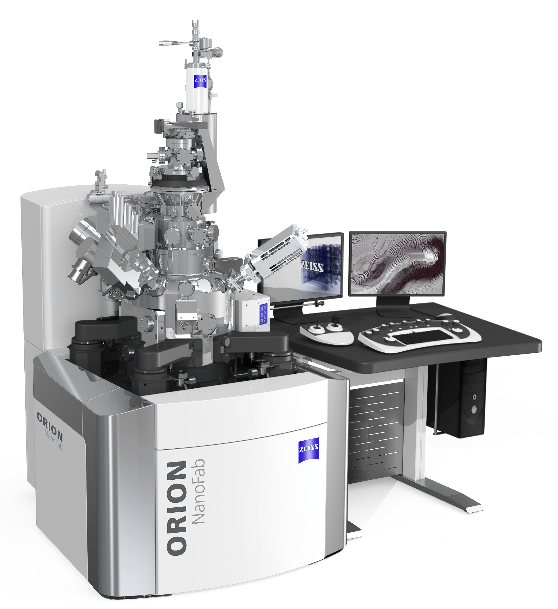

# Home

*ZEISS ORION NanoFab workstation.*

Operational documentation for trained users and superusers. Use the User Guide for normal operation, Reference for background, and Superuser sections for training, maintenance, shutdown and troubleshooting.

- **User Guide Pre-use checks, loading, imaging, patterning and closing down.**

- **Reference System, GFIS, vacuum, imaging concepts and original source files.**

- **Superuser Routine Duties Training and maintenance.**

- **Error & Recovery Shutdown, recovery and troubleshooting.**
