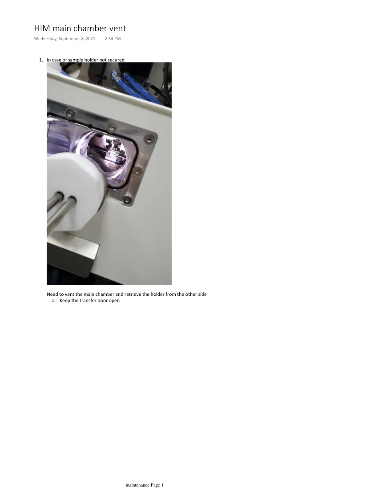
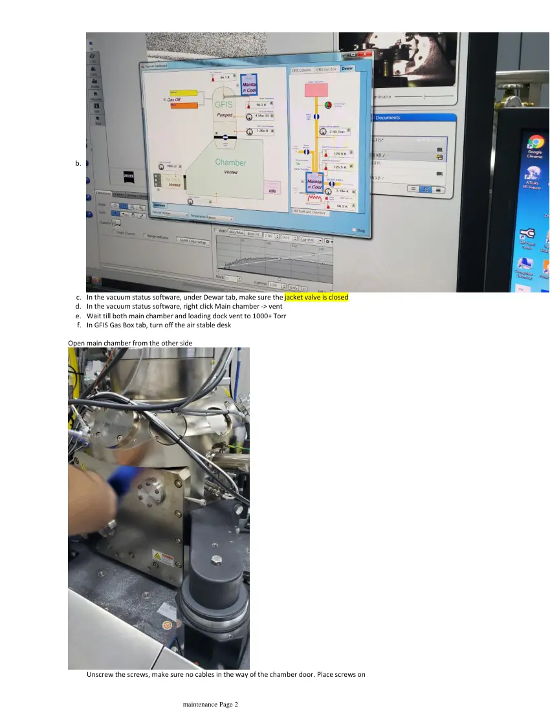
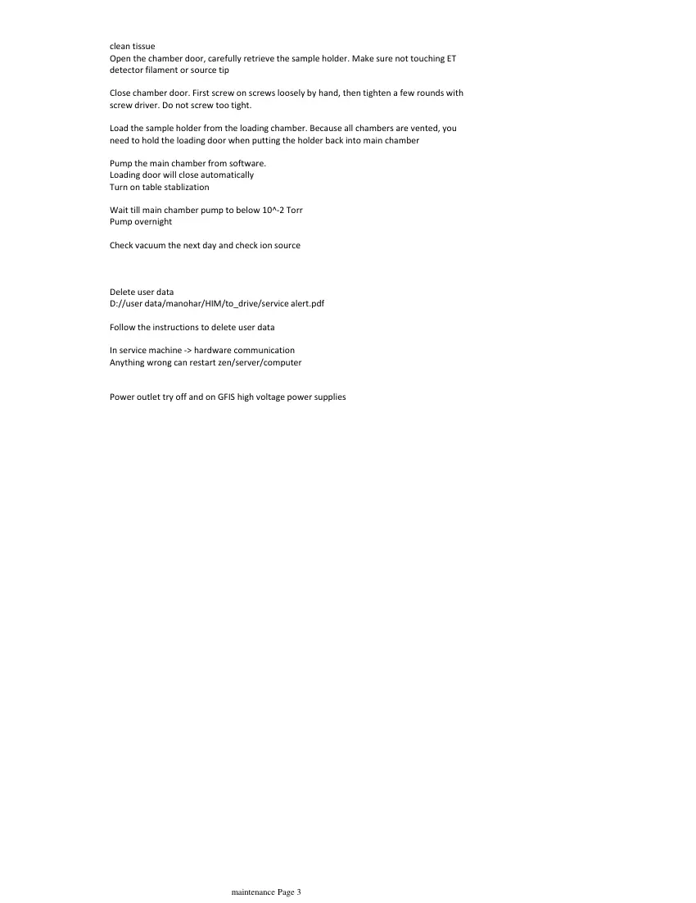

# HIM main chamber vent

> **Source transcription.** Text below is extracted from the uploaded PDF. Each page also includes a facsimile image so figures, diagrams, screenshots, handwritten annotations, and layout are preserved even where PDF text extraction is incomplete.

## Page 1

In case of sample holder not secured
1.
Need to vent the main chamber and retrieve the holder from the other side
Keep the transfer door open
a.
HIM main chamber vent
Wednesday, September 8, 2021
2:34 PM
   
maintenance Page 1

*Page 1 facsimile from `HIM_main_chamber_vent.pdf`.*

## Page 2

b.
In the vacuum status software, under Dewar tab, make sure the jacket valve is closed
c.
In the vacuum status software, right click Main chamber -> vent
d.
Wait till both main chamber and loading dock vent to 1000+ Torr
e.
In GFIS Gas Box tab, turn off the air stable desk
f.
Open main chamber from the other side
Unscrew the screws, make sure no cables in the way of the chamber door. Place screws on 
   
maintenance Page 2

*Page 2 facsimile from `HIM_main_chamber_vent.pdf`.*

## Page 3

clean tissue
Open the chamber door, carefully retrieve the sample holder. Make sure not touching ET 
detector filament or source tip
Close chamber door. First screw on screws loosely by hand, then tighten a few rounds with 
screw driver. Do not screw too tight.
Load the sample holder from the loading chamber. Because all chambers are vented, you 
need to hold the loading door when putting the holder back into main chamber
Pump the main chamber from software.
Loading door will close automatically
Turn on table stablization
Wait till main chamber pump to below 10^-2 Torr
Pump overnight
Check vacuum the next day and check ion source
Delete user data
D://user data/manohar/HIM/to_drive/service alert.pdf
Follow the instructions to delete user data
In service machine -> hardware communication
Anything wrong can restart zen/server/computer
Power outlet try off and on GFIS high voltage power supplies
   
maintenance Page 3

*Page 3 facsimile from `HIM_main_chamber_vent.pdf`.*
