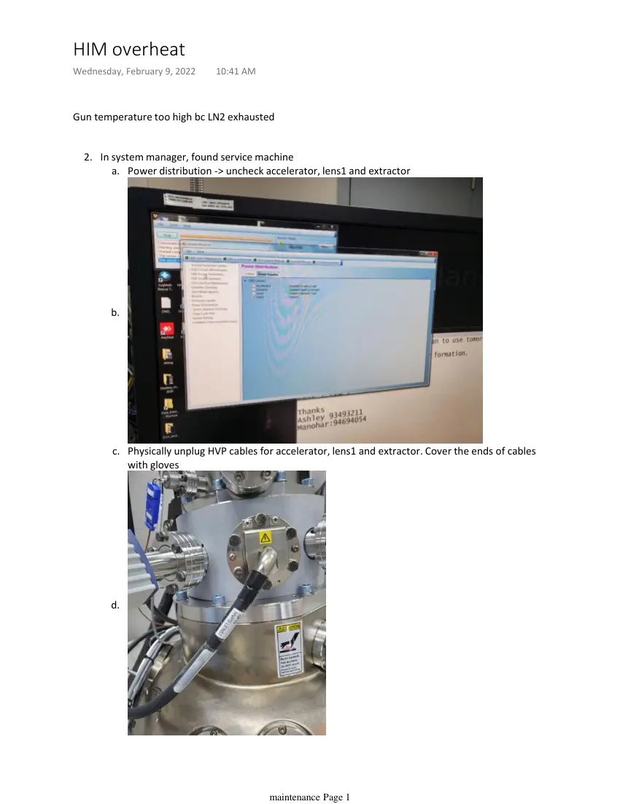
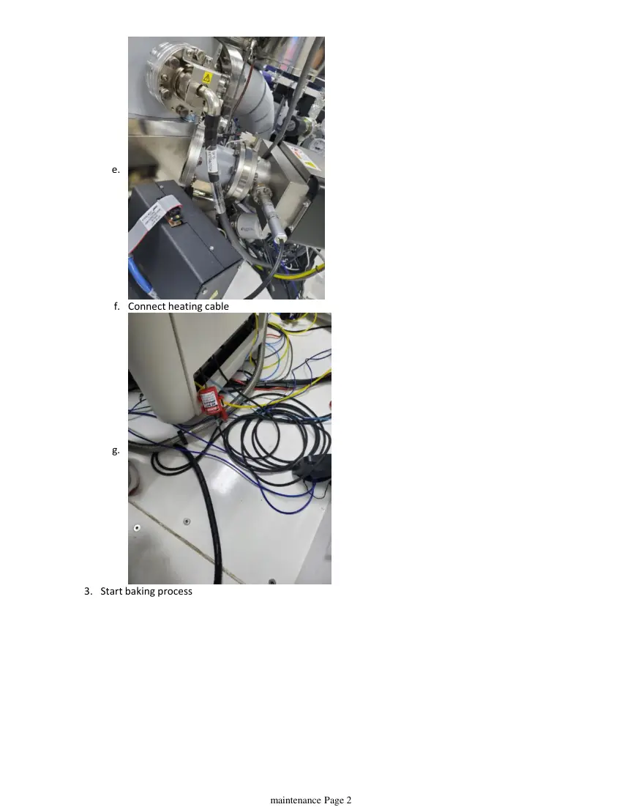
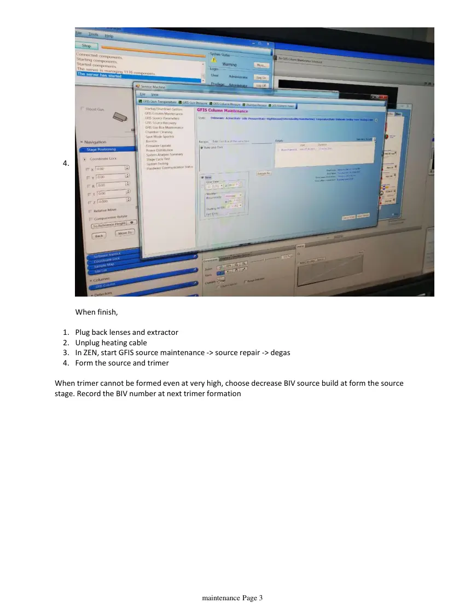

# HIM overheat

> **Source transcription.** Text below is extracted from the uploaded PDF. Each page also includes a facsimile image so figures, diagrams, screenshots, handwritten annotations, and layout are preserved even where PDF text extraction is incomplete.

## Page 1

Gun temperature too high bc LN2 exhausted
In system manager, found service machine
Power distribution -> uncheck accelerator, lens1 and extractor
a.
b.
Physically unplug HVP cables for accelerator, lens1 and extractor. Cover the ends of cables 
with gloves
c.
d.
2.
HIM overheat
Wednesday, February 9, 2022
10:41 AM
   
maintenance Page 1

*Page 1 facsimile from `HIM_overheat.pdf`.*

## Page 2

e.
Connect heating cable
f.
g.
Start baking process
3.
   
maintenance Page 2

*Page 2 facsimile from `HIM_overheat.pdf`.*

## Page 3

4.
When finish,
Plug back lenses and extractor
1.
Unplug heating cable
2.
In ZEN, start GFIS source maintenance -> source repair -> degas
3.
Form the source and trimer
4.
When trimer cannot be formed even at very high, choose decrease BIV source build at form the source 
stage. Record the BIV number at next trimer formation
   
maintenance Page 3

*Page 3 facsimile from `HIM_overheat.pdf`.*
