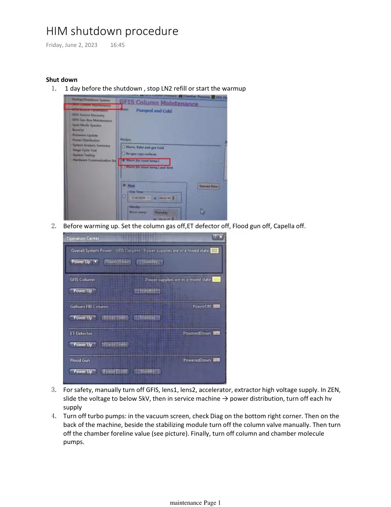
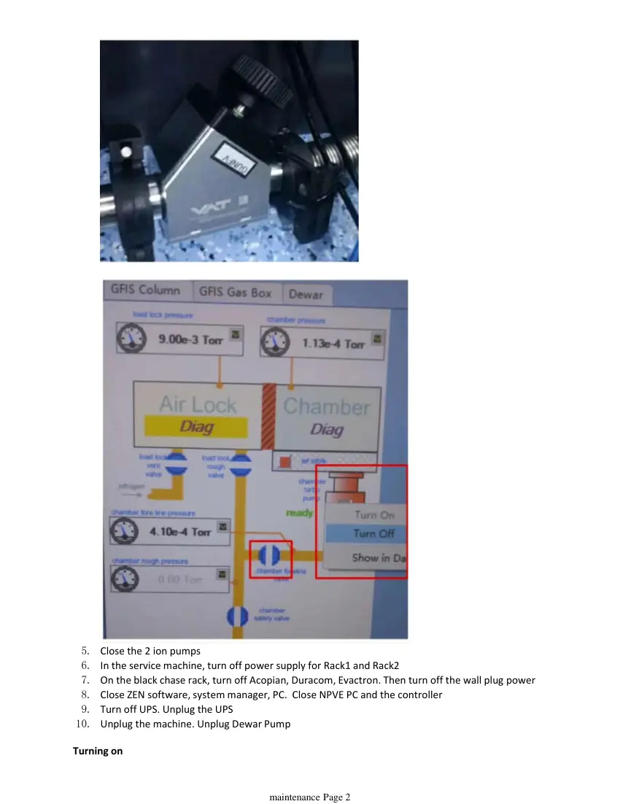
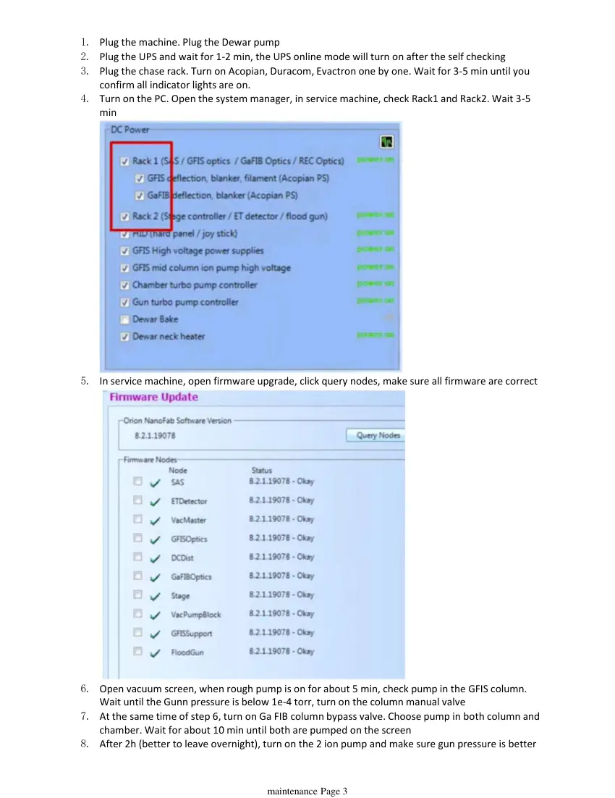
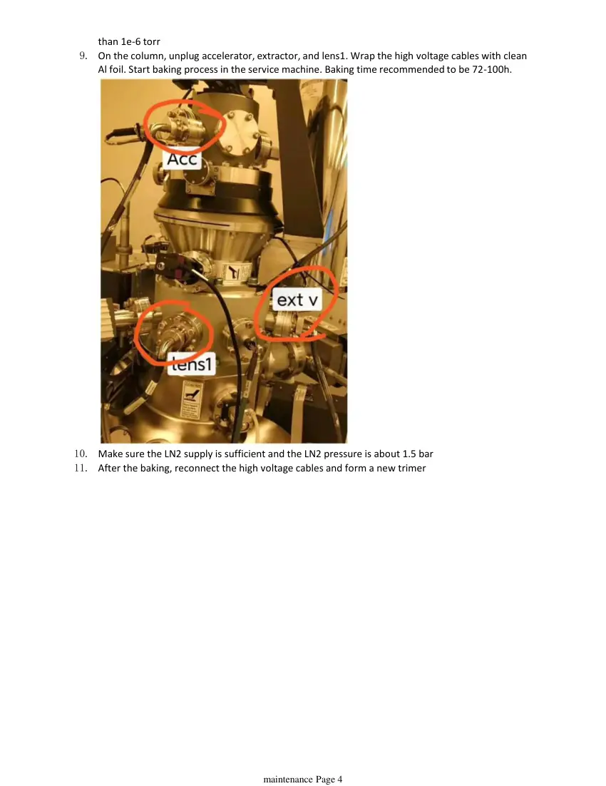

# HIM shutdown and open procedure

> **Source transcription.** Text below is extracted from the uploaded PDF. Each page also includes a facsimile image so figures, diagrams, screenshots, handwritten annotations, and layout are preserved even where PDF text extraction is incomplete.

## Page 1

Shut down 
1 day before the shutdown , stop LN2 refill or start the warmup
1.
Before warming up. Set the column gas off,ET defector off, Flood gun off, Capella off. 
2.
For safety, manually turn off GFIS, lens1, lens2, accelerator, extractor high voltage supply. In ZEN, 
slide the voltage to below 5kV, then in service machine → power distribution, turn off each hv 
supply 
3.
Turn off turbo pumps: in the vacuum screen, check Diag on the bottom right corner. Then on the 
back of the machine, beside the stabilizing module turn off the column valve manually. Then turn 
off the chamber foreline value (see picture). Finally, turn off column and chamber molecule 
pumps.
4.
HIM shutdown procedure
Friday, June 2, 2023
16:45
   
maintenance Page 1

*Page 1 facsimile from `HIM_shutdown_and_open_procedure.pdf`.*

## Page 2

Close the 2 ion pumps
5.
In the service machine, turn off power supply for Rack1 and Rack2
6.
On the black chase rack, turn off Acopian, Duracom, Evactron. Then turn off the wall plug power
7.
Close ZEN software, system manager, PC.  Close NPVE PC and the controller
8.
Turn off UPS. Unplug the UPS
9.
Unplug the machine. Unplug Dewar Pump
10.
Turning on
   
maintenance Page 2

*Page 2 facsimile from `HIM_shutdown_and_open_procedure.pdf`.*

## Page 3

Plug the machine. Plug the Dewar pump
1.
Plug the UPS and wait for 1-2 min, the UPS online mode will turn on after the self checking
2.
Plug the chase rack. Turn on Acopian, Duracom, Evactron one by one. Wait for 3-5 min until you 
confirm all indicator lights are on. 
3.
Turn on the PC. Open the system manager, in service machine, check Rack1 and Rack2. Wait 3-5 
min
4.
In service machine, open firmware upgrade, click query nodes, make sure all firmware are correct
5.
Open vacuum screen, when rough pump is on for about 5 min, check pump in the GFIS column. 
Wait until the Gunn pressure is below 1e-4 torr, turn on the column manual valve
6.
At the same time of step 6, turn on Ga FIB column bypass valve. Choose pump in both column and 
chamber. Wait for about 10 min until both are pumped on the screen
7.
After 2h (better to leave overnight), turn on the 2 ion pump and make sure gun pressure is better 
8.
   
maintenance Page 3

*Page 3 facsimile from `HIM_shutdown_and_open_procedure.pdf`.*

## Page 4

than 1e-6 torr
On the column, unplug accelerator, extractor, and lens1. Wrap the high voltage cables with clean 
Al foil. Start baking process in the service machine. Baking time recommended to be 72-100h.
9.
Make sure the LN2 supply is sufficient and the LN2 pressure is about 1.5 bar
10.
After the baking, reconnect the high voltage cables and form a new trimer
11.
   
maintenance Page 4

*Page 4 facsimile from `HIM_shutdown_and_open_procedure.pdf`.*
