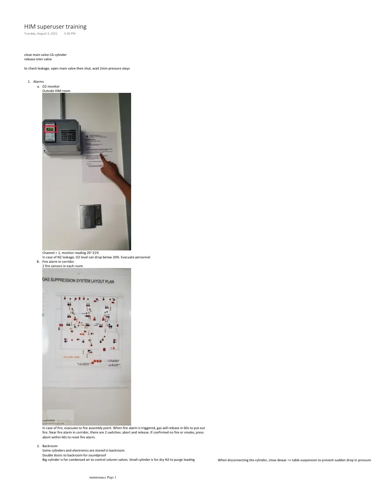
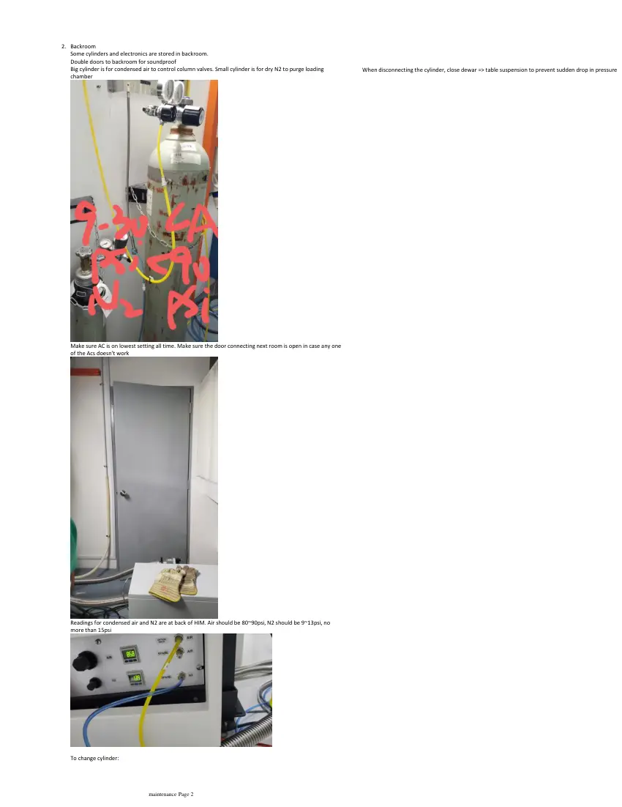
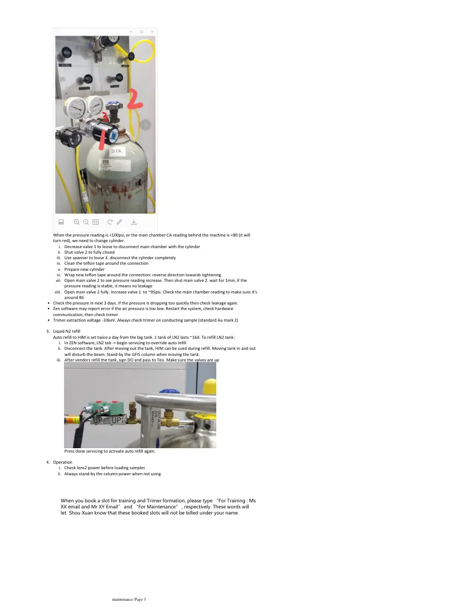

# HIM superuser maintenance

> **Source transcription.** Text below is extracted from the uploaded PDF. Each page also includes a facsimile image so figures, diagrams, screenshots, handwritten annotations, and layout are preserved even where PDF text extraction is incomplete.

## Page 1

close main valve CA cylinder
release inter valve
to check leakage, open main valve then shut, wait 2min pressure stays
Alarms
O2 monitor
a.
Outside HIM room
Channel = 1, monitor reading 20~21%
In case of N2 leakage, O2 level can drop below 20%. Evacuate personnel
Fire alarm in corridor.
B.
2 fire sensors in each room
In case of fire, evacuate to fire assembly point. When fire alarm is triggered, gas will release in 60s to put out 
fire. Near fire alarm in corridor, there are 2 switches: abort and release. If confirmed no fire or smoke, press 
abort within 60s to reset fire alarm. 
Backroom
2.
Some cylinders and electronics are stored in backroom.
Double doors to backroom for soundproof
Big cylinder is for condensed air to control column valves. Small cylinder is for dry N2 to purge loading 
1.
When disconnecting the cylinder, close dewar => table suspension to prevent sudden drop in pressure
HIM superuser training
Tuesday, August 3, 2021
5:36 PM
   
maintenance Page 1

*Page 1 facsimile from `HIM_superuser_maintenance.pdf`.*

## Page 2

Backroom
2.
Some cylinders and electronics are stored in backroom.
Double doors to backroom for soundproof
Big cylinder is for condensed air to control column valves. Small cylinder is for dry N2 to purge loading 
chamber
Make sure AC is on lowest setting all time. Make sure the door connecting next room is open in case any one 
of the Acs doesn't work
Readings for condensed air and N2 are at back of HIM. Air should be 80~90psi, N2 should be 9~13psi, no 
more than 15psi
To change cylinder:
When disconnecting the cylinder, close dewar => table suspension to prevent sudden drop in pressure
   
maintenance Page 2

*Page 2 facsimile from `HIM_superuser_maintenance.pdf`.*

## Page 3

When the pressure reading is <100psi, or the main chamber CA reading behind the machine is <80 (it will 
turn red), we need to change cylinder. 
Decrease valve 1 to loose to disconnect main chamber with the cylinder
i.
Shut valve 2 to fully closed
ii.
Use spanner to loose 3. disconnect the cylinder completely 
iii.
Clean the teflon tape around the connection
iv.
Prepare new cylinder
v.
Wrap new teflon tape around the connection: reverse direction towards tightening
vi.
Open main valve 2 to see pressure reading increase. Then shut main valve 2. wait for 1min, if the 
pressure reading is stable, it means no leakage
vii.
Open main valve 2 fully. Increase valve 1  to ~95psi. Check the main chamber reading to make sure it's 
around 86
viii.
Check the pressure in next 3 days. If the pressure is dropping too quickly then check leakage again.
•
Zen software may report error if the air pressure is too low. Restart the system, check hardware 
communication, then check trimer 
•
Trimer extraction voltage -33keV. Always check trimer on conducting sample (standard Au mark 2)
•
Liquid N2 refill
3.
Auto refill to HIM is set twice a day from the big tank. 1 tank of LN2 lasts ~16d. To refill LN2 tank:
In ZEN software, LN2 tab -> begin servicing to override auto refill
i.
Disconnect the tank. After moving out the tank, HIM can be used during refill. Moving tank in and out 
will disturb the beam. Stand-by the GFIS column when moving the tank.
ii.
After vendors refill the tank, sign DO and pass to Teo. Make sure the valves are up
iii.
Press done servicing to activate auto refill again.
Operation 
Check lens2 power before loading samples
i.
Always stand-by the column power when not using
ii.
4.
When you book a slot for training and Trimer formation, please type “For Training : Ms 
XX email and Mr XY Email” and “For Maintenance” , respectively. These words will 
let Shou Xuan know that these booked slots will not be billed under your name.
   
maintenance Page 3

*Page 3 facsimile from `HIM_superuser_maintenance.pdf`.*
