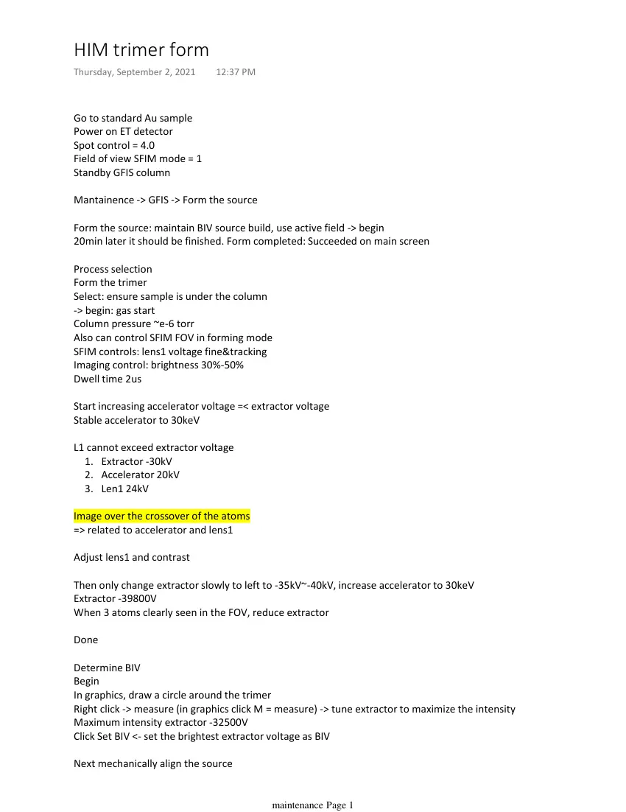
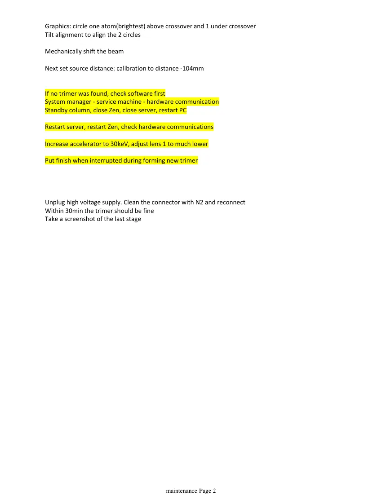

# HIM trimer form

> **Source transcription.** Text below is extracted from the uploaded PDF. Each page also includes a facsimile image so figures, diagrams, screenshots, handwritten annotations, and layout are preserved even where PDF text extraction is incomplete.

## Page 1

Go to standard Au sample
Power on ET detector
Spot control = 4.0
Field of view SFIM mode = 1
Standby GFIS column
Mantainence -> GFIS -> Form the source
Form the source: maintain BIV source build, use active field -> begin
20min later it should be finished. Form completed: Succeeded on main screen
Process selection
Form the trimer
Select: ensure sample is under the column
-> begin: gas start
Column pressure ~e-6 torr
Also can control SFIM FOV in forming mode
SFIM controls: lens1 voltage fine&tracking
Imaging control: brightness 30%-50%
Dwell time 2us
Start increasing accelerator voltage =< extractor voltage
Stable accelerator to 30keV
L1 cannot exceed extractor voltage
Extractor -30kV
1.
Accelerator 20kV
2.
Len1 24kV
3.
Image over the crossover of the atoms
=> related to accelerator and lens1
Adjust lens1 and contrast
Then only change extractor slowly to left to -35kV~-40kV, increase accelerator to 30keV
Extractor -39800V
When 3 atoms clearly seen in the FOV, reduce extractor  
Done
Determine BIV
Begin
In graphics, draw a circle around the trimer
Right click -> measure (in graphics click M = measure) -> tune extractor to maximize the intensity
Maximum intensity extractor -32500V
Click Set BIV <- set the brightest extractor voltage as BIV
Next mechanically align the source
HIM trimer form
Thursday, September 2, 2021
12:37 PM
   
maintenance Page 1

*Page 1 facsimile from `HIM_trimer_form.pdf`.*

## Page 2

Graphics: circle one atom(brightest) above crossover and 1 under crossover
Tilt alignment to align the 2 circles
Mechanically shift the beam
Next set source distance: calibration to distance -104mm
If no trimer was found, check software first
System manager - service machine - hardware communication
Standby column, close Zen, close server, restart PC
Restart server, restart Zen, check hardware communications
Increase accelerator to 30keV, adjust lens 1 to much lower
Put finish when interrupted during forming new trimer
Unplug high voltage supply. Clean the connector with N2 and reconnect
Within 30min the trimer should be fine
Take a screenshot of the last stage
   
maintenance Page 2

*Page 2 facsimile from `HIM_trimer_form.pdf`.*
