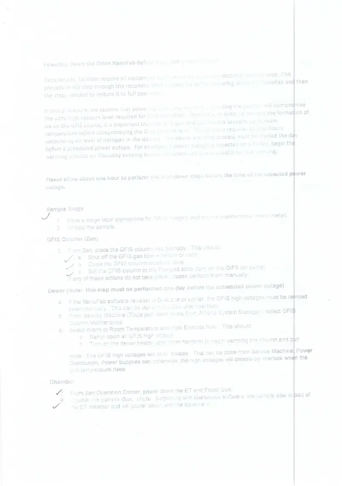
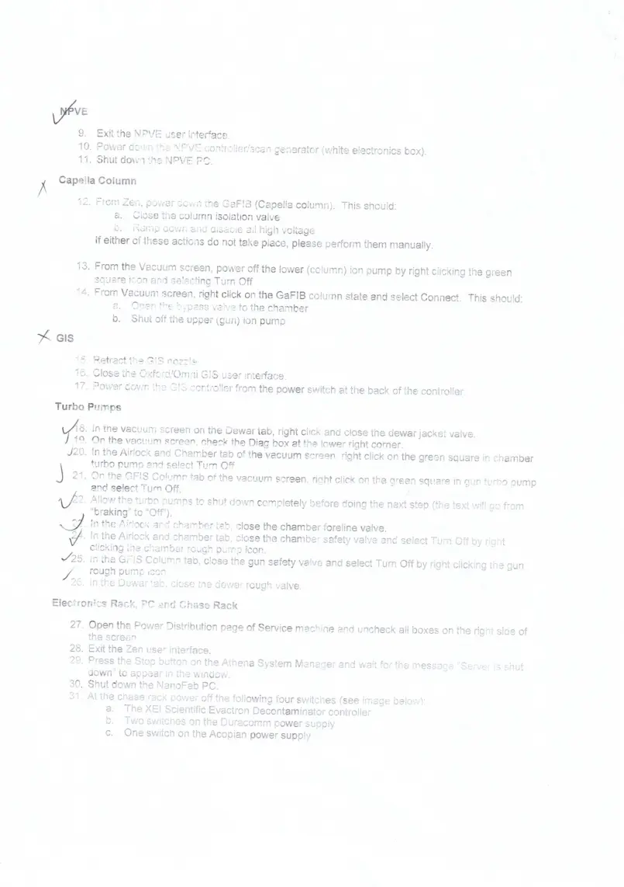
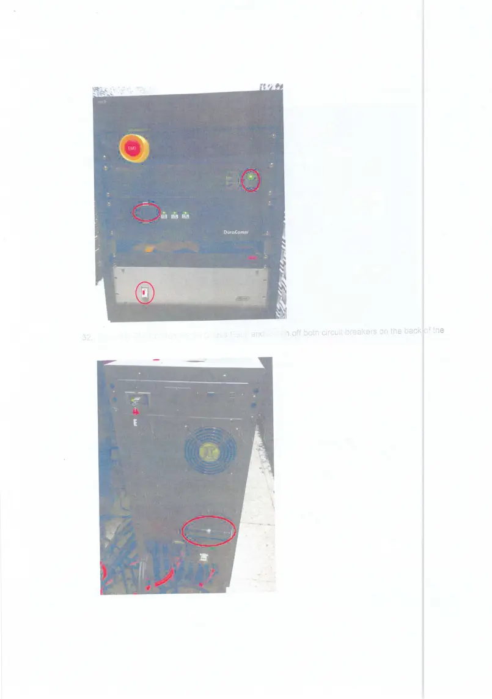
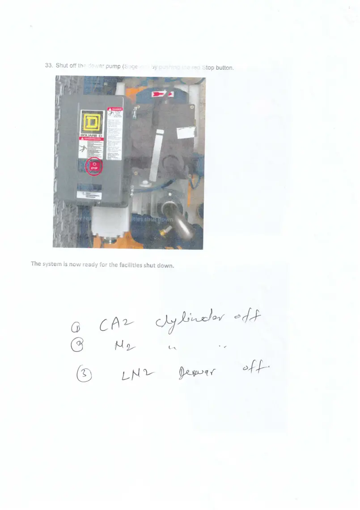
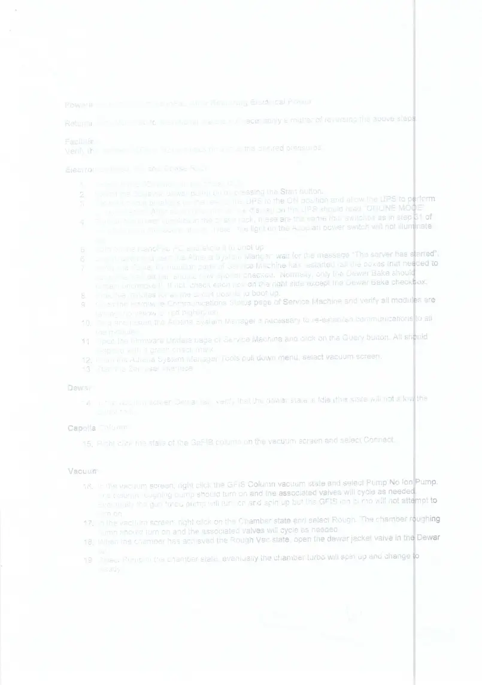
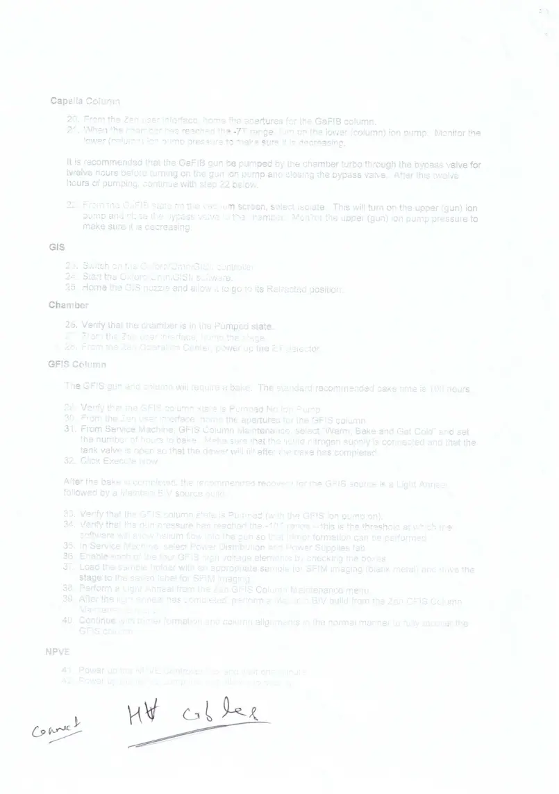

# Shutdown procedure scanned

> **Source transcription.** Text below is extracted from the uploaded PDF. Each page also includes a facsimile image so figures, diagrams, screenshots, handwritten annotations, and layout are preserved even where PDF text extraction is incomplete.

## Page 1

*No machine-readable text was available for this page; refer to the page facsimile below.*

*Page 1 facsimile from `Shutdown_procedure_scanned.pdf`.*

## Page 2

*No machine-readable text was available for this page; refer to the page facsimile below.*

*Page 2 facsimile from `Shutdown_procedure_scanned.pdf`.*

## Page 3

*No machine-readable text was available for this page; refer to the page facsimile below.*

*Page 3 facsimile from `Shutdown_procedure_scanned.pdf`.*

## Page 4

*No machine-readable text was available for this page; refer to the page facsimile below.*

*Page 4 facsimile from `Shutdown_procedure_scanned.pdf`.*

## Page 5

*No machine-readable text was available for this page; refer to the page facsimile below.*

*Page 5 facsimile from `Shutdown_procedure_scanned.pdf`.*

## Page 6

*No machine-readable text was available for this page; refer to the page facsimile below.*

*Page 6 facsimile from `Shutdown_procedure_scanned.pdf`.*

## Page 7

*No machine-readable text was available for this page; refer to the page facsimile below.*

*Page 7 facsimile from `Shutdown_procedure_scanned.pdf`.*

## Page 8

*No machine-readable text was available for this page; refer to the page facsimile below.*

*Page 8 facsimile from `Shutdown_procedure_scanned.pdf`.*

## Searchable transcription reference

> **Editorial note:** This scan has no machine-readable text layer. Its visible pages correspond to the uploaded ZEISS power-outage procedure. The text below is copied from that text-readable source so the scanned record is full-text searchable. The scanned page facsimiles above remain the visual authority for handwritten marks and annotations.

---
title: "ZEISS Power Outage Procedure"
access: superuser
category: source-transcription
owner: HIM Superuser
status: source-transcription
sources:
  - "ZEISS_Power_Outage_Procedure.pdf"
---

# ZEISS Power Outage Procedure

## Page 1

Powering Down the Orion NanoFab Before Expected Power Outage 
 
Occasionally, facilities require all equipment to be powered down for electrical maintenance. This 
procedure will step through the recommended process for safely powering down the NanoFab and then 
the steps needed to restore it to full operation. 
 
In this procedure, we assume that powering down the NanoFab (including the pumps) will compromise 
the ultra-high vacuum level required for GFIS operation.  Therefore, in order to prevent the formation of 
ice on the GFIS source, it is important that the GFIS gun and column are brought up to room 
temperature before compromising the GFIS vacuum level.  This process requires several hours 
(depending on level of nitrogen in the dewar).  The dewar warming process must be started the day 
before a scheduled power outage.  For example, if power outage is expected on a Friday, begin the 
warming process on Thursday evening before the scheduled dewar autofill for that evening. 
 
 
Please allow about one hour to perform the shut-down steps before the time of the expected power 
outage. 
 
 
Sample Stage 
1. Save a stage label appropriate for SFIM imaging and source maintenance (blank metal). 
2. Unload the sample. 
GFIS Column (Zen) 
3. From Zen, place the GFIS column into Standby.  This should: 
a. Shut off the GFIS gas flow – helium or neon 
b. Close the GFIS column isolation valve 
c. Set the GFIS column to the Pumped state (turn on the GIFS ion pump) 
If any of these actions do not take place, please perform them manually. 
Dewar (Note:  this step must be performed one day before the scheduled power outage) 
4. If the NanoFab software revision is Brisbane or earlier, the GFIS high voltages must be ramped 
down manually.  This can be done in the Zen user interface. 
5. From Service Machine (Tools pull down menu from Athena System Manager), select GFIS 
Column Maintenance. 
6. Select Warm to Room Temperature and click Execute Now.  This should: 
a. Ramp down all GFIS high voltage 
b. Turn on the dewar heater (and other heaters) to begin warming the column and gun 
Note:  The GFIS high voltages will NOT disable.  This can be done from Service Machine, Power 
Distribution, Power Supplies tab; otherwise, the high voltages will disable by interlock when the 
gun temperature rises. 
Chamber 
7. From Zen Operation Center, power down the ET and Flood Gun. 
8. Disable the Sample Bias.  (Note:  Beginning with Damascus software, the sample bias is part of 
the ET detector and will power down with the detector.)

## Page 2

NPVE 
9. Exit the NPVE user interface. 
10. Power down the NPVE controller/scan generator (white electronics box). 
11. Shut down the NPVE PC. 
Capella Column 
12. From Zen, power down the GaFIB (Capella column).  This should: 
a. Close the column isolation valve 
b. Ramp down and disable all high voltage 
If either of these actions do not take place, please perform them manually. 
 
13. From the Vacuum screen, power off the lower (column) ion pump by right clicking the green 
square icon and selecting Turn Off 
14. From Vacuum screen, right click on the GaFIB column state and select Connect.  This should: 
a. Open the bypass valve to the chamber 
b. Shut off the upper (gun) ion pump 
GIS 
15. Retract the GIS nozzle. 
16. Close the Oxford/Omni GIS user interface. 
17. Power down the GIS controller from the power switch at the back of the controller. 
Turbo Pumps 
18. In the vacuum screen on the Dewar tab, right click and close the dewar jacket valve. 
19. On the vacuum screen, check the Diag box at the lower right corner. 
20. In the Airlock and Chamber tab of the vacuum screen, right click on the green square in chamber 
turbo pump and select Turn Off. 
21. On the GFIS Column tab of the vacuum screen, right click on the green square in gun turbo pump 
and select Turn Off. 
22. Allow the turbo pumps to shut down completely before doing the next step (the text will go from 
“braking” to “Off”). 
23. In the Airlock and chamber tab, close the chamber foreline valve. 
24. In the Airlock and chamber tab, close the chamber safety valve and select Turn Off by right 
clicking the chamber rough pump icon. 
25. In the GFIS Column tab, close the gun safety valve and select Turn Off by right clicking the gun 
rough pump icon. 
26. In the Dewar tab, close the dewar rough valve. 
Electronics Rack, PC and Chase Rack 
27. Open the Power Distribution page of Service machine and uncheck all boxes on the right side of 
the screen. 
28. Exit the Zen user interface. 
29. Press the Stop button on the Athena System Manager and wait for the message “Server is shut 
down” to appear in the window. 
30. Shut down the NanoFab PC. 
31. At the chase rack power off the following four switches (see image below): 
a. The XEI Scientific Evactron Decontaminator controller 
b. Two switches on the Duracomm power supply 
c. One switch on the Acopian power supply

## Page 3

32. Press the EMO button on the Chase Rack and switch off both circuit breakers on the back of the 
UPS.

## Page 4

33. Shut off the dewar pump (Sogevac) by pushing the red Stop button. 
 
 
 
The system is now ready for the facilities shut down.

## Page 5

Powering Up the Orion NanoFab After Restoring Electrical Power 
 
Returning the NanoFab to operational state is not necessarily a matter of reversing the above steps. 
 
Facilities 
Verify the facilities (CDA & N2) are back on and at the desired pressures. 
 
Electronics Rack, PC and Chase Rack 
1. Unlock the EMO button on the chase rack. 
2. Switch the Sogevac dewar pump on by pressing the Start button. 
3. Set both circuit breakers on the rear of the UPS to the ON position and allow the UPS to perform 
its self checks.  After about one minute, the display on the UPS should read “ONLINE MODE”. 
4. Turn on the power supplies in the chase rack; these are the same four switches as in step 31 of 
the shut-down procedure above.  Note:  the light on the Acopian power switch will not illuminate 
yet. 
5. Turn on the NanoFab PC and allow it to boot up. 
6. Log in, open and start the Athena System Manger; wait for the message “The server has started”. 
7. Verify the Power Distribution page of Service Machine has restarted (all the boxes that needed to 
be unchecked earlier, should now appear checked.  Normally, only the Dewar Bake should 
remain unchecked). If not, check each box on the right side except the Dewar Bake checkbox. 
8. Wait five minutes for all the circuit boards to boot up. 
9. Open the Hardware Communications Status page of Service Machine and verify all modules are 
talking (no yellow or red highlights). 
10. Stop and restart the Athena System Manager if necessary to re-establish communications to all 
the modules. 
11. Open the Firmware Update page of Service Machine and click on the Query button. All should 
respond with a green check mark. 
12. From the Athena System Manager Tools pull down menu, select vacuum screen. 
13. Start the Zen user interface. 
 
Dewar 
14. In the vacuum screen Dewar tab, verify that the dewar state is Idle (this state will not allow the 
dewar to fill). 
Capella Column 
15. Right click the state of the GaFIB column on the vacuum screen and select Connect. 
 
Vacuum 
16. In the vacuum screen, right click the GFIS Column vacuum state and select Pump No Ion Pump. 
The column roughing pump should turn on and the associated valves will cycle as needed.  
Eventually the gun turbo pump will turn on and spin up but the GFIS ion pump will not attempt to 
turn on. 
17. In the vacuum screen, right click on the Chamber state and select Rough. The chamber roughing 
pump should turn on and the associated valves will cycle as needed. 
18. When the chamber has achieved the Rough Vac state, open the dewar jacket valve in the Dewar 
tab. 
19. Select Pump in the chamber state, eventually the chamber turbo will spin up and change to 
Ready.

## Page 6

Capella Column 
20. From the Zen user interface, home the apertures for the GaFIB column. 
21. When the chamber has reached the -7T range, turn on the lower (column) ion pump.  Monitor the 
lower (column) ion pump pressure to make sure it is decreasing. 
 
It is recommended that the GaFIB gun be pumped by the chamber turbo through the bypass valve for 
twelve hours before turning on the gun ion pump and closing the bypass valve.  After this twelve 
hours of pumping, continue with step 22 below. 
 
22. From the GaFIB state on the vacuum screen, select Isolate.  This will turn on the upper (gun) ion 
pump and close the bypass valve to the chamber.  Monitor the upper (gun) ion pump pressure to 
make sure it is decreasing. 
 
GIS 
23. Switch on the Oxford/OmniGISII controller. 
24. Start the Oxford/OmniGISII software. 
25. Home the GIS nozzle and allow it to go to its Retracted position. 
Chamber 
26. Verify that the chamber is in the Pumped state. 
27. From the Zen user interface, home the stage. 
28. From the Zen Operation Center, power up the ET detector. 
GFIS Column 
 
The GFIS gun and column will require a bake.  The standard recommended bake time is 100 hours. 
 
29. Verify that the GFIS column state is Pumped No Ion Pump. 
30. From the Zen user interface, home the apertures for the GFIS column. 
31. From Service Machine, GFIS Column Maintenance, select “Warm, Bake and Get Cold” and set 
the number of hours to bake.  Make sure that the liquid nitrogen supply is connected and that the 
tank valve is open so that the dewar will fill after the bake has completed. 
32. Click Execute Now. 
 
After the bake is completed, the recommended recovery for the GFIS source is a Light Anneal 
followed by a Maintain BIV source build.   
 
33. Verify that the GFIS column state is Pumped (with the GFIS ion pump on). 
34. Verify that the gun pressure has reached the -10T range – this is the threshold at which the 
software will allow helium flow into the gun so that trimer formation can be performed. 
35. In Service Machine, select Power Distribution and Power Supplies tab. 
36. Enable each of the four GFIS high voltage elements by checking the boxes. 
37. Load the sample holder with an appropriate sample for SFIM imaging (blank metal) and drive the 
stage to the saved label for SFIM imaging. 
38. Perform a Light Anneal from the Zen GFIS Column Maintenance menu. 
39. After the light anneal has completed, perform a Maintain BIV build from the Zen GFIS Column 
Maintenance menu. 
40. Continue with trimer formation and column alignments in the normal manner to fully recover the 
GFIS column. 
 
NPVE 
41. Power up the NPVE Controller box and wait one minute. 
42. Power up the NPVE computer and allow it to boot up.

## Page 7

43. On the NanoFab PC (NOT the NPVE PC), start the ZeissFibicsServer software.  This may 
appear as an icon pinned to the Start menu but can also be started by double clicking the 
FibicsZeissServer.exe file in the following folder: 
 
C:\Program Files (x86)\Fibics\Server 
 
44. Log in and start the NPVE user interface.

