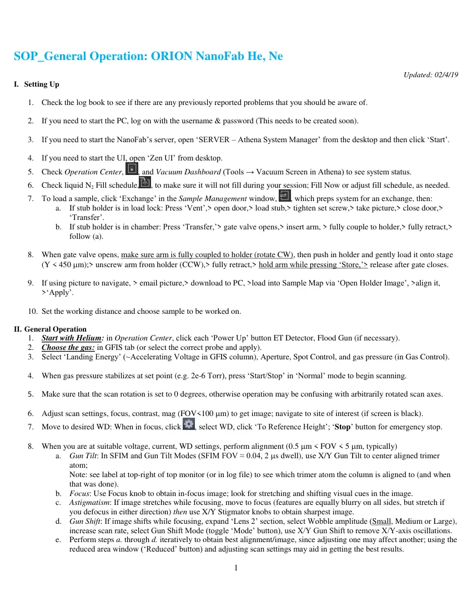
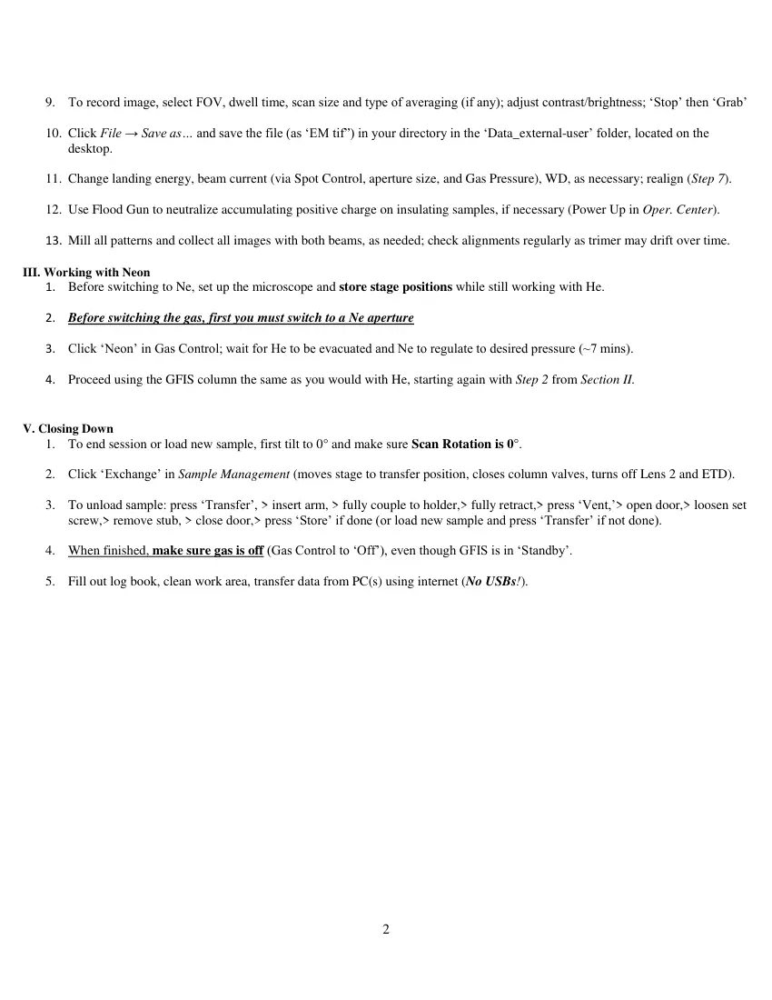

# SOP ORION NanoFab He Ne Users

> **Source transcription.** Text below is extracted from the uploaded PDF. Each page also includes a facsimile image so figures, diagrams, screenshots, handwritten annotations, and layout are preserved even where PDF text extraction is incomplete.

## Page 1

1 
 
SOP_General Operation: ORION NanoFab He, Ne                                        
Updated: 02/4/19 
I. Setting Up 
 
1. Check the log book to see if there are any previously reported problems that you should be aware of. 
 
2. If you need to start the PC, log on with the username & password (This needs to be created soon). 
 
3. If you need to start the NanoFab’s server, open ‘SERVER – Athena System Manager’ from the desktop and then click ‘Start’. 
 
4. If you need to start the UI, open ‘Zen UI’ from desktop. 
5. Check Operation Center, 
, and Vacuum Dashboard (Tools → Vacuum Screen in Athena) to see system status. 
6. Check liquid N2 Fill schedule,
, to make sure it will not fill during your session; Fill Now or adjust fill schedule, as needed. 
7. To load a sample, click ‘Exchange’ in the Sample Management window, 
, which preps system for an exchange, then: 
a. If stub holder is in load lock: Press ‘Vent’,> open door,> load stub,> tighten set screw,> take picture,> close door,> 
‘Transfer’. 
b. If stub holder is in chamber: Press ‘Transfer,’> gate valve opens,> insert arm, > fully couple to holder,> fully retract,> 
follow (a). 
 
8. When gate valve opens, make sure arm is fully coupled to holder (rotate CW), then push in holder and gently load it onto stage 
(Y < 450 m);> unscrew arm from holder (CCW),> fully retract,> hold arm while pressing ‘Store,’> release after gate closes. 
 
9. If using picture to navigate, > email picture,> download to PC, >load into Sample Map via ‘Open Holder Image’, >align it, 
>‘Apply’. 
 
10. Set the working distance and choose sample to be worked on. 
 
II. General Operation 
1. Start with Helium: in Operation Center, click each ‘Power Up’ button ET Detector, Flood Gun (if necessary). 
2. Choose the gas: in GFIS tab (or select the correct probe and apply). 
3. Select ‘Landing Energy’ (~Accelerating Voltage in GFIS column), Aperture, Spot Control, and gas pressure (in Gas Control). 
 
4. When gas pressure stabilizes at set point (e.g. 2e-6 Torr), press ‘Start/Stop’ in ‘Normal’ mode to begin scanning. 
 
5. Make sure that the scan rotation is set to 0 degrees, otherwise operation may be confusing with arbitrarily rotated scan axes. 
 
6. Adjust scan settings, focus, contrast, mag (FOV<100 m) to get image; navigate to site of interest (if screen is black). 
7. Move to desired WD: When in focus, click 
, select WD, click ‘To Reference Height’; ‘Stop’ button for emergency stop. 
 
8. When you are at suitable voltage, current, WD settings, perform alignment (0.5 m < FOV < 5 m, typically) 
a. Gun Tilt: In SFIM and Gun Tilt Modes (SFIM FOV ≈ 0.04, 2 s dwell), use X/Y Gun Tilt to center aligned trimer 
atom;  
Note: see label at top-right of top monitor (or in log file) to see which trimer atom the column is aligned to (and when 
that was done). 
b. Focus: Use Focus knob to obtain in-focus image; look for stretching and shifting visual cues in the image. 
c. Astigmatism: If image stretches while focusing, move to focus (features are equally blurry on all sides, but stretch if 
you defocus in either direction) then use X/Y Stigmator knobs to obtain sharpest image. 
d. Gun Shift: If image shifts while focusing, expand ‘Lens 2’ section, select Wobble amplitude (Small, Medium or Large), 
increase scan rate, select Gun Shift Mode (toggle ‘Mode’ button), use X/Y Gun Shift to remove X/Y-axis oscillations. 
e. Perform steps a. through d. iteratively to obtain best alignment/image, since adjusting one may affect another; using the 
reduced area window (‘Reduced’ button) and adjusting scan settings may aid in getting the best results.

*Page 1 facsimile from `SOP_ORION_NanoFab_He_Ne_Users.pdf`.*

## Page 2

2 
 
 
9. To record image, select FOV, dwell time, scan size and type of averaging (if any); adjust contrast/brightness; ‘Stop’ then ‘Grab’ 
 
10. Click File → Save as… and save the file (as ‘EM tif”) in your directory in the ‘Data_external-user’ folder, located on the 
desktop. 
 
11. Change landing energy, beam current (via Spot Control, aperture size, and Gas Pressure), WD, as necessary; realign (Step 7). 
 
12. Use Flood Gun to neutralize accumulating positive charge on insulating samples, if necessary (Power Up in Oper. Center). 
 
13. Mill all patterns and collect all images with both beams, as needed; check alignments regularly as trimer may drift over time. 
 
III. Working with Neon 
1. Before switching to Ne, set up the microscope and store stage positions while still working with He. 
 
2. Before switching the gas, first you must switch to a Ne aperture 
 
3. Click ‘Neon’ in Gas Control; wait for He to be evacuated and Ne to regulate to desired pressure (~7 mins). 
 
4. Proceed using the GFIS column the same as you would with He, starting again with Step 2 from Section II. 
 
 
V. Closing Down  
1. To end session or load new sample, first tilt to 0° and make sure Scan Rotation is 0°. 
 
2. Click ‘Exchange’ in Sample Management (moves stage to transfer position, closes column valves, turns off Lens 2 and ETD). 
 
3. To unload sample: press ‘Transfer’, > insert arm, > fully couple to holder,> fully retract,> press ‘Vent,’> open door,> loosen set 
screw,> remove stub, > close door,> press ‘Store’ if done (or load new sample and press ‘Transfer’ if not done). 
 
4. When finished, make sure gas is off (Gas Control to ‘Off’), even though GFIS is in ‘Standby’. 
 
5. Fill out log book, clean work area, transfer data from PC(s) using internet (No USBs!).

*Page 2 facsimile from `SOP_ORION_NanoFab_He_Ne_Users.pdf`.*
