# ZEISS ORION NanoFab Operator Manual Rev2

> **Source transcription.** Text below is extracted from the uploaded PDF. Each page also includes a facsimile image so figures, diagrams, screenshots, handwritten annotations, and layout are preserved even where PDF text extraction is incomplete.

## Page 1

Carl Zeiss Microscopy, LLC

*Page 1 facsimile from `ZEISS_ORION_NanoFab_Operator_Manual_Rev2.pdf`.*

## Page 2

*No machine-readable text was available for this page; refer to the page facsimile below.*

*Page 2 facsimile from `ZEISS_ORION_NanoFab_Operator_Manual_Rev2.pdf`.*

## Page 3

Ion Microscopy Innovation Center
Carl Zeiss Group
One Corporation Way
Peabody, MA 01960, USA
Revision History
Effective from: May 2018
360800-0000-024
Carl Zeiss Microscopy Operator’s Manuals are the property of Carl Zeiss Microscopy. 
The Operator’s Manual is classified Non-confidential, meaning that this publication may be left with 
non-Carl Zeiss Microscopy personnel, especially customers or users.
The use of general descriptive names, registered names, trademarks, etc. in this publication does not 
imply, even in the absence of a specific statement, that such names are exempt from the relevant 
protective laws and regulations and therefore free for general use.
Due to an ongoing process of improvement Carl Zeiss Microscopy reserves the right to make 
modifications of this document without notice.
© 2018 Carl Zeiss Microscopy GmbH, Oberkochen, Germany
ECR
VER
Description
Date
Approved
2295
01
Initial release
2/23/18
J. Braggin
2321
02
Reviewed and upgraded from start to finish.
5/29/18
J. Braggin

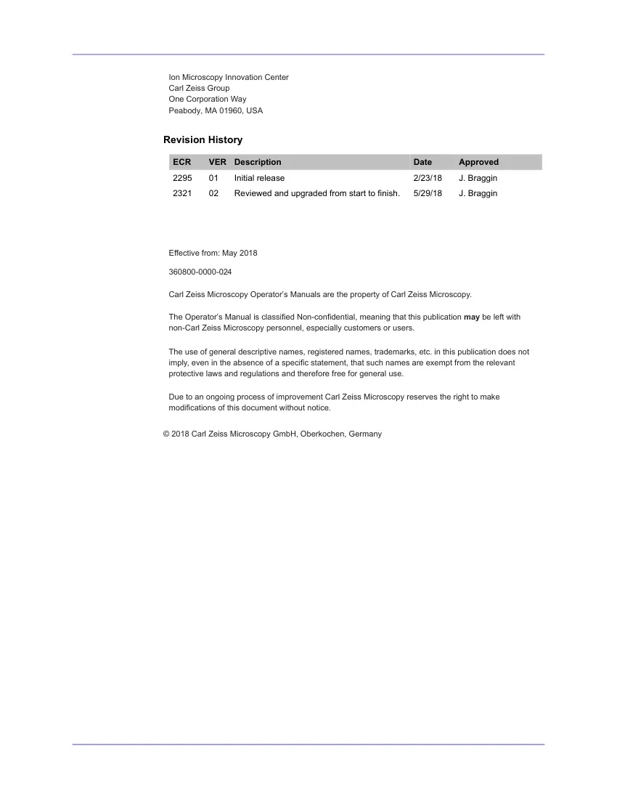

*Page 3 facsimile from `ZEISS_ORION_NanoFab_Operator_Manual_Rev2.pdf`.*

## Page 4

*No machine-readable text was available for this page; refer to the page facsimile below.*

*Page 4 facsimile from `ZEISS_ORION_NanoFab_Operator_Manual_Rev2.pdf`.*

## Page 5

Acknowledgements 
 
This manual is dedicated to the many ORION Plus and ORION NanoFab users who have helped support 
the development of this technology.  Your interest in GFIS technology drove its development and your 
continued support drives us to continue to improve the technology to enable you to do your best work.   
In particular, Annalena Wolff, Ph.D., Queensland University of Technology, Institute for Future 
Environments, Central Analytical Research Facility, contributed her document “HIM ORION NanoFab 
Working Instructions” as a starting point for all the improvements you read in this manual.  Dr. Wolff’s 
documentation, combined with countless contributions and support from ZEISS management, 
applications specialists, software engineers and R&D engineers have turned this from an idea into reality. 
 
Bob Newey, ZEISS Technical Writer

*Page 5 facsimile from `ZEISS_ORION_NanoFab_Operator_Manual_Rev2.pdf`.*

## Page 6

*No machine-readable text was available for this page; refer to the page facsimile below.*

*Page 6 facsimile from `ZEISS_ORION_NanoFab_Operator_Manual_Rev2.pdf`.*

## Page 7

5/29/18
360800-0000-024 Rev 2
| 2 |
Table of Contents
 1
Overview ....................................................................................... 6
 1.1
Precise Imaging, Plus Options....................................................6
 1.2
Beyond Imaging..........................................................................7
 1.3
About This Document .................................................................7
 2
Safety .......................................................................................... 10
 2.1
Safety Labels ............................................................................10
 2.2
Safety Equipment......................................................................12
2.2.1
Protective Cover Panels.....................................................12
2.2.2
Emergency Machine Off (EMO) Shutoff.............................13
2.2.3
Main Shut-Off Valves .........................................................14
 2.3
Material Safety Data Sheets .....................................................14
 3
NanoFab Components & Sub-Systems ................................... 16
 3.1
GFIS Column ............................................................................17
3.1.1
GFIS Column Elements......................................................17
3.1.2
Extractor.............................................................................19
 3.2
Process Chamber .....................................................................25
3.2.1
Process Chamber Elements...............................................25
 3.3
Capella Column Option.............................................................28
 3.4
Gas Injection System (GIS) Option...........................................29
 3.5
NanoPatterning and Visualization Engine (NPVE) Option........30
 3.6
Vacuum Subsystem ..................................................................31
 3.7
Dewar System...........................................................................35
 3.8
Gas Delivery System ................................................................36
 3.9
Vibration Isolation System ........................................................37
 3.10
Operator Console......................................................................38
 3.11
Electronics System ...................................................................41
 4
Routine Operations/Tasks......................................................... 42
 4.1
Using Online Help.....................................................................42
4.1.1
System Manager Help........................................................42
4.1.2
Zen Interface Help..............................................................44
 4.2
Data Viewer ..............................................................................47
 4.3
Loading and Unloading Samples ..............................................52
4.3.1
Sample Handling................................................................52
4.3.2
Sample Load Status...........................................................53
4.3.3
The Air Lock .......................................................................53
4.3.4
Air Lock Controls and Functions ........................................54
4.3.5
Updating the Sample Map..................................................57
4.3.6
Loading the Sample ...........................................................61
4.3.7
Sample Holder Image Requirements .................................64
4.3.8
Unloading the Sample........................................................65
 4.4
Stage Control ............................................................................69
4.4.1
Stage Motion Risks ............................................................69
4.4.2
Stage Motions ....................................................................70
4.4.3
Joystick Control..................................................................71

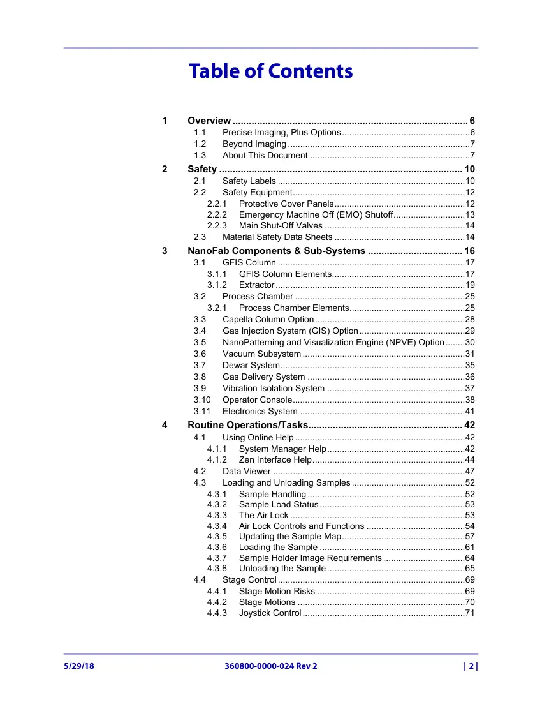

*Page 7 facsimile from `ZEISS_ORION_NanoFab_Operator_Manual_Rev2.pdf`.*

## Page 8

| 3 |
360800-0000-024 Rev 2
5/29/18
4.4.4
Zen UI Stage Control..........................................................74
 4.5
Exchanging the External N2 Supply Tank ................................78
 4.6
Chamber Cleaning....................................................................80
 4.7
Control of the Column Isolation Valve (CIV) .............................83
 4.8
Dewar Control ...........................................................................85
4.8.1
Auto Fill Schedule ..............................................................85
4.8.2
Dewar Fill Command..........................................................86
4.8.3
Active Cooling Status .........................................................86
4.8.4
Service LN2 Source ...........................................................87
4.8.5
Emergency Fill....................................................................88
 4.9
Tuning and Operating the Flood Gun .......................................88
 5
Tool Setup & Maintenance ........................................................ 94
 5.1
Basic System Checks ...............................................................94
 5.2
Basic Source Maintenance .......................................................95
5.2.1
Process Selection...............................................................97
5.2.2
Repair the Source ..............................................................98
5.2.3
Form the Source.................................................................98
5.2.4
Select a Trimer.................................................................105
5.2.5
Determine BIV..................................................................111
5.2.6
Align Source.....................................................................116
5.2.7
Set Source Distance.........................................................121
 5.3
Aperture Selection and Alignment ..........................................124
5.3.1
Homing the Aperture Bar..................................................124
5.3.2
Selecting an Aperture.......................................................125
5.3.3
Electronic Tilt and Shift Alignment....................................126
5.3.4
Mechanical Gun Shift Alignment ......................................128
5.3.5
Mechanical Aperture Alignment .......................................129
 5.4
Focus and Stigmate the Beam................................................131
5.4.1
Focus the Beam ...............................................................131
5.4.2
Stigmating the Beam........................................................132
 6
A Work Session........................................................................ 134
 6.1
Daily Checks ...........................................................................134
6.1.1
Perform Pre Gas-On Checks ...........................................134
6.1.2
Power Up..........................................................................135
6.1.3
Check the Trimer..............................................................136
6.1.4
Align the Source...............................................................136
 6.2
Working Configuration ............................................................136
6.2.1
Load Sample ....................................................................136
6.2.2
Set Landing Energy..........................................................137
6.2.3
Select Aperture.................................................................137
 6.3
Imaging ...................................................................................138
6.3.1
Setting Parameters...........................................................138
6.3.2
Recording and Saving Images .........................................140
 6.4
Ending a Work Session...........................................................141
6.4.1
Unloading Sample............................................................141
6.4.2
Switching Mode to Standby..............................................141
 7
Basic Troubleshooting ............................................................ 144
 7.1
The Vacuum Dashboard.........................................................144
7.1.1
General Features .............................................................146
7.1.2
Diagnostic Mode...............................................................146
7.1.3
Valve Control....................................................................147

*Page 8 facsimile from `ZEISS_ORION_NanoFab_Operator_Manual_Rev2.pdf`.*

## Page 9

5/29/18
360800-0000-024 Rev 2
| 4 |
7.1.4
Temperatures and Pressure.............................................149
7.1.5
Pump Control ...................................................................150
 7.2
System Snapshot....................................................................151
 7.3
Controllers Not Communicating ..............................................153
7.3.1
Hardware Communication Status.....................................153
7.3.2
Firmware Update..............................................................154
 7.4
Gun /Column Issues ...............................................................157
7.4.1
Maintain Cool State..........................................................157
7.4.2
Dewar Auto Fill Status......................................................158
7.4.3
Column Maintenance .......................................................160
7.4.4
Gun Temperature.............................................................161
7.4.5
Dewar Issues....................................................................161
7.4.6
Gun/Column Pressure......................................................165
 7.5
Chamber Pressure Issues ......................................................166
 7.6
Image Issues...........................................................................167
7.6.1
Basic Image Configuration ...............................................167
7.6.2
Checking the ET Detector ................................................169
7.6.3
Checking for an Ion Beam................................................172
 8
GFIS Column Tool Panel ......................................................... 176
 8.1
Mode.......................................................................................177
 8.2
Probe Control..........................................................................177
 8.3
Imaging Mode Control.............................................................178
 8.4
FOV (Field of View) Control ....................................................179
 8.5
SFIM FOV Control ..................................................................179
 8.6
Working Distance Control .......................................................180
 8.7
Pan Control .............................................................................180
 8.8
Scan Rotate Control................................................................182
 8.9
Gas Control.............................................................................182
 8.10
Landing Energy Control ..........................................................184
 8.11
Aperture Control......................................................................185
 8.12
Spot Control............................................................................186
 8.13
Stigmation...............................................................................186
 8.14
Accelerator Control .................................................................187
 8.15
Extractor Control.....................................................................188
 8.16
Lens 1 Control.........................................................................188
 8.17
Lens 2 Control.........................................................................188
 8.18
Beam Shift Control..................................................................189
 8.19
Beam Tilt Control ....................................................................189
 8.20
Column States Control............................................................190
8.20.1
Isolation Valve Control .....................................................190
8.20.2
Scan Control Mode...........................................................190
8.20.3
Blanking Mode..................................................................191
 9
Presets and Probe Tables ....................................................... 192
 9.1
Using Machine Presets ...........................................................192
9.1.1
Example - Preset for Beam Tuning Imaging Conditions ..193
9.1.2
Example - Preset for High Resolution Images .................197
9.1.3
Additional Preset Features...............................................199
 9.2
Probe Tables...........................................................................202
9.2.1
Probe and Probe Table Basics.........................................202
9.2.2
Column User Interfaces....................................................204

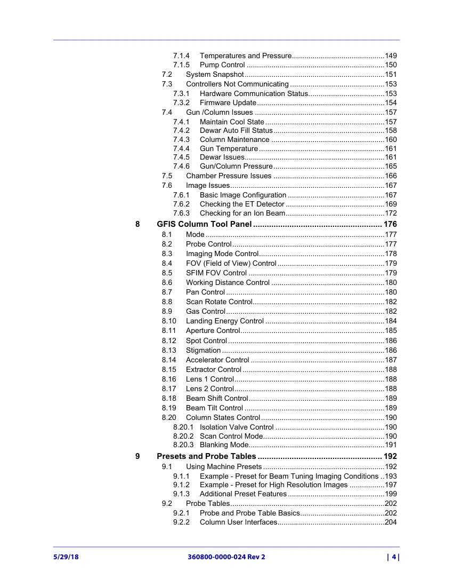

*Page 9 facsimile from `ZEISS_ORION_NanoFab_Operator_Manual_Rev2.pdf`.*

## Page 10

| 5 |
360800-0000-024 Rev 2
5/29/18
9.2.3
Probe Editing....................................................................204
9.2.4
Patterning.........................................................................206
9.2.5
Automation .......................................................................207
9.2.6
Probe Table Display.........................................................208
9.2.7
Putting Probes to Work ....................................................208
 10
Correlative Microscopy ........................................................... 210
 10.1
Overview .................................................................................210
10.1.1
A Summary of the Process...............................................210
 10.2
Zeiss Shuttle & Find Holders ..................................................211
 10.3
Using Shuttle & Find ...............................................................212
10.3.1
Activating Your License....................................................212
10.3.2
Loading the Sample .........................................................213
10.3.3
Establishing the Coordinate System ................................213
10.3.4
Finding Features of Interest .............................................215
10.3.5
Transporting Holder Between Enabled Zeiss Systems....216
10.3.6
Matching Image Sizes......................................................216
 11
Some Imaging Concepts ......................................................... 218
 11.1
The Trimer ..............................................................................218
 11.2
Best Imaging Voltage (BIV).....................................................218
 11.3
Focus ......................................................................................220
 11.4
Astigmatism ............................................................................221
 11.5
Contrast and Brightness .........................................................222
 11.6
Field of View ...........................................................................223
 11.7
Scan Size................................................................................223
 11.8
Dwell Time/Scan Speed..........................................................224
 11.9
Averaging................................................................................225
 11.10 Working Distance....................................................................225
 11.11 Eucentric Height......................................................................226
 11.12 Charge Neutralization .............................................................226
 11.13 Crossover................................................................................227
 11.14 Spot Control............................................................................229
 12
Patterning ................................................................................. 232
 12.1
Patterning Basics ....................................................................232
12.1.1
Patterning Parameters .....................................................233
 12.2
Patterning Basics Using NPVE ...............................................238
12.2.1
Patterning Process...........................................................238
12.2.2
Using NPVE .....................................................................239
12.2.3
Creating Shapes/Patterns ................................................239
12.2.4
Creating Multiple Patterns................................................241
12.2.5
Creating Arrays ................................................................242
12.2.6
Creating Dose Arrays.......................................................243
13
Glossary.................................................................................... 244

*Page 10 facsimile from `ZEISS_ORION_NanoFab_Operator_Manual_Rev2.pdf`.*

## Page 11

5/29/18
360800-0000-024 Rev 2
| 6 |
1
Overview
1.1
Precise Imaging, Plus Options
The ORION NanoFab uses a beam of helium or neon ions, produced from a 
proprietary gas field ion source (GFIS), which is focused and scanned across the 
sample. The source technology, the sample interaction, and the contrast mechanisms 
are distinctly different from the traditional scanning electron microscope (SEM). The 
helium ion offers high brightness and a small energy spread, and hence allows the 
beam to be focused to small probe sizes. The ion beams can be precisely controlled 
with variable energy, variable beam currents, and with steering to achieve sub-
nanometer beam positioning with sub-microsecond timing. As the beam interacts with 
the sample, the beam penetrates relatively deeply before it diverges and hence there 
is a narrow sample interaction region near the surface. The helium beam generates 
secondary electrons, scattered helium atoms (ions and neutrals), and other detectable 
particles from which images can be generated or analysis can be performed.
Adding the Capella Gallium Focused Ion Beam (Ga FIB) Column, an optional 
component of the ORION NanoFab basic system, adds a host of additional 
applications to the tool. With the Capella column, gallium ions are emitted, 
accelerated, focused, and deflected, adding FIB imaging, milling, and gas-assisted 
etching and deposition (with the GIS option) to the tasks that can now be performed.
Figure 1. The ORION NanoFab Workstation
GFIS Column
Operator’s Console
Process Chamber
Gun
Electronics Rack
Gas Injection System 
(option)
Capella Ga FIB 
Column (option)
Dewar
Monitors

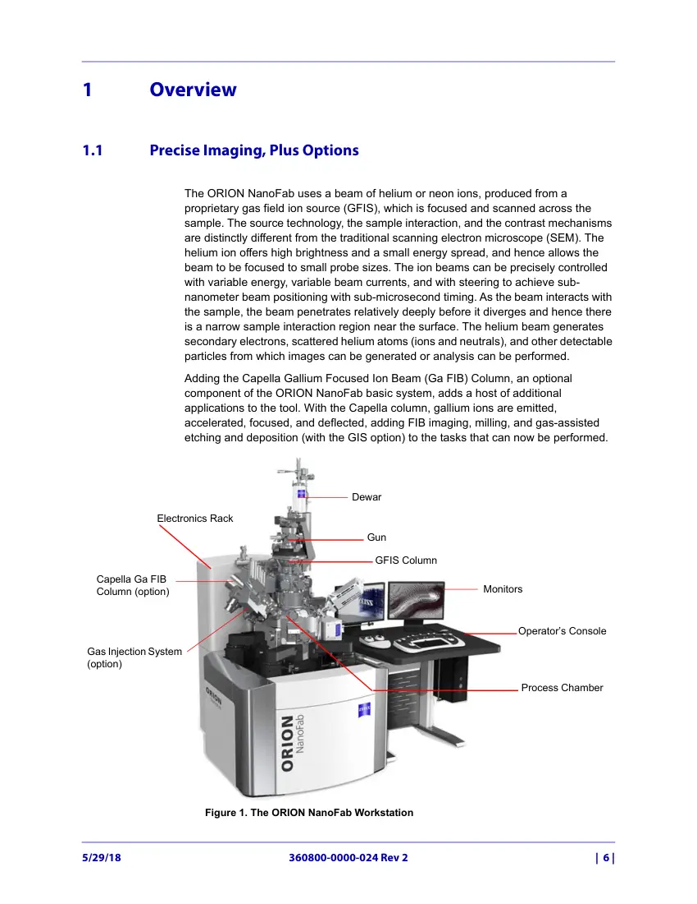

*Page 11 facsimile from `ZEISS_ORION_NanoFab_Operator_Manual_Rev2.pdf`.*

## Page 12

| 7 |
360800-0000-024 Rev 2
5/29/18
1.2
Beyond Imaging
This tool offers a tremendous range of new capabilities, from imaging, to analysis, to 
nanofabrication and to characterization. The high brightness, highly focused ion 
beams have only recently been available, and as such offer many new possibilities for 
usage in a wide range of applications.
In short, the NanoFab serves as the operator’s “eyes and hands” at the nanoscale. As 
“eyes”, the ion beams generate images with incredibly high resolution. Depending on 
the sample and the imaging conditions, the images can reveal information through a 
range of contrast mechanisms that can include topography, compositional differences, 
crystal grains, and voltage contrast.
In addition to imaging, the NanoFab can be used at higher dosages as “hands” in the 
nanoworld; that is, tools to modify and manipulate samples. For example, the ion 
beam’s sputtering process can create precision cuts and drilled holes that are smaller 
than 5 nm. With the addition of gas phase precursors, the ion beam can be used as a 
nanoscale pen, to deposit either conductive or insulating materials with an arbitrary 
pattern and with features as small as 10 nm. Lighter ion beams can also be used to 
expose negative tone (or positive tone) resists to change their properties so that only 
the exposed (or un-exposed) regions persist after the development process. Ion 
beams can also be used to implant dislocations into a material with an otherwise 
orderly atomic structure and correspondingly change the physical properties in the 
prescribed area.  
In short, the NanoFab’s ion beams can serve as versatile tools for manipulating matter 
on the nanometer scale.
1.3
About This Document
This document has been written for two purposes: to provide hands-on information for 
you, the operators of this tool, who may or may not have experience with the Helium 
Ion Microscope (HIM), and to provide broader understanding to those of you who may 
want to understand the ORION NanoFab and the possibilities it presents in the field of 
material science more thoroughly.
Section 1, Overview 
A brief statement that presents the many possibilities inherent in the use of such a 
powerful imaging, characterization, deposition and milling tool.
Section 2, Safety
A presentation of the safety issues that you must be aware of when working with the 
tool.

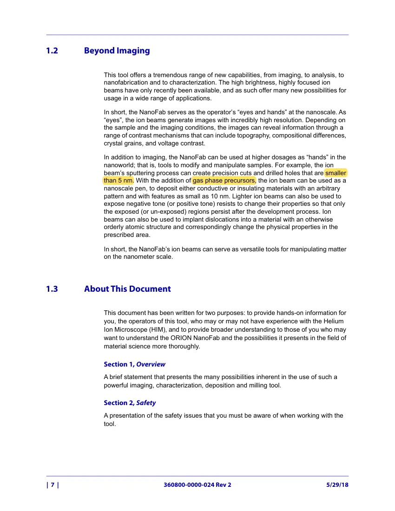

*Page 12 facsimile from `ZEISS_ORION_NanoFab_Operator_Manual_Rev2.pdf`.*

## Page 13

5/29/18
360800-0000-024 Rev 2
| 8 |
Section 3, NanoFab Components and Sub-systems 
Information presented in order to give greater understanding of the various elements 
of the ORION NanoFab system, for those who want to understand it better. This 
information is not necessary to the day-to-day operation of the tool.
Section 4, Routine Operations/Tasks
Provides general information about several of the applications and operations that you 
will be involved in as a user: Online Help, Zen Interface Help, Loading and unloading 
samples, Tuning and Operating the Flood Gun and a few other operations.
Section 5, Tool Setup & Maintenance
Provides specific information about a number of tasks that you will be involved in as an 
operator, such as basic system checks, aligning the source, aperture alignments, 
exchanging the large external N2 Dewar, cleaning the chamber, etc.
Section 6, A Work Session
Takes you through a typical working session at the operator’s console, from making 
your pre-checks, through powering up, to recording and saving your images and 
setting the microscope to Standby mode.
Section 7, Basic Troubleshooting
Explains the primary components of the Vacuum Dashboard. Gives you situations and 
solutions on a number of issues that may arise while working with the tool.
Section 8, GFIS Column Tool Panel
A summary of the principle selections in the GFIS Column tool panel in the UI, and an 
explanation for what those selections control.
Section 9, Presets and Probe Tables
A description of each of these features that can be used to make your use of the tool 
simpler by the construction of machine presets, and the construction of probes and 
probe tables to configure your column.
Section 10, Correlative Microscopy
An overview of the Shuttle & Find module for use in correlative microscopy. An 
overview of the module and step by step instructions for using it.
Section 11, Some Imaging Concepts
A brief synopsis with supporting graphics of several of the concepts that you will be 
dealing with when imaging with the HIM.

*Page 13 facsimile from `ZEISS_ORION_NanoFab_Operator_Manual_Rev2.pdf`.*

## Page 14

| 9 |
360800-0000-024 Rev 2
5/29/18
Section 12, Patterning 
Presents basic patterning concepts and a tutorial of patterning using the Nano 
Patterning and Visualization Engine (NPVE) – an optional component that allows you 
to perform intricate and specific patterns in both etching and deposition processes.
Section 13, Glossary
Definitions of nomenclature and acronyms used in this manual.

*Page 14 facsimile from `ZEISS_ORION_NanoFab_Operator_Manual_Rev2.pdf`.*

## Page 15

5/29/18
360800-0000-024 Rev 2
| 10 |
2
Safety
Follow the safety instructions given in this operator’s manual. This is essential to 
prevent damage and to protect yourself and other people against accidents and 
unsafe practices. Do not deviate from the instructions provided in this manual.
This section summarizes possible hazards and recommended safety procedures and 
includes the following topics:
•
Safety Labels
•
Safety Equipment
•
Material Safety Data Sheets
2.1
Safety Labels
The following table identifies and describes safety labels on the NanoFab that 
operators should be aware of.
Label
Description
Position
Safety Label
Indicates potential hazards.
360735-0000-029
Attached to the fill hose.
Magnetic Fields Label / Pacemaker Hazard
Static magnetic field may reach 20 mT at 
chamber surface
360735-0000-005
Attached to:
• Ion pump
• Pirani gauge
Burn Hazard Label
Severe skin burns can result from prolonged 
contact.
360735-0000-006
Primarily found on heater 
elements that bake gas lines of 
the microscope.
Hazard Chemicals Label
It indicates the presence of pressurized gas 
within the gas box. There are no customer 
serviceable items inside the gas box. Only 
qualified Zeiss personnel should service the gas 
box. The gas box does not contain any toxic 
gases.
360735-0000-007
Attached to the lower part of the 
gas box at the back of the 
microscope.

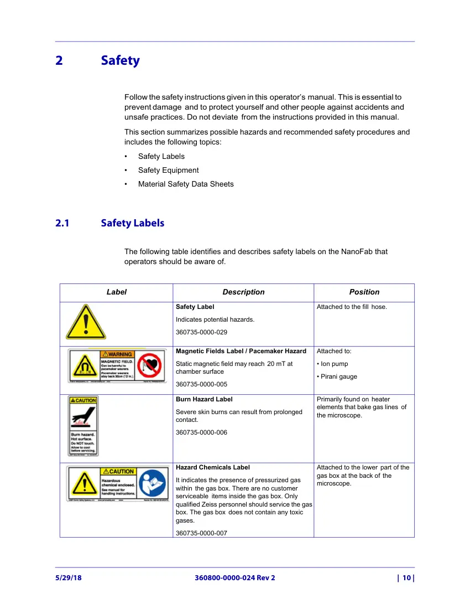

*Page 15 facsimile from `ZEISS_ORION_NanoFab_Operator_Manual_Rev2.pdf`.*

## Page 16

| 11 |
360800-0000-024 Rev 2
5/29/18
Electric Shock Label
Electrical hazard(s) enclosed
360735-0000-008
Attached to:
• Ion pump.
• Rack 1 and rack 2
• Front panel inside electronics 
rack
• LGH4 bracket
Cold Surface Label
Some internal parts of the microscope are at 
cryogenic temperatures. Some versions of the 
microscope use LN2 for cooling. Severe 
frostbite can occur if bare skin is exposed to 
cryogenic temperatures.
360735-0000-009
Attached to:
• Dewar vessel
• Fill hose
OSHA Hazard Levels Label
Specifies the OSHA hazard levels associated 
with LN2.
360735-0000-010
Attached to the Dewar vessel.
Crush Hazard Label
Risk of injury due to mechanical clamping force.
360735-0000-028
Attached to:
• Stage tilt drive assembly cover
• Gun tilt assembly cover
• Aperture drive assembly cover
Arc-Flash Warning Label
Risk of injury due to potential arc-flash hazard.
360735-0000-030
Attached to the chase rack.
Lifting Hazard Label
Heavy item should not be lifted by one person.
360735-0000-022
Attached to:
• Rough pump manifold block
• Chamber and gun rough pumps
• Dewar pump
• UPS
• Chase rack
UPS Voltage Warning Label
Live voltages inside even when main power is 
turned off.
360735-0000-031
Attached to:
• Rack 1 and 2
• Front panel
• Chase rack

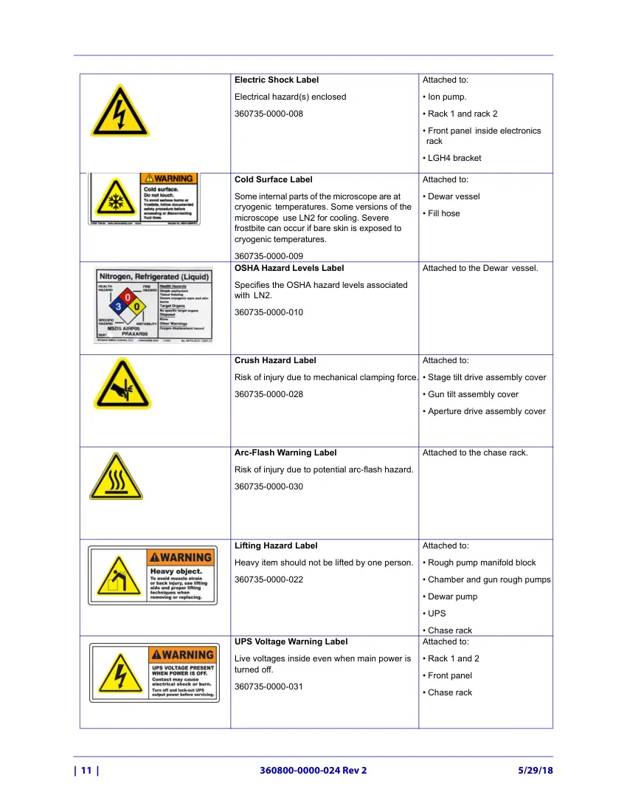

*Page 16 facsimile from `ZEISS_ORION_NanoFab_Operator_Manual_Rev2.pdf`.*

## Page 17

5/29/18
360800-0000-024 Rev 2
| 12 |
2.2
Safety Equipment
This section describes the following NanoFab safety equipment:
•
Protective Cover Panels
•
Emergency Machine Off (EMO) Shutoff
•
Main Shutoff Valves
The customer is responsible for installing main shut-off valves and for providing 
instructions for operating the main shut-off valves.
2.2.1
Protective Cover Panels
The plinth is secured with protective cover panels (see Figure 2).
Note:
The cover panels should only be removed by trained Zeiss service 
engineers.
Figure 2. Protective Cover Panels
Danger
Electrocution hazard: 
High-voltage electrical currents present in the tool can be fatal.

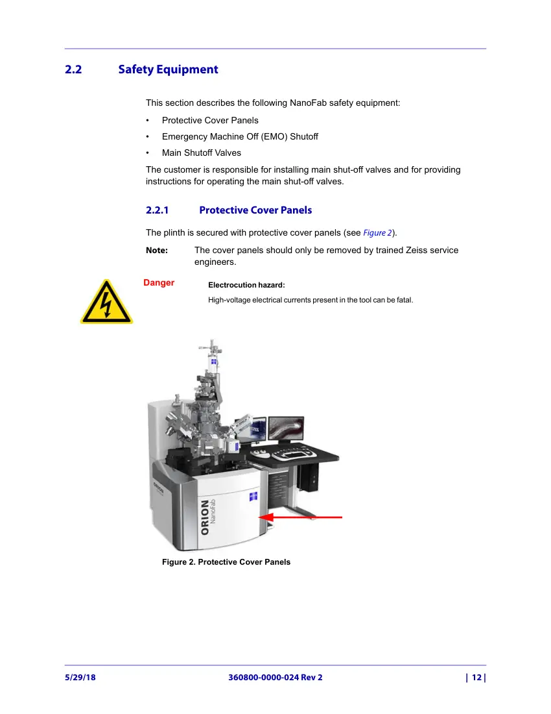

*Page 17 facsimile from `ZEISS_ORION_NanoFab_Operator_Manual_Rev2.pdf`.*

## Page 18

| 13 |
360800-0000-024 Rev 2
5/29/18
2.2.2
Emergency Machine Off (EMO) Shutoff
The Emergency Machine Off (EMO) buttons are to be used only in an emergency that 
requires an immediate shutdown of all electrical power to the microscope. Pressing 
any of the EMO buttons turns off the output from the UPS, removing all voltages from 
the microscope.
The microscope typically remains powered-up at all times; the chamber is under 
vacuum, the ion source is at cryogenic temperature, and all of the electronics are 
operating. Do not press an EMO button unless there is an actual emergency.
Powering-off the microscope by pressing an EMO button does not allow the software 
running the system computer to save data and shut down properly, and data may 
therefore be lost. Damage may also occur to the turbo pumps.
The NanoFab comes equipped with (2) EMO buttons as shown in Figure 3. 
•
Front panel of the chase rack
•
Front of the microscope
Note:
Other EMO buttons may be added to the microscope.
Figure 3. EMO Buttons
When an EMO button is pressed, it latches in the OFF position. To release the EMO 
button from the latched position, turn the knob in the clockwise direction. All EMOs 
must be in the ON position, or unlatched, to enable the output from the UPS.
Danger
Electrocution hazard: 
High-voltage electrical currents present in the tool can be fatal.

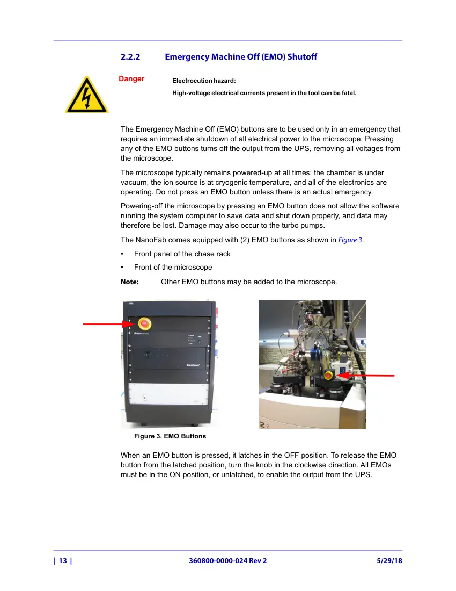

*Page 18 facsimile from `ZEISS_ORION_NanoFab_Operator_Manual_Rev2.pdf`.*

## Page 19

5/29/18
360800-0000-024 Rev 2
| 14 |
2.2.3
Main Shut-Off Valves
The customer is responsible for the installation of main shut-off valves at the site of 
installation. The following main shut-off valves are required:
•
Nitrogen supply
•
Compressed air supply
The main shut-off valves must be easily accessible. They must close off the 
connections to the corresponding media when needed. The main shut-off valves 
must be lockable in their OFF position in order to prevent accidental re-activation.
As the customer is responsible for installing the main shut-off valves, the customer 
should also provide instructions on how to operate the main shut-off valves 
properly.
2.3
Material Safety Data Sheets
You can find material safety data sheets (MSDS) on the Zeiss website covering 
potentially hazardous chemicals that may be used during operation and service 
activities. 
https://www.zeiss.com/microscopy/us/local/safety-and-environmental.html.
These chemicals include:
•
NanoFab potentially hazardous chemicals:
–
Helium
–
Neon
–
N2 (compressed gas)
–
N2 (cryogenic liquid)
–
Compressed air
•
Gallium FIB option potentially hazardous chemicals:
–
Gallium
•
GIS option potentially hazardous chemicals:
–
Chemical cartridges purchased for use with the GIS include the appropri-
ate MSDS document.
–
A list of MSDS documents is included in the Oxford Instruments Nano-
Analysis OmniGIS II Installation and Users Manual that is provided with 
each GIS unit.

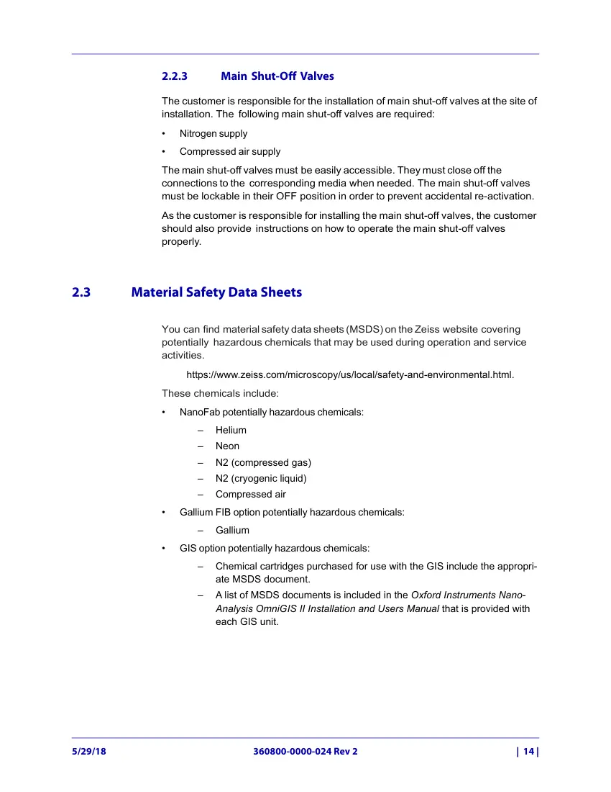

*Page 19 facsimile from `ZEISS_ORION_NanoFab_Operator_Manual_Rev2.pdf`.*

## Page 20

| 15 |
360800-0000-024 Rev 2
5/29/18

*Page 20 facsimile from `ZEISS_ORION_NanoFab_Operator_Manual_Rev2.pdf`.*

## Page 21

5/29/18
360800-0000-024 Rev 2
| 16 |
3
NanoFab Components & Sub-Systems
Figure 4. The NanoFab Process Module with Attachments
Integrated 5 liter Dewar
Vibration Isolation
Large N2 Dewar
Gas Delivery system
Neon
Helium
Ga FIB Column 
option
Zen GUI
Source Camera
Sample & Holder
Gas Injection 
System 
option
Gun Housing, 
containing the Source
Evactron
GFIS Column 
Housing
Air Lock
Process Chamber
Fill Stalk
ET Detector

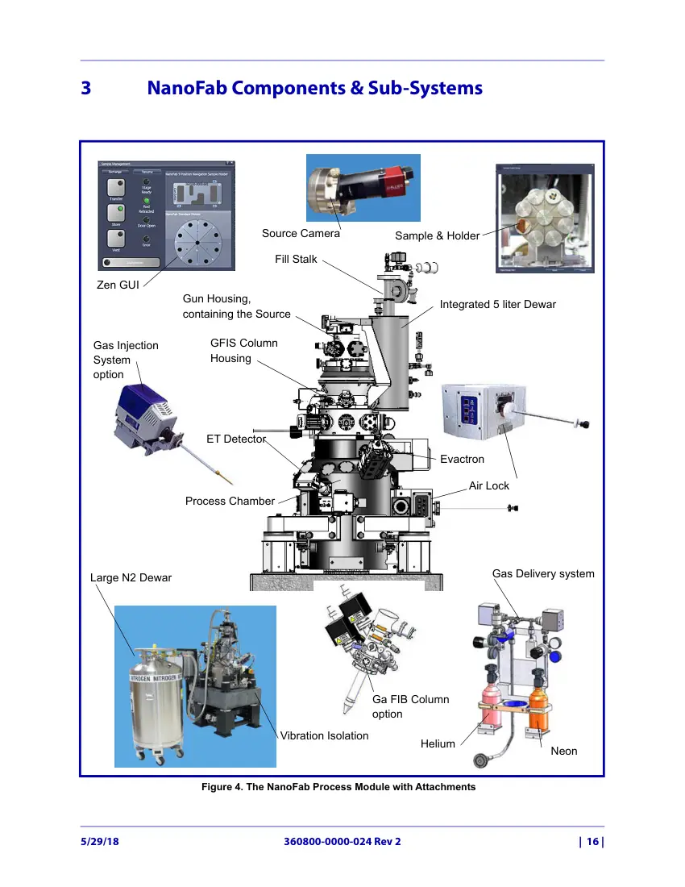

*Page 21 facsimile from `ZEISS_ORION_NanoFab_Operator_Manual_Rev2.pdf`.*

## Page 22

| 17 |
360800-0000-024 Rev 2
5/29/18
3.1
GFIS Column
The term “GFIS Column” has two different meanings. In its larger sense, it refers to the 
structure that includes the gun and the column components and housing down to the 
process chamber. In a narrower sense, it refers to the specific portion of the column 
housing and components that sits between the gun and the process chamber, 
containing the parts from lens 1 down through lens 2, which can be lifted out in one 
piece for maintenance. We describe the individual components of the GFIS column in 
its larger sense here.
3.1.1
GFIS Column Elements
GFIS Gun
The gun sits at the top of the GFIS column. It includes the gun head, the source and 
the extractor. It is the portion of the column that tilts back when opening the top of the 
column for source maintenance. The gun is kept at cryogenic temperature. The area is 
pumped by the gun turbo. The gun pressure gauge monitors the pressure in the gun 
area, which should be in the 5E-10 Torr range. 
The rough pump is used for backing the gun turbo pump. Between the rough pump 
and the turbo is the gun safety valve. It is typically open except when the rough pump 
is not in running mode. The gun foreline gauge monitors the pressure in the foreline 
between the turbo and the rough pump. This pressure should be in the 1E-4 Torr 
range.
Figure 5. The GFIS Gun
Gas line
Source
Gun head

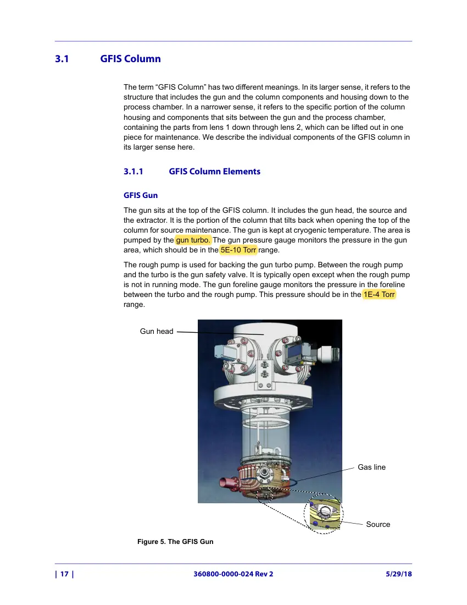

*Page 22 facsimile from `ZEISS_ORION_NanoFab_Operator_Manual_Rev2.pdf`.*

## Page 23

5/29/18
360800-0000-024 Rev 2
| 18 |
Source
The source is mounted at the top of the column, in the gun assembly. The source 
consists of an insulating base, a filament, and an emitter as shown in Figure 6. The 
insulating base is a ceramic disc in which two electrical connector pins are 
embedded. The filament is high-resistance wire, formed into a V-shape and welded 
between the two pins. One end of the emitter, which is a short length of metal wire, 
is welded to the filament. The other end of the emitter is then sharpened to a point 
by an electro-chemical etching process.
Figure 6. Source Components
The emitter occasionally requires reheating in order to reshape the tip, using the 
Forming the Source routine in the Zen UI. As a final step, the source must be 
sharpened to a point consisting of three atoms at the tip, using the Select a Trimer 
routine. One of the three atoms is then selected for the beam. 
Figure 7. Atom Selection for Beam
A positive voltage (accelerator voltage) is applied to the source and a negative voltage 
(extractor voltage) is applied to the extractor, creating an extraction field between the 
two electrodes. The magnitude of the electric field is enough to ionize (separate an 
electron from an atom) gas atoms that approach the tip. The volume around the 
source is cryogenically cooled, which slows down the motion of the atoms, causing 
them to remain in the ionization area longer, thus increasing the likelihood of 
ionization. Ionized atoms, being positively charged due to the missing electron, are 
repelled by the positive voltage of the source, creating the ion beam that is directed 
down the column and scanned across the sample.
Glass Disc
Emitter
 Filament
Connector Pins

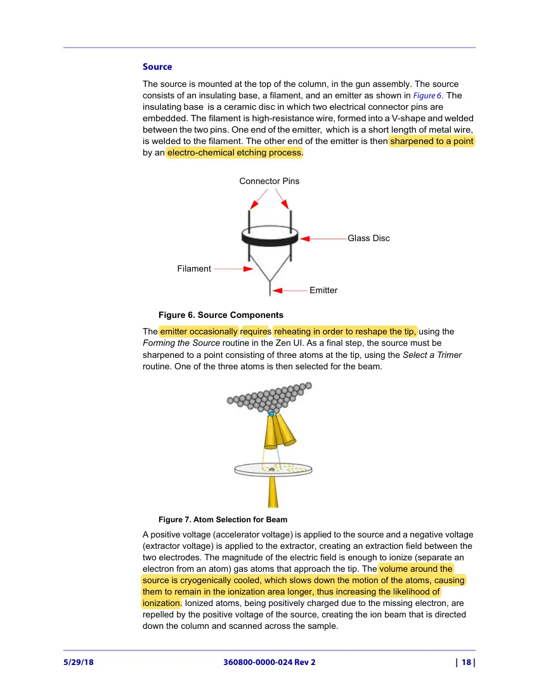

*Page 23 facsimile from `ZEISS_ORION_NanoFab_Operator_Manual_Rev2.pdf`.*

## Page 24

| 19 |
360800-0000-024 Rev 2
5/29/18
The beam from the source can be generated with either helium or, if supplied, neon. 
The choice of gas depends on the customer’s application. The gas selection is made 
by you through the UI.
The source is a consumable item.The life time of a source depends on several factors, 
and is generally between 6 months and 2 years. A source replacement kit 360100-
0000-700 is available and can be ordered through your service organization. 
The high voltage applied to the source is generated by the accelerator power supply 
(PS). The power supply typically operates in the range of 25 kV to 35 kV. The 
accelerator PS feedthru is near the top of the column housing. High voltage should 
always be applied to the source even when the source is in the stand-by mode to keep 
impurities from attaching to the tip.
3.1.2
Extractor 
The extractor electrode is a circular plate that mounts just below the source. The 
extractor power supply is connected to the extractor plate (extractor electrode). The 
ion beam passes through a hole in the middle of the extractor plate. The extractor 
voltage, along with the acceleration voltage create the extraction field that ionizes the 
gas atoms. The extraction field is typically between -25 kV and -35 kV.
The feedthru for the extractor PS is near the top of the column housing, above the 
aperture drive assembly.
The extraction field is kept on even when the GFIS column is in standby mode. This 
helps prevent impurities from attaching to the tip.
GFIS Column Ion Beam
The imaging gas (helium or neon) is ionized at the top of the GFIS column, in the gun 
section, creating the ion beam. The beam passes through lens 1, which condenses the 
beam before it passes through the beam-limiting apertures below. The quadrupole tilts 
and shifts the ion beam to line it up directly with the center of lens 2. After passing 
through the selected beam-limiting aperture and the beam blanker, the beam passes 
through the octopoles, which deflect the ion beam in a raster-like motion across the 
sample.
The action of the ion beam striking the sample causes secondary electrons to be 
dislodged from the sample. The secondary electrons are collected by the ET detector. 
The detector converts the secondary electrons into an electrical signal proportional to 
the number of secondary electrons collected from each point of the scan. The 
electrical signal is converted into an image that is displayed within the user interface.

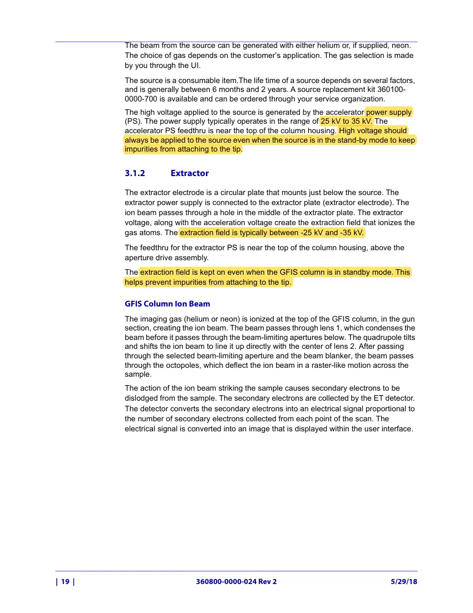

*Page 24 facsimile from `ZEISS_ORION_NanoFab_Operator_Manual_Rev2.pdf`.*

## Page 25

5/29/18
360800-0000-024 Rev 2
| 20 |
Figure 8. The GFIS Column Ion Beam
The following sections describe the main components of the GFIS column as shown in 
Figure 8.
Lens 1
Lens 1, which is sometimes referred to as the condenser lens, is a three-element, 
electrostatic lens (called an Einzel lens) that forces the ions in the beam to converge 
somewhere above the beam limiting apertures. Any charged-particle beam tends to 
diverge after leaving its source and lens 1 corrects for this divergence and focuses the 
beam towards a point further down the column.
Each element is basically circular with a hole in the middle to allow the beam to pass. 
The uppermost element is electrically connected to the extractor and therefore is at the 
same potential. The lowest element is grounded. The middle element is connected to 
the lens 1 power supply, which has a range of 0 to 40 kV. 
The higher the voltage on this element, the stronger the focus force on the beam, 
causing the focal point, also called the crossover point, to move further up the column.
Lens 1
Beam blanker
Lens 2
Upper quadrupoles
Beam limiting aperture
Upper octopoles
Sample holder
Ion beam
Source
Accelerator voltage (+) is 
applied to the source
Lower quadrupoles
Extractor
Lower octopoles
Blanking aperture
Lens 1 condenses the beam
The quadrupoles tilt and shift 
the beam
The octopoles deflect the 
beam in a raster-like motion
Sample
Lens 2 focuses the beam on 
the sample
The beam blanker plates 
deflect the beam to the 
Faraday when not imaging
Extractor voltage (-) is applied 
to the extractor plate
Base of gun
Diff. pumping aperture
Column isolation valve
The isolation valve isolate the 
vacuum between the lower 
column and the chamber
The beam limiting apertures 
limit the beam size

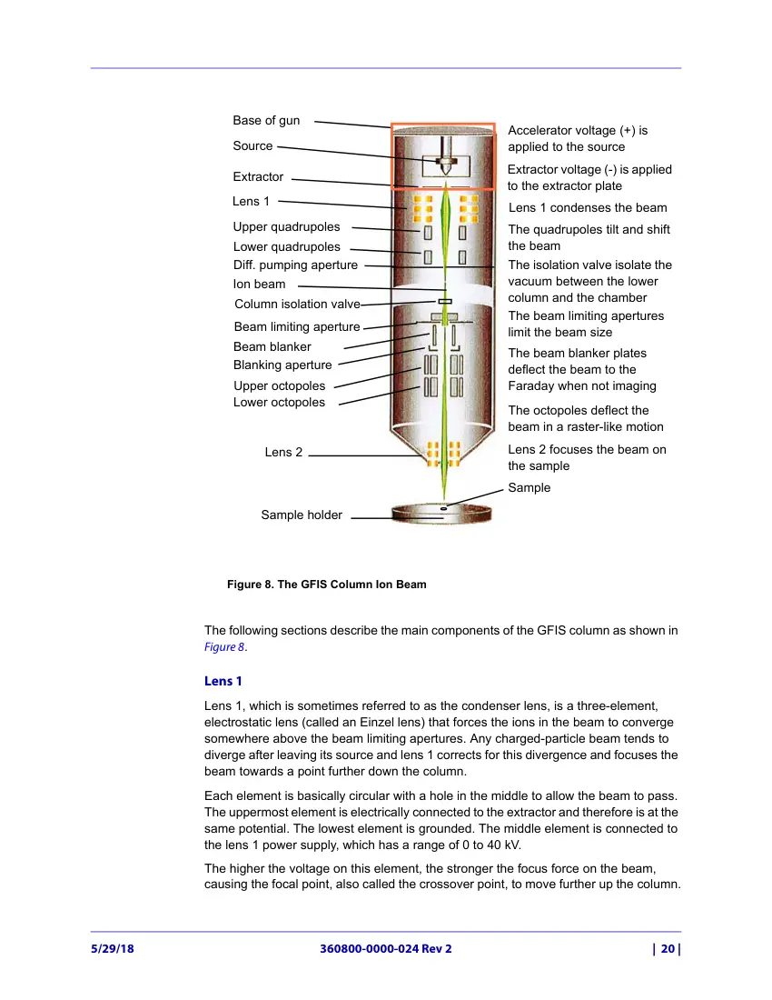

*Page 25 facsimile from `ZEISS_ORION_NanoFab_Operator_Manual_Rev2.pdf`.*

## Page 26

| 21 |
360800-0000-024 Rev 2
5/29/18
Quadrupoles
The main purpose of the quadrupole assembly is to tilt and shift the ion beam so that it 
lines up directly with the center of lens 2. Two quadrupole deflectors, referred to as the 
upper quadrupole and the lower quadrupole, are incorporated in the column 
immediately below lens 1. In Normal Imaging Mode, the quadrupoles are used for 
beam alignment (mid-column tilt and mid-column shift). In SFIM mode, the 
quadrupoles are used to scan the beam.
Figure 9. Beam Tilt & Shift with Quadrupoles
Column Isolation Valve
The column isolation valve (CIV) is a pneumatically operated valve, mounted on the 
front of the column housing, that is opened to allow the ion beam to pass when 
imaging. It is closed to isolate the gun/column vacuum section from the chamber 
vacuum section. The chamber can then be vented for service while keeping the gun/
column sections under vacuum. The valve is closed when the GFIS column is in 
standby mode.
Beam Limiting Apertures
For better imaging, the ion beam must be much narrower than the stream of ions that 
the source produces. Therefore, a beam limiting aperture is used to block all but the 
central part of the ion beam. Through the UI, you can select any one of 14 available 
limiting apertures. Positioning of the apertures is done by the aperture drive assembly, 
located just below the Dewar. The aperture assembly controls the motion of the 
aperture bar, allowing any of 14 apertures to be positioned in the ion beam path. It can 
also pull the aperture bar completely out of the path of the ion beam, allowing the 
beam to pass through what is referred to as “big hole”. The term refers to a position 
where there is no beam-limiting aperture in the beam path.
Every NanoFab is shipped with one of two standard aperture sets. A base system, 
which uses only helium as an imaging gas, is currently shipped with 12 gold foil 
apertures and 2 moly (molybdenum) apertures (Figure 10).

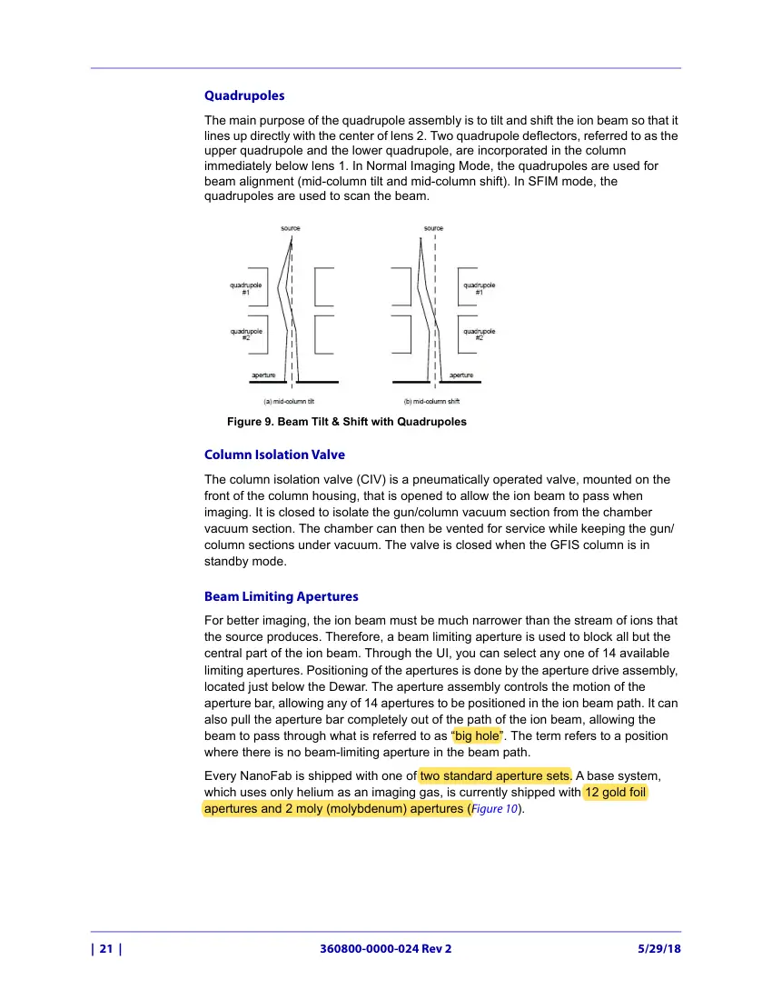

*Page 26 facsimile from `ZEISS_ORION_NanoFab_Operator_Manual_Rev2.pdf`.*

## Page 27

5/29/18
360800-0000-024 Rev 2
| 22 |
Figure 10. Base Machine Aperture Set
The decision as to which aperture to use depends on the specific application. Consult 
with your Tool Owner for further information.
A NanoFab that uses both helium and neon as imaging gases is shipped with an 
aperture set containing 8 moly apertures and 6 gold foil apertures (Figure 11).
Figure 11. Aperture Set for Helium and Neon
The six gold foil apertures, positions 2-7, are used for imaging with helium. At high 
magnification and high resolution, the thinner gold apertures give better images. The 
eight moly apertures, positions 1 and 8-14, are used for neon imaging, as gold foil 
apertures are easily damaged with neon. 
Beam Blanking Assembly
The beam blanking plates are mounted on opposite sides of the beam path and 
electrically isolated from each other. During imaging, both plates are grounded, 
allowing the beam to pass between them unaffected. From there the beam passes 
down the optical axis and through the hole in the middle of the beam blanking aperture 
(Figure 12). 
When not imaging, it is best to not allow the beam to continue down the column. This 
is called blanking the beam. Blanking the beam is accomplished by applying an equal, 
but opposite polarity voltage to each of the blanking plates. The field created between 
the two plates deflects the beam away from the optical axis. Once deflected, instead of 
passing through the beam blanking aperture, it strikes the inside of the beam Faraday 
cylinder and is measured.

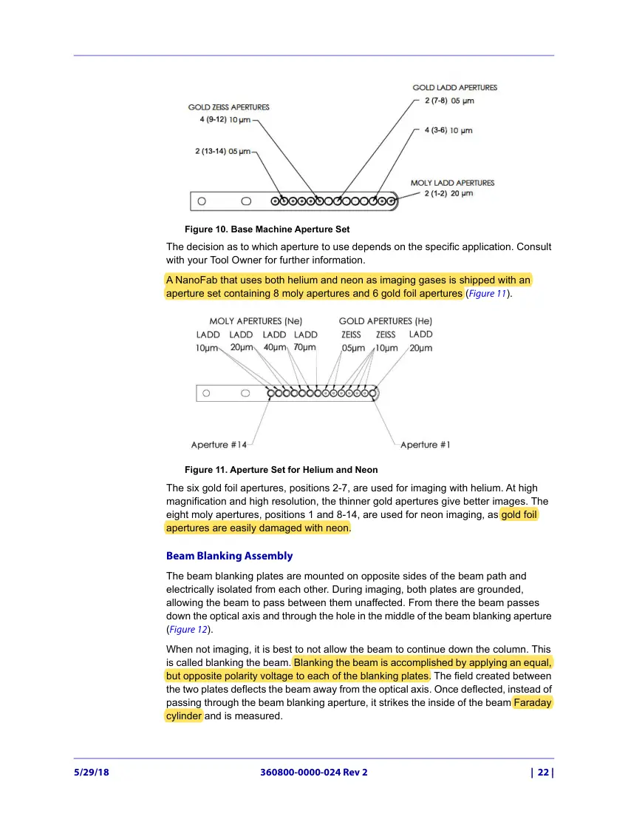

*Page 27 facsimile from `ZEISS_ORION_NanoFab_Operator_Manual_Rev2.pdf`.*

## Page 28

| 23 |
360800-0000-024 Rev 2
5/29/18
Figure 12. Beam Blanking 
Faraday Cup and Beam Blanking Aperture
The Faraday cup is comprised of the Faraday cylinder and the beam blanking aperture 
attached to the bottom. When the beam is blanked it strikes the inside of the Faraday 
cup, allowing the beam current to be measured by circuitry in the GFIS support 
module.
The beam blanking aperture is a flat plate with a small hole in the middle and attaches 
to the bottom of the Faraday cylinder. When the ion beam is unblanked it passes 
through the aperture. When the ion beam is blanked, all the ions in the beam are 
captured within the Faraday cup.
Figure 13. The Faraday Cup
Blanking plates
Blanking aperture
Faraday cylinder

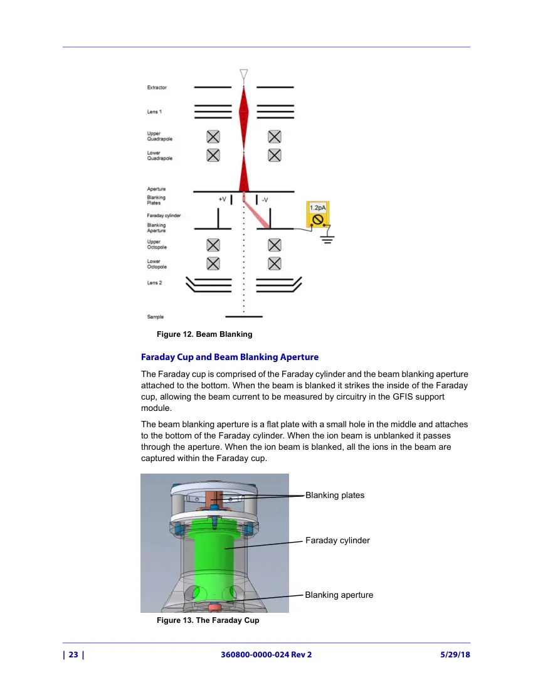

*Page 28 facsimile from `ZEISS_ORION_NanoFab_Operator_Manual_Rev2.pdf`.*

## Page 29

5/29/18
360800-0000-024 Rev 2
| 24 |
Octopoles
An octopole deflector (referred to as an 
octopole) works like a quadrupole deflector 
but with eight radial deflectors, which allows 
for finer control. The GFIS column has two 
octopoles, mounted one above the other, 
referred to as the upper and lower octopoles. 
The octopoles work together to deflect the ion 
beam in a scanning pattern across the 
sample. A double-deflection scheme is used 
which keeps the beam on the center of lens 2 
while scanning. The signals that drive both 
octopoles come from the GFIS optics module.
Figure 14. Octopole Beam Deflection
Lens 2
Like lens 1, lens 2 is a 3-element (Einzel) lens that focuses the ion beam on the 
sample. Each element is basically circular with a hole in the middle to allow the beam 
to pass. The upper and lower elements are grounded. The middle element is 
connected to the lens 2 power supply. The power supply is a positive supply and has a 
range of 0 to 40 kV. The higher the voltage on this element, the stronger the focus 
force on the beam, causing the focal point (working distance) to move closer to the 
column.

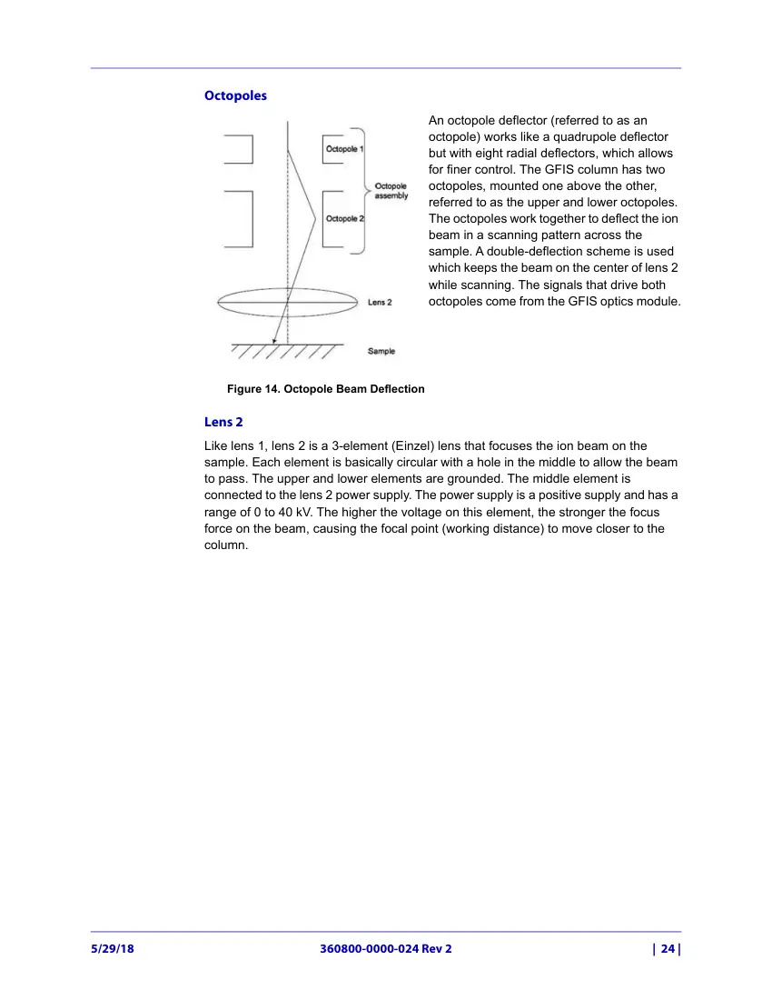

*Page 29 facsimile from `ZEISS_ORION_NanoFab_Operator_Manual_Rev2.pdf`.*

## Page 30

| 25 |
360800-0000-024 Rev 2
5/29/18
3.2
Process Chamber
The process chamber sits at the base of the tool, below the column. All processing 
takes place inside the process chamber. Samples are placed in the chamber via an air 
lock, which is mounted on the chamber (the back side of the image in Figure 15).
3.2.1
Process Chamber Elements
Cradle & Tilt Drive Assembly
Inside the process chamber is the cradle, which provides motion on one axis, referred 
to as tilt. The tilt axis has a range of travel of -5 degrees to +54 degrees. At +54 it is 
normal to the Capella (Ga FIB) column option, which would be mounted above the 
chamber door. Tilt is accomplished by tilting the cradle, which is driven by the tilt drive 
assembly.
Figure 15. Process Chamber
Stage
Mounted in the cradle is a 4-axis stage. The stage allows four axes of movement; X, Y, 
Z, and Rotate. As an operator, consider that the front of the machine is on the air lock 
side, as that perspective is what you get in your ion beam images.The X-axis therefore 
moves in the left and right direction in your images, and the Y-axis appears as moving 
in the front and back direction, using the air lock as your orientation point. Both the X 
and Y axes have a travel range of 50 mm. The Z-axis is the up-and-down direction, 
with a travel range of 8 mm. The rotate axis has a range of 0 to 360 degrees. 
Sample Holder
The sample holder sits on the sample holder mounting platform on top of the stage 
when it has been inserted into the chamber through the air lock. 
 Stage
Process chamber
Cradle
Sample holder
Sample
Chamber 
camera
Tilt drive assembly

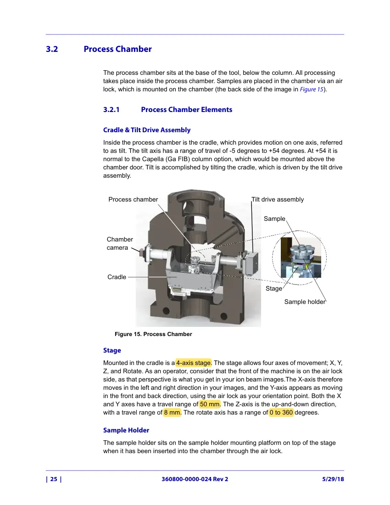

*Page 30 facsimile from `ZEISS_ORION_NanoFab_Operator_Manual_Rev2.pdf`.*

## Page 31

5/29/18
360800-0000-024 Rev 2
| 26 |
Camera
The chamber camera is mounted on the back of the process chamber, shown on Figure 
15. This allows you to view the stage and holder as they are moving, to avoid the 
sample hitting the bottom of the column, the ET detector grid, or anything else in the 
chamber.
Also in the process chamber is the detector (not shown) that collects the secondary 
electrons emitted from the sample as it is struck by the ion beam. The gun, column and 
process chamber together compose the process module.
ET Detector
The Everhart-Thornley detector (ET detector) is mounted towards the left on the 
process chamber (not shown in Figure 15). It’s purpose is to collect the secondary 
electrons that are dislodged from the sample when struck by the ion beam, for basic 
and high-resolution imaging, giving information on the topography of the sample, and 
to some degree its composition. Within the ET detector, the secondary electrons are 
converted to an electrical signal proportional to the number of electrons collected.
Figure 16. ET Detector
On the end of the ET detector, inside the process chamber, is a small wire-mesh cage 
called the collector grid. Under normal operation, the grid is at a potential of +500 volts. 
The secondary electrons that are dislodged from the sample are attracted to the 
positive potential on the ET detector grid. Just behind the grid is the scintillator, a disk-
shaped substrate, that is positively biased to attract and accelerate the electrons 
drawn in by the grid. Electrons striking the scintillator cause photons to be emitted 
from the other side of the scintillator. The silica glass light pipe carries photons 
produced by the scintillator out of the vacuum chamber and provides electrical 
isolation between the internal and external components of the detector.
Behind the light pipe is the photomultiplier tube (PMT), which converts the photons to 
an electrical signal and multiplies it many order of magnitude. The gain through the 
PMT is controlled by the voltage applied across it. This voltage is controlled by the 
contrast setting. The output from the PMT is fed to the ET detector pre-amp. The 
output of the pre-amp is on the VIDEO connector of the ET detector assembly, which 
is connected to the SAS for image processing.
Collector grid
Scintillator 
(inside)
Light Guide assembly, 
containing the light pipe
Photomultiplier 
assembly
Pre-amp

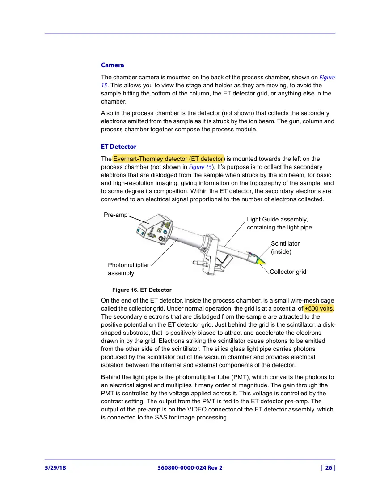

*Page 31 facsimile from `ZEISS_ORION_NanoFab_Operator_Manual_Rev2.pdf`.*

## Page 32

| 27 |
360800-0000-024 Rev 2
5/29/18
Flood Gun
The flood gun is mounted on the chamber above the chamber door.
The NanoFab HIM imaging process involves striking the specimen to be imaged with 
a beam of positively-charged helium ions. When these ions hit the specimen, they 
dislodge (negatively-charged) electrons, referred to as secondary electrons (SE). Both 
actions (adding positive ions and removing electrons) cause a non-conducting 
specimen to become positively charged. The more positively charged the specimen 
becomes, the harder it is for the secondary electrons to be dislodged, since they are 
attracted back to the positively-charged sample instead of making their way to the ET 
detector. No image is formed unless secondary electrons can reach the ET detector. 
To overcome the problem of the specimen becoming positively charged, the flood gun 
generates a beam of electrons that is aimed at the specimen to reduce or eliminate the 
positive charge (Figure 17). Elements within the flood gun allow the beam to be emitted 
(or not), focused, and aimed (or deflected), so that the electron beam can be 
concentrated in the same area on the specimen that the ion beam is striking. This 
process of flooding the specimen with an electron beam is called charge 
neutralization. 
Figure 17. Electron Flooding
When imaging, the grid on the ET detector is positive to attract secondary electrons. If 
the flood gun emitted electrons while the ET detector was positive, the electrons from 
the flood gun would completely saturate the ET detector. To prevent this situation from 
occurring, the ion beam and the electron beam from the flood gun are multiplexed so 
that the flood gun is blanked while the ion beam is on, and vice versa (Figure 18). When 
the flood gun is emitting electrons, the ET detector grid is at a -1000 V potential to 
repel flood gun electrons. This prevents the ET detector from getting saturated.
Figure 18. Imaging
Flood gun
ET detector
Column

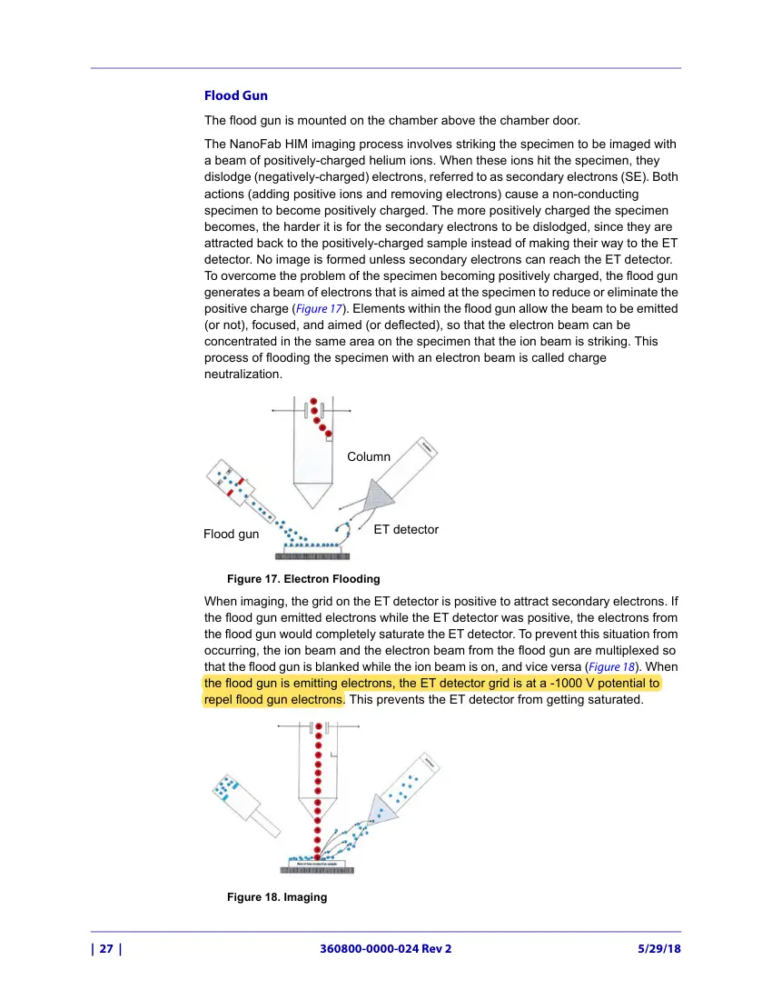

*Page 32 facsimile from `ZEISS_ORION_NanoFab_Operator_Manual_Rev2.pdf`.*

## Page 33

5/29/18
360800-0000-024 Rev 2
| 28 |
3.3
Capella Column Option
The Capella, a Gallium Focused Ion Beam (FIB) Column, is an optional component of 
the ORION NanoFab basic system. It is located on the left side of the chamber, as 
viewed from the front. It is typically used in the following applications:
•
FIB Imaging - Image generation and specimen analysis by a focused ion beam 
scanned across the specimen.
•
Milling - Removal of material from the specimen surface by a focused ion beam 
concentrated locally.
•
Gas-assisted etching - Cutting into the material with the assistance of a process 
gas via a Gas Injection System (GIS).
•
Gas-assisted deposition - Deposition of material using a focused ion beam and 
the assistance of a process gas via a GIS.
Figure 19. Capella (Ga FIB) Column (option)
Gallium ions (Ga+) are extracted from a liquid metal ion source, and are used up 
during operation. The source is rated for 30000 µAh.
GFIS Column
Ga FIB Column
Sample
Process chamber

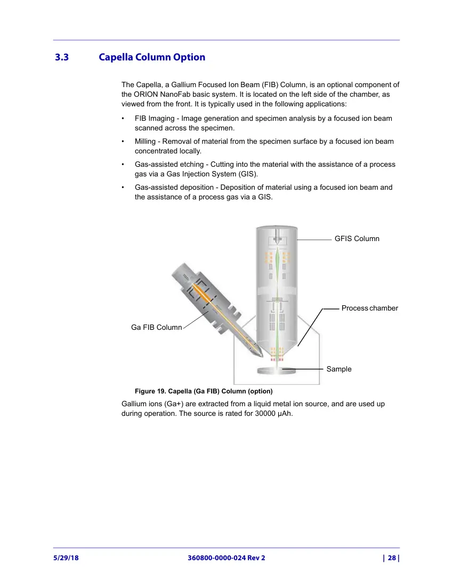

*Page 33 facsimile from `ZEISS_ORION_NanoFab_Operator_Manual_Rev2.pdf`.*

## Page 34

| 29 |
360800-0000-024 Rev 2
5/29/18
3.4
Gas Injection System (GIS) Option
The Gas Injection System (GIS) is a chemical delivery system that allows chemically 
reactive gasses to be released within the process chamber in close proximity to where 
the ion beam impacts the sample.
The beam interacts with the various chemical precursors to either deposit materials 
onto the substrate, or etch materials from the substrate.
Figure 20. Gas Injection System (option)
Both electrical and pneumatic control lines connect the GIS mounted on the chamber 
to the electronic controller located in the options rack. The GIS delivers gas into the 
chamber through a retractable needle that is inserted during operation to be in close 
proximity to the sample substrate.
The GIS delivery system can deliver up to 3 different chemical precursors and two 
different inert gasses. The inert gasses can be used as a process gas or a carrier gas 
for the delivery of the precursor.

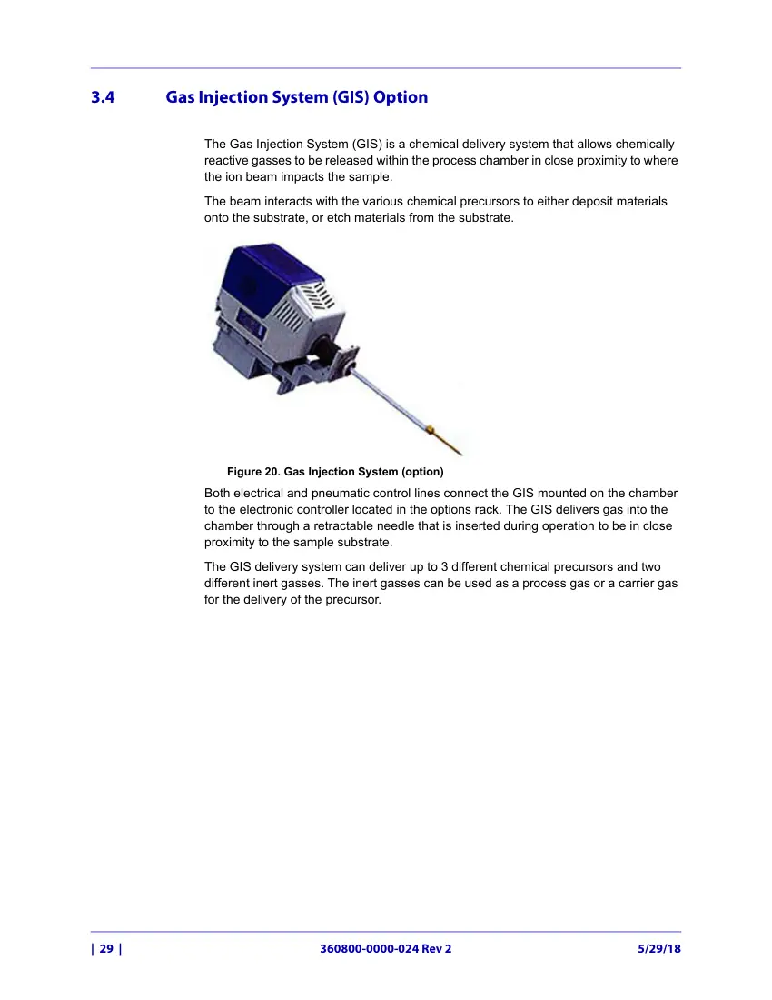

*Page 34 facsimile from `ZEISS_ORION_NanoFab_Operator_Manual_Rev2.pdf`.*

## Page 35

5/29/18
360800-0000-024 Rev 2
| 30 |
3.5
NanoPatterning and Visualization Engine (NPVE) Option
The Fibics NanoPatterning and Visualization Engine (NPVE) is an optional component 
of the ORION NanoFab® and allows you to perform intricate and specific patterns in 
both etching and deposition processes. It incorporates a dedicated 16 bit scan 
generator for each NanoFab column and dual signal acquisition hardware supporting 
real-time advanced patterning and visualization. The beam is completely controlled by 
the GUI that allows it to create a range of fully editable shapes including rectangles, 
trapezoids, polygons, lines, polylines, ellipses and spots; then it‘s possible to vector-fill 
these shapes while maintaining full control over dose variation and patterning 
parameters including patterning direction, spacing, dwell, refresh and scan strategy. 
See Section 12.2, Patterning Basics Using NPVE.

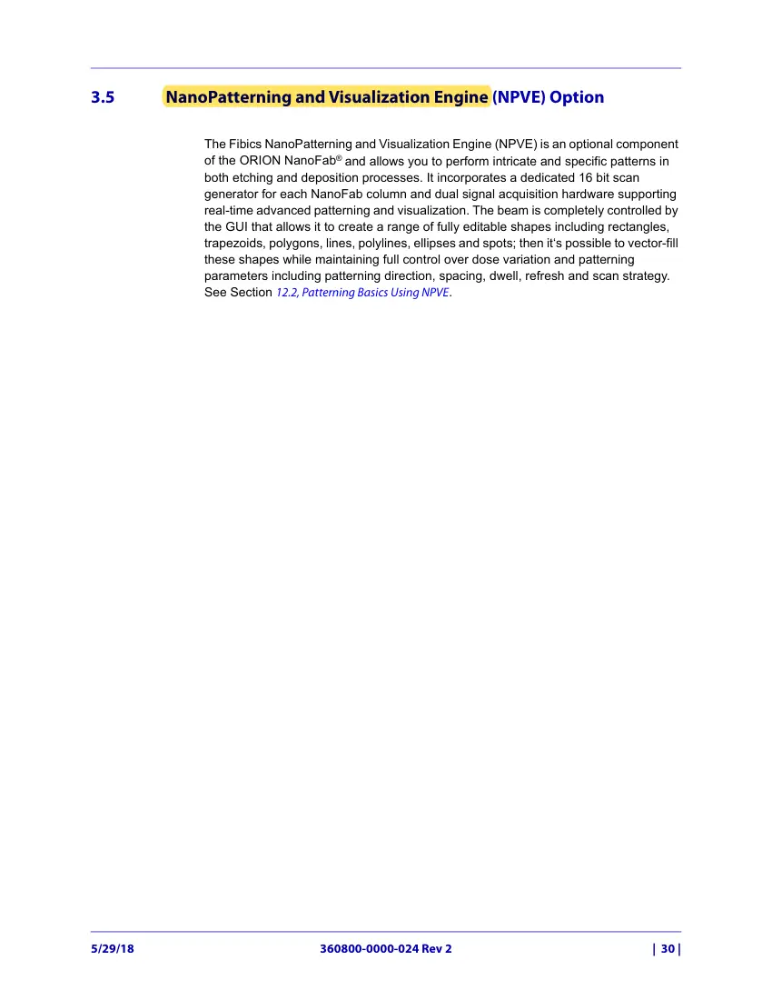

*Page 35 facsimile from `ZEISS_ORION_NanoFab_Operator_Manual_Rev2.pdf`.*

## Page 36

| 31 |
360800-0000-024 Rev 2
5/29/18
3.6
Vacuum Subsystem
The Vacuum Dashboard is a good place to observe the operation of the vacuum 
system during normal operation but should be used only for observation and not for 
running the system. 
There are three separate vacuum regions within the NanoFab: gun/column, chamber 
and Dewar.
Figure 21. The Vacuum Dashboard
The area above the column isolation valve in the GFIS column is the gun/column 
vacuum region. This region is pumped by the gun turbo pump at the rear of the 
process chamber. It is shown in Figure 22. 
Figure 22. Gun/Column Vacuum Region
On the right side of the Dashboard is the GFIS Column panel, which shows the pumps 
and the valves related to the gun/column vacuum region (Figure 24). It is accessed by 
selecting the GFIS Column tab at the top of the panel.
Isolation valve

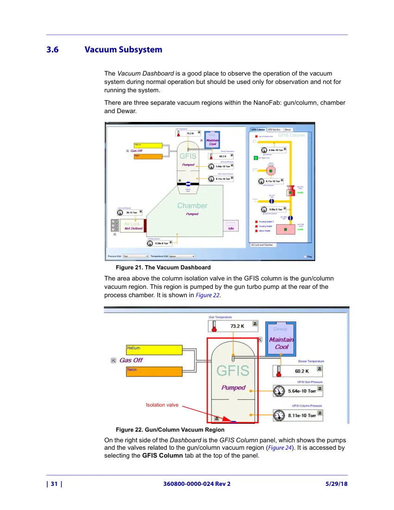

*Page 36 facsimile from `ZEISS_ORION_NanoFab_Operator_Manual_Rev2.pdf`.*

## Page 37

5/29/18
360800-0000-024 Rev 2
| 32 |
Figure 23. GFIS Column Panel
The area below the gun/column region, separated by the isolation valve, is the 
chamber vacuum region. This region is pumped by the chamber turbo pump, which is 
mounted to the bottom of the process chamber. It is outlined in red in the view of the 
Vacuum Dashboard below (Figure 24). 
Figure 24. Chamber Region

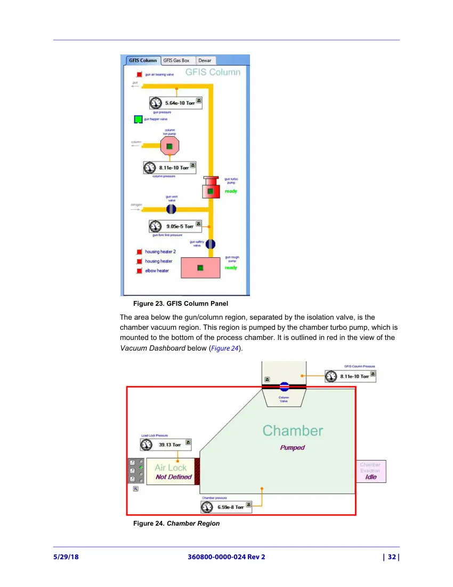

*Page 37 facsimile from `ZEISS_ORION_NanoFab_Operator_Manual_Rev2.pdf`.*

## Page 38

| 33 |
360800-0000-024 Rev 2
5/29/18
By selecting the Air Lock and Chamber tab at the bottom of the panel on the right side 
of the Dashboard, you can access the Air Lock and Chamber panel which shows the 
pumps and the valves related to the chamber vacuum region (Figure 25).
Figure 25. Air Lock and Chamber Panel
The Dewar vacuum region is the inner vessel of the Dewar where the liquid nitrogen is 
held. This region is pumped by the Dewar rough pump which is typically located in the 
chase room.

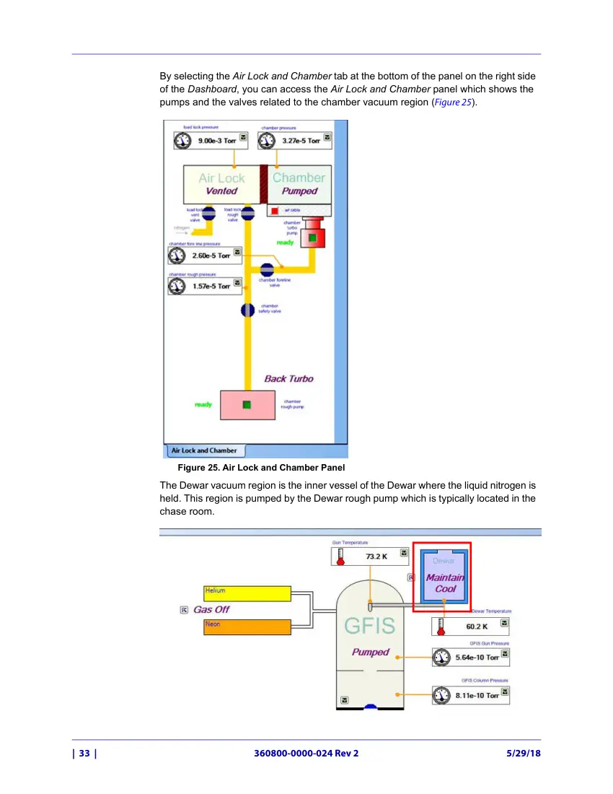

*Page 38 facsimile from `ZEISS_ORION_NanoFab_Operator_Manual_Rev2.pdf`.*

## Page 39

5/29/18
360800-0000-024 Rev 2
| 34 |
The Dewar panel of the Vacuum Dashboard is shown in Figure 26, which shows the 
pump and the valves related to the Dewar vacuum region.
Figure 26. Dewar Panel on Vacuum Dashboard

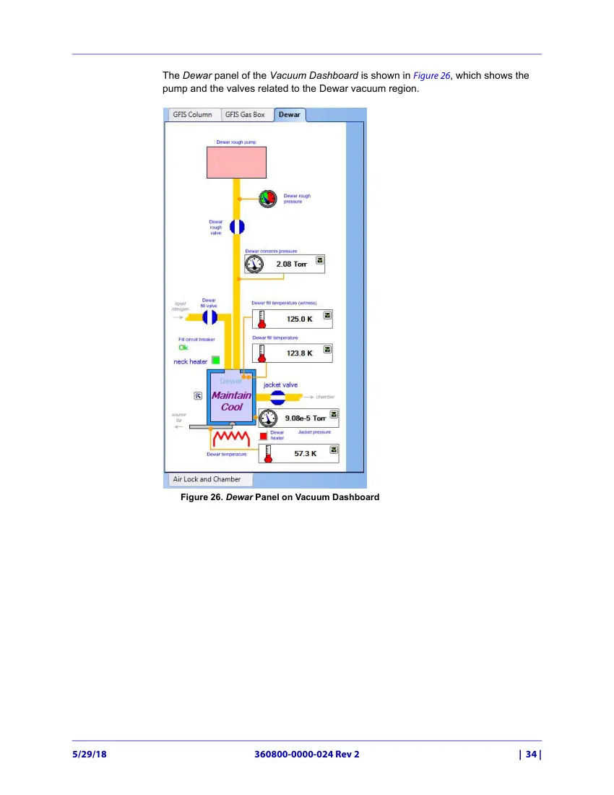

*Page 39 facsimile from `ZEISS_ORION_NanoFab_Operator_Manual_Rev2.pdf`.*

## Page 40

| 35 |
360800-0000-024 Rev 2
5/29/18
3.7
Dewar System
The integrated Dewar uses liquid nitrogen to cool the ion gun to cryogenic 
temperatures (below 100 K), that are required to obtain useful rates of helium 
ionization. The Dewar vessel is a stainless steel vacuum reservoir mounted on the top 
of the chamber module on the right-hand side of the ion column. The Dewar contents 
are pumped down to a pressure of about 2 Torr. This lowers the boiling point of the N2 
to below 60 K. At this temperature the nitrogen turns to a solid. Heat is transferred from 
the ion gun to the bottom of the inner wall of the vessel by a cold finger linkage, 
designed to maximize the conduction of heat to the nitrogen while minimizing the 
transmission of mechanical vibration to the ion gun.
Figure 27. Integrated Dewar System
The integrated Dewar is automatically refilled with liquid nitrogen from an external 
transfer Dewar tank twice a day. See Section 4.8.1, Auto Fill Schedule. The external tank 
is not part of the NanoFab assembly, but is the customer’s responsibility.
Figure 28. Large N2 Dewar Refill Tank

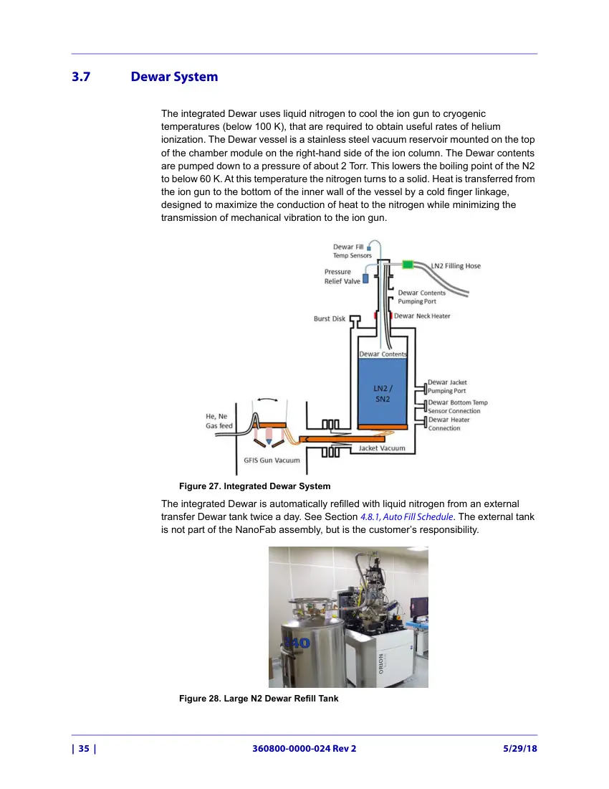

*Page 40 facsimile from `ZEISS_ORION_NanoFab_Operator_Manual_Rev2.pdf`.*

## Page 41

5/29/18
360800-0000-024 Rev 2
| 36 |
3.8
Gas Delivery System
The gas delivery system has all the components needed to provide the clean, 
pressure-regulated gases to the GFIS gun. These components include the gas bottles, 
pressure regulators, motorized leak valves, a gas purifier, and an isolation valve.
The gas delivery system is mounted at the back of the microscope. All NanoFabs have 
helium as an imaging gas, in which case there is one set of valves and gauges for that 
line. Neon can be provided as well as an option, in which case you would have two gas 
feed lines, as shown in Figure 29.
Figure 29. Gas Delivery System
The motorized leak valves control and shut off the flow of process gas. They are 
controlled automatically through the computer.
The gas purifier removes contaminants from the process gas.
The pressure regulators reduce the gas bottle pressure to 4 psi, which is reflected in 
the upper of the two gauges on each line. They are not used by the operator. The two 
lower gauges are high pressures gauges; each one measuring the pressure in the 
bottle.
It would be good practice for the operator to periodically inspect the high pressure 
gauges, as gas bottles are typically replaced when the pressure falls below 500 psi.
The electronic pressure gauge at the back of the gas box transmits the gas box 
pressure to the computer, which is reflected in the gas pressure readout in the Gas 
Box panel of the Vacuum Dashboard. If there is any pressure issues occurring in the 
system, you will get a message in the vacuum screen.
Do not attempt any maintenance of the gas box yourself. Call a service representative 
if any issues arise.
Neon bottle
Helium bottle
Motorized leak valve
Manual regulator
Gas purifier
Electronic pressure gauge
High pressure gauge
Regulator gauge
Isolation valve

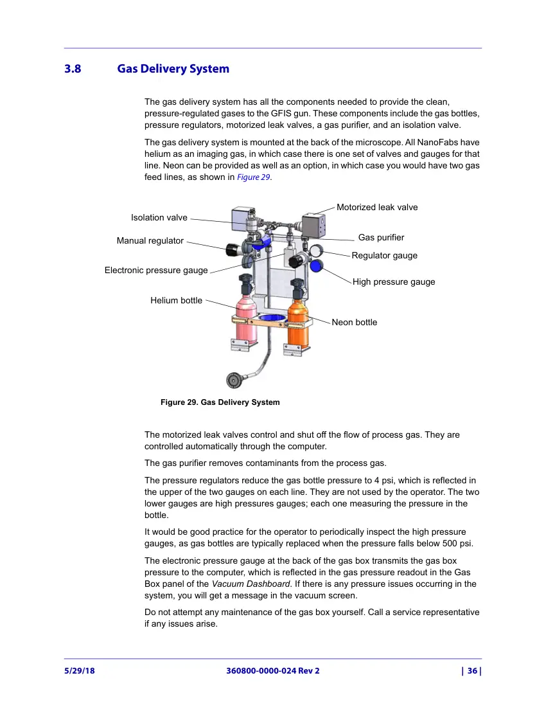

*Page 41 facsimile from `ZEISS_ORION_NanoFab_Operator_Manual_Rev2.pdf`.*

## Page 42

| 37 |
360800-0000-024 Rev 2
5/29/18
3.9
Vibration Isolation System
The vibration isolation system protects the NanoFab from outside vibrations that may 
cause movement of the ion beam relative to the sample, resulting in ripples in the 
image.The vibration isolation system consists of upper isolators and lower isolators as 
shown in Figure 30.
Figure 30. Isolation System
Both sets of isolators are fed by the compressed dry air (CDA) system from the 
pneumatic control panel. The vibration isolation system is enabled or disabled with a 
button labeled air table in the Air Lock and Chamber panel of the Vacuum Dashboard 
(see Figure 31). Clicking on the button toggles the state between On (green indicator) 
and Off (red indicator).
Figure 31. Air Lock and Chamber Panel
Upper Isolators
Granite Base
Work Chamber
Lower Isolators

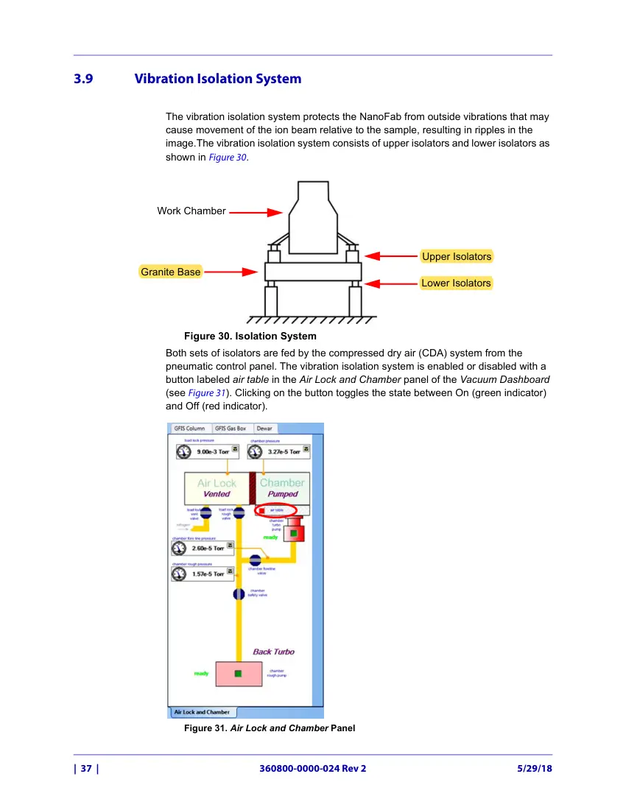

*Page 42 facsimile from `ZEISS_ORION_NanoFab_Operator_Manual_Rev2.pdf`.*

## Page 43

5/29/18
360800-0000-024 Rev 2
| 38 |
3.10
Operator Console
This is the operator’s seat. The table contains the UI monitor, the optional patterning 
monitor, the dual joystick, the knob panel, the keyboard, and the mouse.
The system computer is under the table on the right side.
Figure 32. Operator’s Console
Dual Joystick
Use the dual joystick for stage control. See Section 4.4.3, Joystick Control for a 
description of the relationship of joystick motion to stage and image motion.
Figure 33. Dual Joystick
•
Break push button - Used to stop the stage in an emergency
•
X/Y/R Joystick - Controls the X-axis and Y-axis motion, and the stage rotation by 
turning the knob.
•
T/Z Joystick - Controls the Z-axis (vertical) motion of the stage and the stage tilt 
(T) motion.
Break push button
X/Y/R Joystick 
T/Z Joystick

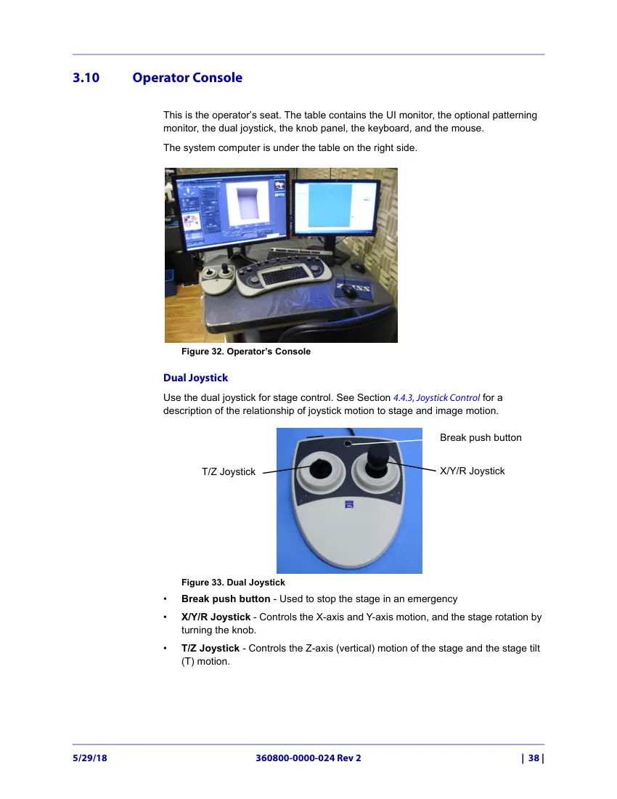

*Page 43 facsimile from `ZEISS_ORION_NanoFab_Operator_Manual_Rev2.pdf`.*

## Page 44

| 39 |
360800-0000-024 Rev 2
5/29/18
Knob Panel
The actions controlled by the knob panel are described in this section.
Figure 34. Knob Panel
Panel Lock – This button toggles between panel locked mode and panel unlocked 
mode. When in panel locked mode all other knobs and buttons (does not affect the 
keyboard buttons or the Panel Lock button itself) are disabled. When the panel is not 
locked, all buttons and knobs are enabled.
Stigmator X and Stigmator Y – These knobs are used to correct any astigmatism of 
the beam by varying small DC voltages applied to the upper octopole deflectors.
Magnification – This knob is used to adjust the magnification, or field of view, of the 
image. Turning the knob clockwise gives the effect of zooming in on the image while 
turning the knob counter-clockwise zooms out.
Reduced – This button toggles between full scan view (the entire FOV) and reduced 
scan view. The reduced scan view results in a scan of a smaller portion of the image, 
and thus a faster image refresh time which can make adjusting focus and stigmation 
easier.
Tilt/Shift X and Tilt/Shift Y – These knobs are used to correct for small errors in the 
mechanical alignment of the ion beam. Tilt error is when the beam in not parallel to the 
axis of the column and shift error is when the beam is laterally offset from the axis of 
the column. This is accomplished by applying small DC voltages to the upper and 
lower quadrupoles.
Mode – This button toggles the mode of the Tilt/Shift knobs between the tilt function 
and the shift function.
SFIM/Normal – This button toggles the image mode between SFIM mode and normal 
imaging mode.
Magnification
Focus
Tilt/Shift X 
Tilt/Shift Y 
Pan X
Grab
Scan Rotate
Brightness
Contrast
Stigmator X
Mode
Start/Stop
SFIM/Normal
Panel 
lock
Pan Y
Stigmator Y
Reduced
Scan Speed

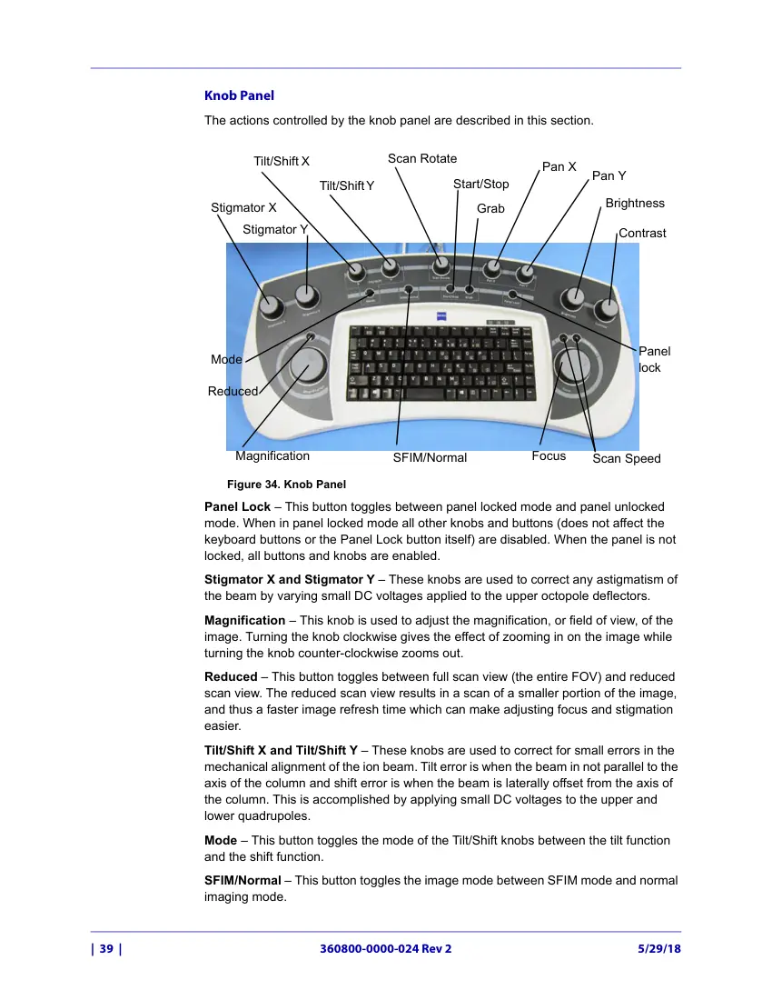

*Page 44 facsimile from `ZEISS_ORION_NanoFab_Operator_Manual_Rev2.pdf`.*

## Page 45

5/29/18
360800-0000-024 Rev 2
| 40 |
Scan Rotate – This control is both a pushbutton and a knob. Pushing the button 
toggles between scan rotate enabled and scan rotate disabled. When scan rotate is 
enabled, turning the knob clockwise or counter-clockwise rotates the scan, and 
therefore the displayed image to rotate in the clockwise or counter-clockwise, 
respectively.
Start/Stop – This button toggles between imaging and not imaging.
Grab – Pressing this button triggers one full scan, at the current imaging parameters. 
Scanning will stop at the completion of one full scan.
Pan X and Pan Y – These knobs shift the scanning position of the beam on the 
sample, and therefore the displayed image, in the X and Y direction respectively.
Brightness – This knob adjusts a DC offset that is applied to each pixel of the image 
during image processing.
Contrast – This knob adjusts the gain through the photomultiplier tube in the ET 
detector.
Focus – This knob controls the lens 2 voltage which determines the focal distance of 
the beam. This knob is adjusted to bring the area being scanned into focus in the 
image.
Scan Speed (plus and minus) – These two buttons give you a quick way to shorten 
the dwell time (increase scan speed) or lengthen the dwell time (decrease scan 
speed).

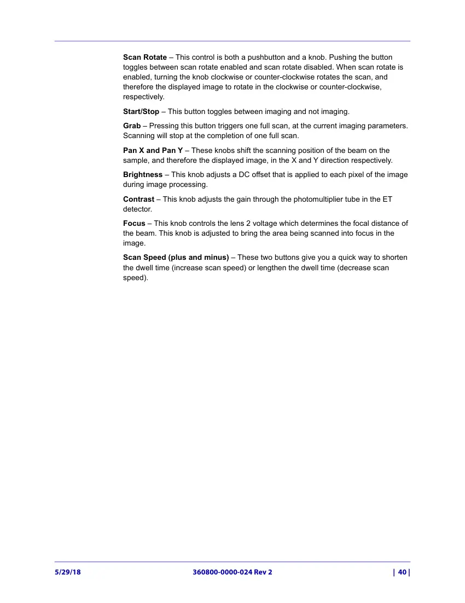

*Page 45 facsimile from `ZEISS_ORION_NanoFab_Operator_Manual_Rev2.pdf`.*

## Page 46

| 41 |
360800-0000-024 Rev 2
5/29/18
3.11
Electronics System
The bottom part of the electronics frame holds the high voltage power supply, ion 
pump controller, power distribution module, pneumatic panel, and the PVAC vacuum 
controller.
The upper part of the electronics frame is the electronics rack that holds the various 
electronics modules that control many of the NanoFab sub-systems. It consists of two 
racks: rack 1 (optics rack) and rack 2 (detector rack).
Figure 35. Electronics System
Capella Controller (option)
ET Detector Controller
Flood Gun Controller
GFIS 2 Optics Support Controller
SAS Controller
GFIS1 Optics Controller
Stage Controller
Internet Hub
Rack 1
Rack 2
HV Power Supply
Ion Pump Controller
PVAC Vacuum Controller
The Power Distribution Module and the 
Pneumatic Panel are on the back side 
of the frame view shown.

*Page 46 facsimile from `ZEISS_ORION_NanoFab_Operator_Manual_Rev2.pdf`.*

## Page 47

5/29/18
360800-0000-024 Rev 2
| 42 |
4
Routine Operations/Tasks
4.1
Using Online Help
The NanoFab Online Help system provides users with information about the settings, 
configuration, and operating instructions for the microscope. Access to the Help 
system is available from ATHENA System Manager and the Zen user interface.
4.1.1
System Manager Help
To display the Help menu, go to System Manager> Help (Figure 36).
Figure 36. ATHENA System Manager Help 
The Help menu provides the following options described in this section.
•
Help Topics
•
Release Notes
•
About
Select Help Topics to display NanoFab Help Navigation window (Figure 37).
Figure 37. NanoFab Help Navigation Window

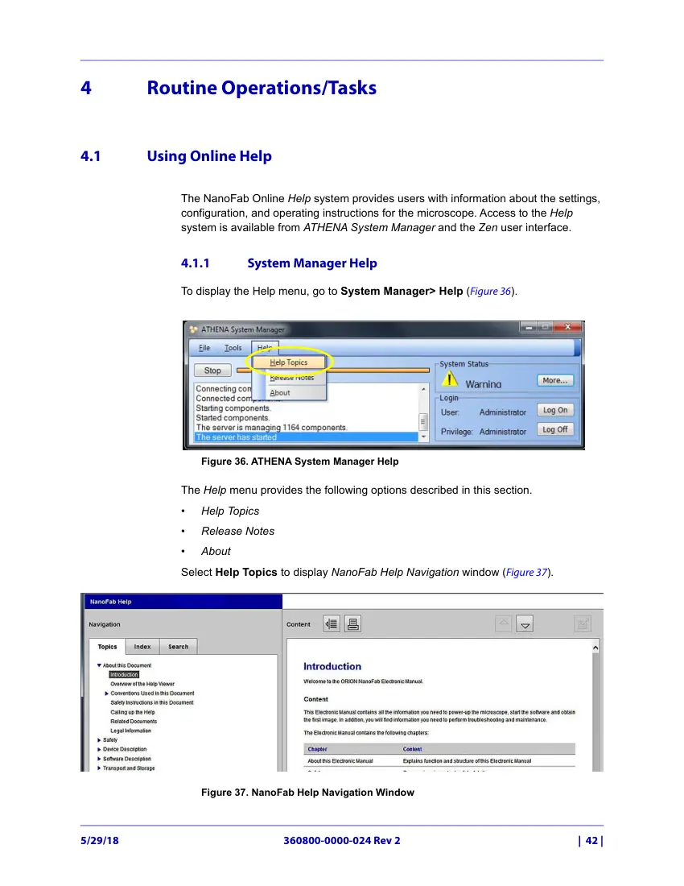

*Page 47 facsimile from `ZEISS_ORION_NanoFab_Operator_Manual_Rev2.pdf`.*

## Page 48

| 43 |
360800-0000-024 Rev 2
5/29/18
Use the Help navigation window to display a list of topics (default), an index of help 
topics, or a search panel.
Select Release Notes in System Manager to display the release notes for the 
software installed on the tool (Figure 38).
Figure 38. NanoFab Release Notes
Select About in System Manager to display version information about the system 
software installed on the tool (Figure 39).
Figure 39. System Software Information

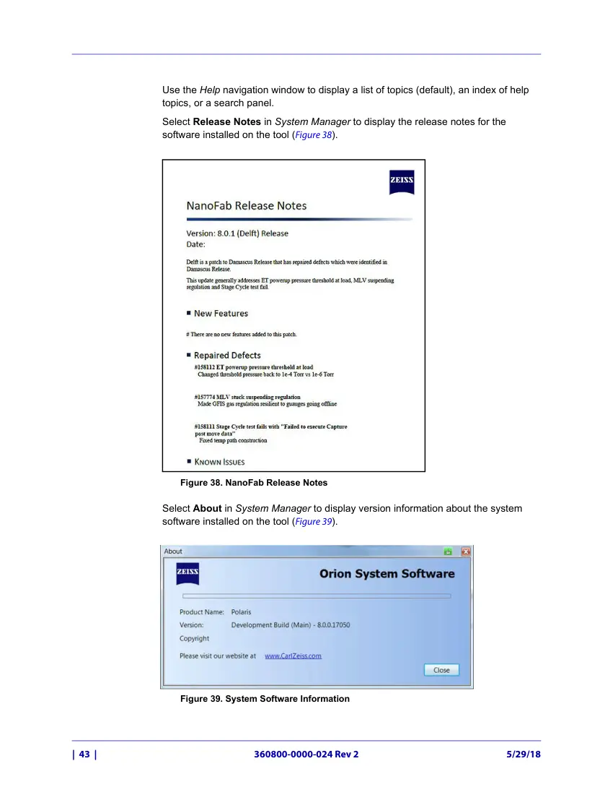

*Page 48 facsimile from `ZEISS_ORION_NanoFab_Operator_Manual_Rev2.pdf`.*

## Page 49

5/29/18
360800-0000-024 Rev 2
| 44 |
4.1.2
Zen Interface Help
To display help in the Zen Interface go to Zen> Help as shown in Figure 40.
Figure 40. Zen Interface Help Menu
The Help menu provides the following options described in this section.
•
Contents
•
Index
•
About
The Contents and Index selections display the navigation pane shown in Figure 37 and 
an alphabetical list of topics shown in Figure 41.
Figure 41. Help Index
Select About in the Zen UI to display information about the system configuration and 
Zen application information as shown in Figure 42.

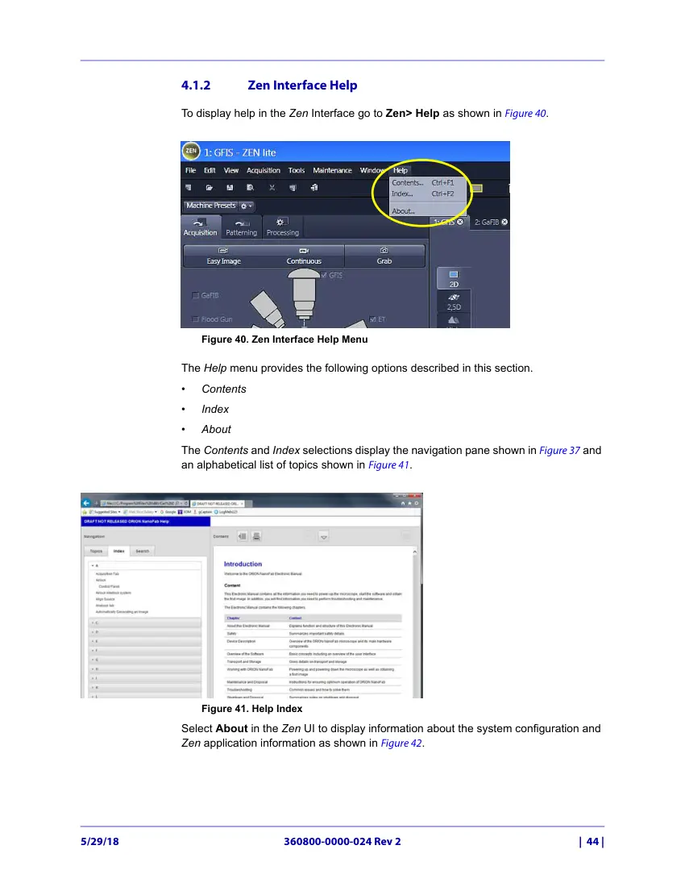

*Page 49 facsimile from `ZEISS_ORION_NanoFab_Operator_Manual_Rev2.pdf`.*

## Page 50

| 45 |
360800-0000-024 Rev 2
5/29/18
Figure 42. Zen Interface About Panel
From the Zen interface About panel, select Show System Information to display a 
summary of hardware, components and the software environment (Figure 43).
Figure 43. Zen UI System Summary

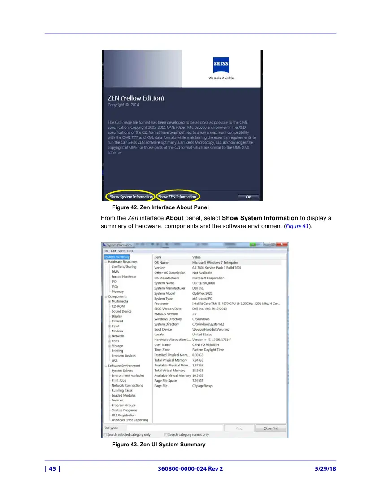

*Page 50 facsimile from `ZEISS_ORION_NanoFab_Operator_Manual_Rev2.pdf`.*

## Page 51

5/29/18
360800-0000-024 Rev 2
| 46 |
From the Zen interface About panel, select Show Zen Information to display 
application information for the Zen installation. Choose from the following tabs (Figure 
44).
•
Operating System
•
Hardware
•
Software
•
Folders
•
Service Packs
Figure 44. Zen Application Information

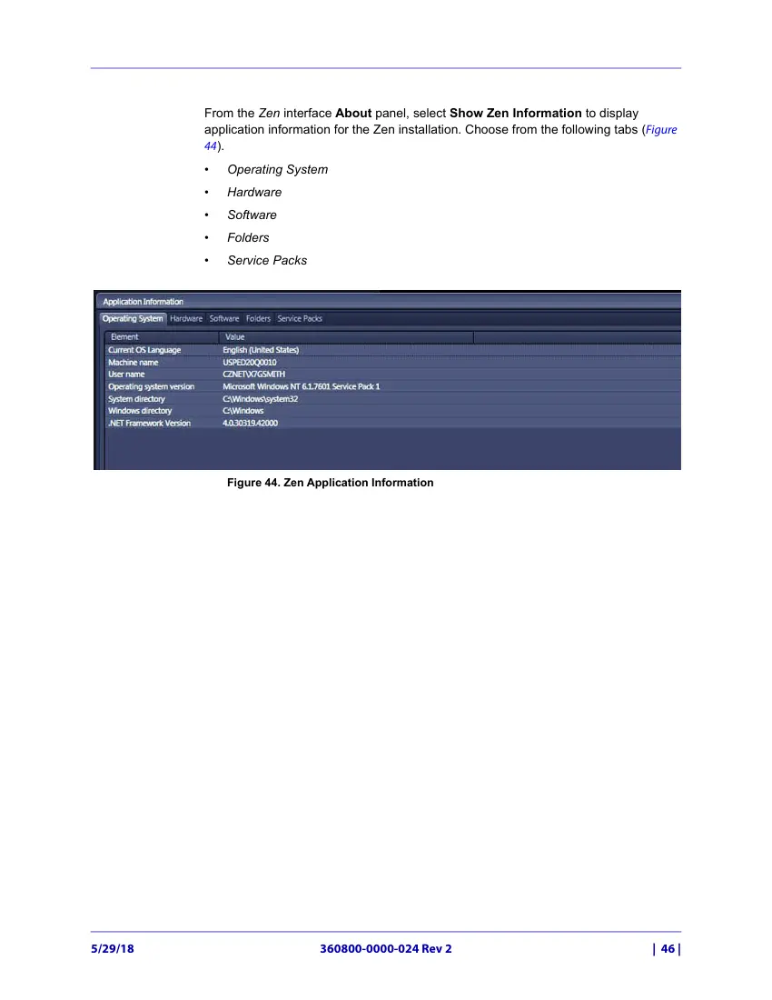

*Page 51 facsimile from `ZEISS_ORION_NanoFab_Operator_Manual_Rev2.pdf`.*

## Page 52

| 47 |
360800-0000-024 Rev 2
5/29/18
4.2
Data Viewer
The Data Viewer is an application within ATHENA System Manager that displays strip 
charts that are representations of data recorded by the software. There is more than 
one way to launch Data Viewer. For instance, select Tools > Data Viewer in System 
Manager.
Figure 45. Open Data Viewer
The Data Viewer (viewing Zeiss_Polaris) screen appears, where you can select which 
data you would like to view and how to view it.
Figure 46. Viewing Zeiss_Polaris Screen.
Another way to open Data Viewer is through the Vacuum Dashboard. All of the 
temperature and pressure readbacks in the Vacuum Dashboard have a small icon in 
the upper right corner that looks like a graph.
Figure 47. Readback Data Viewer Icon

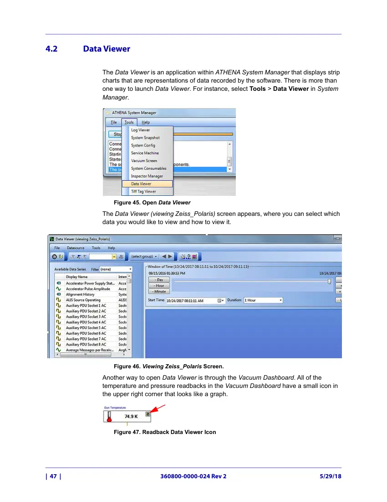

*Page 52 facsimile from `ZEISS_ORION_NanoFab_Operator_Manual_Rev2.pdf`.*

## Page 53

5/29/18
360800-0000-024 Rev 2
| 48 |
Click the icon to open Data Viewer with a graphic display for the gauge or temperature 
readings for the readout selected. The following image displays a graph for the GFIS 
gun temperature readings.
Figure 48. Data Viewer Graph Display
You can click the Maximum graph display icon 
furthest to the right in the tool bar 
to toggle to the same opening screen that displayed when you opened Data Viewer in 
System Manager. 
Figure 49. Available Data Series List
The Available Data Series panel on the left allows you to select any available data 
series to view. Scroll up and down the list and click the one you want; for example, 
Chamber Pressure, and then click the Down arrow below the panel (or double-click 
the name).

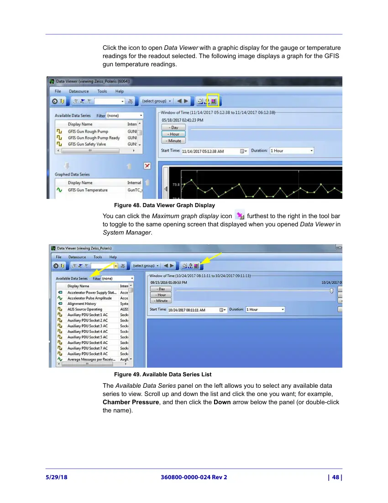

*Page 53 facsimile from `ZEISS_ORION_NanoFab_Operator_Manual_Rev2.pdf`.*

## Page 54

| 49 |
360800-0000-024 Rev 2
5/29/18
Figure 50. Select the Data Series to View
The name of the data series you selected appears in the lower pane on the left, and 
the graph of the data appears in the large pane on the right, as shown below.
Figure 51. Select Multiple Graphs
You can display multiple graphs by selecting more in the Available Data Series panel.
If the space required exceeds the screen size, a scroll bar appears on the right.
To remove a graph from the Graphed Data Series panel, click that data series name; 
for example GFIS Gun Temperature, and then click the Up arrow above the panel.

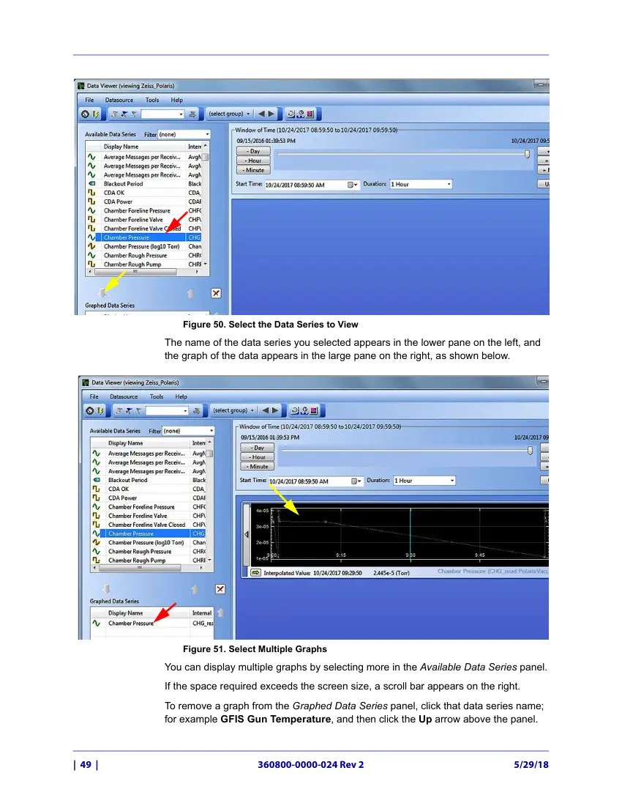

*Page 54 facsimile from `ZEISS_ORION_NanoFab_Operator_Manual_Rev2.pdf`.*

## Page 55

5/29/18
360800-0000-024 Rev 2
| 50 |
Figure 52. Display Duration
The time period displayed by a graph is determined by the Duration value, which 
displays at the top of the graph panel. For example, in the screen above, Duration is 
1 hour, so the screen displays 1 hour of data. By default, the data display is static. 
Figure 53. Data Viewer Task Bar
To continually update the data, click the Strip Chart Display icon
in the task bar. 
The data graph will scroll to the left, with new data appearing on the right and the older 
data moving to the left.
Figure 54. Change Duration
To change the duration that displays, open the drop-down list in the Duration field and 
click one of the standard time spans; either 1 Minute, 1 Hour, I Day, or 1 Week.
If you would like a different duration such as 10 hours, for example, select Custom.

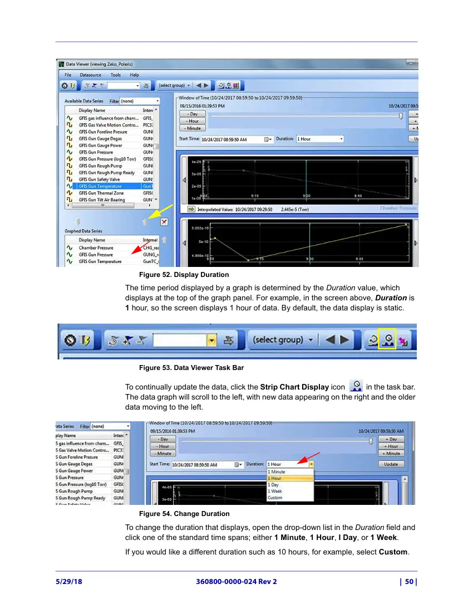

*Page 55 facsimile from `ZEISS_ORION_NanoFab_Operator_Manual_Rev2.pdf`.*

## Page 56

| 51 |
360800-0000-024 Rev 2
5/29/18
Figure 55. Custom Duration
Two addition fields appear to the right of the Duration field; the first for a numerical 
value, and the second for units. Enter 10 in the first field, and select Hours in the 
second field for a duration of 10 hours. Click the blinking green Update button to the 
right to activate your duration.

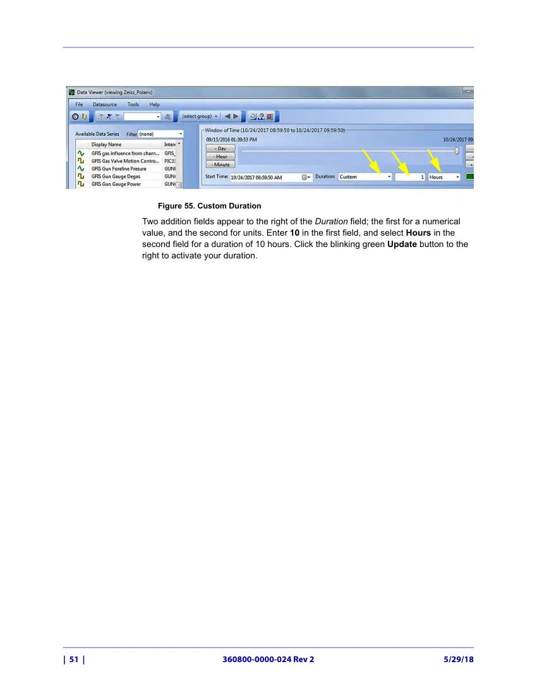

*Page 56 facsimile from `ZEISS_ORION_NanoFab_Operator_Manual_Rev2.pdf`.*

## Page 57

5/29/18
360800-0000-024 Rev 2
| 52 |
4.3
Loading and Unloading Samples
4.3.1
Sample Handling
For the best performance of the NanoFab anything loaded into the process chamber 
must be extremely clean. Always wear new, clean gloves when handling any sample, 
sample holder, or anything that is going inside the process chamber. Always wear 
gloves when touching any surface inside the air lock.
All samples loaded into the NanoFab must be vacuum compatible. The NanoFab 
process chamber and ion columns are operated at high vacuum. Any contamination 
can compromise the performance of the NanoFab. Do not load any samples that that 
outgas as this can lead to severe contamination problems within both the process 
chamber and the ion columns.
All samples must be dry and clean. When mounting sample material on an SEM stub, 
make sure the stub is clean. If it can be done without damaging the sample, use a 
nitrogen gun to blow it and the sample holder off. Make sure the sample is securely 
attached.
Use as little material as possible: 
Too much material always poses a 
risk for device contamination and 
might also prevent you from seeing 
the sample features you are 
interested in (excess material can 
block the view). 
Your sample must be securely 
attached to SEM stub: Loose sample 
debris can contaminate the column, 
resulting in system downtimes for 
several weeks and high associated 
costs. 
Maximum sample dimensions: L x 
W x H = 50 mm x 50 mm x 6 mm. 
Be aware of sample height: High 
sample heights poses the risks of 
smashing into the end of lens 2 and 
the ET detector grid when moving the 
stage. See section 4.4.1, Stage Motion 
Risks.
Loose Sample Debris: Samples like 
powders and small particles that are 
not secured to the stub can, especially 
if non-conductive, get up into the 
column.
Figure 56. System Performance- Prior & After Contamination

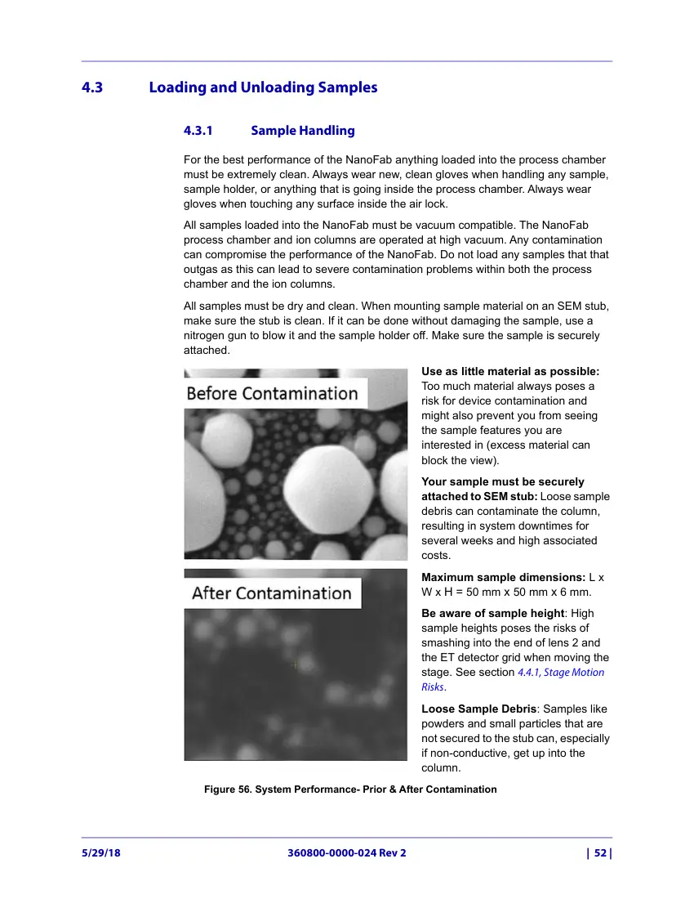

*Page 57 facsimile from `ZEISS_ORION_NanoFab_Operator_Manual_Rev2.pdf`.*

## Page 58

| 53 |
360800-0000-024 Rev 2
5/29/18
4.3.2
Sample Load Status
The current sample load status is displayed in the menu bar at the top of the UI (Figure 
57).
Figure 57. Sample Load Statuses
There are three sample statuses:
•
Empty - There is no sample holder on the stage. 
•
Working - A sample exchange is in progress
•
Loaded - There is a sample holder on the stage.
There is no sensor on the stage that determines if a sample holder is loaded; the 
displayed status is based on the last actions of the operator. At the end of the 
Exchange routine, the status reported is Empty, with the assumption that you have 
removed the sample holder. The status is reported as Loaded after the Resume 
routine has been completed.
4.3.3
The Air Lock
The purpose of the air lock (also called the load lock) is to allow the movement of a 
sample into or out of the process chamber without having to vent the process 
chamber.
Figure 58. Air Lock
Between the air lock and the chamber is the gate valve, which provides a vacuum seal 
between the air lock and the process chamber. When the gate valve is closed, the air 
lock can be vented without affecting the process chamber vacuum. When the air lock 
is pumped, the gate valve can be opened to allow the transfer of the sample holder 
between the air lock and the process chamber.
Air lock door
Viewing window
Transfer rod 
Air lock door handle
Control/Status Panel
Fixing knob

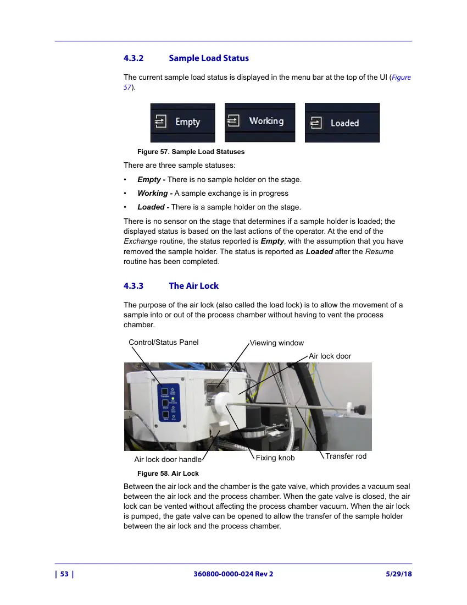

*Page 58 facsimile from `ZEISS_ORION_NanoFab_Operator_Manual_Rev2.pdf`.*

## Page 59

5/29/18
360800-0000-024 Rev 2
| 54 |
Note:
When installing or removing the transfer rod, the fixing knob on the end of 
it (Figure 58) has a tight fit due to the knob o-ring. You can damage the 
alignment pins on the fixing knob if you put a wrench to it and turn it too 
far, or in the wrong direction.
When installing the transfer rod, align the pins on the knob with the pin 
slots in the air lock port (if they don’t align, turn the knob 180 degrees). 
Slide the pins into the slots and turn the knob clockwise approximately 5 
degrees. When removing the transfer rod, grasp the fixing knob firmly with 
both hands and turn the knob approximately 5 degrees counter-clockwise 
and slide it out. Tools should not be needed.
Figure 59. Inserting and Removing Transfer Rod Without Damage
4.3.4
Air Lock Controls and Functions
A control panel on the side of the air lock allows certain operations of the air lock.
Figure 60. Control Panel
There is also a representation of the control panel available through the UI, called the 
Sample Management tool panel (Figure 62). To access it, click the Sample 
Pin
Pin
Slot
Slot

*Page 59 facsimile from `ZEISS_ORION_NanoFab_Operator_Manual_Rev2.pdf`.*

## Page 60

| 55 |
360800-0000-024 Rev 2
5/29/18
Management icon 
on the tool bar (Figure 61) at the top of the UI to display the 
Sample Management tool panel. 
Figure 61. Sample Management Icon
The UI version of the air lock control panel, the Sample Management tool panel, has 
more features than the control panel on the side of the air lock. 
The buttons and indicators in 
the Sample Management 
tool panel that match those 
on the air lock control panel 
perform the same functions. 
Each of the controls and 
indicators are described 
below. The sequence in 
which to use these is 
described in the sections on 
loading and unloading 
samples.
Figure 62. Sample Management Tool Panel
Exchange
Use the Exchange button to move the stage into the load position, or stage-ready 
position. The load position is where all the axes of the stage are set so the sample 
holder can be transferred between the air lock and the process chamber using the 
transfer rod.

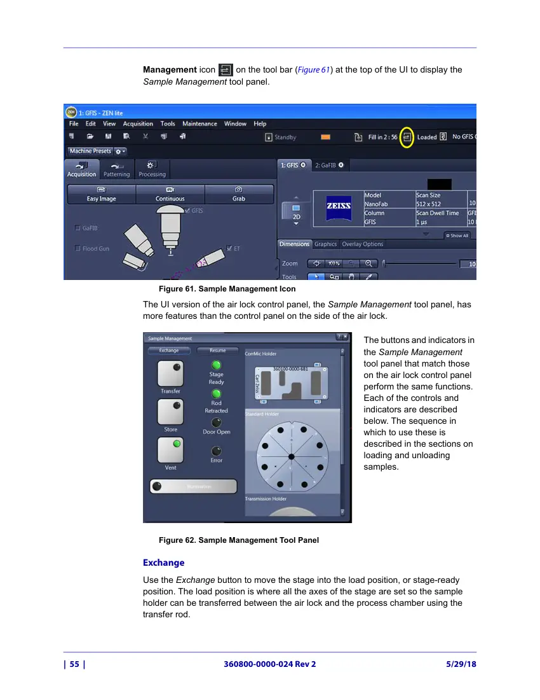

*Page 60 facsimile from `ZEISS_ORION_NanoFab_Operator_Manual_Rev2.pdf`.*

## Page 61

5/29/18
360800-0000-024 Rev 2
| 56 |
If there is no sample holder on the stage, the exchange routine ends after positioning 
the stage to the load position. Otherwise, the air lock is pumped and the air lock gate 
valve opens. The illumination LEDs also turn on.
Resume
Use the Resume button after placing the sample holder on the stage and fully 
retracting the transfer rod. This causes the air lock gate valve to close and the stage to 
move to a position under the column, in the beam path.
Transfer
Use the Transfer button to pump the air lock and open the gate valve once the stage is 
in the Stage Ready position.
Store
Use the Store button to achieve a state in which the air lock gate valve is closed and 
the air lock rough valve is open in order to pump down the air lock to rough vacuum, at 
which time the rough valve closes. 
Vent
Use the Vent button to vent the air lock. This causes the air lock gate valve to close 
and nitrogen to be pumped into the air lock to vent it. In the vent state the air lock door 
can be opened for loading or unloading of the sample holder into or out of the air lock.
Stage Ready
The Stage Ready indicator lights up when the sample stage is in the load position.
Rod Retracted
The Rod Retracted indicator lights up when the transfer rod is fully retracted. If the 
transfer rod is not fully retracted, any operation involving opening or closing the air lock 
gate valve is inhibited.
Door Open
The Door Open indicator lights up when the air lock door is not fully closed.
Error
The error indicator lights up when the air pressure for the gate valve is too low to 
operate the valve.
Illumination
Use the Illumination button to turn the air lock illumination LEDs on or off. The indicator 
with the Illumination button should indicate whether the illumination is on or off, but 
sometimes goes out of sync and does not correctly indicate the state of the air lock 
illumination. Clicking on the button causes it to indicate the proper state.

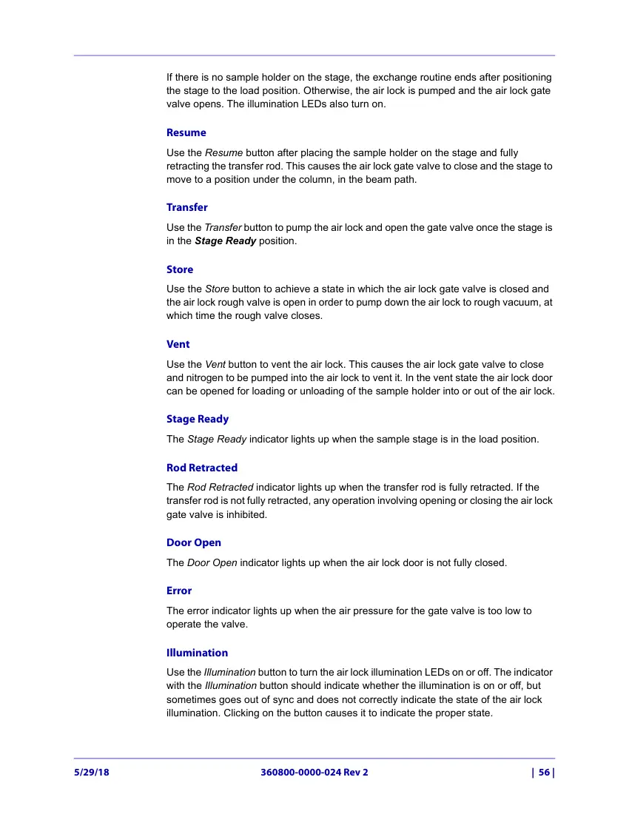

*Page 61 facsimile from `ZEISS_ORION_NanoFab_Operator_Manual_Rev2.pdf`.*

## Page 62

| 57 |
360800-0000-024 Rev 2
5/29/18
Air lock door
The air lock door allows access to the air lock for loading or unloading samples. When 
the air lock is vented, open the door by pulling on the air lock door handle. The door 
must be fully closed in order to pump down the air lock.
Viewing window
Use the viewing window in the air lock door to visually monitor the process of loading 
or unloading the sample on the stage.
Sample transfer rod
Use the sample transfer rod to place the sample holder onto, or removing it from, the 
sample stage. Use the knob on the end of the rod to thread the rod into the sample 
holder, which is threaded on the other end for attachment to the sample holder.
4.3.5
Updating the Sample Map
The Sample Map shows an image of the sample holder that helps you navigate around 
the sample holder.
Click Sample Map in the Navigation tool panel to open the Sample Map tool panel 
(Figure 63). For the requirements of the image to be loaded, see See “Sample Holder 
Image Requirements” on page 64.

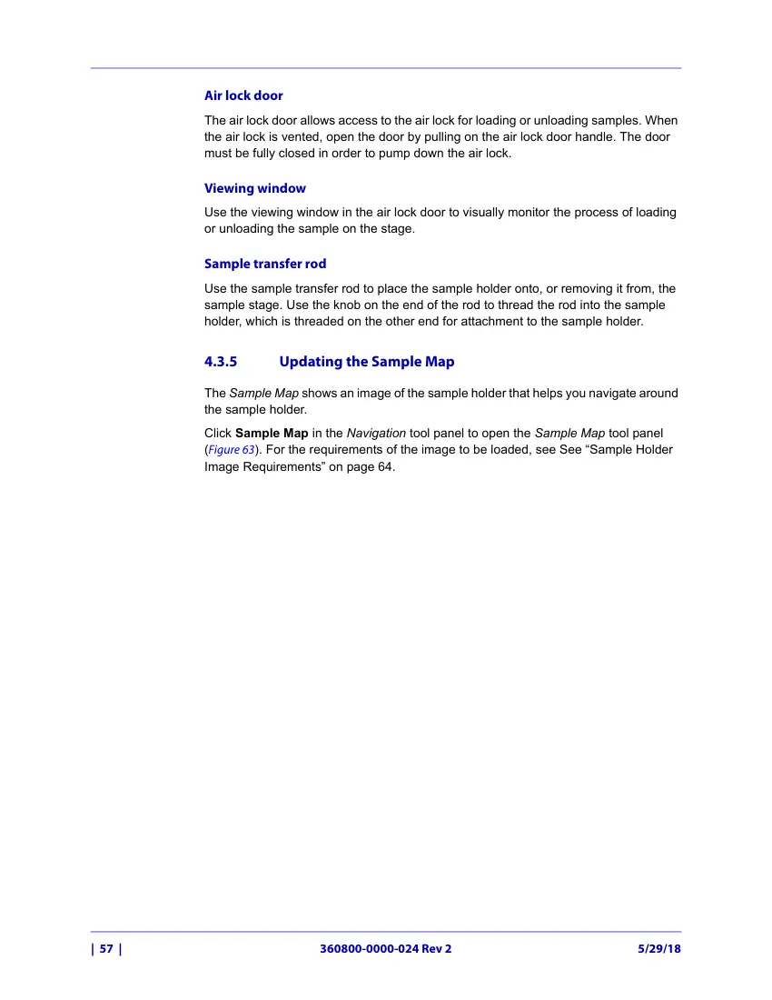

*Page 62 facsimile from `ZEISS_ORION_NanoFab_Operator_Manual_Rev2.pdf`.*

## Page 63

5/29/18
360800-0000-024 Rev 2
| 58 |
Figure 63. Sample Map Tool Panel
The Sample Map tool panel opens, with either an empty sample holder outline (left 
side of Figure 64) or an image of a previously loaded sample holder image on the 
outline (right side of Figure 64).

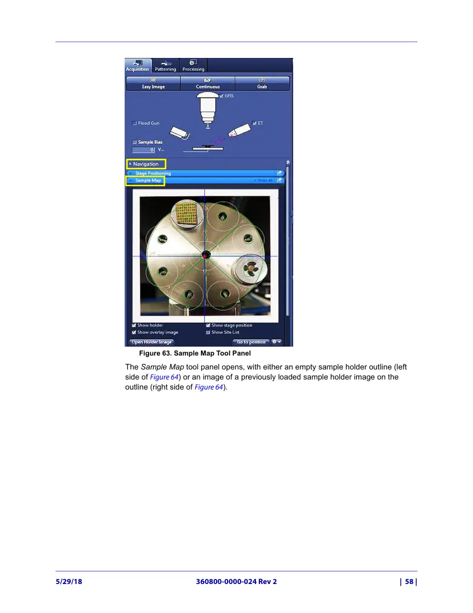

*Page 63 facsimile from `ZEISS_ORION_NanoFab_Operator_Manual_Rev2.pdf`.*

## Page 64

| 59 |
360800-0000-024 Rev 2
5/29/18
Figure 64. Sample Holder Outline and Loaded Sample Holder
In order to load an image into the sample map, a JPG image of the sample holder for 
the Sample Map must be accessible through a USB port or saved to a location on the 
system computer. See instructions in 4.3.7, Sample Holder Image Requirements if your 
image does not cover the sample holder.
1.
Click Open Holder Image to display the Sample Holder Image view.
Figure 65. Sample Holder Image View
2.
Click Open Image File at the bottom to open Windows Explorer.
3.
Navigate to your sample holder image file, then click Open. Your saved image of 
the sample holder appears in the Sample Holder Image view.
Note:
If you cannot find the 
Open Holder Image 
button, click the check 
box for Show overlay 
image, and it will appear.

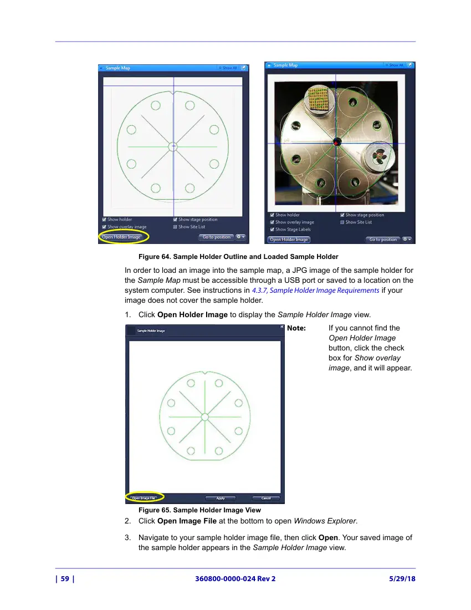

*Page 64 facsimile from `ZEISS_ORION_NanoFab_Operator_Manual_Rev2.pdf`.*

## Page 65

5/29/18
360800-0000-024 Rev 2
| 60 |
Figure 66. Photo in Sample Holder Image View
4.
Align the sample holder image using these steps:
a)
Place the cursor in the center of the outline and then drag (left-click, hold) 
to position the center of the outline in the center of the sample holder.
b)
Move the wheel on the mouse forward or back to change the size of the 
outline until the size of the outline matches the size of the sample holder.
c)
Position the cursor near the top or bottom of the outline, and then left 
click, hold, and move the mouse left and right to rotate the outline until the 
notch on the image is aligned with the notch in the outline.
d)
Repeat the steps as required to get the outline correctly positioned.
Figure 67. Align Notch
Notch in image aligned with notch 
in outline
Note:
When you hover over the 
image, alignment 
instructions appear.

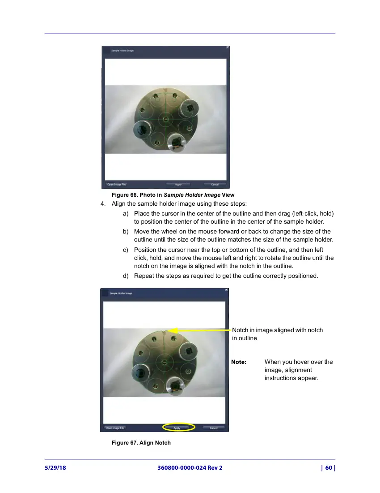

*Page 65 facsimile from `ZEISS_ORION_NanoFab_Operator_Manual_Rev2.pdf`.*

## Page 66

| 61 |
360800-0000-024 Rev 2
5/29/18
5.
When the outline and image are aligned, click Apply (Figure 67). The new sample 
image now appears in the Sample Map window (Figure 68).
Figure 68. Aligned Image
4.3.6
Loading the Sample 
Click the Sample Management icon
 in the tool bar at the top of the UI to open the 
Sample Management tool panel.
Before starting the loading process, verify that a sample holder is not already on the 
stage. The best way to do this is to look at the image from the chamber scope in the 
UI. If there is a sample holder on the stage, you can see it in this image (Figure 69). 
Figure 69. Sample Holder in Chamber Scope

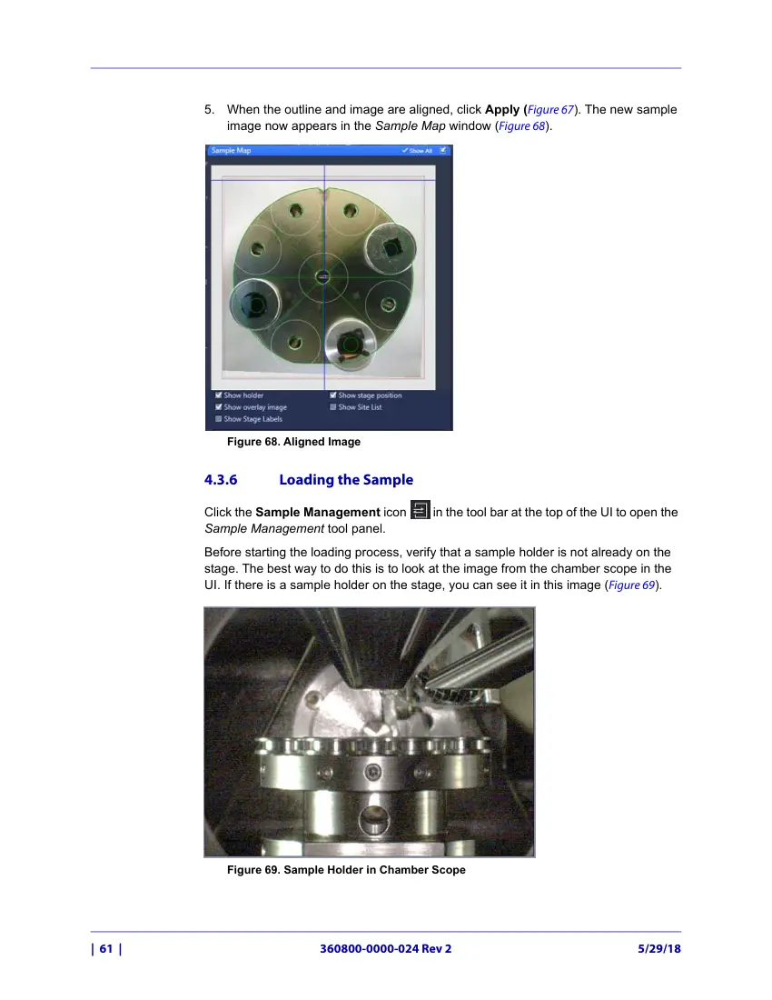

*Page 66 facsimile from `ZEISS_ORION_NanoFab_Operator_Manual_Rev2.pdf`.*

## Page 67

5/29/18
360800-0000-024 Rev 2
| 62 |
Figure 70. Sample Management Tool Panel
1.
Check that the transfer rod is fully retracted. The Rod Retracted LED is lit.
2.
Verify that the air lock is vented, if it is not, click Vent. The Vent LED lights up.
Note:
Gloves are required when handling the sample holder.
3.
Open the air lock door (Figure 71).
Figure 71. Open Air Lock Door
4.
Slide the sample holder onto the platform with the threaded hole facing the trans-
fer rod as shown in Figure 72.
Note:
Be sure the sample holder and transfer rods are aligned.

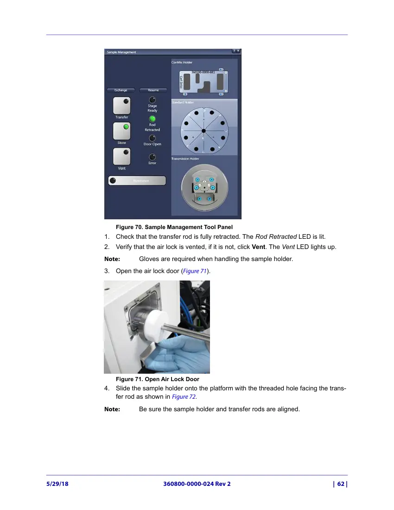

*Page 67 facsimile from `ZEISS_ORION_NanoFab_Operator_Manual_Rev2.pdf`.*

## Page 68

| 63 |
360800-0000-024 Rev 2
5/29/18
Figure 72. Sample Holder Orientation
5.
While holding the sample holder on the platform, turn the transfer rod clockwise to 
screw the rod into the sample holder as shown in Figure 73.
Figure 73. Attach Transfer Rod to Holder
Note:
To add an image of the sample holder in the Sample Map, take a photo 
that you can use as described in section 4.3.5, Updating the Sample Map.
6.
Close the air lock door. The Door Open LED turns off.
7.
Click Transfer to begin the process:
a)
The stage moves into the load position.
b)
The air lock pumps down.
c)
The gate valve opens.
d)
The chamber Illuminates.
Note:
The Transfer routine is complete when the Transfer LED lights up.
8.
While observing through the air lock viewing window, push the transfer rod into 
the chamber and verify that the sample holder slides onto the stage.
9.
While gently pressing the transfer rod, turn the rod counter-clockwise several full 
turns to disengage the rod from the sample holder.
Note:
Ensure that the transfer rod is fully disengaged from the sample holder 
before pulling the transfer rod back. Otherwise, the holder can fall off the 
stage and become stuck in the chamber, requiring the chamber to be 
vented to recover the holder.
10. Fully retract the rod from the chamber. The Rod Retracted LED lights up.

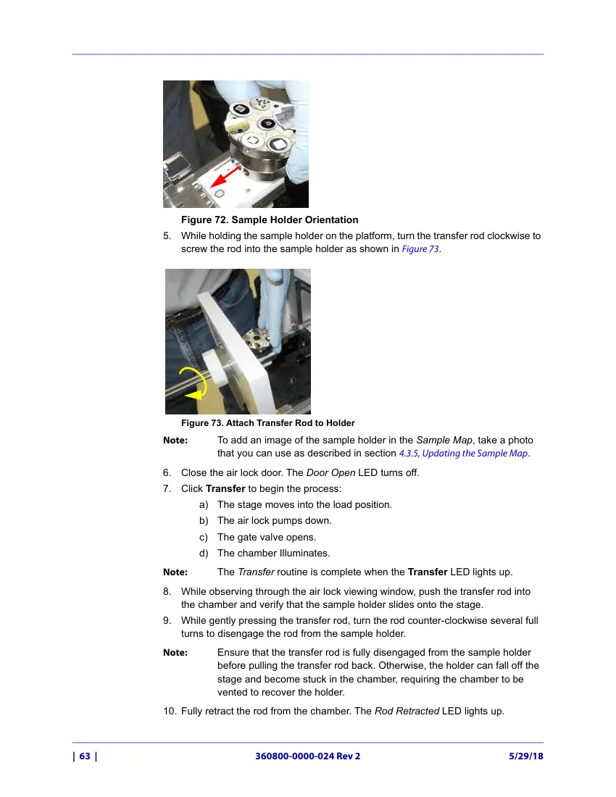

*Page 68 facsimile from `ZEISS_ORION_NanoFab_Operator_Manual_Rev2.pdf`.*

## Page 69

5/29/18
360800-0000-024 Rev 2
| 64 |
11. Click Resume on the Sample Management tool panel to begin the routine:
a)
The gate valve closes.
b)
The stage moves to the resume location.
c)
The menu bar changes from Working to Loaded.
d)
The column isolation valve opens.
4.3.7
Sample Holder Image Requirements
In order to load an image of the sample holder into the Sample Map it must be a JPG 
image with a resolution of 100 dpi or less. If the JPG image has the correct resolution 
it will fit in the Sample Map window as shown below.
Figure 74. Image Resolution 100 DPI
If the JPG image has a higher resolution than 100 dpi, it may only fill part of the 
Sample Map window, as shown below.
Note:
A dpi lower than 75 might give you a poor quality image.

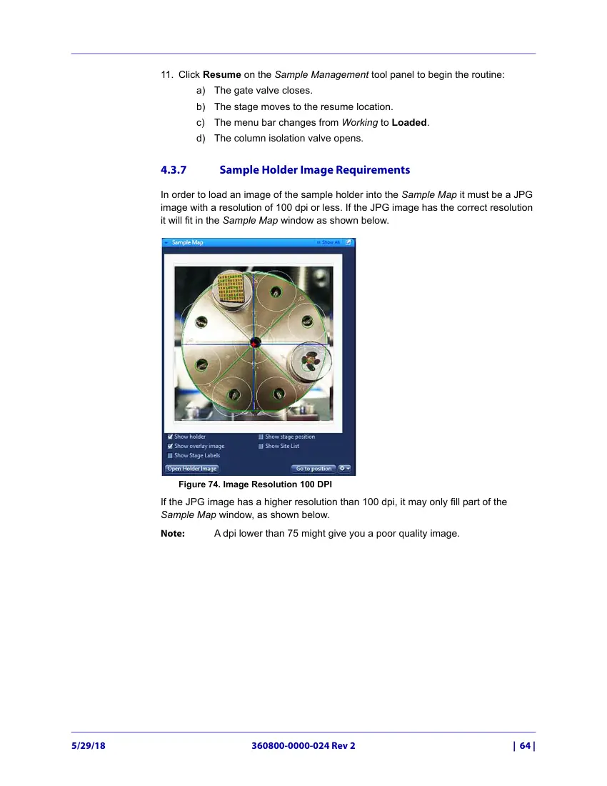

*Page 69 facsimile from `ZEISS_ORION_NanoFab_Operator_Manual_Rev2.pdf`.*

## Page 70

| 65 |
360800-0000-024 Rev 2
5/29/18
Figure 75. Image Resolution Above 100
4.3.8
Unloading the Sample 
1.
Verify the sample transfer rod is fully retracted (Figure 76). The Rod Retracted LED 
would be lit.
Figure 76. Sample Transfer Rod Retracted
2.
Click the Sample Management icon on the tool bar (Figure 77) to display the Sam-
ple Management tool panel (Figure 78).
Note: The image should be taken at 
the same orientation at which it is 
loaded into the chamber.  With the 
standard sample holder this is with 
the flat towards the bottom of the 
image and the notch at the top.  Small 
rotation errors between the image and 
the template can be adjusted after 
loading the image.  Large rotation 
errors (like 90 degrees) should be 
corrected by modifying the original 
image and re-saving before loading 
into Zen > Sample Map.

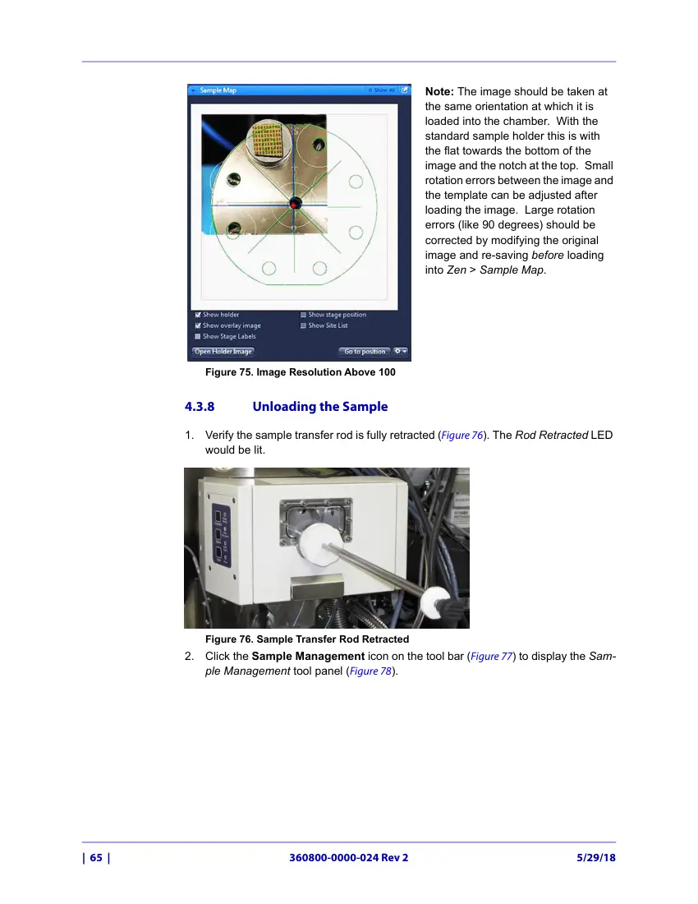

*Page 70 facsimile from `ZEISS_ORION_NanoFab_Operator_Manual_Rev2.pdf`.*

## Page 71

5/29/18
360800-0000-024 Rev 2
| 66 |
Figure 77. Sample Management Icon
Figure 78. Sample Management Tool Panel
3.
Click Exchange on the Sample Management tool panel to begin the routine:
a)
The stage in the chamber moves to the exchange position, which lights 
the Stage Ready LED.
b)
The air lock pumps down.
c)
The chamber gate valve opens.
d)
The menu bar text changes from Working to Empty.
e)
The air lock Illuminates for enhanced visibility.
Note:
When the Exchange routine completes, the Transfer LED is lit as shown 
in Figure 79.

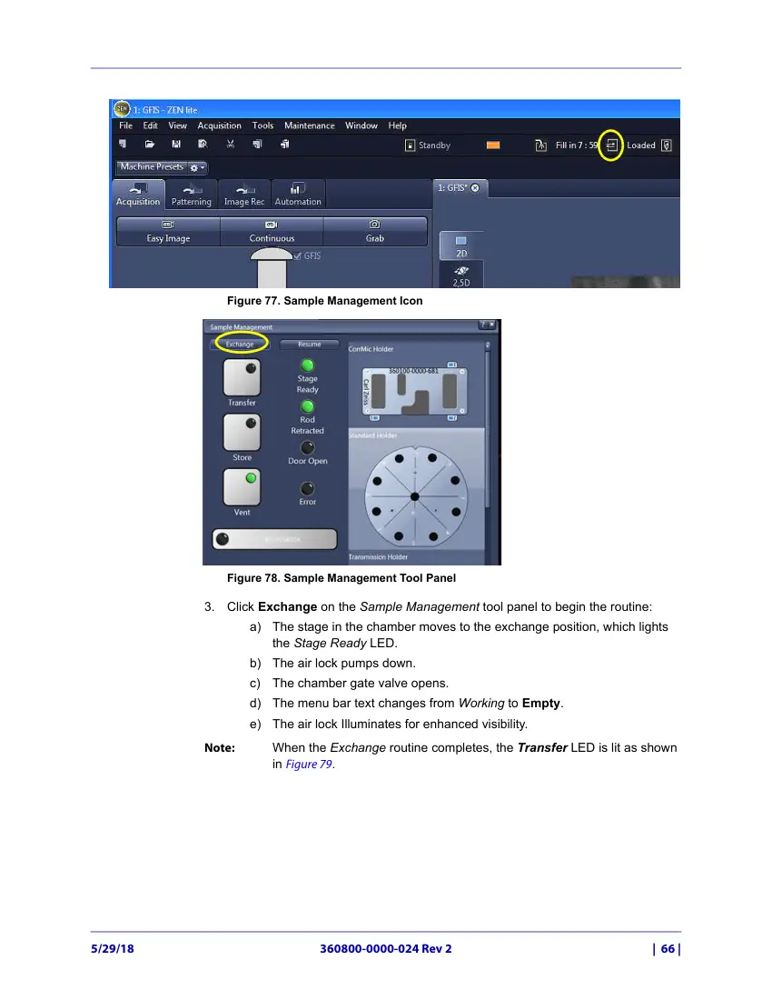

*Page 71 facsimile from `ZEISS_ORION_NanoFab_Operator_Manual_Rev2.pdf`.*

## Page 72

| 67 |
360800-0000-024 Rev 2
5/29/18
Figure 79. Transfer LED
4.
Remove the sample holder from the chamber:
a)
Insert the transfer rod into the chamber until the end aligns with the sam-
ple holder.
b)
Slowly turn the knob on the transfer rod clockwise to thread the rod into 
the sample holder until the rod is fully inserted.
c)
Pull the rod with the sample holder attached out of the chamber until it 
stops. The Rod Retracted LED lights up.
Note:
Ensure that the transfer rod is fully disengaged from the sample holder 
before pulling the transfer rod back. Otherwise, the holder can fall off the 
stage and become stuck in the chamber, requiring the chamber to be 
vented to recover the holder.
5.
Click Vent to close the air lock gate valve and flood the air lock chamber with N2.
6.
The Vacuum Dashboard indicates when the chamber is Vented.
Note:
Gloves are required for the remaining steps in the procedure.
7.
Open the air lock door as shown on the left in Figure 80.
8.
Turn the knob on the transfer rod counter-clockwise to detach the rod from the 
sample holder.
9.
Carefully slide the sample holder away from the door to remove it from the plat-
form as shown. Use one hand to hold the transfer rod fully retracted while using 
the other hand to remove the sample holder.

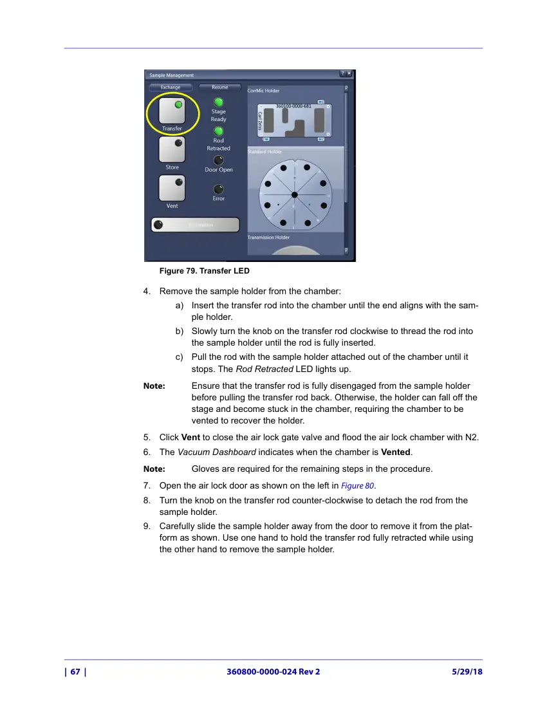

*Page 72 facsimile from `ZEISS_ORION_NanoFab_Operator_Manual_Rev2.pdf`.*

## Page 73

5/29/18
360800-0000-024 Rev 2
| 68 |
Figure 80. Open the Air Lock Door

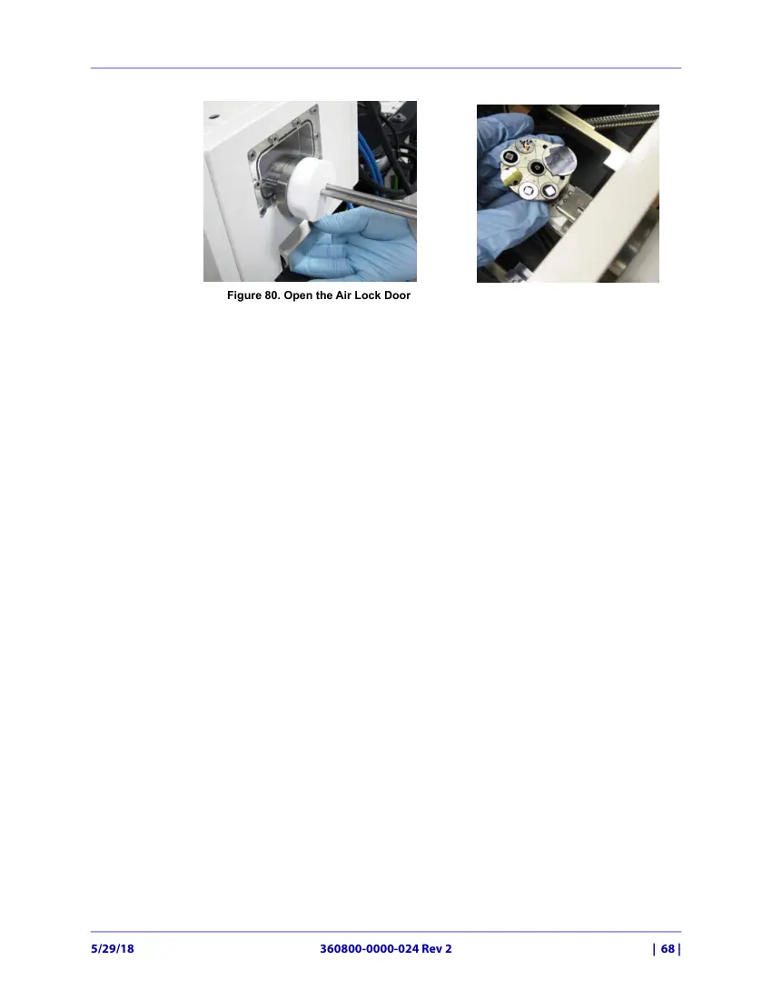

*Page 73 facsimile from `ZEISS_ORION_NanoFab_Operator_Manual_Rev2.pdf`.*

## Page 74

| 69 |
360800-0000-024 Rev 2
5/29/18
4.4
Stage Control
Note:
All reference to direction assumes that the front of the tool is the aspect of 
the tool containing the air lock. The perspective you see in the ion beam 
images is as if you were standing in front of the air lock.
The stage can be controlled either by using the joysticks or through the UI. The details 
of using either of these methods are described in the following sections. Regardless of 
what controls are used to move the stage, the stage movements are the same, and the 
same precautions must be taken. 
4.4.1
Stage Motion Risks
It is possible to crash the sample holder into either the end of lens 2 or the ET detector 
grid, so care must be taken. Moving the stage in any direction has that risk, depending 
on the sample height, except for moving down on the Z axis. Therefore always use the 
chamber scope image to observe the motion of the stage while moving it to make sure 
the samples stay clear of the GFIS column and the ET detector.
•
Moving the stage to a high Z-value has a high risk of crashing a sample into lens 2 
or the detector grid.
•
Tilting the stage, especially with a high Z value, has a particular risk, in either 
direction.
•
Movement in any direction, except down on the Z-axis, with a tall sample on the 
sample holder, or when moving after viewing a low spot on a sample, has the risk 
of hitting higher locations or higher samples on the sample holder, so you must 
always view the movement through the chamber scope.
Note:
Remember that the chamber scope view is from the camera, which is 
situated 90 degrees to the right of the air lock. 
Figure 81. Chamber Scope view of Sample Holder
Sample 
holder
End of detector grid (behind 
flood gun and lower) 
Flood gun
End of 
lens 2
-T
+T
-X away from you
+X toward you
-Y
+Y
-Z
+Z

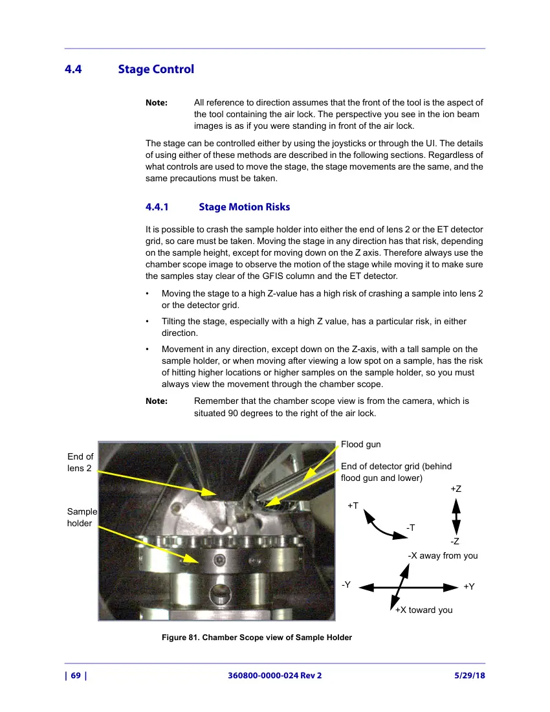

*Page 74 facsimile from `ZEISS_ORION_NanoFab_Operator_Manual_Rev2.pdf`.*

## Page 75

5/29/18
360800-0000-024 Rev 2
| 70 |
4.4.2
Stage Motions
The stage moves in five axes. Each are described below. The front of the NanoFab is 
defined as the side of the tool where the air lock is mounted. This is the orientation in 
which you view your ion beam images. 
Note:
Be aware that in the chamber scope view, the orientation changes 90 
degrees, as the chamber scope camera is mounted 90 degrees to the 
right of the air lock.
X-Axis
The X-axis is defined as the left and right directions when standing in front of the air 
lock. The range of travel of the X-axis is 50 mm. The positive direction is defined as 
towards the right of the chamber (toward the camera). When the X-axis is all the way 
to the left of the chamber the position is defined as 0 mm.
Y-Axis
The Y-axis is defined as the away and back directions when standing in front of the air 
lock. The range of travel of the Y-axis is 50 mm. The positive direction is towards the 
chamber door (to the right in the camera view). When the Y-axis is back toward the air 
lock the position is defined as 0 mm.
Z-Axis
The Z-axis is in the up and down direction, with a travel of 8 mm. The positive direction 
is defined as up (towards the GFIS column). When the axis is all the way down, it is 
defined to be a 0 mm.
Rotate Axis
The rotate axis has a range of travel of 360 degrees. Clockwise is defined as the 
positive direction.
Tilt Axis
The tilt axis has a range of travel of -5 degrees to +54 degrees. Zero degrees is 
defined as when the stage is horizontal (normal to the GFIS beam). The positive 
direction of tilt is when the bottom of the cradle assembly moves toward the air lock. 
This faces the top of the stage towards the chamber door, or the side of the chamber 
on which the Capella (Ga FIB column) option would mount. At a tilt of 54 degrees, the 
top of the stage is normal to the Ga FIB beam.

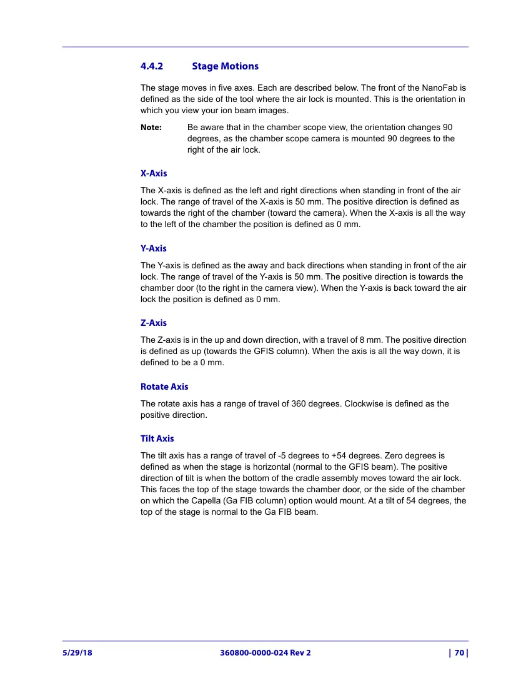

*Page 75 facsimile from `ZEISS_ORION_NanoFab_Operator_Manual_Rev2.pdf`.*

## Page 76

| 71 |
360800-0000-024 Rev 2
5/29/18
4.4.3
Joystick Control
Note:
All reference to direction assume that the air lock is at the front of the tool 
with the chamber door at the back of the tool.
Tilt/Z Joystick
If you move the joystick left, the top of the stage tilts toward the air lock (-tilt) up to -5 
degrees.
If you move the joystick right, the top of the stage tilts away from the air lock (+tilt) to a 
maximum of 54 degrees (toward the Capella column location).
If you move the joystick down, the stage platform moves down (-Z)
If you move the joystick up, the stage platform move up (+Z)

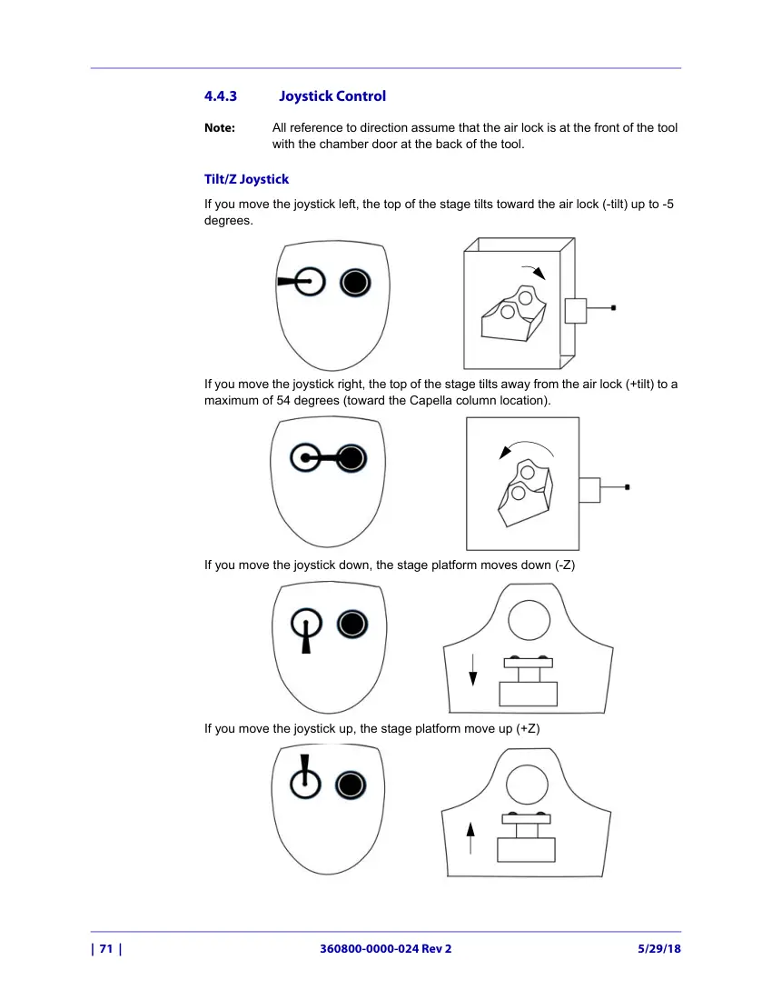

*Page 76 facsimile from `ZEISS_ORION_NanoFab_Operator_Manual_Rev2.pdf`.*

## Page 77

5/29/18
360800-0000-024 Rev 2
| 72 |
X/Y/R Joystick
If you move the joystick right, the stage platform moves right in relation to the air lock 
(+X), and the image moves right.
If you move the joystick left, the stage platform left in relation to the air lock (-X), and 
the image moves left.
If you move the joystick down, the stage platform moves towards the air lock (-Y), and 
the image moves down.
If you move the joystick up, the stage platform moves away from the air lock (+Y), and 
the image moves up.

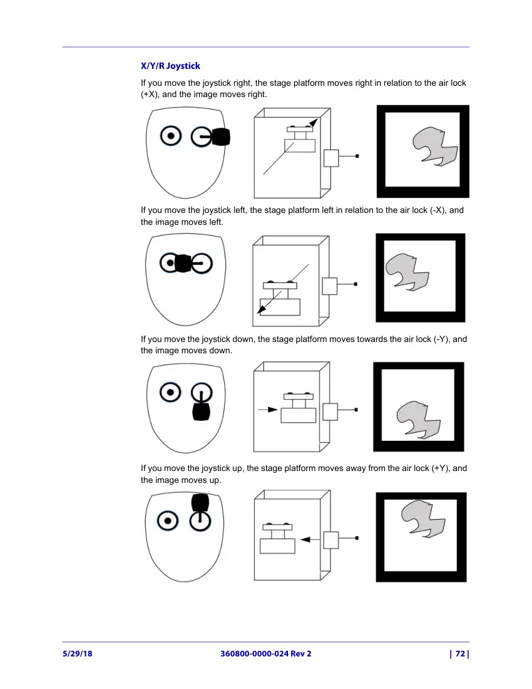

*Page 77 facsimile from `ZEISS_ORION_NanoFab_Operator_Manual_Rev2.pdf`.*

## Page 78

| 73 |
360800-0000-024 Rev 2
5/29/18
If you rotate the X/Y/R joystick to the right, the holder image rotates clockwise.
If you rotate the X/Y/R joystick to the left, the holder image turns counter clockwise.
Note:
Be aware of the brake button, which can be used to stop the stage in 
an emergency.
Break button

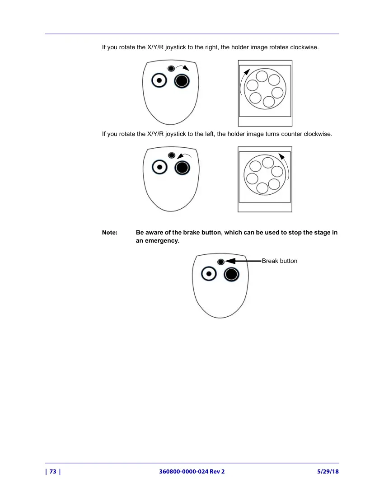

*Page 78 facsimile from `ZEISS_ORION_NanoFab_Operator_Manual_Rev2.pdf`.*

## Page 79

5/29/18
360800-0000-024 Rev 2
| 74 |
4.4.4
Zen UI Stage Control
Moving the stage using the UI is done through the Stage Positioning tool panel. From 
the Navigation tool panel, click the Stage Positioning tab to open the Stage 
Positioning tool panel.
Note:
Be aware of the Stop button at the lower right corner of the tool panel. Use 
this button to immediately stop the tool if there is a risk of collision.
Figure 82. Stage Positioning Tool Panel
X, and Control
The X, Y, R section of the Stage Positioning tool panel is shown below. 
Figure 83. Stage Positioning Tool Panel
In the top left area are the readbacks for the current position of these axes.

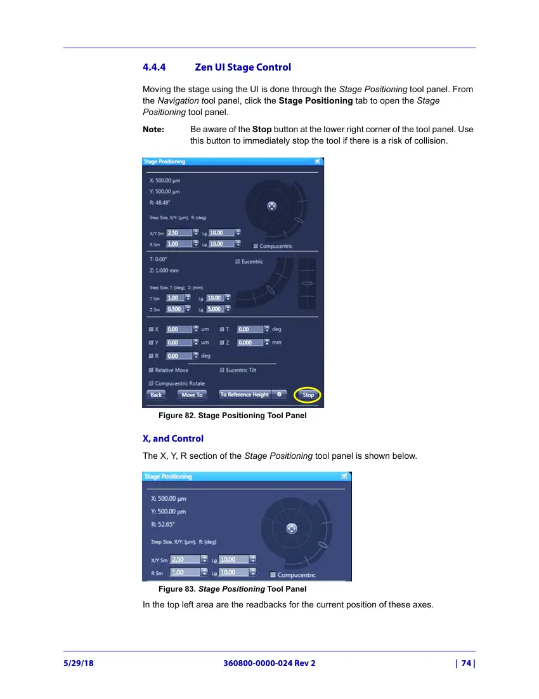

*Page 79 facsimile from `ZEISS_ORION_NanoFab_Operator_Manual_Rev2.pdf`.*

## Page 80

| 75 |
360800-0000-024 Rev 2
5/29/18
Rotation Control
On the right hand side are the controls for X,Y, and R. 
Figure 84. Rotation Control
On the outside right edge of the control is the rotate control. This control is divided into 
four sections, with a small oval in the middle. There are two ways of controlling 
rotation; one is by dragging the oval, and the other is by entering small and large step 
values in the R, Sm and Lg fields (Figure 83) in the lower left corner of the top section 
of the Stage Positioning tool panel, and then clicking in one of the four sections of the 
rotate control to rotate the stage one step at a time. 
The oval is a virtual joystick. Dragging this oval up causes the rotate axis to move 
continuously for as long as the oval is held away from its center position; up for a 
negative rotation direction, and down for a positive rotation direction. 
The four sections are step controls, meaning that each time the control is clicked, the 
rotate moves a fixed amount. When you hover over a section with the mouse, it 
highlights. The two sections at the upper and lower end of the control rotate in large 
steps and the two inner sections rotate in small steps. The magnitude of the steps are 
determined by the values entered in the fields in the lower left of the window.
Figure 85. Rotation Step Size Values
The X and Y step controls are the two concentric circles, each divided into eight 
sections. The inner circle controls the small steps and the outer circle controls the 
large steps.
Small Step Control 
Oval - Slide Rotation Control 
Large Step Control
Large Step Control 
Small Step Control

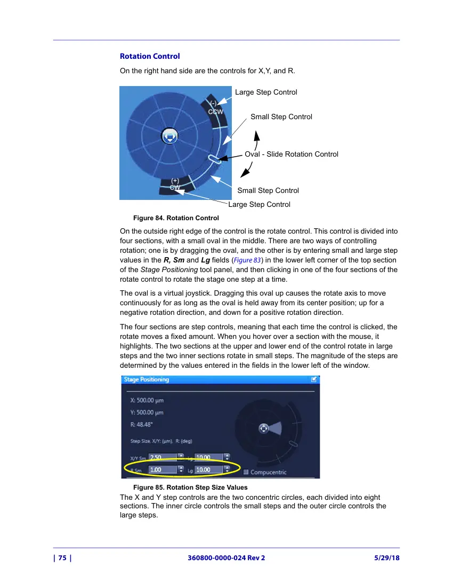

*Page 80 facsimile from `ZEISS_ORION_NanoFab_Operator_Manual_Rev2.pdf`.*

## Page 81

5/29/18
360800-0000-024 Rev 2
| 76 |
Figure 86. X & Y Control
The four sections on each axis move the stage only in that axis, incrementally with 
each click, according to the values entered in the X/Y, Sm and Lg fields in the Stage 
Positioning tool panel. The four diagonal sections between the X and Y axes cause the 
stage to move on both axes at the same time. 
Figure 87. X & Y Step Size Values
In the very center of this control is a virtual joystick. This virtual joystick can be dragged 
in any direction, causing the stage to move in the same direction (Figure 86).
Tilt, Z Control
The Tilt, Z section of the Stage Positioning tool panel (Figure 88) is in the middle of the 
Stage Positioning tool panel (Figure 82).
The Tilt, Z section of the Stage Positioning tool panel is shown below. In the top left 
area are the readbacks for the current position of these axes. On the right hand side 
are two separate controls used to command the stage to move. 
Figure 88. T, Z Section of Stage Positioning Tool Panel
Black Large steps (outer circle)
Blue: Small steps (inner circle)
Virtual Joystick

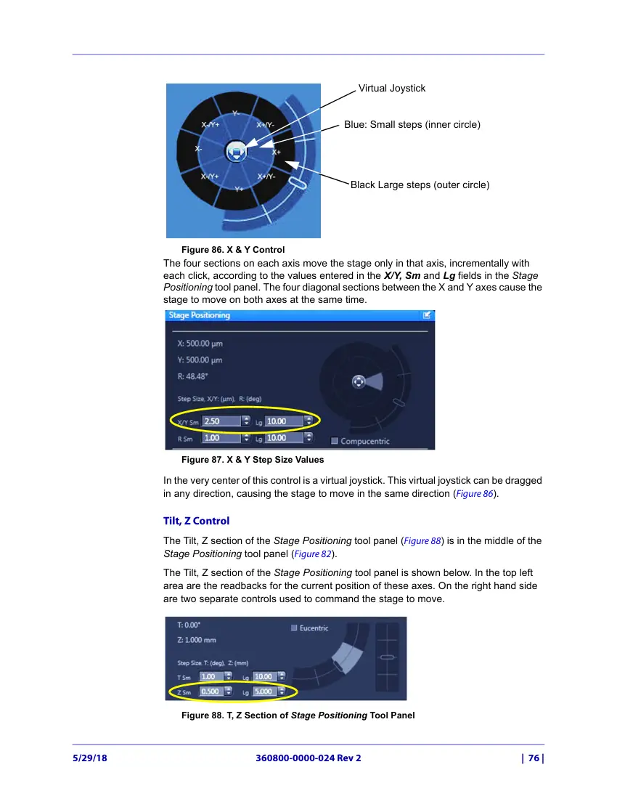

*Page 81 facsimile from `ZEISS_ORION_NanoFab_Operator_Manual_Rev2.pdf`.*

## Page 82

| 77 |
360800-0000-024 Rev 2
5/29/18
The one on the left (the arc shaped one) is the tilt control. This control works identically 
as the rotate control described above, except dragging down moves you in the 
negative direction. Dragging the virtual joystick (oval) up causes the tilt axis to move in 
the positive direction.
Figure 89. Tilt Control
The control on the right is the Z control. This control works identically as the tilt control 
described above. Dragging the virtual joystick (oval) up causes the Z axis to move in 
the positive (up) direction.
Figure 90. Z Control
The four sections on the tilt control move the stage incrementally with each click, 
according to the values entered in the T, Sm and Lg fields in lower left of the Tilt, Z 
section of Stage Positioning tool panel (Figure 91).
The four sections on the Z Controls move the stage incrementally with each click, 
according to the values entered in the Z, Sm and Lg fields in lower left of the Tilt, Z 
section of the Stage Positioning tool panel (Figure 91).
Figure 91. T and Z Step Size Values
Oval - Slide tilt 
control
+
_
Black: Large step 
controls
Blue & Light Blue: Small 
step controls
Oval - Slide Tilt Control
Blue & light blue: Small step 
controls 
Black: Large step controls

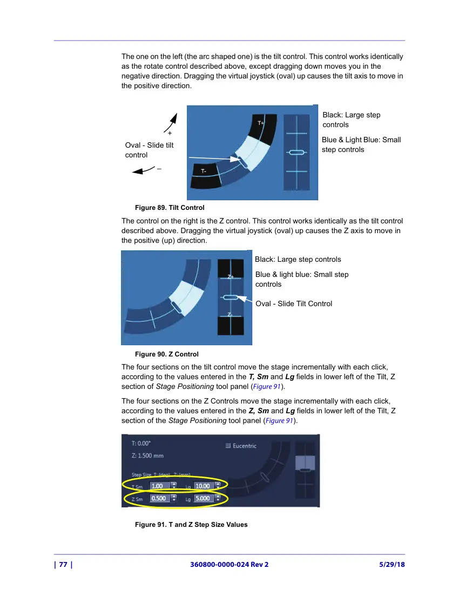

*Page 82 facsimile from `ZEISS_ORION_NanoFab_Operator_Manual_Rev2.pdf`.*

## Page 83

5/29/18
360800-0000-024 Rev 2
| 78 |
4.5
Exchanging the External N2 Supply Tank
The external N2 supply tank is the responsibility of the customer. It is also the 
responsibility of the customer to have all operators trained in the procedures for 
exchanging the external tank as well as all safety precautions that must be observed.
It is recommended that the NanoFab Dewar Control be put into Service Mode while 
the external tank is being exchanged. This prevents any chance of the software 
initiating a Dewar fill while the tank is being exchanged. To put the system into service 
mode, click on the Dewar Fill icon
, which is found along the top of 
the UI. The Dewar Control tool panel opens, with the system in Active Cooling mode. 
See Figure 92.
Figure 92. Dewar Control Tool Panel
Click the Begin Servicing button at the bottom of the pane to disable the Auto Fill 
routine. See Figure 93.

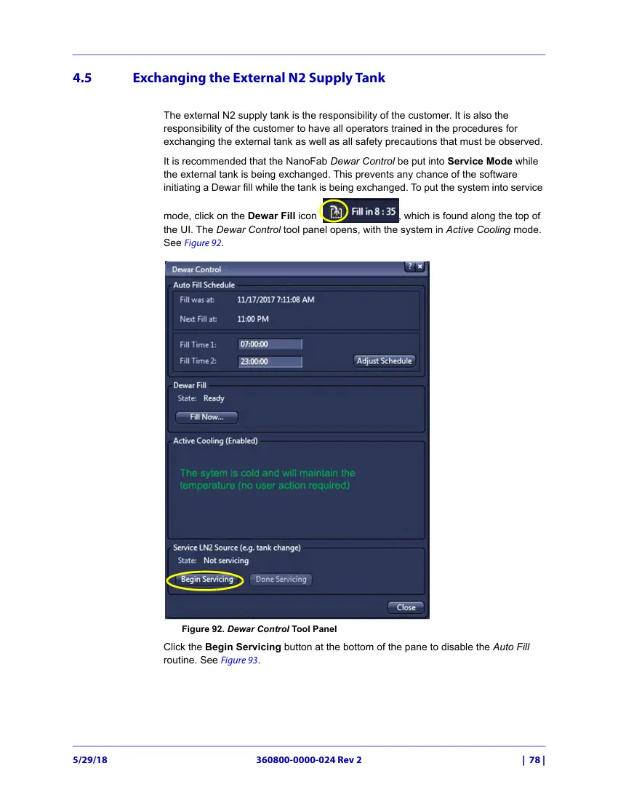

*Page 83 facsimile from `ZEISS_ORION_NanoFab_Operator_Manual_Rev2.pdf`.*

## Page 84

| 79 |
360800-0000-024 Rev 2
5/29/18
Figure 93. Servicing N2 Source
The Dewar Fill icon at the top of the UI flashes yellow on and off, labeled Servicing. 
See figure below.
Figure 94. Dewar Fill Icon - Servicing
After the tank has been exchanged, click the Done Servicing button at the bottom of 
the Dewar Control tool panel. Auto fill is now enabled. It is very important to click this 
Done Servicing button after the tank has been exchanged or Auto Fill remains 
disabled and the gun eventually warms up.

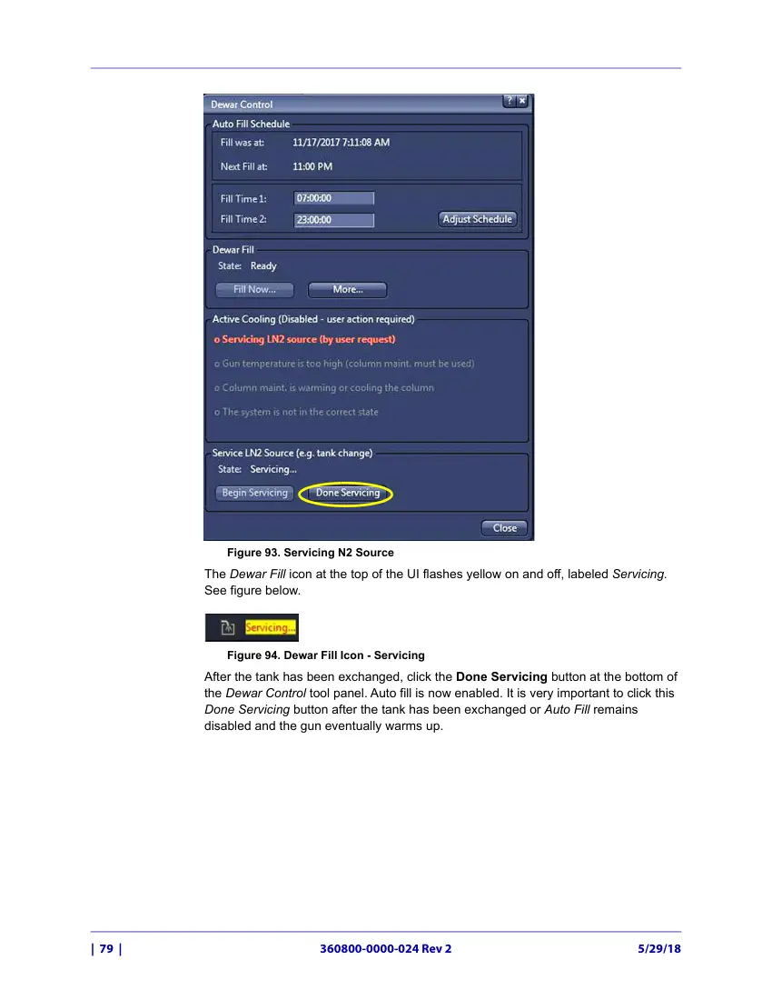

*Page 84 facsimile from `ZEISS_ORION_NanoFab_Operator_Manual_Rev2.pdf`.*

## Page 85

5/29/18
360800-0000-024 Rev 2
| 80 |
4.6
Chamber Cleaning
All vacuum chambers contain volatile hydrocarbon molecules that are introduced into 
the chamber through atmospheric hydrocarbon contamination, lubrication, or 
inadvertent contamination by users. This build-up of hydrocarbon reduces the image 
quality. Hydrocarbon contamination in the chamber causes staining on the sample 
when imaging. It also results in deposits on the sample when milling. Any time these 
symptoms are noticed, it is time to clean the chamber with the plasma cleaner, also 
referred to as the Evactron (brand name). The plasma generated by the Evactron 
chemically reacts with the hydrocarbons in a way that makes them easier to pump out 
of the chamber.
The Evactron consists of two major components:
•
Plasma radical source
•
Controller
The plasma radical source is mounted on the chamber port to the left of the air lock.
Figure 95. Evactron Plasma Radical Source
The controller is mounted in the chase rack. 
Figure 96. Evactron Controller
Evactron
Evactron controller

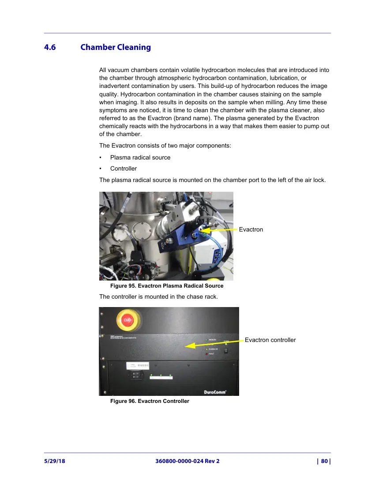

*Page 85 facsimile from `ZEISS_ORION_NanoFab_Operator_Manual_Rev2.pdf`.*

## Page 86

| 81 |
360800-0000-024 Rev 2
5/29/18
Performing a Chamber Cleaning
In earlier days, chamber cleaning was performed through the Service Machine 
application. It can now be done directly from the Zen UI. Use it when you have 
indications of hydrocarbon contamination.
Select Maintenance > System > Chamber Cleaning in the UI.
Figure 97. Chamber Cleaning selection
The Chamber Clean screen opens.
You can begin cleaning now, or clean at a pre-determined time by selecting either 
Start Now or Schedule Clean at the bottom of the screen. If you select Start Now, the 
Start Date and Start Time are not relevant. If you schedule a time in the future, you 
must enter the Start Date and Start Time.
Select the Number of hours for the cleaning.
There are 3 selections for Cleaning Intensity in the drop-down list: Mild, Moderate, 
and Heavy. When you select one, the Plasma and Purge values for it display in the 
Actions section at the bottom.
The cleaning process requires the chamber to be at rough vacuum. To accomplish this 
the following sequence executes:
•
The air lock is pumped.
•
The gate valve opens.

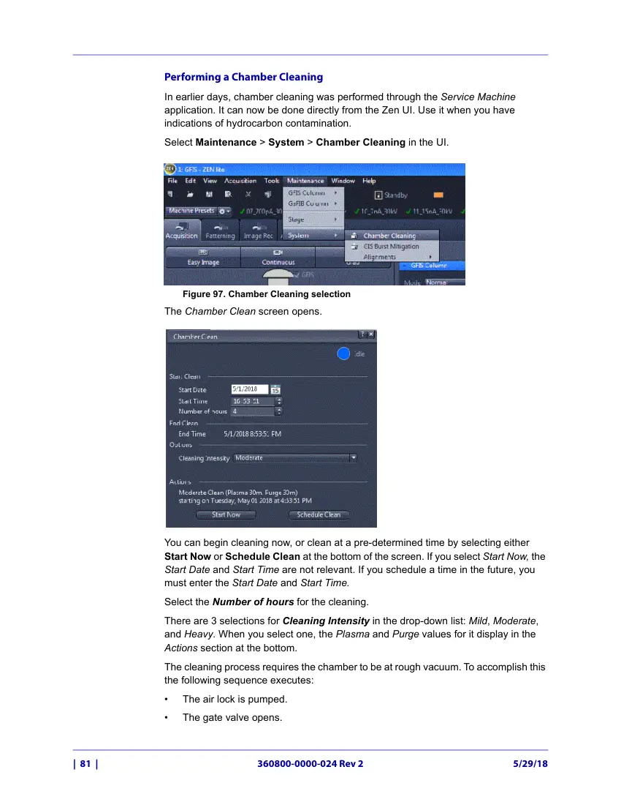

*Page 86 facsimile from `ZEISS_ORION_NanoFab_Operator_Manual_Rev2.pdf`.*

## Page 87

5/29/18
360800-0000-024 Rev 2
| 82 |
•
the chamber turbo pump is turned off. 
It takes a few minutes for the turbo pump to spin down to a stop, during which time the 
status of the turbo pump is reported as braking in the Vacuum Dashboard (red box, 
Figure 98).
Figure 98. Rough Pump Braking
When the turbo has completely stopped, a burst of nitrogen is put into the chamber. 
This causes pressure in the chamber to rise above 10 Torr, at which point the 
ENABLED LED on the front panel of the Evactron controller starts blinking (Figure 99).
Figure 99. ENAPLED On
After a number of minutes, the rough pump gets the chamber down to a pressure in 
the range of 5E-1 Torr (Figure 100). This is the pressure required for the Evactron to 
operate.

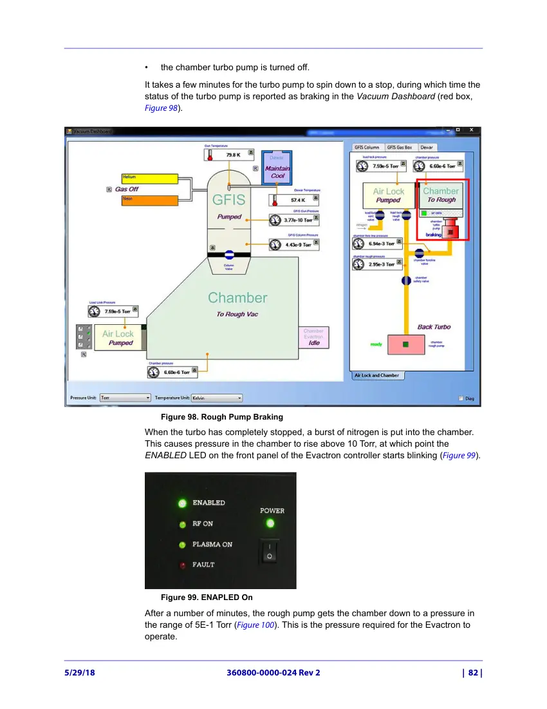

*Page 87 facsimile from `ZEISS_ORION_NanoFab_Operator_Manual_Rev2.pdf`.*

## Page 88

| 83 |
360800-0000-024 Rev 2
5/29/18
Figure 100. Chamber Pressure in Range
Once the Evactron pressure reaches the correct level, the RF ON LED on the front of 
the panel of the Evactron controller lights up (Figure 101).
Figure 101. RF On
This means the source in the Evactron is on, which is required to generate the plasma. 
Once the plasma is being generated, the PLASMA ON LED lights up (Figure 101). The 
two yellow LEDs remain lit while the plasma is on and off during the nitrogen purge 
portion of each cleaning cycle. The process repeats until completing the number of 
cycles selected.
When the cleaning process is completed, the software restores the chamber to the 
pumped state.
4.7
Control of the Column Isolation Valve (CIV)
See the section "Column Isolation Valve" on page 21, for a description of the CIV. At 
various times the software opens or closes the CIV. There are a couple ways you can 
also check or change the state of the CIV. It is easiest via the Vacuum Dashboard. The 
CIV is between the column and the chamber, and is shown in the open state in the 
figure below (Figure 102), To change the state, right-click the valve image and then 
select Open Valve or Close Valve as required.

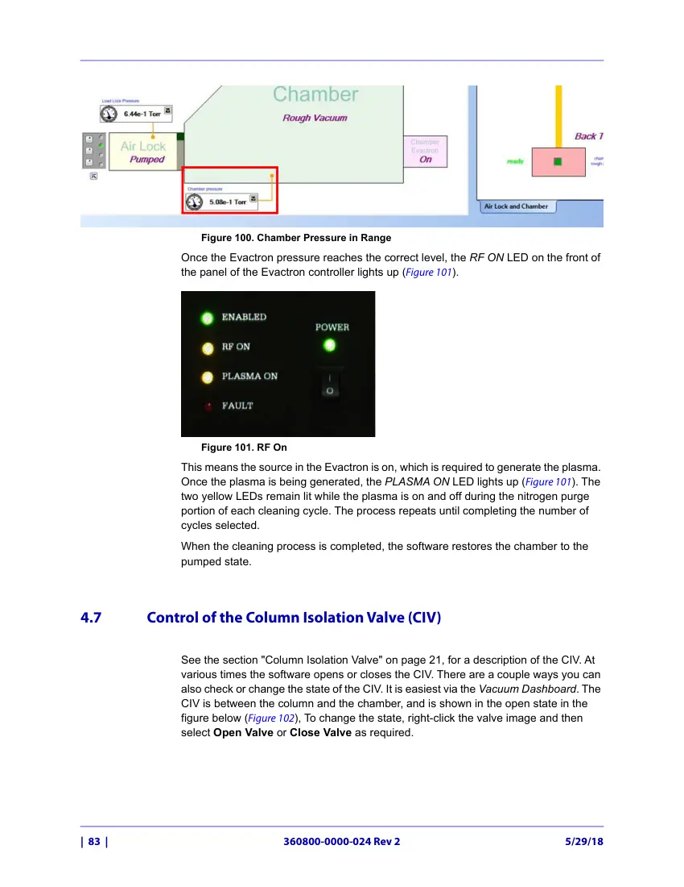

*Page 88 facsimile from `ZEISS_ORION_NanoFab_Operator_Manual_Rev2.pdf`.*

## Page 89

5/29/18
360800-0000-024 Rev 2
| 84 |
Figure 102. CIV Open
Another way to control the CIV is through the Zen UI. The CIV control is found in the 
GFIS Column tool panel under Additional Properties in the Column States section.
Figure 103. Column States
The current state of the valve is to the right of Isolation Valve is, shown as Open in 
Figure 103. The button to the right of that is the button for changing the state, which in 
this case is Close.

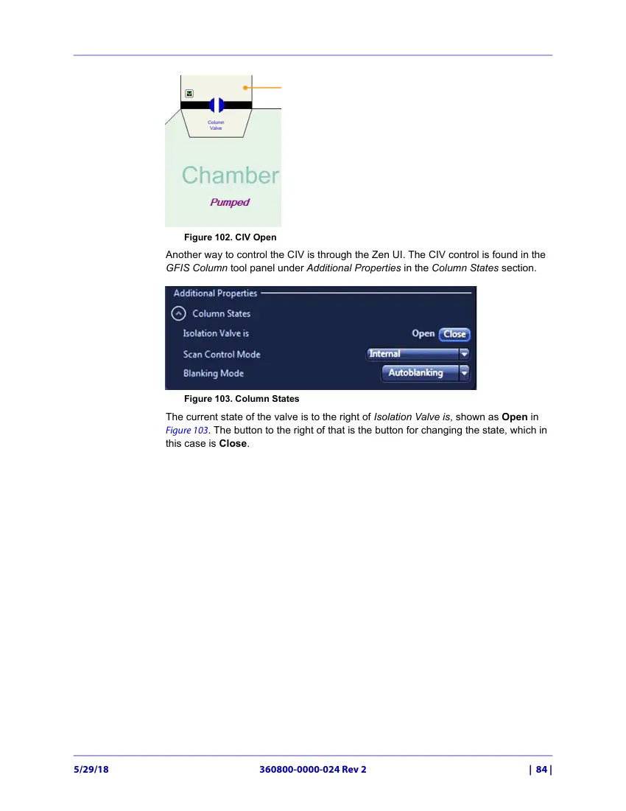

*Page 89 facsimile from `ZEISS_ORION_NanoFab_Operator_Manual_Rev2.pdf`.*

## Page 90

| 85 |
360800-0000-024 Rev 2
5/29/18
4.8
Dewar Control
The Dewar Control tool panel in the UI has a few features that are helpful for the 
operator. To open the Dewar Control tool panel, click the Dewar Fill icon in the menu 
bar at the top of the UI. 
Figure 104. Dewar Fill Icon
The Dewar Control tool panel opens (Figure 105).
Figure 105. Dewar Control Tool Panel
4.8.1
Auto Fill Schedule
The top section of the Dewar Control tool panel (Figure 105) is the Auto Fill Schedule 
section. The last time the Dewar was filled is displayed in the Fill was at: field. Below 
that is the time of the next scheduled fill. Below that two text boxes display the 
scheduled times for the two daily auto fills. The fill times cannot be entered directly into 
these text boxes. To change the scheduled auto fill times, click on the Adjust 
Schedule button and the Set Auto Fill Time tool panel appears (Figure 106).

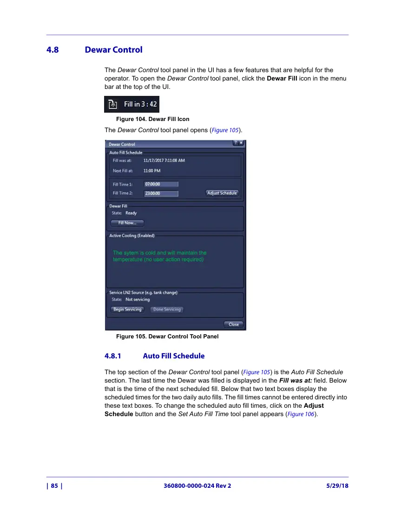

*Page 90 facsimile from `ZEISS_ORION_NanoFab_Operator_Manual_Rev2.pdf`.*

## Page 91

5/29/18
360800-0000-024 Rev 2
| 86 |
Figure 106. Set Auto Fill Time Tool Panel
The two auto fill times are displayed. You can schedule these for any times that work 
best for you, but there cannot be more than 16 hours between scheduled fills. The time 
between fills is displayed below the text fields.
Generally, it is recommended that these auto fill times be set for outside of normal 
working hours. The first fill of the day is typically a couple of hours before work begins 
on the NanoFab, as this allows time for the gun temperature to return to normal after 
the end of the fill.
If a fill time is changed, it may not take full affect right away. To avoid an interval that is 
too long or too short between fills, the software may wait a couple of fill cycles before 
putting the new fill times into effect. After entering the new fill time, click on the Save 
button.
4.8.2
Dewar Fill Command
In the middle of the Dewar Control tool panel is the Dewar Fill section with the Fill Now 
button (Figure 105). Click this button to start the Dewar fill right away. Do not click on 
this button unless there is a reason to fill the Dewar at that immediate time. Executing 
a Fill Now disrupts the normal auto fill times and it takes a few auto fill cycles before 
the fills are back to the scheduled times.
4.8.3
Active Cooling Status
The Active Cooling section of the Dewar Control tool panel displays the status, 
enabled or disabled, of the auto fill process. When auto fill is enabled, the word 
Enabled is displayed next to Active Cooling at the top of the section, and a message 
below that states that the system will be maintained in the cold state without any action 
by the operator.(Figure 215).

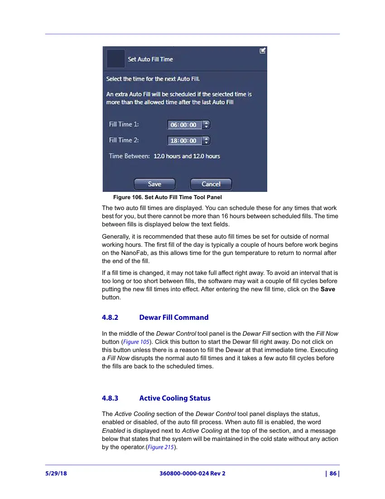

*Page 91 facsimile from `ZEISS_ORION_NanoFab_Operator_Manual_Rev2.pdf`.*

## Page 92

| 87 |
360800-0000-024 Rev 2
5/29/18
Figure 107. Active Cooling Enabled
If Active Cooling is disabled, and the Dewar cannot be put into the Maintain Cool state, 
contact your service representative.
If the Auto Fill is disabled, the words, Disabled- user action required, is displayed at 
the top of this section (Figure 108) and the reason is given in highlighted text.
Figure 108. Active Cooling Disabled
In the text area, the reason auto fill is disabled is highlighted in red. For more detail, 
see section 7.4, Gun /Column Issues.
4.8.4
Service LN2 Source
The purpose of this feature is to allow the operator to put the auto fill into Service mode 
while performing any service on the external LN2 source. The most common reason 
for entering Service mode is to replace the external LN2 source tank. It is 
recommended that you enter Service mode while changing the external tank to

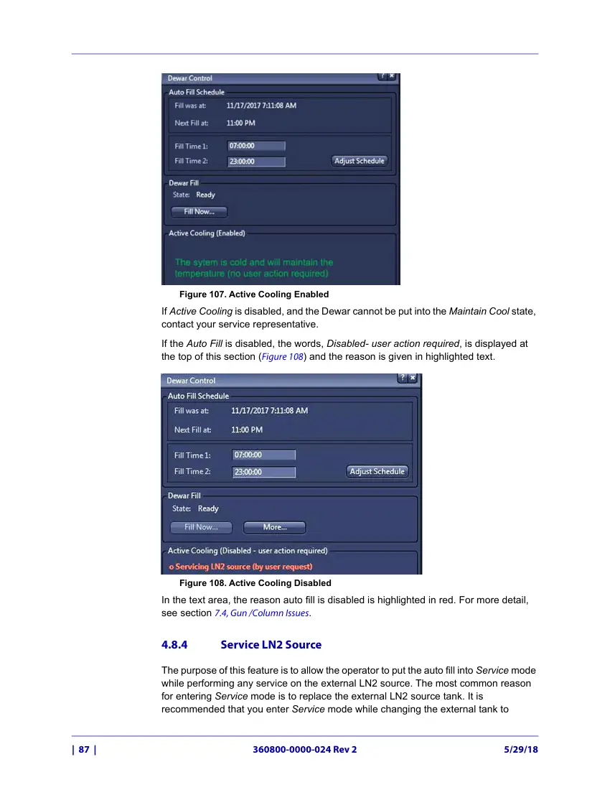

*Page 92 facsimile from `ZEISS_ORION_NanoFab_Operator_Manual_Rev2.pdf`.*

## Page 93

5/29/18
360800-0000-024 Rev 2
| 88 |
prevent any possibility of the Dewar fill process starting during the tank change, in 
which case, the Dewar system could be exposed to air and moisture, which would 
compromise its performance.
Figure 109. Servicing Section of Dewar Control Tool Panel
To enter Service mode, click the Begin Servicing button in the section at the bottom 
of the Dewar Control tool panel (Figure 109). When you are finished servicing, be sure 
to click the Done Servicing button. Since the Dewar does not fill while in servicing 
mode, the Dewar may run out of LN2 if the tool is left in servicing mode for an 
extended period, and the gun will warm up. As a reminder that auto fill is in the 
servicing mode, the word Servicing, with a yellow flashing background, is displayed 
next to the Dewar Control icon.
Figure 110. Servicing Icon
4.8.5
Emergency Fill
If the Dewar bottom temperature should rise above 80 K (gun temperature 
approximately 100 to 105 K), the software initiates an emergency fill. An emergency fill 
is not triggered if the Dewar auto fill is in servicing mode. 
Note:
The HV power shuts off if the gun temperature reaches 120 K.
4.9
Tuning and Operating the Flood Gun
Please refer to "Flood Gun" on page 27 regarding the theory and operation of the flood 
gun.
Verify Flood Gun Not Shorted
Before powering up the flood gun, make sure that the ET detector grid is NOT shorted.
Note:
For the flood gun to function properly, the electrons emitted from the flood 
gun MUST be sufficiently repelled away from the ET detector to prevent 
saturation and damage to the detector’s scintillator. In normal operation, 
the ET grid voltage is switched to about -1000V, creating a field to repel 
the flood gun electrons. However, if the ET grid has been damaged or 
shorted to ground (for example, from being bumped by a sample), the 
repelling field may not be sufficient.

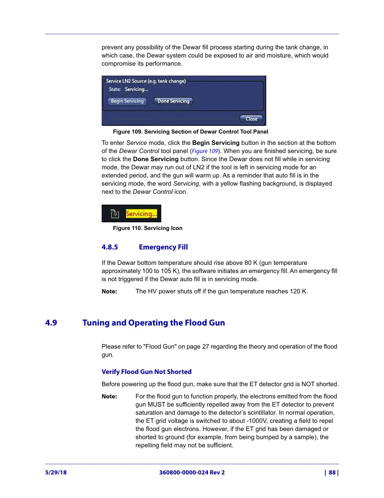

*Page 93 facsimile from `ZEISS_ORION_NanoFab_Operator_Manual_Rev2.pdf`.*

## Page 94

| 89 |
360800-0000-024 Rev 2
5/29/18
To verify normal operation of the ET grid (NOT shorted) perform the following steps:
1.
Continuously image, and zoom in to about 5 µm Field of View (FOV).
2.
Focus and stigmate the beam and set the contrast for medium-gray average 
intensity.
3.
In the ET Detector control, overwrite the 500V in the grid text field to 0 and press 
Enter.
4.
Observe the image; the features in the image should move to the right and down 
slightly and the image should begin to darken.
5.
Once this behavior has been verified, set the grid back to 500V (the image should 
quickly snap back to the original position and brightness).
6.
If changing the ET grid voltage has no effect on the image (position or brightness), 
DO NOT POWER UP THE FLOOD GUN.
Perform Emission Current Adjustment
Note:
This should be required only once unless the flood gun is replaced. Use 
this emission current adjustment only if the flood gun has been replaced 
and/or if you suspect this procedure has not been performed or the 
emission current has changed.
1.
Set the emission current of the flood gun to 1 to 2 µA. 
2.
From the Operation Center, power the flood gun on and keep it on for about an 
hour to stabilize.
3.
Power down the ET detector and wait 2 minutes for the voltages to ramp down.
4.
Go to the Inspector Manager and open BhvFloodGun, PolarisFloodGun, FGF-
GEmissionI:
Figure 111. Inspector Manager

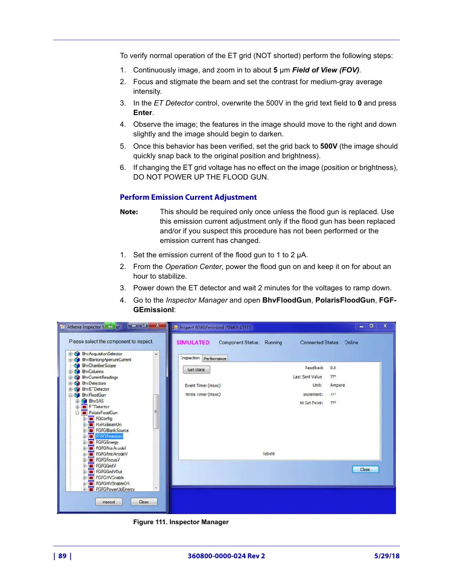

*Page 94 facsimile from `ZEISS_ORION_NanoFab_Operator_Manual_Rev2.pdf`.*

## Page 95

5/29/18
360800-0000-024 Rev 2
| 90 |
5.
Look at the readback current (in Amps; should be in the -8 range).
6.
Set the Flood Gun Mode to On (this will unblank the flood gun and will only work if 
the ET is powered down so that the electrons from the flood gun do not damage 
the ET scintillator).
7.
Look at the readback current and adjust the filament voltage so that the emission 
current reads between 1 and 2E-6A.
8.
Set the Flood Gun Mode back to Auto (or Line or Frame).
9.
Power up the ET detector.
Background
There are two basic modes of charge neutralization on the Orion NanoFab – frame 
and line. Frame neutralization is only relevant for continuous imaging since it waits for 
one full image (or frame) to be completed before neutralizing. Line neutralization, on 
the other hand, will neutralize between each line of an image. For example, if the pixel 
resolution is set to 512, there will be 512 iterations of neutralization for a single image. 
Line neutralization is, therefore, much more effective than frame neutralization but will 
also be much slower. Frame neutralization can be used while navigating on a sample 
to find a specific area of interest, for example, since a faster response time is needed 
in this case. While the neutralization may not be as efficient, it may be adequate at 
lower magnifications since the charge density from the ion beam is less.
The most effective use of neutralization is line neutralization combined with line 
averaging. In this case, the neutralization is activated between each line that is 
averaged and between each line of the image. When used with short dwell times, the 
sample has much less chance to build up charge. For example, a 1024 pixel resolution 
image with 16 line averages, will have 1024 x 16 = 16384 cycles of neutralization for a 
single image.
In some cases, it may be desirable to use frame averaging on a charging sample while 
maximizing the neutralization. In this special case, the flood gun neutralization mode 
cannot be set to Auto. Line neutralization mode must be selected and frame 
averaging.
Optimize Flood Gun Emission
Optimize the flood gun emission onto the sample at a given working distance. 
Note:
It is recommend that the sample be placed at the beam coincidence/tilt 
eucentric working distance (usually between 8.5 and 9.0 mm). Optimizing 
the neutralization involves imaging on a charging sample to induce some 
charging but not too much and adjusting the flood gun’s x and y deflectors 
and focus to maximize the signal. The values in the following steps are 
guidelines; other settings can also be used.
1.
Set sample to the tilt eucentric and/or Ga FIB coincidence point working distance.
2.
Set the Flood Gun Mode to Frame.
3.
Set the Flood Time to 3000 usec.
4.
Set the Flood Gun Mode to Line.
5.
Set the Flood Time to 100 usec.

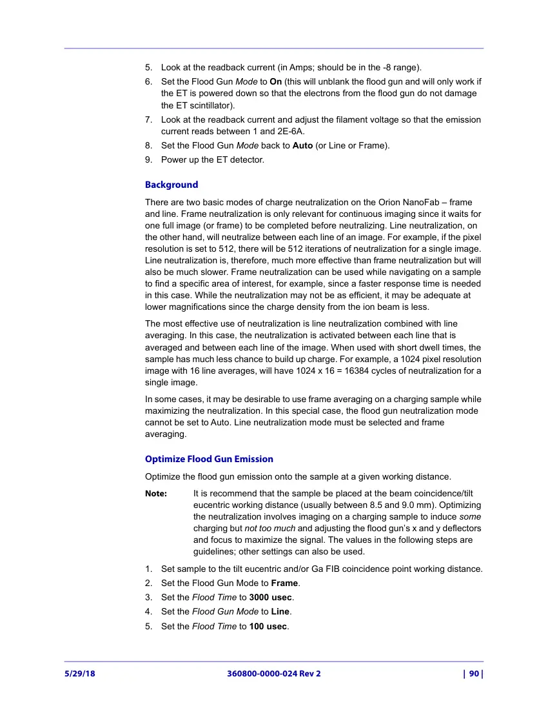

*Page 95 facsimile from `ZEISS_ORION_NanoFab_Operator_Manual_Rev2.pdf`.*

## Page 96

| 91 |
360800-0000-024 Rev 2
5/29/18
6.
Set the Flood Gun Mode to Auto.
7.
Begin continuously imaging at 256 or 512 pixel resolution and lowest magnifica-
tion (largest FOV) possible. Use a dwell time of 1 µsec and no averaging.
8.
Adjust contrast for medium gray.
9.
Slowly zoom in until the image begins to darken.
10. Adjust the y and x deflectors to maximize the brightness of the image.
11. Change the Scan Parameters to Line averaging (about 8 lines); this will automat-
ically change the flood gun to line neutralization mode.
12. Repeat the previous two steps to optimize the neutralization.
13. Adjust the Focus slider for best neutralization (default is -433V).
Figure 112. Flood Gun tool panel
Note:
The behavior of neutralization in Auto mode is the following:
–
If Image Averaging is set to Frame, neutralization will be set to Frame.
–
If Image Averaging is set to Line, neutralization will be set to Line.
–
If no Image Averaging is used, neutralization will be set to Frame.
14. If the image is excessively bright on the left edge, increase the Grid Blank Time.
–
Adjustments can be made to the Flood Energy but should not exceed 900 
V and will likely require readjustment of the deflectors.
–
Adjustments to the source voltage will also affect the amount of neutral-
ization but should only be done after optimizing the deflectors and focus 
voltage. Do not exceed 2.50 V.
–
Adjustments can also be made to the Flood Energy but should not exceed 
850 V and will likely require readjustment of the deflectors.
–
Changing the magnification has a large impact on the neutralization since 
it dramatically affects the charge density of the ion beam on the sample.

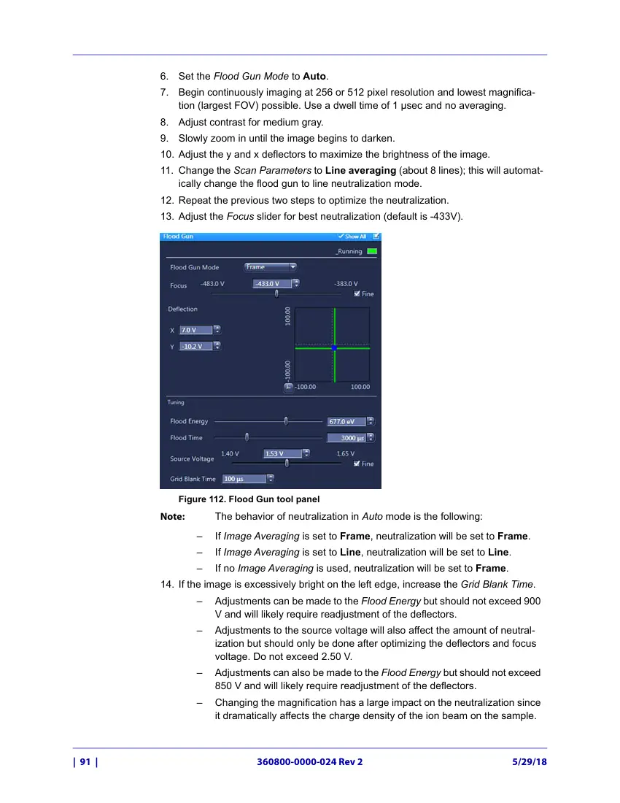

*Page 96 facsimile from `ZEISS_ORION_NanoFab_Operator_Manual_Rev2.pdf`.*

## Page 97

5/29/18
360800-0000-024 Rev 2
| 92 |
Zooming out may result in over-neutralizing and non-intuitive contrast 
changes can occur.
Create a Preset to Save the Optimized Settings
See "Using Machine Presets" on page 192 for basic information on creating presets.
After optimizing the neutralization at a given sample working distance and flood gun 
energy, a preset should be created so that well-neutralized images can be quickly 
obtained on new samples:
1.
Near the top left corner of the Zen UI, open the Machine Presets control panel and 
click the Create button to create a new preset.
2.
Uncheck all of the categories except the Flood Gun.
3.
Check all items in the Flood Gun category.
4.
At the top of the Preset Editor, select a group and give the preset a name (e.g., 
Flood Gun at Coincident WD).
5.
Close the preset editor.
Figure 113. Device Preset Editor

*Page 97 facsimile from `ZEISS_ORION_NanoFab_Operator_Manual_Rev2.pdf`.*

## Page 98

| 93 |
360800-0000-024 Rev 2
5/29/18
Using the Preset
When the flood gun is required for imaging:
1.
Power up the flood gun.
2.
Activate the preset.
3.
Move the sample to the reference working difference
The flood gun should be reasonably tuned; slight adjustments (mostly to the x and y 
deflectors) may be required to optimize the neutralization.

*Page 98 facsimile from `ZEISS_ORION_NanoFab_Operator_Manual_Rev2.pdf`.*

## Page 99

5/29/18
360800-0000-024 Rev 2
| 94 |
5
Tool Setup & Maintenance
5.1
Basic System Checks
A number of quick status checks of the tool can be made by viewing the Vacuum 
Dashboard. It is a good idea to make these checks when first sitting down at the tool, 
and also when the tool doesn’t seem to be operating correctly.
If all of these basic checks seem fine but the tool is still not functioning properly, see 
Section 7, Basic Troubleshooting.
The following checks assume that the tool is in standby mode, but otherwise 
operational. These checks would be typical before bringing up the tool for a working 
session. All of these checks can be made by observing the various readbacks in the 
main section of the Vacuum Dashboard (see Section 7.1, The Vacuum Dashboard).
1.
GFIS Gun Check
The state of the GFIS column should be Pumped. The gun pressure should be <1E-9 
Torr.
Gun Temperature should be in the range of 73 K to 85 K.
2.
Column Check
The GFIS Column pressure should be <1E-8 Torr.
3.
Chamber Check
The state of the chamber should be Pumped. The chamber pressure should be 
<3E-7 Torr.
4.
Dewar Check
The Dewar should be in the Maintain Cool state. Dewar bottom temperature should 
be <60 K.
The following checks can be done in the UI.
5.
High Voltage Check
Accelerator, Extractor, and Lens 1 voltage should be enabled. The extraction field 
should be at 105% of He BIV.  For a system with BIV at 35kV, this would be 36.75kV.
Note:
In the Zen UI, enabled is usually indicated by white text in the write field, 
and disabled by gray text, but the Extractor is an exception, which 
displays in gray text in Normal imaging mode, even when the high voltage 
is technically enabled.

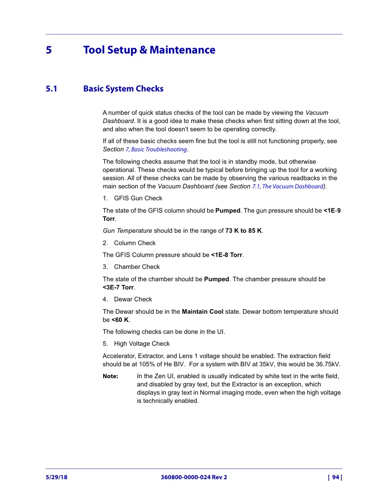

*Page 99 facsimile from `ZEISS_ORION_NanoFab_Operator_Manual_Rev2.pdf`.*

## Page 100

| 95 |
360800-0000-024 Rev 2
5/29/18
At this point, the lens 2 voltage is not important. It is possible that lens 2 is disabled 
from the previous load or unload sequence.
6.
Sample Load Status
Check the load status icon in the menu bar (see 4.3.2, Sample Load Status) to understand 
if a sample holder is already loaded on the stage. However, the reported status can be 
in error if the proper sequence to load or unload was not performed correctly by the 
last user. If there is a sample holder loaded on the stage, it can be seen in the chamber 
scope window (Figure 114).
Figure 114. Sample Holder in Chamber Scope
5.2
Basic Source Maintenance
Note:
The daily use of the system may often NOT require any GFIS source 
maintenance. You may cycle between Standby and Power up several 
times before any GFIS source maintenance is required.
Before starting any of the source maintenance procedures, it is best to position a 
conductive featureless sample under the beam.
“Source Maintenance” refers to a number of actions that are taken to obtain and align 
a trimer. There are a number of wizards that assist you in performing these actions. 
They are located under GFIS Source Maintenance, which is found from the main 
menu at the top of the UI (). To get to these wizards select Maintenance > GFIS 
Column > GFIS Source Maintenance.

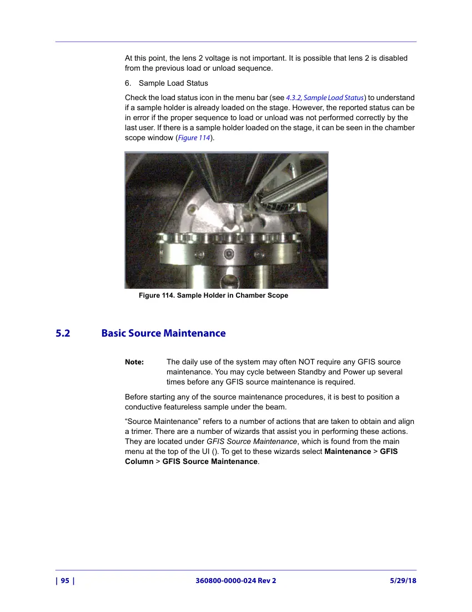

*Page 100 facsimile from `ZEISS_ORION_NanoFab_Operator_Manual_Rev2.pdf`.*

## Page 101

5/29/18
360800-0000-024 Rev 2
| 96 |
. Zen Main Menu
The GFIS Source Maintenance Wizard appears in the UI. On the left side of the UI 
there is a menu of selectable actions (Figure 115). In the center of the UI is a brief 
description of each action (Figure 116).
Each of the selectable actions are described in the sub-sections below.
Figure 115. GFIS Source Maintenance Wizard

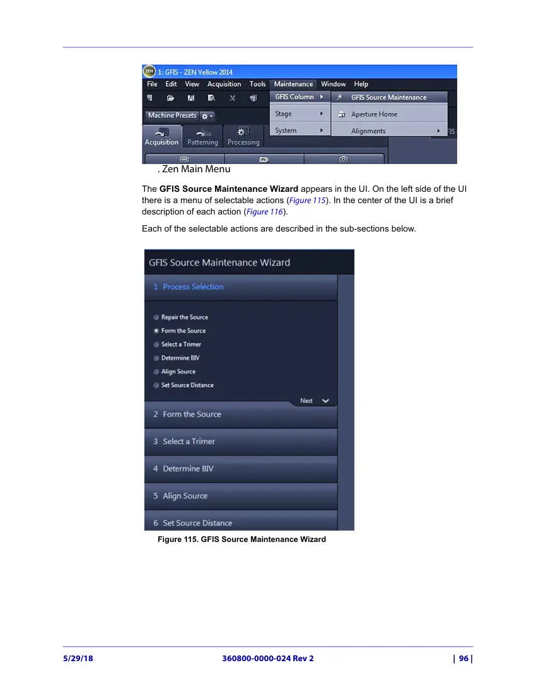

*Page 101 facsimile from `ZEISS_ORION_NanoFab_Operator_Manual_Rev2.pdf`.*

## Page 102

| 97 |
360800-0000-024 Rev 2
5/29/18
Figure 116. Source Maintenance Actions
5.2.1
Process Selection
When the GFIS Source Maintenance Wizard is opened, the section for Process 
Selection is opened with the radio button for Form the Source selected by default.
The actions listed here are presented in the order in which they should be performed. 
Any of the actions listed can be selected and the group of actions shown after Process 
Selection update to reflect the newly selected option. For example, in Figure 117, Select 
a Trimer is selected in the Process Selection section, and the group of actions below 
has been adjusted to start at Select a Trimer.
Once a selection has been made in the Process Selection section, click on Next.

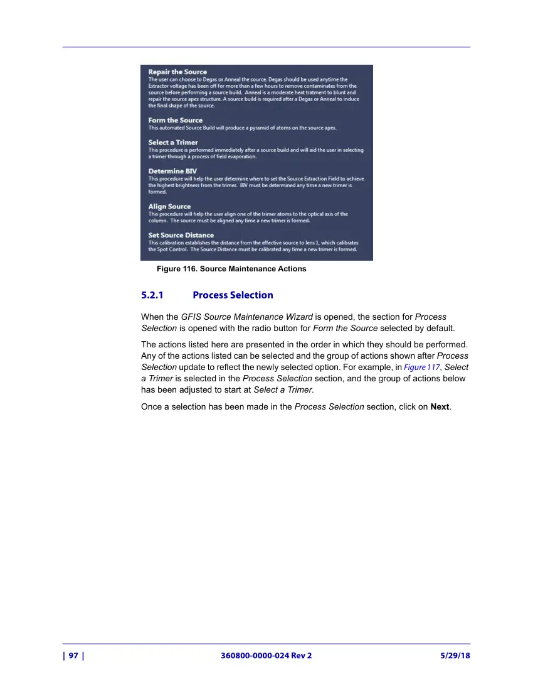

*Page 102 facsimile from `ZEISS_ORION_NanoFab_Operator_Manual_Rev2.pdf`.*

## Page 103

5/29/18
360800-0000-024 Rev 2
| 98 |
Figure 117. Select a Trimer Selected
5.2.2
Repair the Source
The actions under the Repair the Source selection are not part of basic source 
maintenance and are not covered in this manual. Consult with your tool owner for 
further information and help.
5.2.3
Form the Source
The process of forming a source (also called building a source) is the process that 
restructures a completed pyramid build on the end of the source tip. When this 
process is opened, the UI looks like Figure 118.

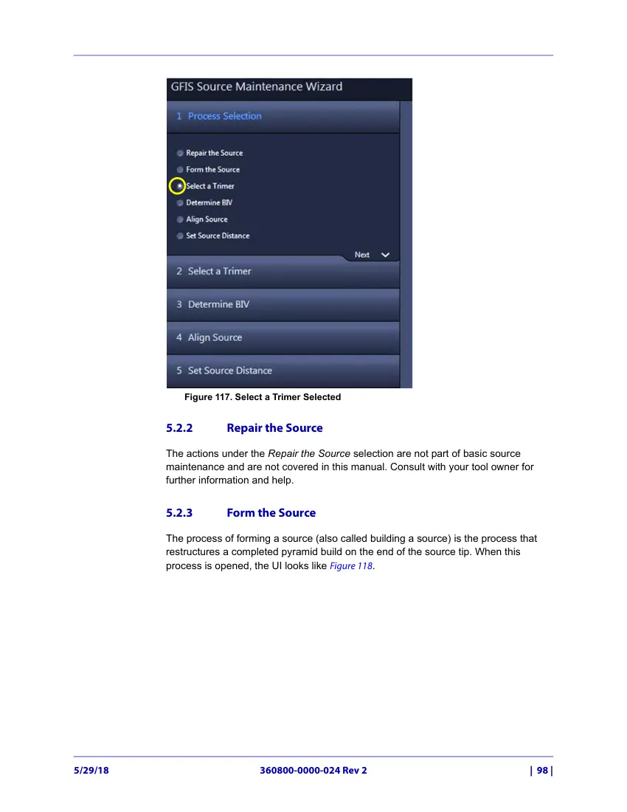

*Page 103 facsimile from `ZEISS_ORION_NanoFab_Operator_Manual_Rev2.pdf`.*

## Page 104

| 99 |
360800-0000-024 Rev 2
5/29/18
Figure 118. Source View Camera
The text displayed at the top of this window, State: Form Completed, and 
SUCCEEDED, are left over from the last successful forming. 
There are a couple of selections that can be made in the Form the Source section. The 
default selections of Maintain BIV Source Build and Keep most recent field should not 
be changed. The other options are not covered in this manual. Consult with your Tool 
Owner for further explanation.
Click on the Begin button to start the forming process. 
Note:
Raising the field can shorten the life of the source. Do not raise the 
field without the guidance of the tool owner.

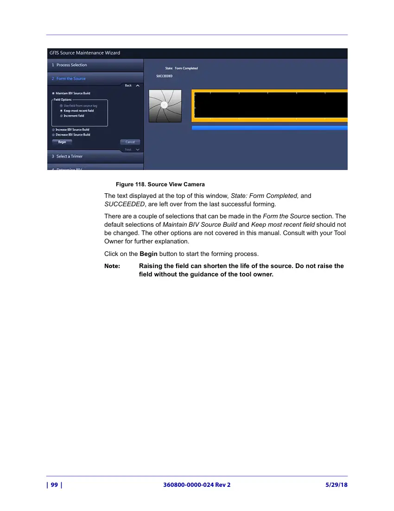

*Page 104 facsimile from `ZEISS_ORION_NanoFab_Operator_Manual_Rev2.pdf`.*

## Page 105

5/29/18
360800-0000-024 Rev 2
| 100 |
Figure 119. Form the Source Options
The process begins by turning off the gas to the gun if it is not already off, which could 
take up to 5 minutes to evacuate the gas. Once the gas is off the process ramps down 
the accelerator, extractor, L1 and L2 voltages. The display in the middle of Figure 120 is 
a graph where the horizontal (X) axis is time. The red background, seen in the left part 
of the graph indicates that the accelerator and extractor voltages are still enabled.
Figure 120. Accelerator and Extractor Voltages Ramping Down
After the applicable voltages are ramped down, the process begins heating the 
source. There are two indicators that the heating has begun. One is a yellow bar that 
appears at the bottom of the graph, as seen in Figure 121. The second is that the

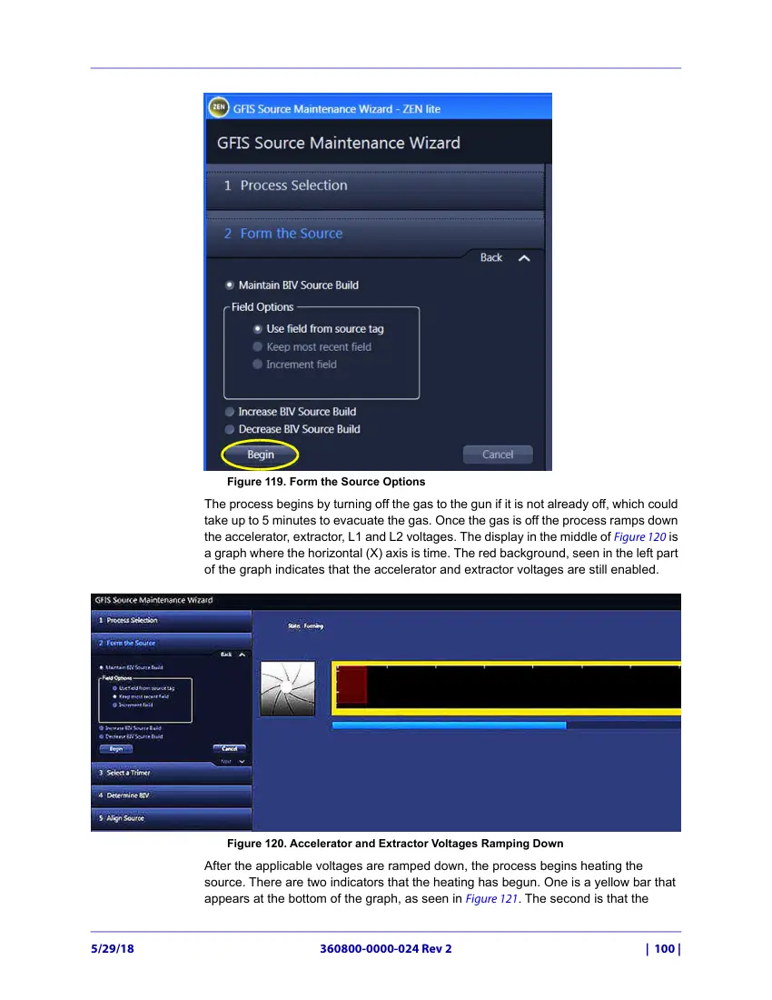

*Page 105 facsimile from `ZEISS_ORION_NanoFab_Operator_Manual_Rev2.pdf`.*

## Page 106

| 101 |
360800-0000-024 Rev 2
5/29/18
square box to the left of the graph changes from an image of a closed shutter (Figure 
120) to a black box, showing that the source view camera is enabled (Figure 121).
Figure 121. Source Heating Begun
Within a minute or so, an image of the source appears in the box to the left of the 
graph, as can be seen in Figure 122. This is an image from the infrared source view 
camera. The brightness of this image indicates the temperature of the source.
Figure 122. Temperature of Source Graph Starting
A close-up of this image is shown in Figure 123. The yellow cross shows the point 
where the temperature is measured. A purple line segment also appears in the graph 
at the same time (see circled area in Figure 122). The vertical (Y) axis in this graph is 
the temperature of the source, although no Y-axis values are displayed as the 
temperatures used during the source build is proprietary information.

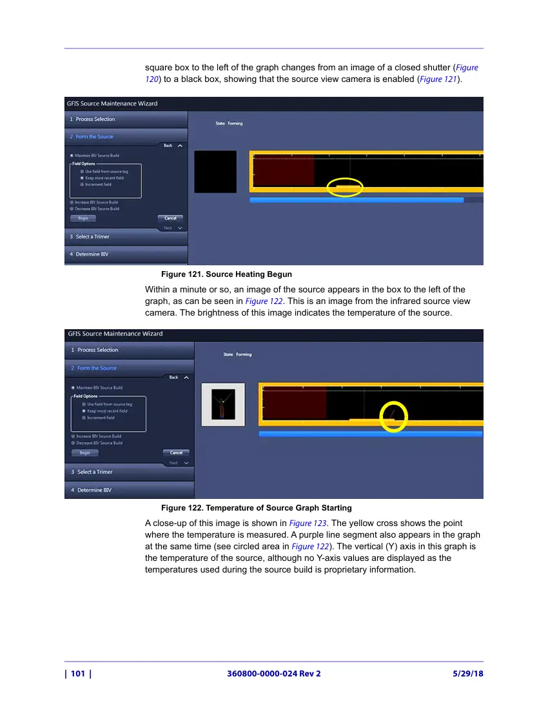

*Page 106 facsimile from `ZEISS_ORION_NanoFab_Operator_Manual_Rev2.pdf`.*

## Page 107

5/29/18
360800-0000-024 Rev 2
| 102 |
Figure 123. Camera Image of Source
The horizontal line near the top of the graph (see Figure 124) is the target temperature 
to which the source is regulated. Shortly after reaching this temperature, a field 
(voltage potential between accelerator and extractor) is applied to the tip. The 
background in the graph becomes red again to indicate the presence of the field 
voltage.
Figure 124. Form the Source Display
After a little time, the source is set to a lower temperature and regulated there (Figure 
125). The image from the source view camera becomes noticeably less bright. Also, 
the time scale of the graph is occasionally adjusted based on how long the process 
has been running. Notice the difference in the time scale between Figure 124 and Figure 
125.
Source View Camera
Source Heating Indicator
Source Temperature
Target Temperature

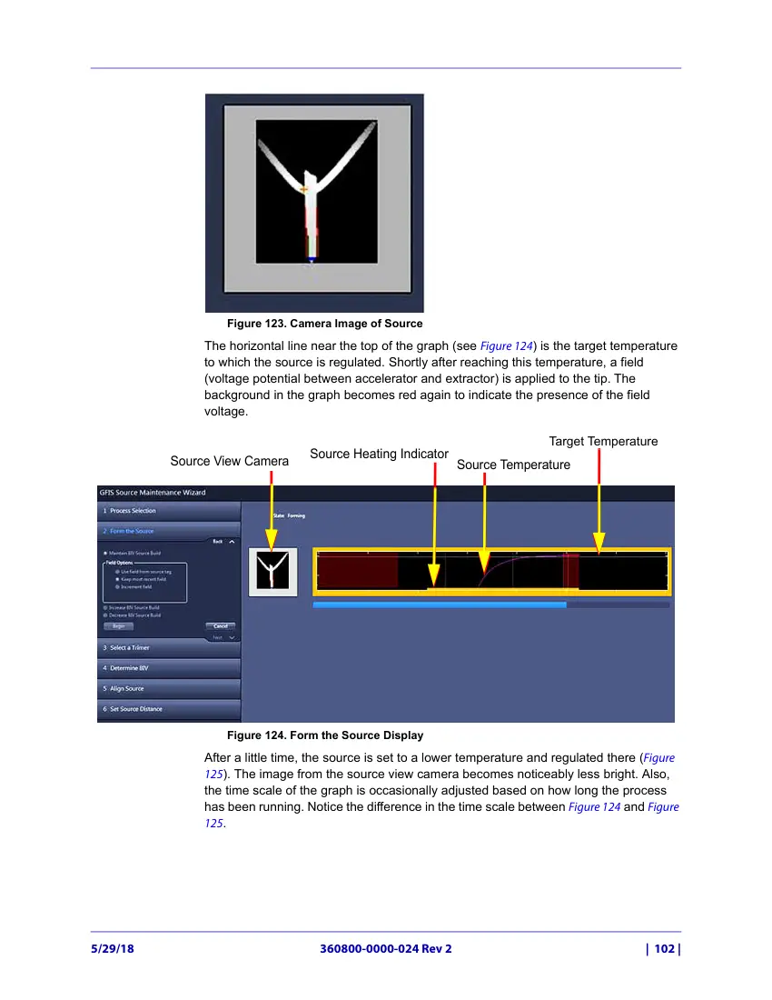

*Page 107 facsimile from `ZEISS_ORION_NanoFab_Operator_Manual_Rev2.pdf`.*

## Page 108

| 103 |
360800-0000-024 Rev 2
5/29/18
Figure 125. Temperature Regulated Lower
The source is maintained at this new temperature for a few minutes and then the 
heating is stopped. That point can be seen in Figure 126 where the purple line in the 
graph drops to the bottom of the graph (indicated by the red circle) and the window 
that displayed the source becomes black.
Figure 126. Source Temperature Stopped
Just before the process ends, the source view camera shuts off, which is indicated by 
the closed shutter in the source display (Figure 127).

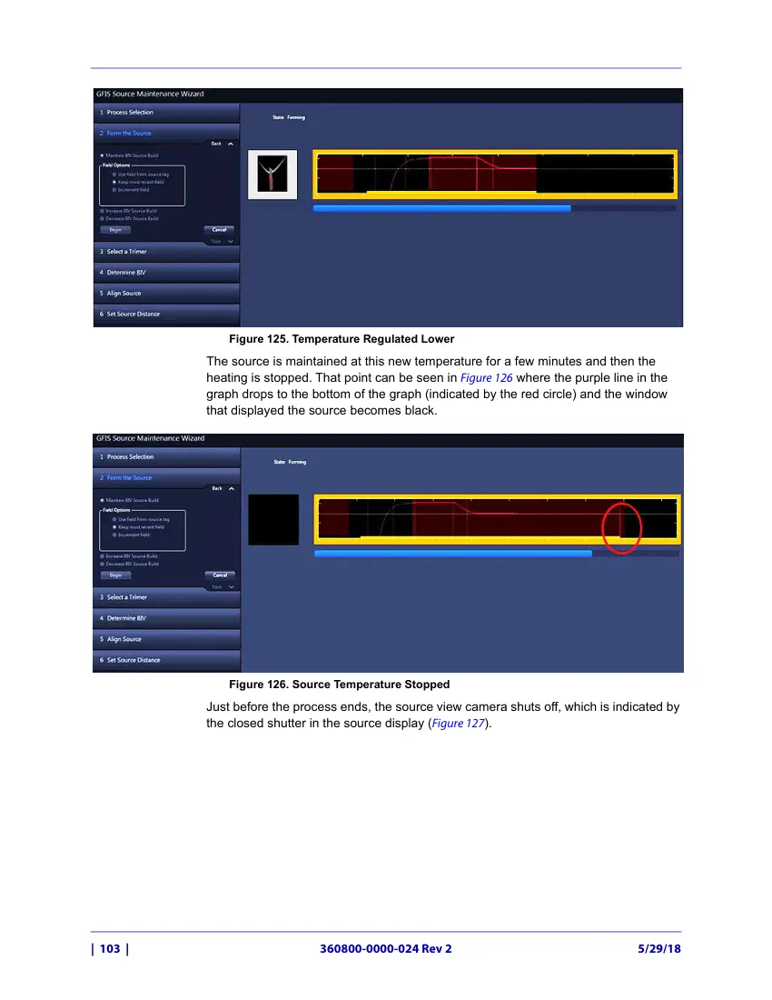

*Page 108 facsimile from `ZEISS_ORION_NanoFab_Operator_Manual_Rev2.pdf`.*

## Page 109

5/29/18
360800-0000-024 Rev 2
| 104 |
Figure 127. Camera Display Shuttered
As a last step, the accelerator voltage is ramped up to 9500 V and the extractor is 
ramped up to -10,000 V. There is no readback for these voltages on this screen but 
when the process is complete the text at the top of the display states State Form 
Completed and SUCCEEDED (Figure 128). The Begin button is also enabled again.
Figure 128. State Form Completed
The Form the Source process is complete. Click on the next button to move to the 
Select a Trimer process.

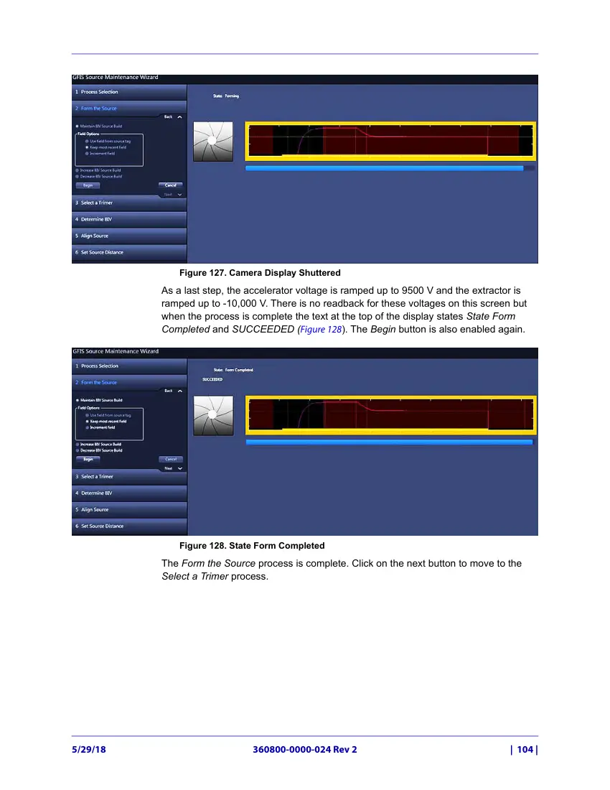

*Page 109 facsimile from `ZEISS_ORION_NanoFab_Operator_Manual_Rev2.pdf`.*

## Page 110

| 105 |
360800-0000-024 Rev 2
5/29/18
5.2.4
Select a Trimer
There are two situations in which this process is used. One is when the Form the 
Source process has just been completed. The other is when you just want to select a 
new trimer form the existing build (pyramid). As described below, some steps are 
skipped, depending on which situation applies.
Note:
For more information on a trimer, see 11.1, The Trimer.
Figure 129. GFIS Source Maintenance Wizard
The Select a Trimer tool panel opens with every function in this panel disabled except 
the check box for Ensure column is over sample. During the Select a Trimer routine, a 
beam is generated from the source. In order to see the source in SFIM mode it is 
necessary for the beam to strike a sample (conductive and preferably featureless) and 
generate secondary electrons that can be collected by the ET detector. 
Note:
“Featureless” refers to an area that does not have a pattern such as a 
grid. Bare metal, such as that on the sample holder, works best (see Figure 
130). A bare SEM stub works as well.

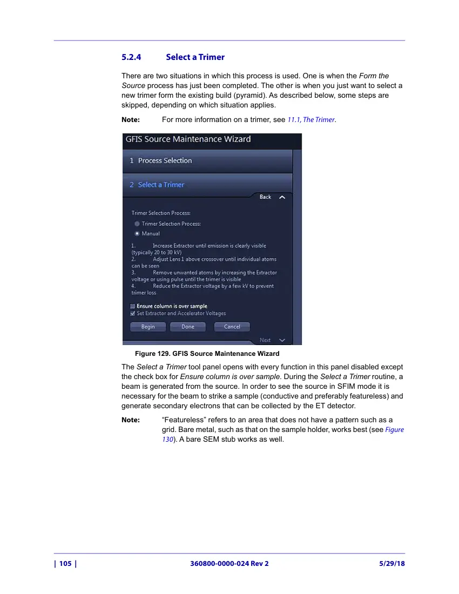

*Page 110 facsimile from `ZEISS_ORION_NanoFab_Operator_Manual_Rev2.pdf`.*

## Page 111

5/29/18
360800-0000-024 Rev 2
| 106 |
Figure 130. Sample Holder Featureless Areas
If you are not sure that there is an appropriate sample under the beam, cancel out of 
the GFIS Source Maintenance Wizard using the Cancel button at the bottom of the UI 
(Figure 131) and position a sample under the beam.
Figure 131. Cancel Button
1.
Once there is a sample under the beam, check the check box to the left of Ensure 
column is over sample. 
The Set Extractor and Accelerator Voltages check box and Begin button are enabled.
Figure 132. Buttons Enabled
2.
Along the bottom of the UI are a section of tool panels. Click the arrow to the left of 
Accelerator in the tool panel in the middle labeled Select Trimer Step Controls to 
open the Accelerator tool panel if it is not already open by default.
Figure 133. Accelerator Tool Panel

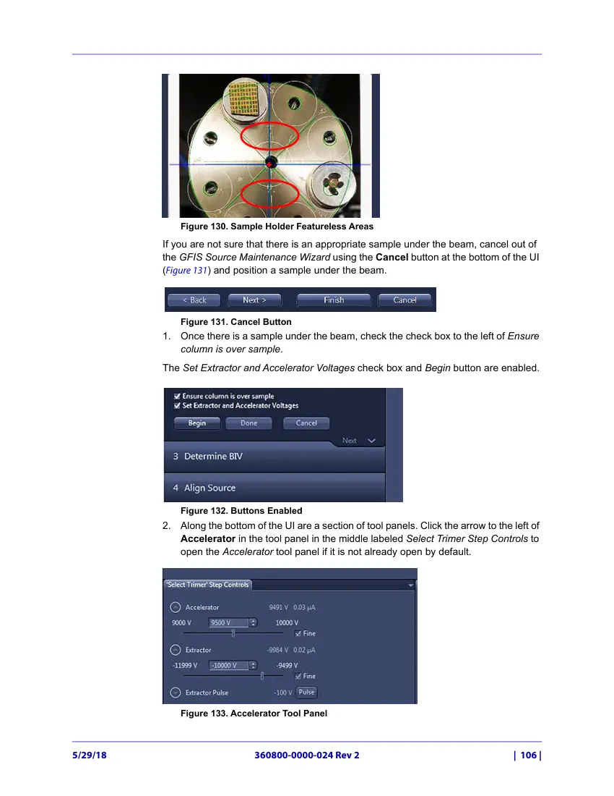

*Page 111 facsimile from `ZEISS_ORION_NanoFab_Operator_Manual_Rev2.pdf`.*

## Page 112

| 107 |
360800-0000-024 Rev 2
5/29/18
3.
Open the Extractor tool panel the same way if it is not open by default.
Note:
Extractor is somewhat of a misnomer in this and other tool panels in the 
Zen UI. It actually refers to the extraction field, which is the potential 
difference that is created by a positive accelerator voltage applied to the 
source and a negative extractor voltage applied to the extractor electrode. 
The values displayed in the Extractor fields in the UI are in actuality 
extraction field values.
4.
If the Form the Source process was executed just before starting the Select a Tri-
mer process, you will want the accelerator and extractor voltages to start below 
the values required for ionization. This allows you to determine the extraction field 
for first light. In this case, leave the Set Extractor and Accelerator Voltages 
check box checked and click on the Begin button. The software automatically 
ramps the accelerator voltage up to 17,500 volts and the extractor field up to -
20,000 V (see Figure 134). Skip step 5 and proceed to step 6. 
5.
If the Select a Trimer routine was started with the intent of just peeling away atoms 
down to the next shelf of the existing pyramid, without rebuilding the pyramid 
(forming a source), you will want the accelerator and extractor voltages to remain 
at their current values. In this case, uncheck the Set Extractor and Accelerator 
Voltages check box, click the Begin button, and then skip to step 19.
Figure 134. Begin Button Checked
6.
When the begin button is clicked, an image window opens in the UI and scanning 
is enabled. Increase the contrast of the image until noise (white speckles) can be 
seen in the image (Figure 135).
Figure 135. Noise

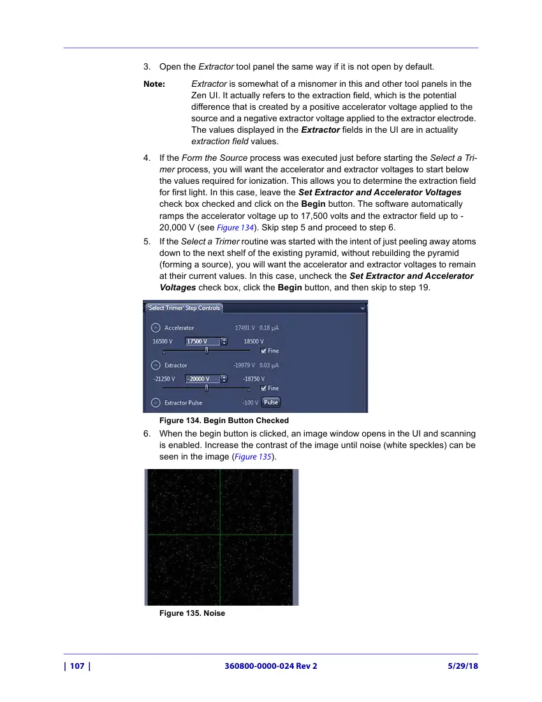

*Page 112 facsimile from `ZEISS_ORION_NanoFab_Operator_Manual_Rev2.pdf`.*

## Page 113

5/29/18
360800-0000-024 Rev 2
| 108 |
7.
Click the SFIM Controls tab in the lower left of the UI to open the SFIM Controls 
tool panel (Figure 136). 
8.
Turn the Magnification knob on the knob panel counter-clockwise until 1.00 dis-
plays for GFIS SFIM Fov (Field Of View) in the SFIM Controls tool panel.
Figure 136. SFIM Controls Tool Panel
9.
While performing the following procedure, occasionally give the Magnification 
knob a spin in the counter-clockwise direction to make sure the FOV is always at 
the maximum.
10. In the Select Trimer Step Controls tool panel, set the accelerator to 20 kV and in 
the SFIM Controls tool panel, set lens 1 to 16 kV. 
Note:
As a rule of thumb when in SFIM mode, setting lens 1 to 80 percent of the 
acceleration voltage roughly focuses the beam on the blanking aperture. 
Figure 137. Select Trimer Step Controls Tool Panel
11. Using the slider for the extractor, slowly increase (more negative) the extraction 
field by moving the slider to the left until some signal is seen near the center of the 
image window. At first, this signal may be unstable, in that it appears and disap-
pears. Continue slowly increasing the extractor voltage until this signal stays there 
for more than a few seconds (Figure 138). 
Figure 138. First Light

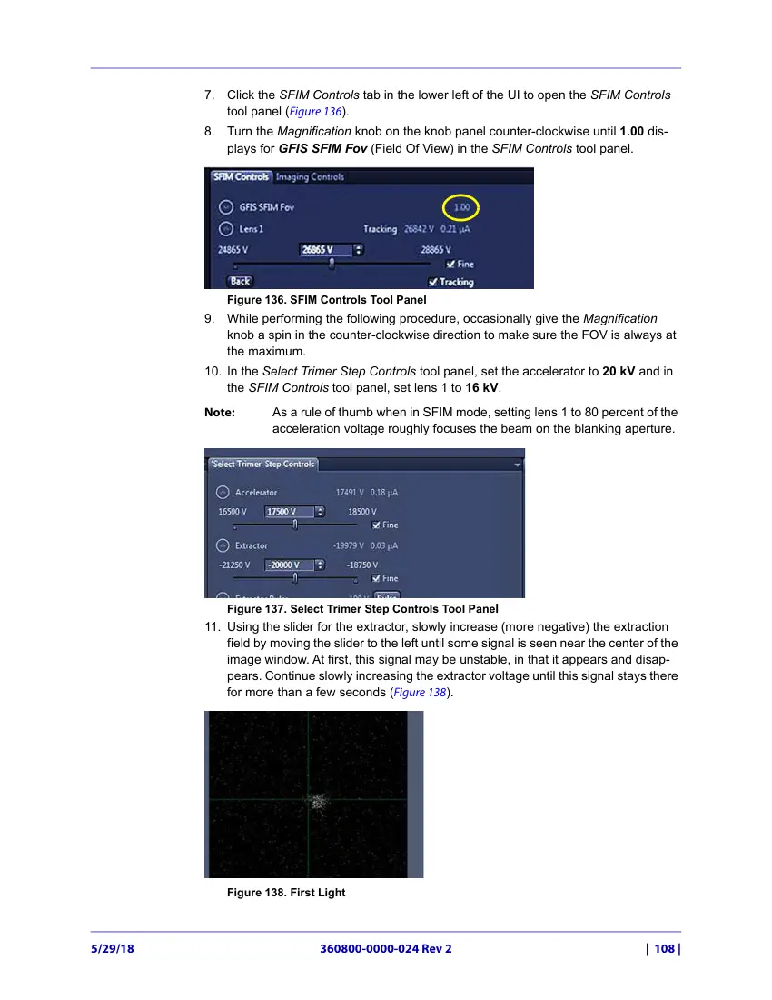

*Page 113 facsimile from `ZEISS_ORION_NanoFab_Operator_Manual_Rev2.pdf`.*

## Page 114

| 109 |
360800-0000-024 Rev 2
5/29/18
12. Make a note of the value of the extraction field at this point, which is referred to as 
“first light”. (For more on “first light”, see 10.4, Best Imaging Voltage (BIV).) It will typi-
cally be within the range of -20 to -25 kV. If first light is outside of this range, 
advanced source maintenance may be required, which is beyond the scope of this 
manual.
13. Continue increasing the extraction field (more negative) up to about -26,000 kV.
14. Using the control for the accelerator in the Select Trimer Step Controls tool panel, 
set the accelerator to 25 kV. Then using the lens 1 control in the SFIM Controls 
tool panel, set lens 1 to 20 kV. At this point, all of the signal is concentrated into 
the dot in Figure 139.
Figure 139. Blanking Aperture in SFIM View
15. Slowly increase the lens 1 voltage to spread out the signal until it looks something 
like that in Figure 140. This allows you to see emission off of individual atoms of the 
source.
Figure 140. Source Atoms Emission
16. Continue to slowly increase the extraction field, remembering to occasionally spin 
the Magnification knob in the counter-clockwise direction. Also, use the lens 1 
control to effectively zoom in and out in the image. As the extraction field is 
increased the image becomes brighter.
17. Adjust the contrast as required to keep the image out of saturation. As the 
extraction voltage is increased, atoms are peeled away, leaving an organized 
structure that looks like the following figure.

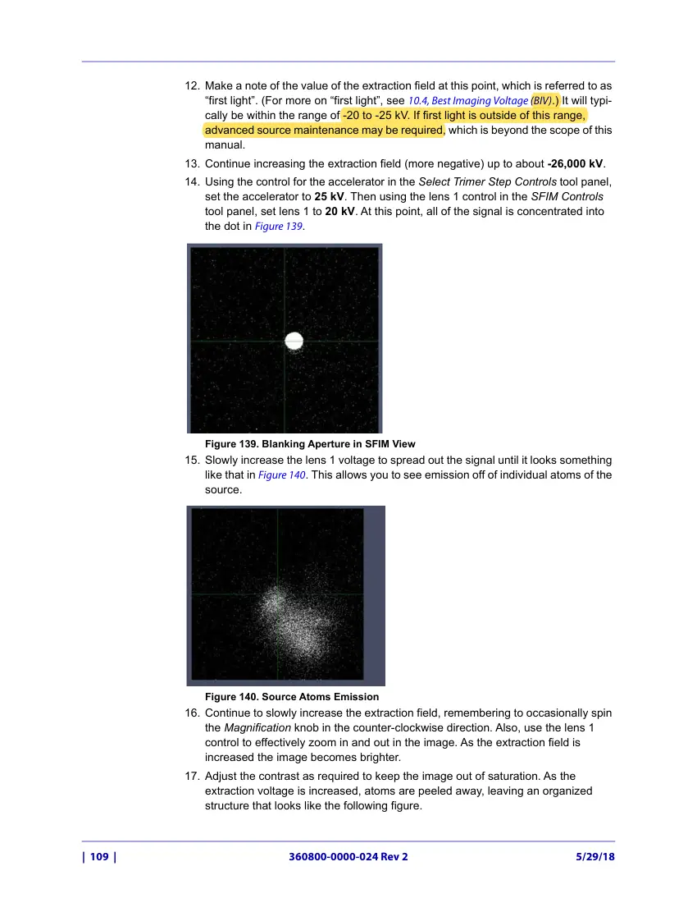

*Page 114 facsimile from `ZEISS_ORION_NanoFab_Operator_Manual_Rev2.pdf`.*

## Page 115

5/29/18
360800-0000-024 Rev 2
| 110 |
Figure 141. Organized Structure
18. Reduce the lens 1 voltage to see a wider view of the source, revealing the three 
ridges of the pyramid structure, as seen in Figure 142. 
19. Then return lens 1 to a higher voltage, allowing a view of individual atoms (Figure 
141).
Figure 142. Three Ridges of Pyramid Structure
20. If the structure of the source is disorganized, as shown below, you must repeat the 
Form the Source process. Disorganization can happen if the source did not form 
correctly or if an arc was generated during the process of selecting a trimer.
Figure 143. No Organized Structure

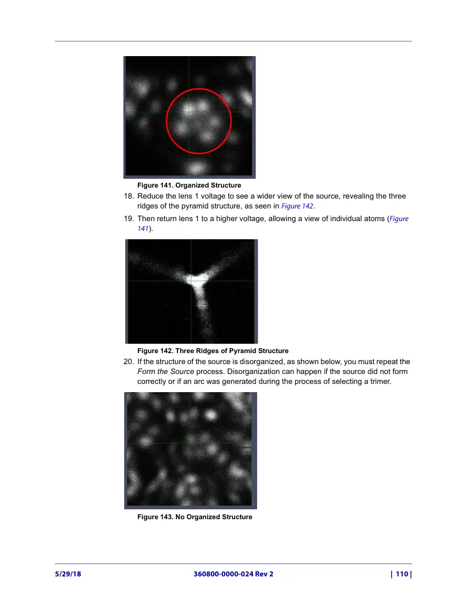

*Page 115 facsimile from `ZEISS_ORION_NanoFab_Operator_Manual_Rev2.pdf`.*

## Page 116

| 111 |
360800-0000-024 Rev 2
5/29/18
Continue to increase the extraction field, peeling away atoms, until a trimer is created, 
as shown next. This should happen with an extraction field somewhere around 20 kV 
higher than the first light voltage. 
Note:
If no trimer is attained by the time the extractor is above -45 kV, refer to 
Section 7.6.3, Checking for an Ion Beam.
Figure 144. Trimer Forming
21. As soon as a trimer is created, reduce the extraction voltage to about -35 kV. 
Figure 145. Trimer Formed
22. Click the Done button in the Select a Trimer tool panel and then click Next. This 
causes the Determine BIV wizard to open.
5.2.5
Determine BIV
1.
The next step in the GFIS Source Maintenance Wizard is to determine BIV (Best 
Imaging Voltage. For more information, see Section 10.3, Best Imaging Voltage 
(BIV)). If the Determine BIV process is entered directly from the Select a Trimer 
process, the Ensure column is over sample check box is already checked. If it 
isn’t, check it and then click the Begin button.

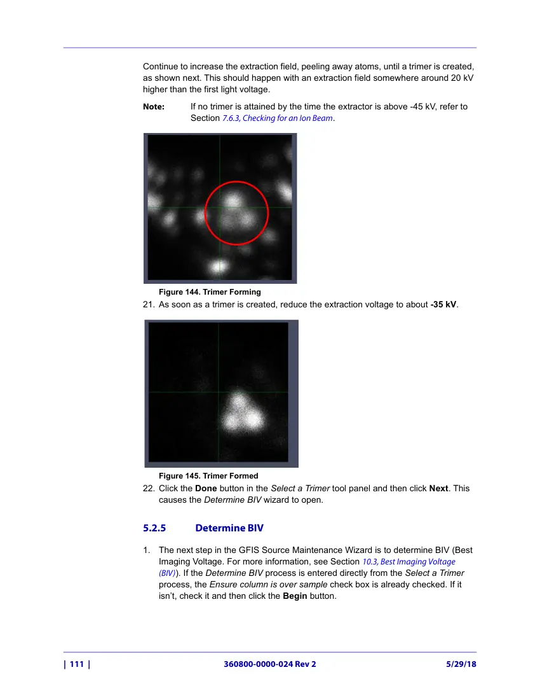

*Page 116 facsimile from `ZEISS_ORION_NanoFab_Operator_Manual_Rev2.pdf`.*

## Page 117

5/29/18
360800-0000-024 Rev 2
| 112 |
Figure 146. Determine BIV
2.
At this point there should be a live image of the trimer in the image window. Just 
above the controls section at the bottom right in the UI is a small check box 
labeled Show All. Click this check box to activate it as shown in Figure 147. 
3.
Select the Graphics tab and then click the circle symbol in the Graphics tool panel.
Figure 147. Select Show All
4.
Draw a circle around the trimer, as shown in Figure 148. 
5.
Adjust the contrast so no part of the trimer image is saturated.

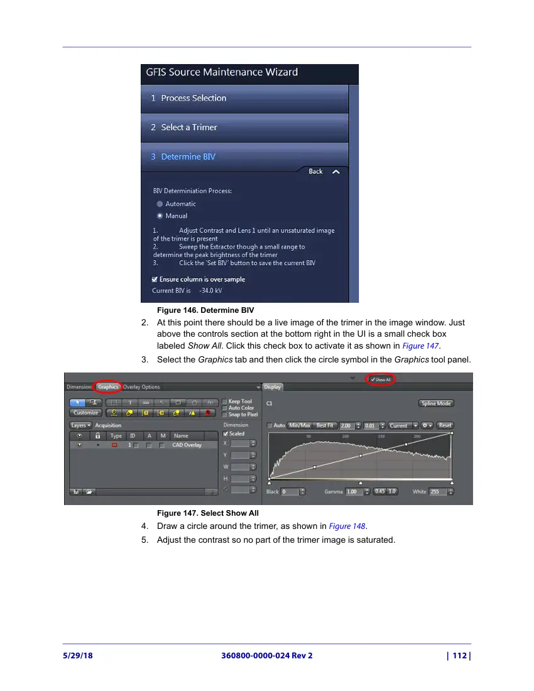

*Page 117 facsimile from `ZEISS_ORION_NanoFab_Operator_Manual_Rev2.pdf`.*

## Page 118

| 113 |
360800-0000-024 Rev 2
5/29/18
Figure 148. Circle Around Trimer
6.
In the Graphics tab, check the box under the M, as shown in Figure 149.
Figure 149. Select M
7.
Annotation appears in the image, giving the area and the intensity mean value 
(see Figure 150). You are only interested in the intensity mean value at this point. 
Slowly adjust the extraction field, up and down, until the maximum mean value is 
determined. There will be some fluctuation in this reading so it is difficult to find 
the precise point where the intensity value is at its maximum, but get as close as 
you can. The extraction field at which the trimer is the brightest is referred to as 
the best imaging voltage, or BIV. As a rule of thumb, this value is approximately 10 
kV, above the value for first light.

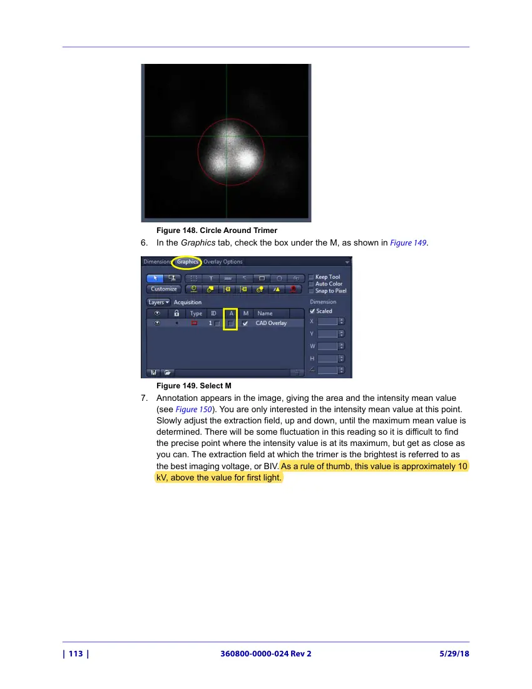

*Page 118 facsimile from `ZEISS_ORION_NanoFab_Operator_Manual_Rev2.pdf`.*

## Page 119

5/29/18
360800-0000-024 Rev 2
| 114 |
Figure 150. Intensity Mean Value
8.
In the example above, BIV was found to be -35343 volts (Figure 151). 
Figure 151. BIV Extractor Voltage
9.
Round this number to the nearest 500 volts. Therefore, for example, in this case, 
enter -35500 in the extractor text box, as shown in Figure 152.
Figure 152. Enter Rounded Extractor Voltage
Click on the Set BIV button to save this value, which is saved by the software as the 
current BIV value in the GFIS Source Maintenance Wizard, as shown in Figure 153.

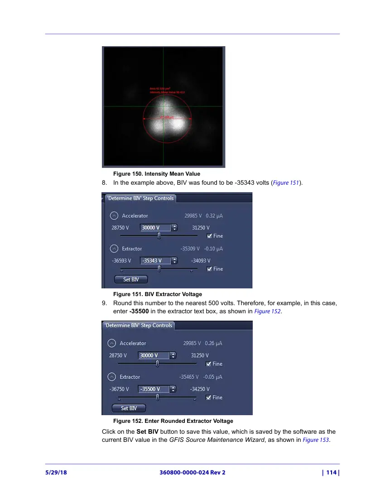

*Page 119 facsimile from `ZEISS_ORION_NanoFab_Operator_Manual_Rev2.pdf`.*

## Page 120

| 115 |
360800-0000-024 Rev 2
5/29/18
Figure 153. BIV Saved
10. Click on the Done button to end this process.
11. Click on Next to go the Align Source process.

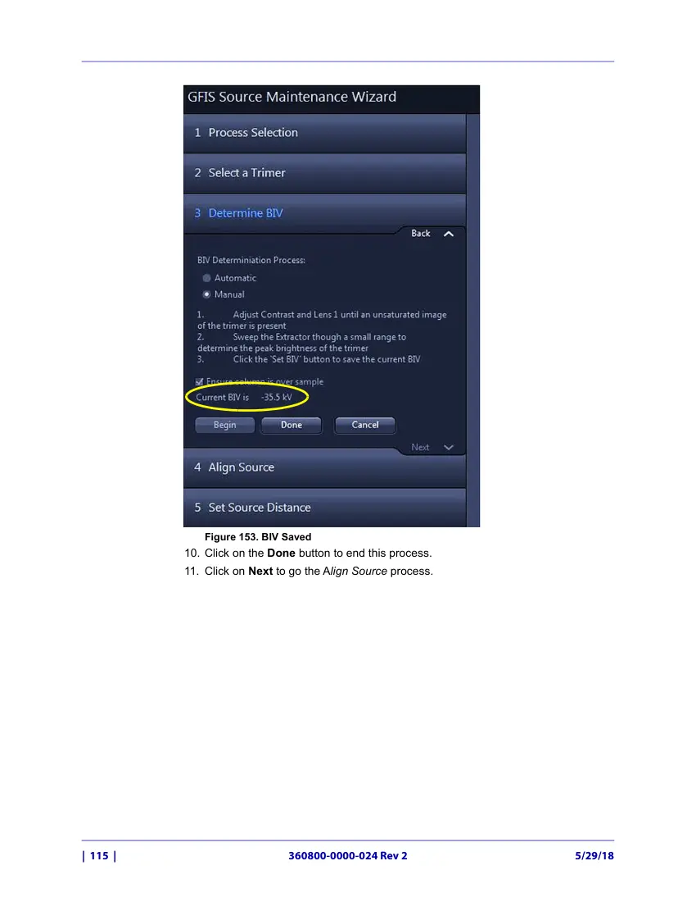

*Page 120 facsimile from `ZEISS_ORION_NanoFab_Operator_Manual_Rev2.pdf`.*

## Page 121

5/29/18
360800-0000-024 Rev 2
| 116 |
5.2.6
Align Source
Note:
Throughout this procedure, the terms “above crossover” and “below 
crossover” are used. See 11.13, Crossover for an explanation of these 
terms.
Use the Align Source 
process to position the 
selected atom of a 
trimer so the emission 
from that atom is 
centered down the 
column.
1.If the Align Source 
process was entered 
directly from the Deter-
mine BIV process the 
Ensure column is over 
sample check box is 
checked. If it is not, 
check it and then click 
Begin (Figure 154).
Figure 154. Align Source Panel

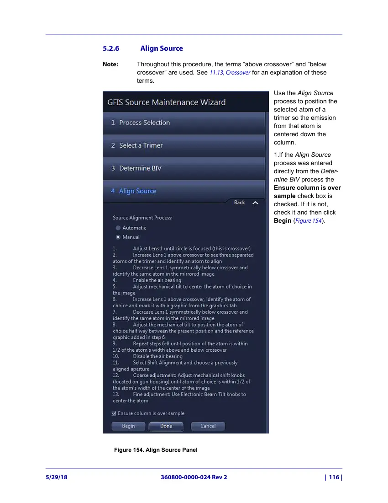

*Page 121 facsimile from `ZEISS_ORION_NanoFab_Operator_Manual_Rev2.pdf`.*

## Page 122

| 117 |
360800-0000-024 Rev 2
5/29/18
Mechanical Tilt Alignment
1.
Adjust lens 1 until the image forms a circle - referred to as “at crossover”.
Figure 155. Beam At Crossover
2.
Increase lens 1 above crossover to see three separate atoms of the trimer as 
shown in Figure 156 and select the atom that appears to be brightest to align. Any 
atom can be used, although if one is clearly brighter it is recommended you use 
that one, but once selected you must keep track of that atom. 
3.
Make a note of the lens 1 voltage value displayed in the SFIM Controls tool panel.
Note:
Round this value to the nearest thousand if it is easier to remember.
Figure 156. Above Crossover Voltage
4.
Decrease lens 1 voltage below crossover until the trimer is about the same size as 
it was in step 2 and identify the same atom at the mirrored image. This value is 
referred to as “below crossover”.
Note:
As stated in section 11.13, Crossover, the image of the trimer above and 
below crossover are mirror images of each other on both axes.
5.
Make a note of the lens 1 voltage value displayed in the SFIM Controls tool panel.
Note:
Round this value to the nearest thousand if it is easier to remember.

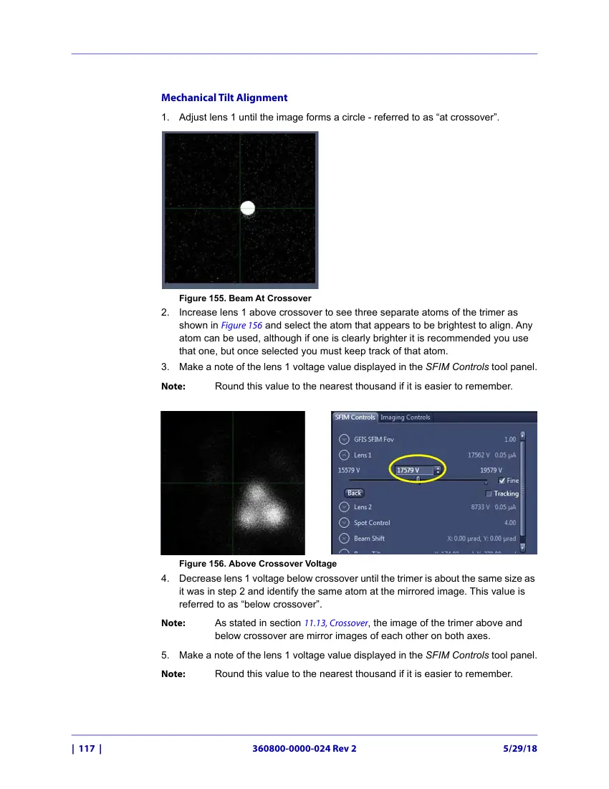

*Page 122 facsimile from `ZEISS_ORION_NanoFab_Operator_Manual_Rev2.pdf`.*

## Page 123

5/29/18
360800-0000-024 Rev 2
| 118 |
Figure 157. Below Crossover Voltage
6.
Enter one of the values noted above into the lens 1 voltage field in the SFIM Con-
trols panel, and without touching the slider, enter the second noted value into the 
field, overwriting the first value.
7.
Click Back just below the slider, which allows you to toggle between the two val-
ues just entered. Notice that when switching between the two lens 1 values, not 
only does the trimer change position but the images of the trimer becomes the 
mirror image of each other across both axes. For example, notice in Figure 156, the 
brightest atom in the trimer is in the lower right position of the trimer. In Figure 157, 
that same atom is in the upper left position.
Note:
Do not use the slider during the rest of this part of the alignment process 
as that will overwrite the values that are being used for the Back button. 
8.
The tilt alignment step in this process requires tilting the gun head. Before the gun 
head can be tilted, the gun head air bearing must be enabled. Click the Align 
Source Step Controls tab and check Enable air bearing as shown in Figure 158.
Figure 158. Align Source Step Controls

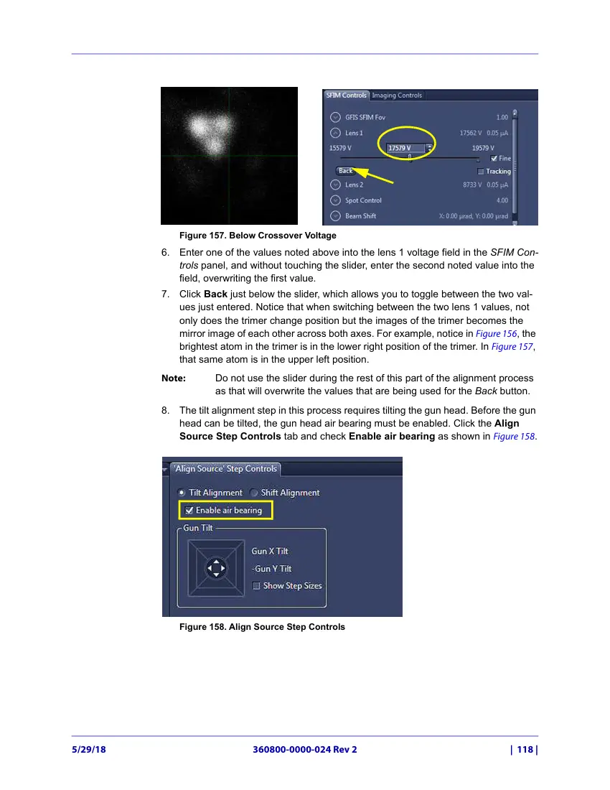

*Page 123 facsimile from `ZEISS_ORION_NanoFab_Operator_Manual_Rev2.pdf`.*

## Page 124

| 119 |
360800-0000-024 Rev 2
5/29/18
9.
Click Back to select the lens 1 voltage that is the higher of the two values (above 
crossover). 
10. Identify which atom to align. It is recommended, but not required, that you choose 
the brightest.
Note:
It is important to keep track of the atom when swapping between the two 
lens 1 values, keeping in mind the mirror image effect described above. 
11. Draw a circle around the atom identified to be aligned using Show All> Graphics 
and the circle symbol (Figure 159).
Figure 159. Identify Atom for Alignment
12. Click Back to set lens 1 to the below crossover voltage. The image will look simi-
lar to the left hand figure in Figure 160. 
13. Using the Gun Tilt tool in the Align Source Step Controls tool panel (Figure 158), 
move the gun tilt so the selected atom moves towards the circle used to mark the 
position of the atom in the image in Figure 159. Move the atom about half way 
towards the circle, Figure 160 (right), then go back and check the above crossover 
image.
Figure 160. Moving the Trimer

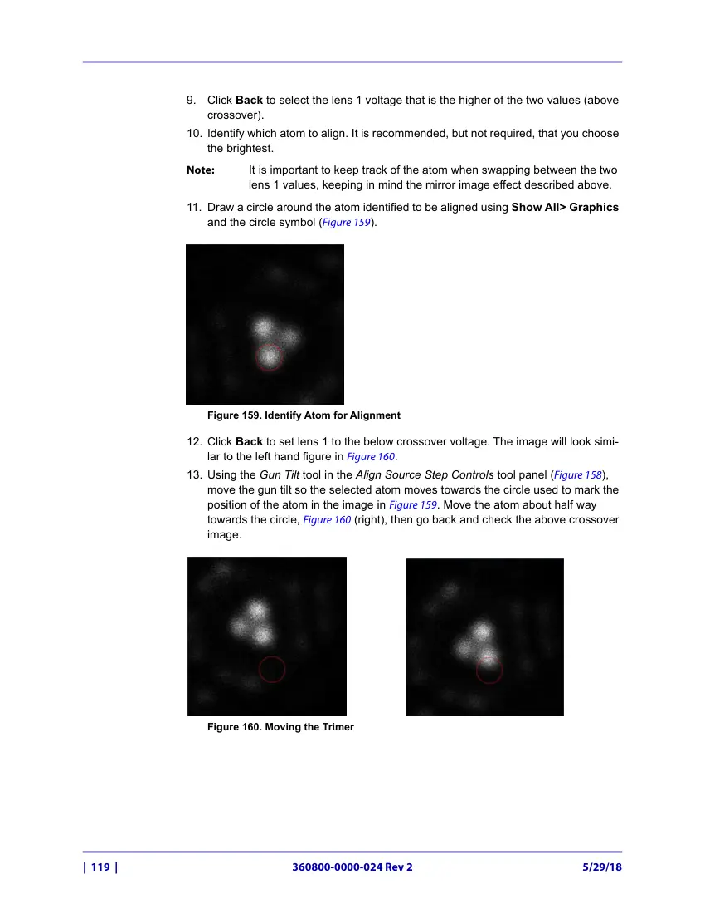

*Page 124 facsimile from `ZEISS_ORION_NanoFab_Operator_Manual_Rev2.pdf`.*

## Page 125

5/29/18
360800-0000-024 Rev 2
| 120 |
14. The position of the trimer in the crossover image in Figure 160 will have moved as 
shown in Figure 161.
Figure 161. Trimer Positioning
15. Reposition the circle so it is on the selected atom again.
16. Switch to the crossover view in Figure 162 and tilt the gun some more to move the 
atom towards the circle.
17. Repeat this process until the atom is centered in the circle in both crossover 
images Figure 161 and Figure 162. The position will not necessarily be in the center 
of the screen.
Figure 162. Trimer Aligned
18. In the Align Source Step Controls tool panel (Figure 172), uncheck Enable air 
bearing.

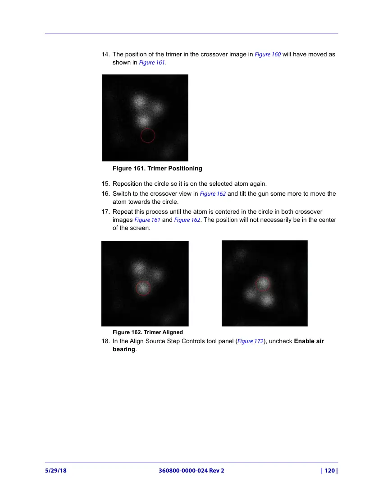

*Page 125 facsimile from `ZEISS_ORION_NanoFab_Operator_Manual_Rev2.pdf`.*

## Page 126

| 121 |
360800-0000-024 Rev 2
5/29/18
Mechanical (Course) Shift Alignment
1.
Click the Shift Alignment radio button.
Figure 163. Shift Alignment
2.
Click the down-arrow to the right of the Aperture field and select a previously 
aligned aperture. Increase the contrast and zoom in on the trimer using the SFIM 
FOV. The image should be similar to Figure 164 (left).
3.
Using the gun shift knobs outlined in green in Figure 163, position the selected 
atom at the center of the cross-hairs in the image Figure 164 (right). This is a very 
sensitive adjustment so it may be difficult to get the atom exactly centered. Having 
the atom touching the cross hairs is sufficient at this stage. A finer adjustment will 
be made later with the electronic beam tilt function.
Figure 164. Position the Trimer.
4.
Back off the knobs slightly so there is no tension.
5.2.7
Set Source Distance
Use the Set Source Distance process to calibrate the distance from the source to lens 
1. 
Note:
In order for the column optics software to correctly determine the working 
distance, it needs to know a number of important values.  Many of these

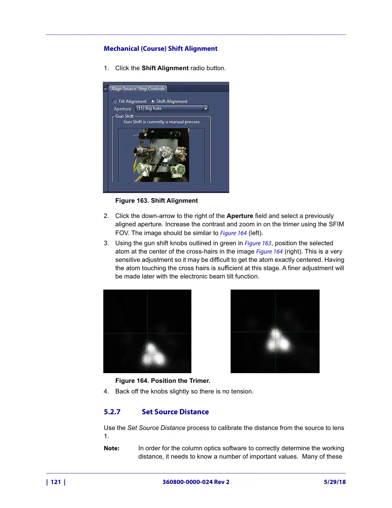

*Page 126 facsimile from `ZEISS_ORION_NanoFab_Operator_Manual_Rev2.pdf`.*

## Page 127

5/29/18
360800-0000-024 Rev 2
| 122 |
are the current operating voltages of the column (e.g., accelerating 
voltage), but one key piece of information is the distance from the source 
tip to lens 1.  Based on knowledge of this distance, the accelerating 
voltage and the lens 1 focus voltage, the software can calculate the 
position of the column crossover.  Using this crossover position, the 
accelerating voltage and the lens 2 focus voltage, the software can 
calculate the working distance. The basic algorithm is to use lens 1 to 
focus the beam at a known location in the column.  The value of the 
source distance (object for lens 1) will then be adjusted such that 
crossover position (image formed by lens 1) calculated by the optics is 
equal to the known location.
1.
If the Set Source Distance routine was entered directly from the Align Source rou-
tine, the Ensure column is over sample check box is already checked. If it is 
not, check it and click Begin.
Figure 165. Set Source Distance
2.
The software moves the aperture bar to big hole. The image, which will probably 
be a bit out of focus (Figure 166 left), shows the hole in the middle of the blanking 
aperture. 
3.
From the Set Source Distance Step Controls tab, open the Lens 1 and Source 
Distance controls as shown in Figure 166, right, by clicking the arrows to the left of 
Lens 1 and Source Distance.

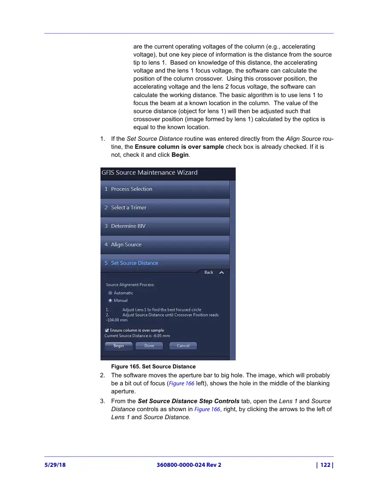

*Page 127 facsimile from `ZEISS_ORION_NanoFab_Operator_Manual_Rev2.pdf`.*

## Page 128

| 123 |
360800-0000-024 Rev 2
5/29/18
Figure 166. Set Source Distance Controls
4.
Adjust the lens 1 voltage to get the sharpest edge (Figure 167 on the left).
Use the slider control to sharpen the image at the edge of the circle. Any portion of 
the image inside the circle will likely be out of focus. Use the up- and down-arrows 
at the right of the voltage text field to fine tune the edge (Figure 167 on the right).
Figure 167. Adjust Lens 1 Voltage
5.
Use the small arrows to the right of the Source Distance text field to adjust the 
Crossover Position until it reads as close to -104.0 as possible.
Figure 168. Adjust Crossover Position
6.
Click Done and Finish.

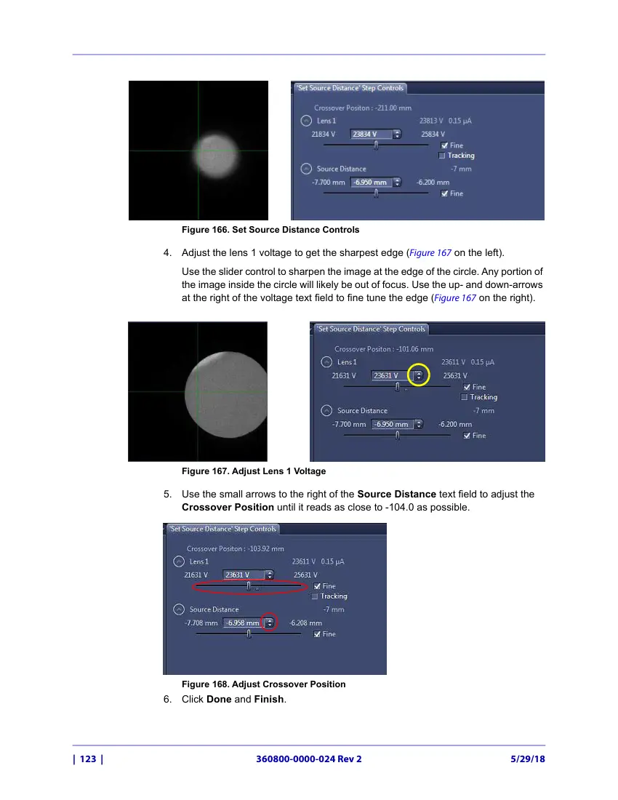

*Page 128 facsimile from `ZEISS_ORION_NanoFab_Operator_Manual_Rev2.pdf`.*

## Page 129

5/29/18
360800-0000-024 Rev 2
| 124 |
5.3
Aperture Selection and Alignment
5.3.1
Homing the Aperture Bar
Before an aperture can be selected, the aperture bar must be homed. The homed 
state of the aperture bar is displayed in the GFIS Column tool panel to the far right of 
Aperture. See yellow circle in Figure 169. If the state is Not Homed, the aperture must 
be homed before selecting it. If the state is shown as Homed, you can select it (see 
5.3.2, Selecting an Aperture).
Figure 169. Aperture Not Homed
1.
To home the aperture bar, select Aperture Home from the Maintenance > GFIS 
Column tool panel.
Figure 170.Start Home Routine
Click on Aperture Home in the Aperture tool panel to start the homing routine. After a 
short wait a popup appears stating that the apertures have been properly homed.
Figure 171. Message that Aperture is Homed
The state of the aperture bar that is displayed in the GFIS Column tool panel is now 
reported as Homed.

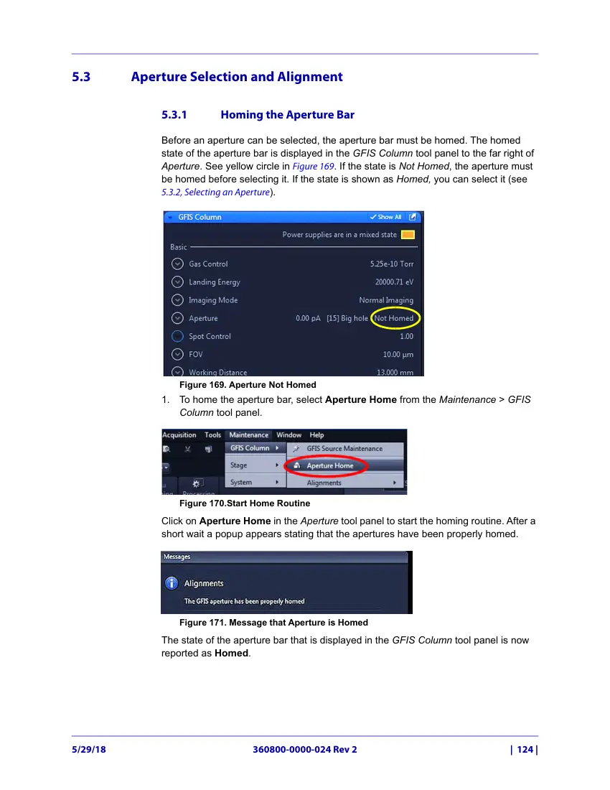

*Page 129 facsimile from `ZEISS_ORION_NanoFab_Operator_Manual_Rev2.pdf`.*

## Page 130

| 125 |
360800-0000-024 Rev 2
5/29/18
Figure 172. GIFS Column Tool Panel
5.3.2
Selecting an Aperture
To select an aperture, click the arrow in the GFIS Column tool panel to the left of 
Aperture to open the Aperture tool control and then use the arrow to the right of the 
aperture field to open the aperture drop-down list. Then click on an aperture to select 
it. The type and size of the selected aperture appears in the Aperture text field. At first 
it is grayed-out while the aperture moves into position. Once the aperture is in position 
the label is highlighted.
Figure 173. Aperture List
The apertures listed are those that are installed on your system. The list shown (Figure 
173) is for a GFIS column supplied with both helium and neon. The apertures listed as 
He apertures (2 -7) are made of thin gold foil. They are fragile and should be used only 
with the helium beam as they are easily damaged by the neon beam. The neon 
apertures (1 and 8-14) are much more robust and can be used with either neon or 
helium.

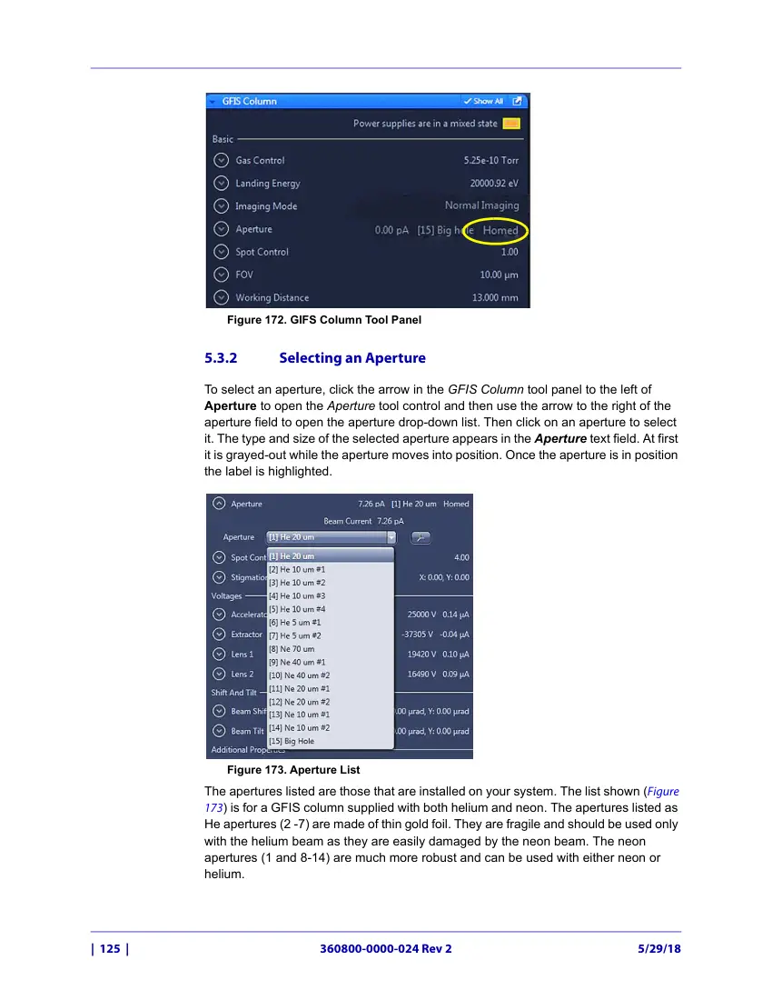

*Page 130 facsimile from `ZEISS_ORION_NanoFab_Operator_Manual_Rev2.pdf`.*

## Page 131

5/29/18
360800-0000-024 Rev 2
| 126 |
5.3.3
Electronic Tilt and Shift Alignment
This section describes electronic fine alignment of the beam (using the quadrupoles) 
to an aperture using the Tilt/Shift knobs on the knob panel. If earlier mechanical 
alignment is done well, only small adjustments of the Tilt/Shift knobs are required to 
fine-tune the alignment. This is referred to as electronic tilt and shift alignment. If a 
large adjustment in the electronic tilt or shift is needed, a mechanical adjustment of the 
aperture or the gun head may be required (Section 5.3.3, Electronic Tilt and Shift 
Alignment).
The X and Y Tilt/Shift knobs on the knob panel are used for this alignment and the 
Mode button is used to toggle between tilt alignment and shift alignment. The mode 
that is currently selected is displayed at the bottom right side of the UI (Figure 174).
Figure 174. Current Mode Indication
The tilt alignment is done in SFIM mode and the shift alignment is done in Normal 
Imaging mode. These two alignments, tilt and shift, have some interaction with each 
other, therefore the process involves going back and forth between the two.
Electronic Tilt Alignment
1.
For the tilt alignment, select SFIM mode. 
2.
Use the Mode button to select Gun Tilt mode.
3.
Use the X and Y tilt knobs to position the selected atom of the trimer in the center 
of the cross hairs in the UI image field.
Note:
Imaging should be no lower than 512 pixel resolution and no shorter than 
2 usec dwell time.
Electronic Shift Alignment
1.
For shift alignment, go to Normal Imaging mode and focus on a feature with 
sharp edges, preferably somewhat round in shape so there are sharp edges on 
both axes.
Tilt/Shift X
Tilt/Shift Y
Mode Toggle

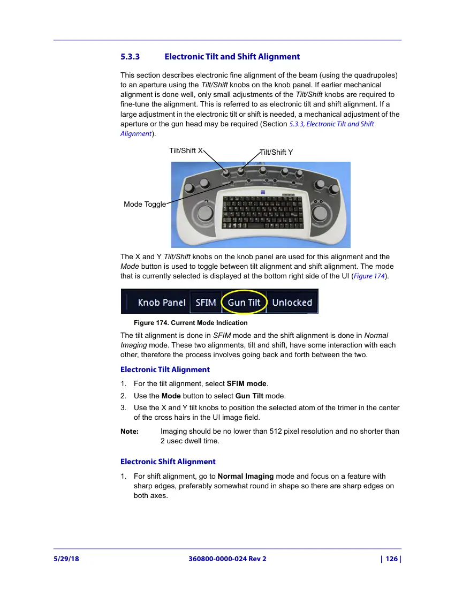

*Page 131 facsimile from `ZEISS_ORION_NanoFab_Operator_Manual_Rev2.pdf`.*

## Page 132

| 127 |
360800-0000-024 Rev 2
5/29/18
Figure 175. Image With Sharp Edges
2.
Enable lens 2 wobble by clicking on the Small button at the bottom of the lens 2 
tool panel (Figure 176). This sweeps the lens 2 voltage above and below the focus 
value. If the beam is not in the center of lens 2, sweeping of lens 2 voltage causes 
the image to wobble (back and forth movement of the feature) as it goes in and 
out of focus.
Figure 176. Lens Wobble Size
3.
Use the mode button to toggle to Gun Shift mode.
Note:
The mode you are currently in appears in the bottom right of the Zen UI.

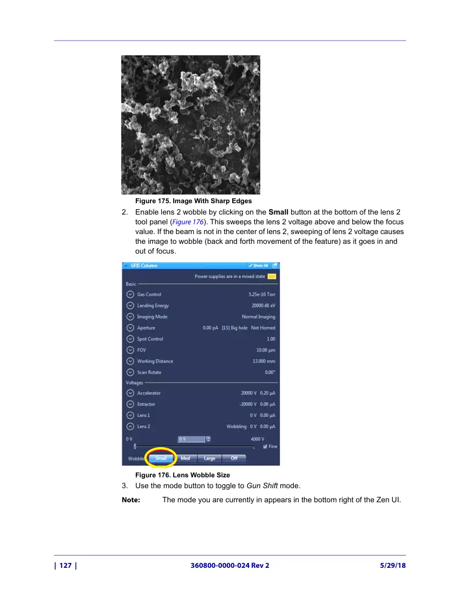

*Page 132 facsimile from `ZEISS_ORION_NanoFab_Operator_Manual_Rev2.pdf`.*

## Page 133

5/29/18
360800-0000-024 Rev 2
| 128 |
Figure 177. Gun Shift Mode
4.
Use the X and Y shift knobs to minimize the wobble.
Figure 178. Shift & Tilt Section - GFIS Column Tool Panel
In a well-aligned system all four of these values (X shift, Y shift, X tilt, Y tilt) are within 
the range of ±200 µrad. If any of these values are outside of that range, mechanical 
adjustments must be made. If beam shift values are out of this range, the mechanical 
position of the aperture must be adjusted. If beam tilt values are outside of this range, 
a mechanical adjustment to the gun shift position is required. See “Electronic Tilt and 
Shift Alignment” on page 126.
5.3.4
Mechanical Gun Shift Alignment
Mechanical shift alignment of the gun head is necessary when the electronic beam tilt 
value becomes too large.
Mechanical gun shift alignment is done in SFIM mode. 
1.
Set the X and Y beam tilt values to zero first. To do this, Click the arrow to the left 
of Beam Tilt in the GFIS Column tool panel to open the Beam Tilt tool panel.
2.
Enter 0 in both the X and Y Beam Tilt fields (Figure 179).
Figure 179. Enter Gun Shift Values
3.
Switch to SFIM mode to display the trimer. 
4.
Position the selected atom of the trimer to the center of the cross hairs in the UI 
image field using the X and Y Gun Shift knobs on the GFIS column.

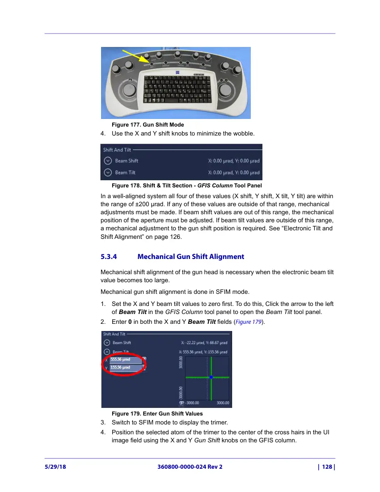

*Page 133 facsimile from `ZEISS_ORION_NanoFab_Operator_Manual_Rev2.pdf`.*

## Page 134

| 129 |
360800-0000-024 Rev 2
5/29/18
5.
After completing this procedure, perform the electronic tilt and shift. See “Elec-
tronic Tilt and Shift Alignment” on page 126.
5.3.5
Mechanical Aperture Alignment
Coarse (mechanical) alignment of an aperture is necessary when the electronic beam 
shift value is too large. See the previous section for the procedure for electronic shift 
alignment.
Mechanical alignment is done in normal imaging mode. Before beginning the 
mechanical alignment of the aperture, set the X and Y beam shift values to zero. 
1.
Click the arrow to the left of Beam Shift in the GFIS Column tool panel to open 
the Beam Shift control and type 0 in both the X and Y Beam Shift fields.
Figure 180. Enter Beam Shift Values
2.
Open the Aperture control and click the Aperture Alignment button (Figure 181) 
to open the GFIS Aperture Alignment tool panel (Figure 182).
Figure 181. Aperture Alignment Button

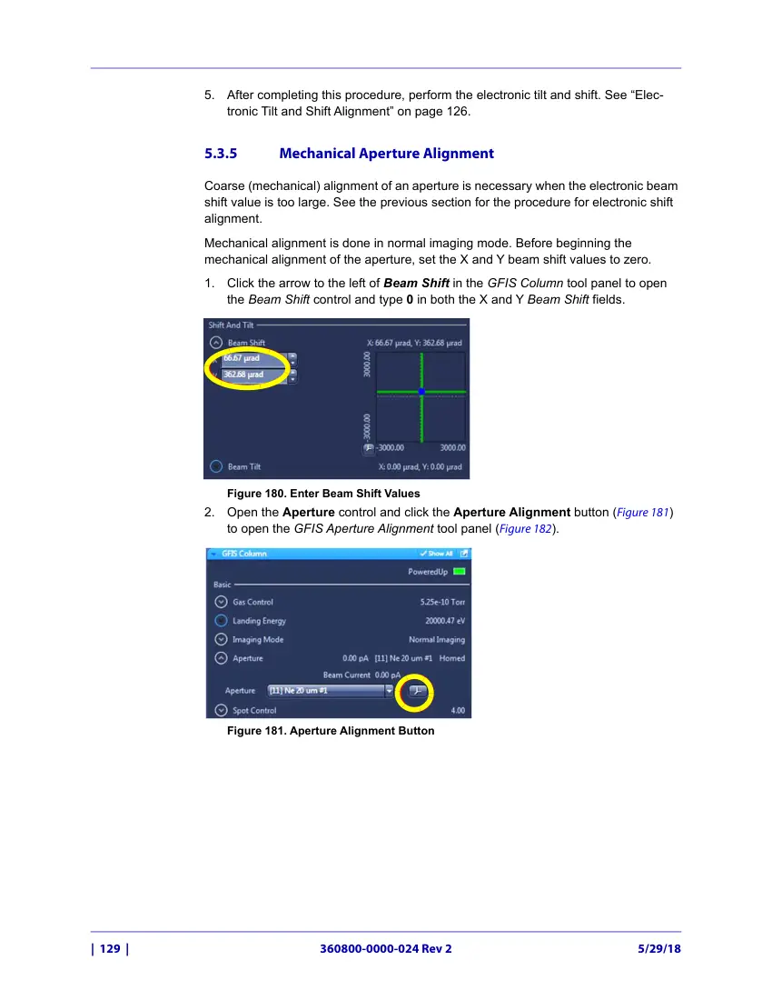

*Page 134 facsimile from `ZEISS_ORION_NanoFab_Operator_Manual_Rev2.pdf`.*

## Page 135

5/29/18
360800-0000-024 Rev 2
| 130 |
Figure 182. GFIS Aperture Alignment Tool Panel
3.
Focus on a feature with sharp edges and somewhat round in shape so there are 
sharp edges on both axes. Enable lens 2 wobble by clicking the check box to the 
left of Lens 2 Wobble. The image in the UI rotates by 90°, to align the X/Y scan of 
the image to the X/Y direction of the aperture bar.
4.
Lens 2 wobble sweeps the lens 2 voltage above and below the focus point value. 
If the beam is not in the center of lens 2, sweeping of the lens 2 voltage causes 
the image to wobble (back and forth movement of the feature) as it goes in and 
out of focus. 
5.
The four arrows below lens 2 Wobble (encircled in yellow in Figure 182) are a vir-
tual joystick used to move the aperture bar. Use these arrows to minimize the 
wobble. The X arrows affect horizontal image motion as viewed in the UI image 
and the Y arrows affect vertical motion in the UI image. The magnitude of aperture 
movement for each click is determined by the value entered in the Step Size field. 
If lens 2 wobble causes a large movement in the image, use a value in the range 
of 10 µm, and for fine adjustment use 1 µm. (see Section 8.11, Aperture Control for 
a description of the movements of the virtual joystick). 
6.
When the movement of the image has been minimized, uncheck the Lens 2 Wob-
ble check box and then click the Save button. This saves the current position of 
the aperture.

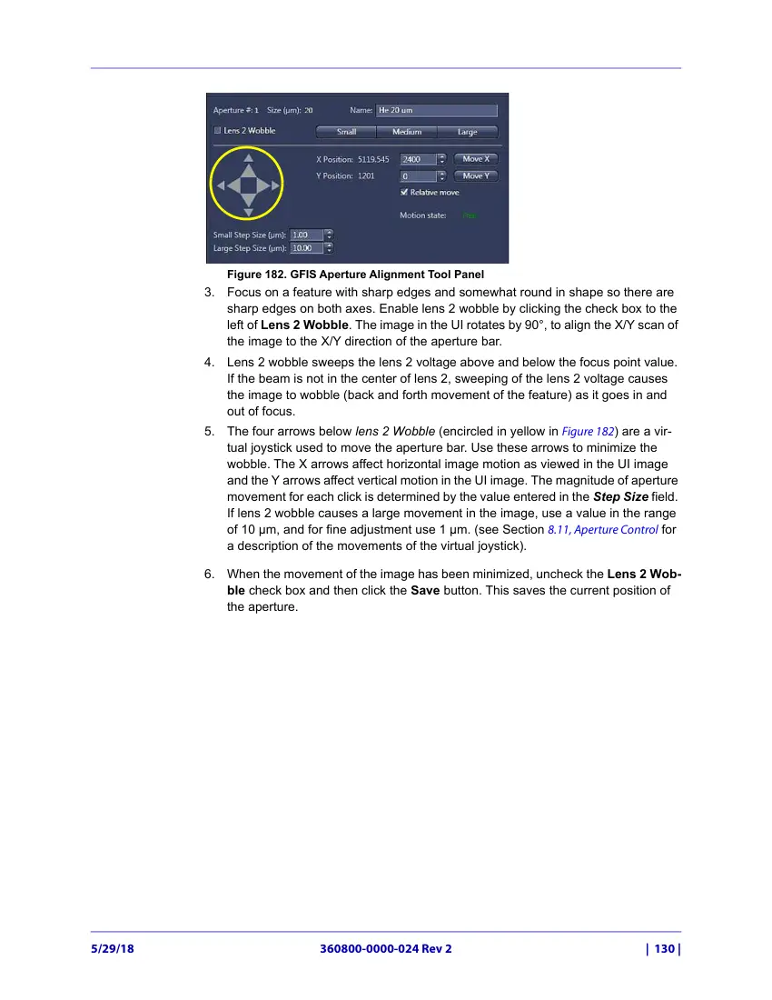

*Page 135 facsimile from `ZEISS_ORION_NanoFab_Operator_Manual_Rev2.pdf`.*

## Page 136

| 131 |
360800-0000-024 Rev 2
5/29/18
5.4
Focus and Stigmate the Beam
During normal operation you will be checking the focus and stigmation of the beam 
quite often. 
Whenever beam limiting aperture, spot control, or acceleration voltage is changed:
1.
Perform electronic beam tilt if necessary:
a)
Select aperture to be used and spot control to be used (typically 4 to 6).
b)
SFIM imaging, center atom of choice in screen.
c)
Fine tune using L1 wobble on Small setting and normal imaging.
2.
Perform electronic beam shift:
a)
Select aperture to be used and spot control to be used (typically 4 to 6).
b)
Normal imaging, remove L2 wobble down to about a 500nm FOV with L2 
wobble set to Small.
c)
Iterate L1 wobble with electronic tilt adjustment and L2 wobble with elec-
tronic shift adjustment until both L1 and L2 wobbles are minimized.
Note:
The electronic shift/align and electronic tilt values should be less than 500 
µrad in magnitude when complete; typically these values are 
approximately 200 µrad or less.  One exception is when the accelerating 
voltage is changed by a “large” amount – for example, when changing 
from 30 to 10 kV.  In this case the electronic tilt adjustment required to 
illuminate the aperture properly may be in the range of 300-400 µrad.
3.
Focus and stigmate the beam.
Note:
The knobs for focus and stigmation adjustments have sensitivities that 
vary with magnification/FOV.  At higher magnification/smaller FOV, the 
focus and stigmator knobs have a smaller voltage per turn than at lower 
magnification/larger FOV.  For that reason, you will be less likely to miss 
the “sweet spot” when turning the knob at higher magnification if you turn 
the knob a little too far.  Therefore, it is recommended to zoom in as much 
as possible when focusing and stigmating.  The optimum focus and 
stigmation is not affected by the magnification, so zooming in or out after 
optimizing does not require refocusing or restigmating.
5.4.1
Focus the Beam
Everyone has their own preferences as to which scan parameters to use when 
focusing the beam. Below are some basic tips to use when focusing.
Generally, it is best to find a feature relatively close to your area of interest, which has 
sharp edges and with a somewhat rounded shape. This gives you sharp edges in all 
directions. It is sometimes difficult to focus and stigmate on a one-dimensional feature 
like a line.

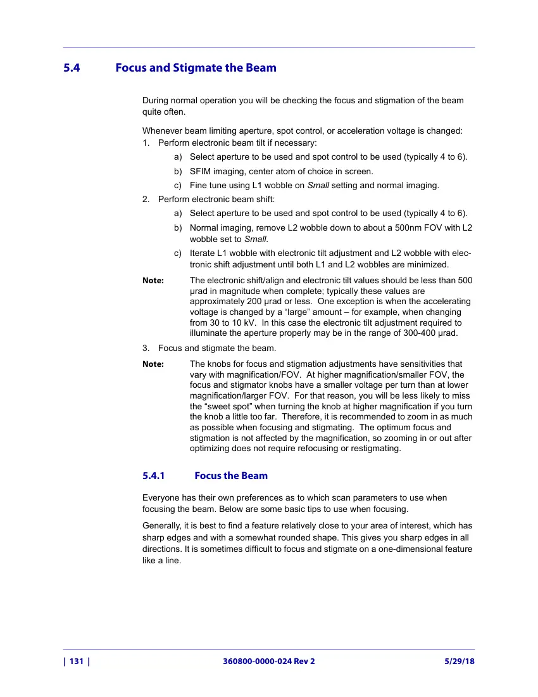

*Page 136 facsimile from `ZEISS_ORION_NanoFab_Operator_Manual_Rev2.pdf`.*

## Page 137

5/29/18
360800-0000-024 Rev 2
| 132 |
Figure 183. Image with Good Focusing Features
Most people prefer to use a short dwell time to have a faster refresh time of the image. 
However this also reduces the signal to noise ratio. Using a reduced scan size (see 
Reduced button in the knob panel Section 3.10, Operator Console reduces the image 
refresh time as you are scanning a smaller area of the image, and therefore there are 
fewer pixels in the image. With this reduced size you do not have to use a shortened 
dwell time to speed up the refresh time.
While focusing the image you may notice indications of astigmatism of the beam. The 
section below explains how to stigmate (remove any astigmatism from) the beam.
5.4.2
Stigmating the Beam
See Section 11.4, Astigmatism, for an explanation of astigmatism.
When the beam is showing indications of astigmatism, the X and Y Stigmator controls 
on the knob panel (Figure 184) can be used to eliminate the affect. Following are some 
basic tips on stigmating the beam:
–
When stigmating, use the same feature that was used when focusing.
–
Before adjusting the Stigmator knobs on the knob panel, set the Focus 
knob to the best compromise between the X direction distortion and the Y 
direction distortion. When fine tuning the stigmation you may notice that 
when you have the sharpest focus on edges in the X direction, the Y 
direction edges are out of focus, and vise versa. Before adjusting the Stig-
mator knobs, set the focus to halfway between the best focus for X and 
the best focus for Y.
–
Adjust the X and Y Stigmator knobs to get the best focus on your feature.
–
Adjust focus between stigmating each axis. In other words; focus, stig-
mate X, focus, stigmate Y, focus...etc.

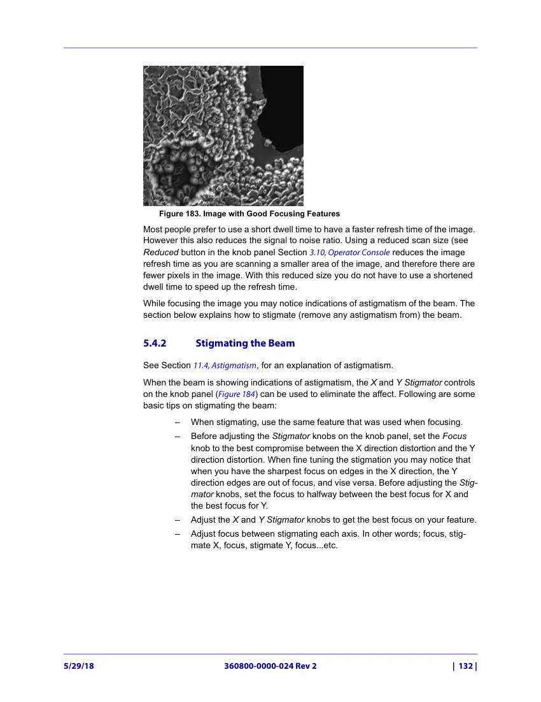

*Page 137 facsimile from `ZEISS_ORION_NanoFab_Operator_Manual_Rev2.pdf`.*

## Page 138

| 133 |
360800-0000-024 Rev 2
5/29/18
Figure 184. Knob Panel Stigmator & Focus Knobs
X and Y Stigmator knobs
Focus knob

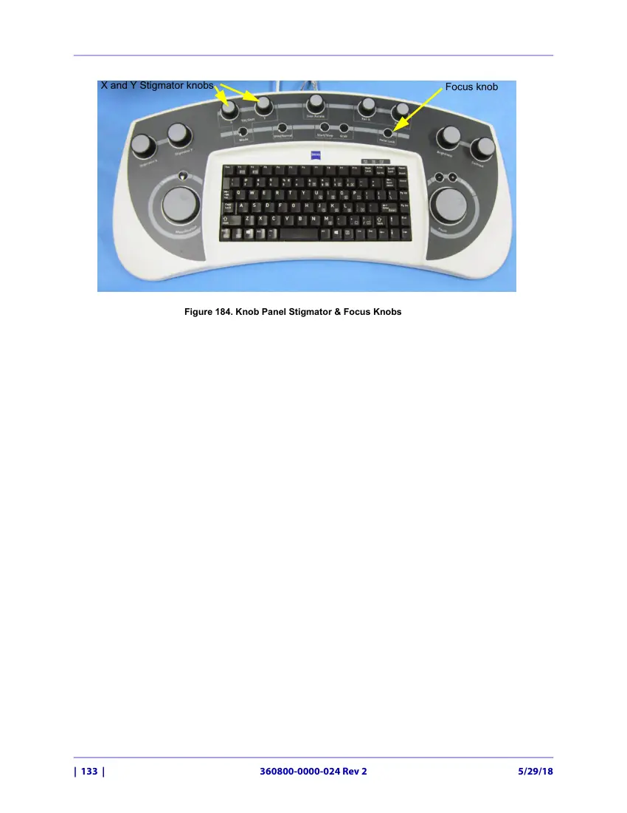

*Page 138 facsimile from `ZEISS_ORION_NanoFab_Operator_Manual_Rev2.pdf`.*

## Page 139

5/29/18
360800-0000-024 Rev 2
| 134 |
6
A Work Session
6.1
Daily Checks
It is a good idea to record a few system parameters at the beginning of each work day 
before starting work on the tool. A log or spreadsheet of these parameters should be 
maintained. This data could serve as an early warning of possible problems with the 
tool. The log would also be helpful to service personnel in the event of a problem with 
the tool.
Figure 185. Example of Daily Log
6.1.1
Perform Pre Gas-On Checks
Do a quick visual check of the tool by performing the basic system checks as 
described in Section 5.1, Basic System Checks.
Before turning on any gases record the base pressure in the gun, mid-column, and the 
work chamber. Also record the gun temperature and the Dewar bottom pressure.

*Page 139 facsimile from `ZEISS_ORION_NanoFab_Operator_Manual_Rev2.pdf`.*

## Page 140

| 135 |
360800-0000-024 Rev 2
5/29/18
6.1.2
Power Up
The following steps assume that a sample has been loaded into the work chamber and 
that it is in the beam path. It is best if the area to be imaged is featureless. Imaging on 
an area with a lot of contrast makes the following checks more difficult.
Bring up the Operation Center by clicking on the Operation Center icon at the top of 
the UI.
Figure 186. Operation Center Icon
The Operation Center tool panel opens. If the system was previously put in Standby 
mode, the Operation Center looks like Figure 187.
Figure 187. Operation Center Tool Panel
In the GFIS Column section, click the Power Up button. The status of the GFIS 
column, displayed in the upper right corner of the GFIS Column section, changes from 
Standby to PoweringUp. Wait for the status to change to PoweredUp. This takes a 
minute or so. During this process, the helium gas is turned on and the column isolation 
valve opens.
If the ET detector is powered down, click the Power Up button in the ET Detector 
section. The status of the ET detector changes immediately to PoweredUp.

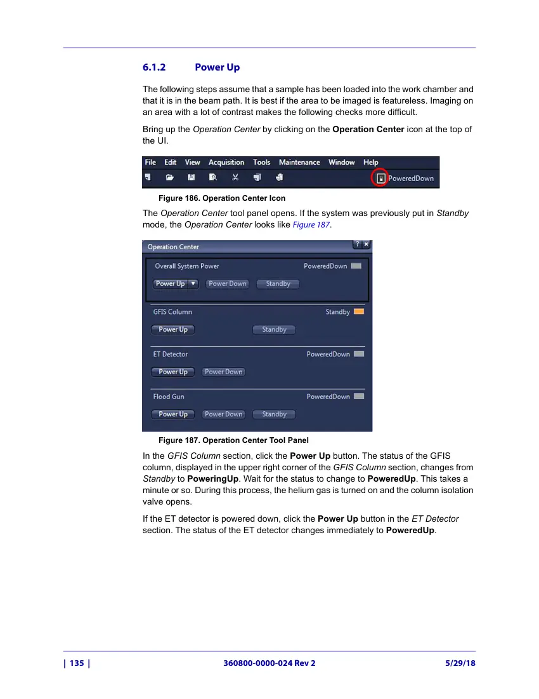

*Page 140 facsimile from `ZEISS_ORION_NanoFab_Operator_Manual_Rev2.pdf`.*

## Page 141

5/29/18
360800-0000-024 Rev 2
| 136 |
6.1.3
Check the Trimer
Before beginning work you must check that a trimer is present and aligned. Go to 
SFIM imaging mode.
Figure 188. Trimer
Verify that the trimer is present and the atom of choice is aligned on the cross hairs in 
the UI. If one or more of the trimer atoms are missing you should try to get a new trimer 
from the current build. To do this, see Section 5.2.4, Select a Trimer. If you are not able to 
get another trimer from this build, see Section 5.2.3, Form the Source.
6.1.4
Align the Source
Whether you have a new trimer or are using a trimer that already existed, it is a good 
idea to go through the source align steps. See Section 5.2, Basic Source Maintenance and 
perform the steps of determining BIV, aligning the source, and setting the source 
distance.
6.2
Working Configuration
The next few sections describe the steps required to begin working. The selections 
made in some of these steps are determined by the application. The details about 
which selections to make are beyond the scope of this manual.
6.2.1
Load Sample
If the daily checks have just been performed, there is already a beam down and an 
aligned aperture in place. If your work sample is not already loaded into the chamber, 
do that now. See Section 4.3, Loading and Unloading Samples.

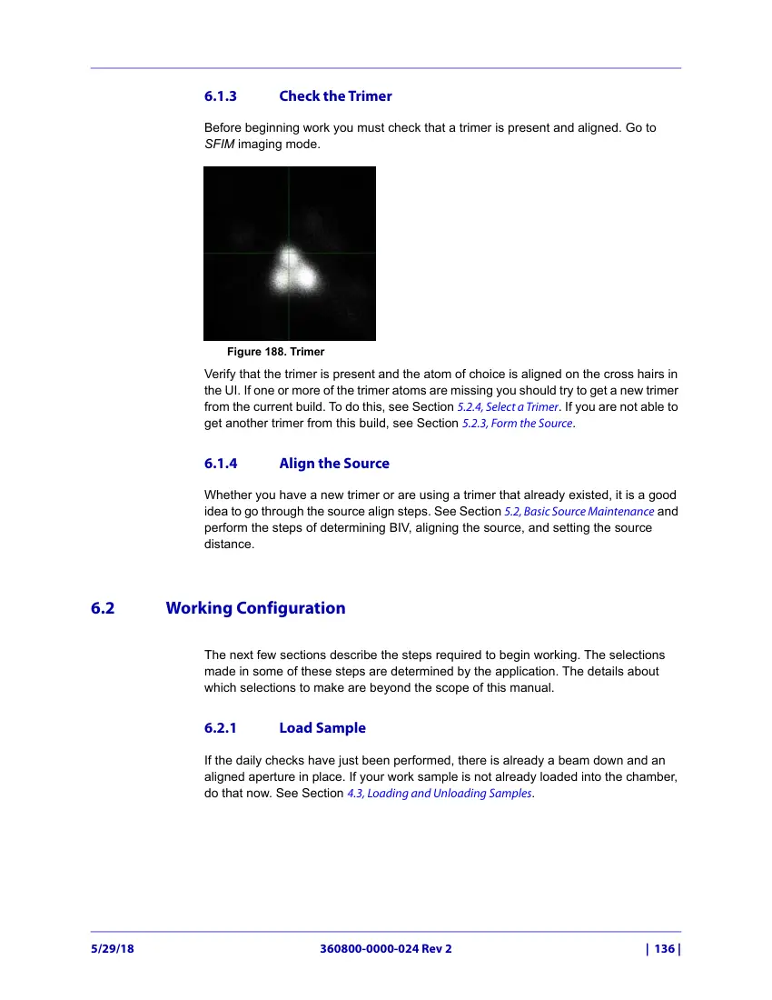

*Page 141 facsimile from `ZEISS_ORION_NanoFab_Operator_Manual_Rev2.pdf`.*

## Page 142

| 137 |
360800-0000-024 Rev 2
5/29/18
6.2.2
Set Landing Energy
Landing energy is the energy at which ions hit the sample, determined by the 
accelerator voltage. Set the landing energy using the Landing Energy control in the 
GFIS Column tool panel. Generally set it around 25 to 30 kV. See 8.10, Landing Energy 
Control.
:
Figure 189. Landing Energy
For helium operation set the extractor to 100% of BIV. See Section 5.2.5, Determine BIV 
for details on how BIV is determined.
6.2.3
Select Aperture
Decide which aperture to use, based on your application. Gold foil apertures are 
designated as helium apertures. Molybdenum apertures are designated as neon 
apertures. Do not use the gold foil apertures when running neon, as they are easily 
damaged by neon. 
Select the aperture through the Aperture control in the GFIS Column tool panel. See 
sections 5.3.1, and 5.3.2 for more detail on apertures and aperture selection.
Smaller apertures can be helpful in getting higher resolution images, but also result in 
less beam current, leading to noisier images. Consult your tool owner for further 
information. 
Note:
Changing the aperture causes large changes in ion beam current: 
Doubling the aperture size quadruples the beam current.
General usage:
–He 5 µm: UHR imaging
–He 10 µm: HR imaging
–Ne 20 µm: Imaging and sub 30 nm patterns
–Ne 40 µm: Small patterns (sub 300 nm)
–Ne 70 µm: Large area patterning (larger than 
300 nm)
Figure 190. Select Aperture

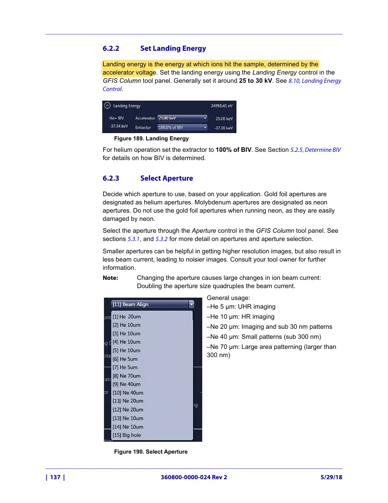

*Page 142 facsimile from `ZEISS_ORION_NanoFab_Operator_Manual_Rev2.pdf`.*

## Page 143

5/29/18
360800-0000-024 Rev 2
| 138 |
Select Spot Control Value
Select the required spot control value using the Spot Control tool in the GFIS Column 
tool panel. See Section11.14, Spot Control for a discussion of spot control.
Note:
Changing the spot control value changes the ion beam current (the 
number of ions that interact with the sample per second). Reducing the 
spot control by 1 number doubles the ion beam current, and thus 
increases beam size: If spot 5 produces 1 pA beam current, spot 4 
produces 2 pA beam current
6.3
Imaging
6.3.1
Setting Parameters
The following imaging parameters must be set before recording an image:
–
Contrast and Brightness
–
Field of View (FOV)
–
Scan Size (Pixel Resolution) 
–
Dwell time (Scan Speed)
–
Averaging

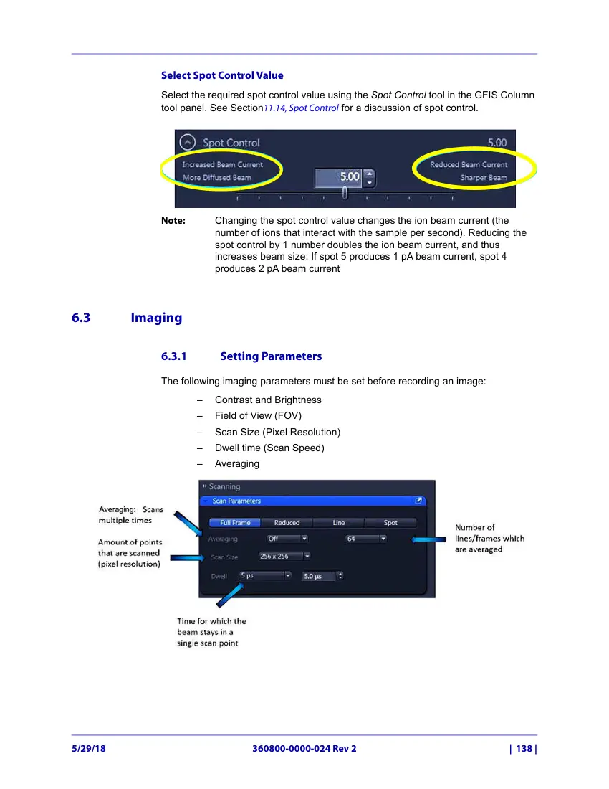

*Page 143 facsimile from `ZEISS_ORION_NanoFab_Operator_Manual_Rev2.pdf`.*

## Page 144

| 139 |
360800-0000-024 Rev 2
5/29/18
Contrast and Brightness
1.
Select a medium speed dwell time (1µs).
2.
Reduce the contrast to zero and adjust the brightness to a level so the last gray 
level can be seen, by eye, before the screen goes black (50% is a good default 
selection).
3.
Increase the contrast so that the signal level shows an image.
Field of View (FOV)
Select a FOV appropriate for the size of the area of interest on the sample. Typically, 
this is done with the Magnification knob on the knob panel. There are some FOV 
related tools in the UI that can also be used (see 8.4, FOV (Field of View) Control).
Scan Size (Pixel Resolution)
Scan size sets the amount of scan points (pixels) in the image. For general imaging, 
512 x 512 or 1024 x 1024 typically works best. When making high a resolution image, 
1024 x 1024 or 2048 x 2048 are the preferred selections. 
Note: If you are using low magnification, you may need a high pixel resolution a 
pixelated image.
Dwell Time (Scan Speed)
Dwell time sets the time that the ion beam stays at a single scan point. The longer the 
dwell time, the slower the scan speed.
Note:
The values below are suggested values only. The required scan time is 
sample-dependent. Increase the dwell time (slower scan speed) until a 
smooth (non-noisy) image is obtained. Be careful not to damage your 
sample. For charging samples and beam-sensitive samples use short 
dwell times in combination with averaging functions. 
Note:
Suggested values:
–
0.5 µs: wobble
–
1 µs: alignments
–
>10 µs: images

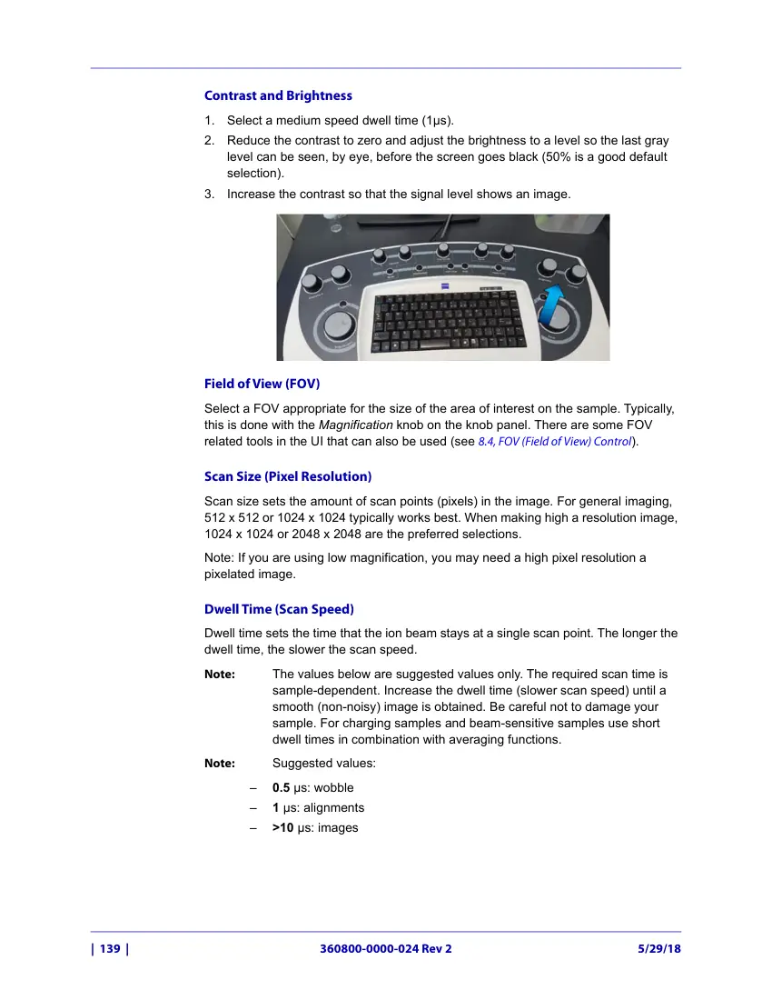

*Page 144 facsimile from `ZEISS_ORION_NanoFab_Operator_Manual_Rev2.pdf`.*

## Page 145

5/29/18
360800-0000-024 Rev 2
| 140 |
Averaging
Averaging is typically used in combination with short dwell times for charging samples 
or beam-sensitive samples. The mode selects which type of averaging is used and the 
number selects how many lines or frames are averaged.
–
Off: No averaging is used
–
Line: Each line is scanned the selected number of times and the average 
signal for each pixel is displayed.
–
Frame: Each frame is scanned the selected number of times and the 
average signal is displayed.
6.3.2
Recording and Saving Images
Recording an Image
–
Press Stop button to stop imaging
–
Press Grab button to capture the image
Capturing Images
After obtaining a good quality image, there are 3 format options:
•
EM.tif – Electron Microscope. This is the most commonly used format and cap-
tures “tiftag” data as well (many system settings and parameters that the image 
was captured with).  This data can be accessed with the NanoFab’s 
CZTifTagViewer program.
•
Standard.tiff – This format captures the image only and not the data or tiftags.
•
CZI (Carl Zeiss Internal) is for use across Zeiss products like SEMs and light 
microscopes.

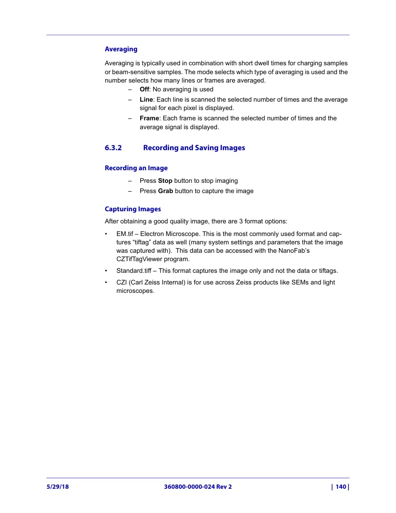

*Page 145 facsimile from `ZEISS_ORION_NanoFab_Operator_Manual_Rev2.pdf`.*

## Page 146

| 141 |
360800-0000-024 Rev 2
5/29/18
6.4
Ending a Work Session
6.4.1
Unloading Sample
Note:
If no one else is using the tool, you can leave the sample and holder inside 
the chamber to minimize exposure to atmosphere.
1.
Bring up the sample management tab.
2.
Press the Exchange button.
–
Brings sample to exchange 
position
–
Closes the CIV
–
Turns off ET detector, flood gun 
and lens 2
–
Opens the air lock valve
3.
Pull the sample out via the transfer rod.
–
Screw to the sample via screw-
ing knob (clockwise).
–
Hold white seal while pulling 
back the rod as this can come 
out while pulling.
4.
Press the Vent button when in loading 
position (Store green light is on).
–
Automatically closes air lock valve
5.
Remove sample holder and samples.
6.
Store sample holder in a clean, dry environment away from exposure to dust (a 
closed storage box, preferably with nitrogen purge, is ideal.
6.4.2
Switching Mode to Standby
The microscope typically remains powered up at all times. That means the sample 
chamber is under vacuum, the ion source is at cryogenic temperature, and all of the 
control electronics are operating and the HVPS is still on.
This section describes the procedure for setting the tool to Standby mode.
1.
Change to Standby mode.
Note:
Put the system into the standby mode when you are not going to use the 
tool for an extended period of time, for example, overnight.
Open the Operation Center and click Standby in the GFIS Column section as shown 
in Figure 191. The column is isolated, the helium gas turns off, the flood gun powers 
down, and the state is Standby. The extractor voltage increases to 105% of the helium 
BIV setting to help keep contaminants off of the source.

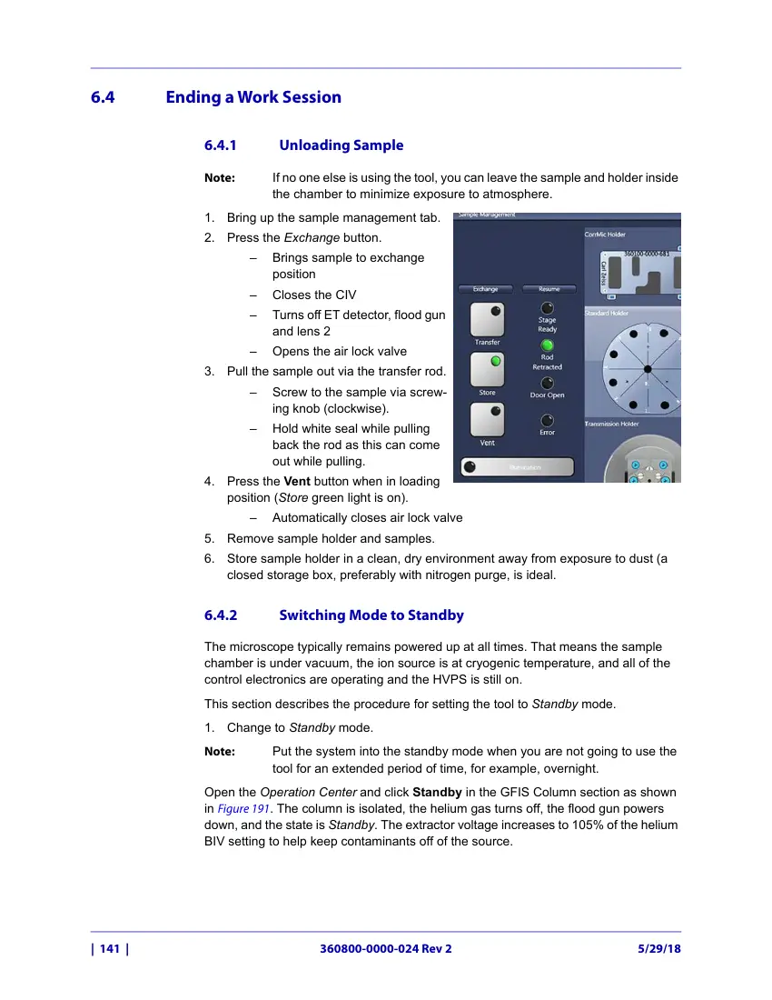

*Page 146 facsimile from `ZEISS_ORION_NanoFab_Operator_Manual_Rev2.pdf`.*

## Page 147

5/29/18
360800-0000-024 Rev 2
| 142 |
Figure 191. Standby Mode
Note:
If the system reports Not Operating, the system is in an in-between state 
where imaging is not possible, for example, the gas is off or the column is 
isolated, but it is not in the Standby state.

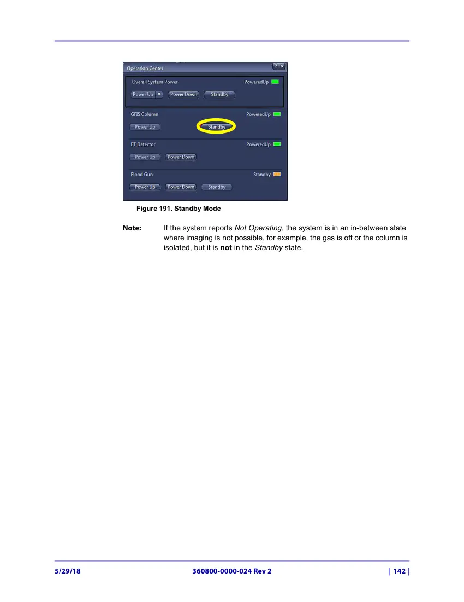

*Page 147 facsimile from `ZEISS_ORION_NanoFab_Operator_Manual_Rev2.pdf`.*

## Page 148

| 143 |
360800-0000-024 Rev 2
5/29/18

*Page 148 facsimile from `ZEISS_ORION_NanoFab_Operator_Manual_Rev2.pdf`.*

## Page 149

5/29/18
360800-0000-024 Rev 2
| 144 |
7
Basic Troubleshooting
This section is intended to familiarize the operator with the use of the Vacuum 
Dashboard for use in troubleshooting, and to help an operator do some basic 
troubleshooting of the most common problems that can be encountered with the 
NanoFab. Sometimes the issue is simply a set-up or configuration problem that can be 
resolved without having to call for service.
7.1
The Vacuum Dashboard
This section gives a quick overview of the operational status of the NanoFab. The 
Vacuum Dashboard should be used to observe states, valve status, pressures, 
temperatures, etc., or to launch DataViewer but not to run the NanoFab.  With very few 
exceptions, the normal operation of the NanoFab can and should be done through the 
Zen UI and not the from the dashboard.  The dashboard should be “look but don’t 
touch” unless troubleshooting.
The server must be running to access it. Go to the tools menu in System Manager and 
select Vacuum Screen (Figure 192).
Figure 192. System Manager
The Vacuum Dashboard appears (Figure 193).

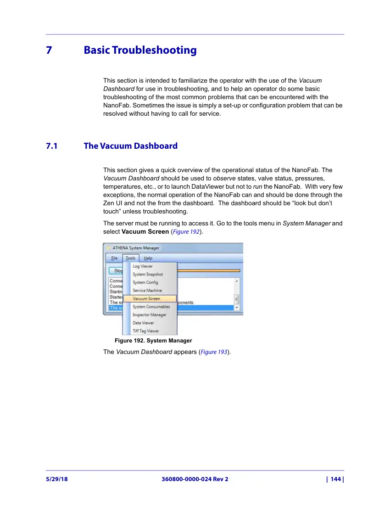

*Page 149 facsimile from `ZEISS_ORION_NanoFab_Operator_Manual_Rev2.pdf`.*

## Page 150

| 145 |
360800-0000-024 Rev 2
5/29/18
Figure 193. Vacuum Dashboard
The larger display, on the left side of the Vacuum Dashboard, depends upon the 
configuration of the NanoFab in regard to its options. The configuration shown in Figure 
193 is a NanoFab with one ion column and two imaging gases. A glance at the left side 
of the Vacuum Dashboard gives you a pretty good assessment of the operational state 
of the NanoFab.
The panel on the right side of the Vacuum Dashboard has at least 4 tabs: GFIS 
Column, GFIS Gas Box, Dewar, and Air Lock & Chamber. If you have the Capella 
option there is also a Gallium FIB Column tab.
In Figure 193, 4 tabs are shown; 3 at the top and one at the bottom. 
Note:
Before a discussion of the Vacuum Dashboard, a general understanding 
of State Machine is helpful. State Machine is a conceptual model of a 
machine that can be in a finite number of states, transitions, and actions. 
This conceptual model was used in the programing of the Vacuum 
Dashboard. The overall system, when operated by the software, is in state 
machine mode. It consists of a number of state machine modules. The 
chamber, the air lock, the GFIS column, among others, are each designed 
on the state machine model. Therefore one action or transition, for 
example, within the operation of the chamber, will bring about other 
programmed transitions or actions within the chamber module. In a few 
instances, transitions will also occur in connecting state machines. For 
example, the action of venting the chamber will cause the action of

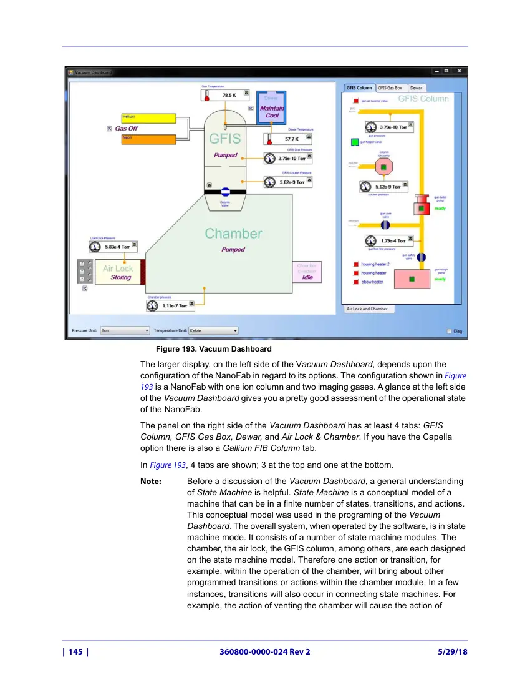

*Page 150 facsimile from `ZEISS_ORION_NanoFab_Operator_Manual_Rev2.pdf`.*

## Page 151

5/29/18
360800-0000-024 Rev 2
| 146 |
venting the air lock also, even though the chamber and the air lock consist 
of two state machine modules.
As an example of a state machine module, the chamber state machine 
allows a finite number of actions by the operator: vent, rough, or pump, 
producing the states of vented, rough pumped, and high vacuum pumped. 
Selecting any one of these puts a number of other components into 
actions, such as opening or closing valves or starting a pump, etc.
State machine is the normal operating mode for the operator. Diag. 
(diagnostic) is the operating mode for use by Zeiss Field Services, for 
maintenance of the tool. An operator should not vary from state machine 
mode, as he may cause some undesired consequences.
7.1.1
General Features
The general features of the Vacuum Dashboard are discussed below, followed by 
descriptions of individual readbacks and indicators.
Most of the modules displayed in the dashboard are under state machine control. The 
text displayed in purple is the current state of that module of the NanoFab. For 
example, in Figure 194, the current state of the chamber is shown to be Pumped. Each 
of the modules have only a few valid states they can be in. If the current state of 
components such as valves, pumps, gauges, etc., does not match a defined state 
exactly, the state is displayed as Undefined. When a section is in state machine mode, 
none of the valves or pumps that are a part of that module state machine can be 
individually controlled. The state of a module can only be changed by selecting 
another state from the list of valid commands.
Right-click any purple text to see a list of the 
valid commands of that section of the NanoFab. 
For example, Figure 194 shows the list of valid 
commands for the chamber, which are Pump, 
Vent, and Rough. Each list of valid commands 
also includes two other selections; Init 
(Initialize) and Diag (Diagnostic).
Figure 194. Chamber States
7.1.2
Diagnostic Mode
Selecting Diag takes that section out of state machine mode and puts it in Diag mode. 
The displayed state for that section is now Diag. In Diag mode, the engineer has more 
individual control of the valves and pumps. This can be dangerous. There are some 
interlocks preventing actions that could be harmful to the NanoFab in Diag mode, but 
it is possible to create some undesired effects. Do not use Diag mode unless you are 
a trained engineer or are instructed to do so by Zeiss personnel.

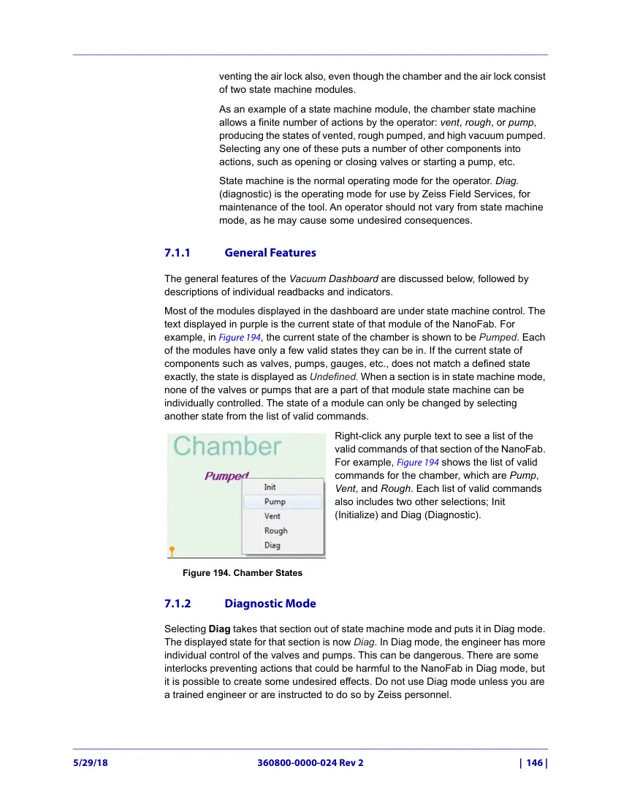

*Page 151 facsimile from `ZEISS_ORION_NanoFab_Operator_Manual_Rev2.pdf`.*

## Page 152

| 147 |
360800-0000-024 Rev 2
5/29/18
It is not possible to go directly from Diag mode to any of the valid state machine states. 
The only way to exit Diag mode is to click on Init. This causes the software to check 
the various parameters and determine if all of them line up exactly with a particular 
defined state. If that is the case, that state displays. If not, Undefined is displayed.
7.1.3
Valve Control
Valves are represented in the Vacuum Dashboard as a blue circle with a white or gray 
bar running through the middle. On the left side of the Vacuum Dashboard shown in 
Figure 195, between the chamber and the GFIS column, is shown the column isolation 
valve (labeled Column Valve). Note the color of the bar and the position of the bar. 
When the bar is white, the valve is controllable by you. When the bar is gray the valve 
is not controllable by the operator.
Note:
Although the valve in Figure 195 may at first appear open, be aware that 
the beam is vertical, therefore the valve in this position blocks the beam.
Figure 195. Opening CIV
Right-click the valve and a popup appears with Open Valve and Close Valve as 
options (Figure 195). In this case, since the valve is closed, the Open Valve option is 
active and the Close Valve option is grayed out. If the valve were open, the reverse 
would be true. In the configuration shown in Figure 195, click Open Valve to open this 
valve. The valve now appears like this
.
If the position of the bar is lined up with the direction of flow, the valve is open. In Figure 
196, the two valves directly below the air lock are both closed - the bars are horizontal 
and the flows (the yellow lines in this case) are vertical. The other two valves are open 
since in both cases the bar is lined up with the direction of the yellow flow line at the 
point where the valve is placed.
Some valves are not controllable by the operator. The examples shown in Figure 196 in 
the Air Lock and Chamber panel are not controllable. Notice that the bar is gray for all 
four valves, meaning that none of the valves are controllable by the operator.

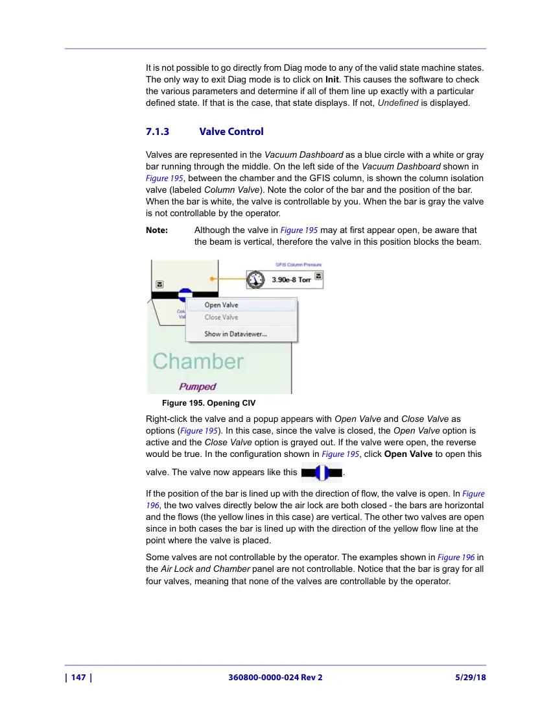

*Page 152 facsimile from `ZEISS_ORION_NanoFab_Operator_Manual_Rev2.pdf`.*

## Page 153

5/29/18
360800-0000-024 Rev 2
| 148 |
Figure 196. Valves Not Under Operator Control
Right-clicking the grayed-out valve results in the popup you can use to find out why the 
valve is uncontrollable.
Figure 197. Popup For Valves Not Controllable by Operator

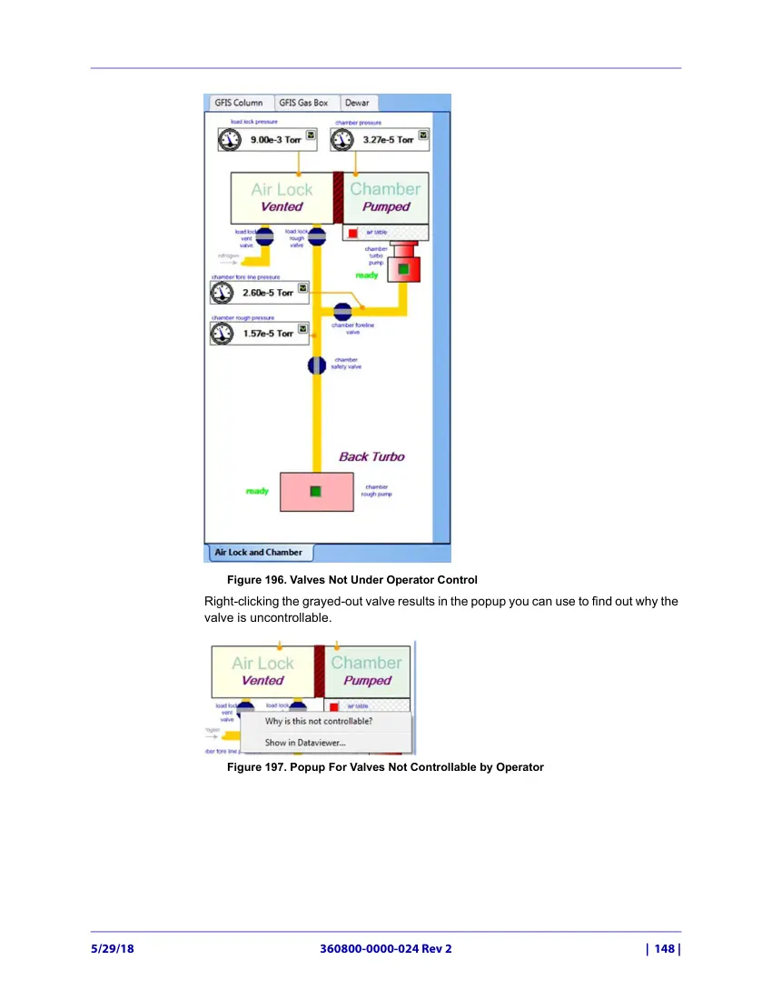

*Page 153 facsimile from `ZEISS_ORION_NanoFab_Operator_Manual_Rev2.pdf`.*

## Page 154

| 149 |
360800-0000-024 Rev 2
5/29/18
Click the line, “Why is this not controllable?” and a popop opens that states the reason.
Figure 198. Not Controllable Message
7.1.4
Temperatures and Pressure
Temperatures and pressures are displayed in the Vacuum Dashboard within 
rectangular boxes (Figure 199). Temperature readings display a thermometer and 
pressure readings display a gauge.
Figure 199. Gun Temperature & GFIS Column Pressure
Another feature is the little graph-like figure 
in the upper right corner of each box 
(Figure 199). Clicking this opens the reading in Data Viewer (Sec 4.2, Data Viewer).
If you double-click a Temperature or Pressure box, a popup appears with a much 
larger display of that readback (Figure 200).
Figure 200. Gun Temperature Popup
The readback can be dragged to any position on the monitor that is convenient.

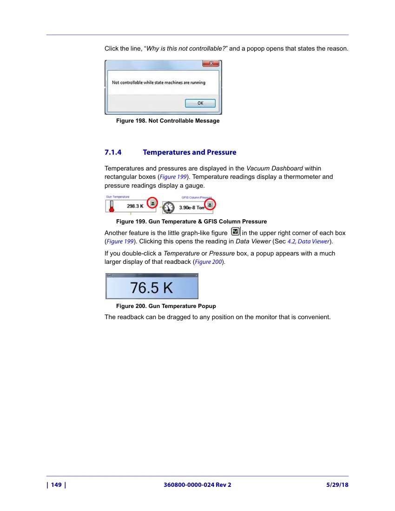

*Page 154 facsimile from `ZEISS_ORION_NanoFab_Operator_Manual_Rev2.pdf`.*

## Page 155

5/29/18
360800-0000-024 Rev 2
| 150 |
7.1.5
Pump Control
The representation of each pump has a 
small square in the middle (Figure 201). If 
the box is green, the pump is turned on, if 
the box is red, the pump is off. 
Notice that two of the pumps in Figure 201 
have a green indicator that is darker than 
the indicator on the other pump. Dark 
green means that the pump is not 
controllable by you, while the lighter 
green indicates that the pump can be 
controlled by the operator.
Figure 201. Pump Representations
Right-clicking the box causes a popup to appear, allowing you to turn the pump on or 
off Figure 202).
Figure 202. Pump Turn On/Off Popup

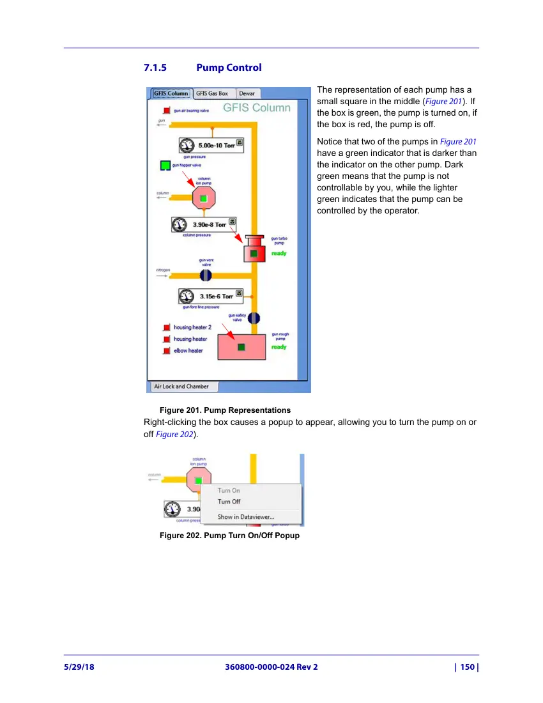

*Page 155 facsimile from `ZEISS_ORION_NanoFab_Operator_Manual_Rev2.pdf`.*

## Page 156

| 151 |
360800-0000-024 Rev 2
5/29/18
7.2
System Snapshot
The System Snapshot is a feature that triggers generation of a file that collects a large 
amount of data from the NanoFab. This data is useful to factory personnel for 
troubleshooting a problem that occurred with a NanoFab. If an unexplained event 
happens with the NanoFab, it is a good idea to create a system snapshot that can be 
sent to the factory for analysis. This file is too big to send via email, therefore a file 
transfer service must be used.
1.
Open Athena System Manager.
Figure 203. Athena System Manger Tools Tab
2.
Select Tools > System Snapshot. The System Snapshot status screen opens.
Figure 204. System Snapshot Status Screen.
3.
Click Start. The ReasonForm dialog box opens.

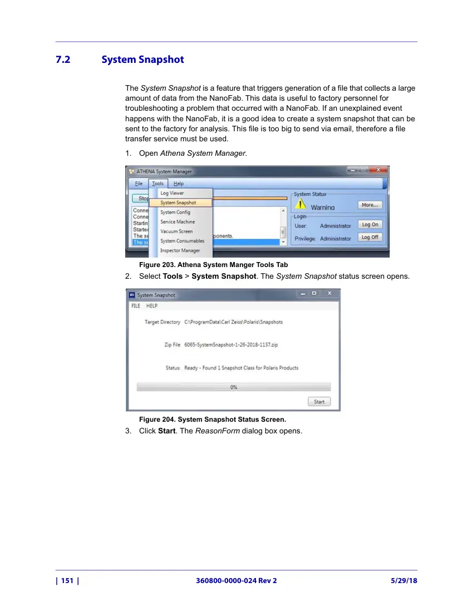

*Page 156 facsimile from `ZEISS_ORION_NanoFab_Operator_Manual_Rev2.pdf`.*

## Page 157

5/29/18
360800-0000-024 Rev 2
| 152 |
Figure 205.The ReasonForm
4.
Enter the requested information.
Note:
The operator must enter his/her first and last name. All other functions, 
except the Cancel button, are disabled until the name is entered. Once a 
name is entered, all other functions, except the Continue button, are 
enabled. The Continue button is enabled after you enter the description 
into the text field.
Note:
If the problem occurred within the last few minutes, you can leave the 
default time and date in the corresponding fields. 
a)
If the problem occurred earlier, update the date and time field to the 
approximate time of the incident. 
b)
Then enter a detailed description of the observations of the problem. For 
example, state what the operator was doing at the time, what state the 
NanoFab was in, what was observed, etc. The more information you 
enter, the more help it is in finding a solution to the problem.
5.
Click Continue. The software beings collecting data. The progress bar tracks the 
percentage of completion.
Figure 206. Progress Bar

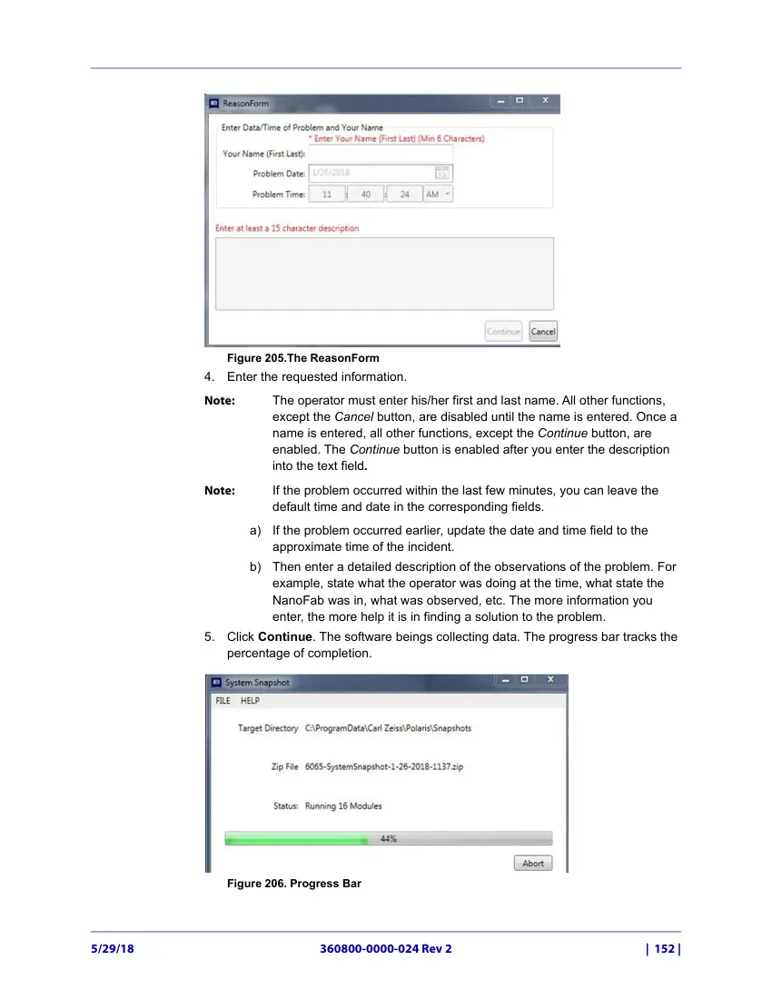

*Page 157 facsimile from `ZEISS_ORION_NanoFab_Operator_Manual_Rev2.pdf`.*

## Page 158

| 153 |
360800-0000-024 Rev 2
5/29/18
When the snapshot is complete, a popup appears, letting you know that the 
snapshot is complete.
The snapshot is automatically saved to the snapshots folder, which is located 
at C:\ProgramData > CarlZeiss > Polaris > Snapshots. However, the 
ProgramData folder is usually hidden so it may not be displayed in Windows 
Explorer. You can get to the Snapshots directory by typing the path into the 
path bar in Windows Explorer.
Figure 207. Path to Snapshot Directory
7.3
Controllers Not Communicating
There are a couple of features in Service Machine that can be used to check 
communication to all of the nodes and modules in the NanoFab.
7.3.1
Hardware Communication Status
If any of the modules are not communicating with the UI, there could be a problem with 
the system computer communicating to that module. For example, you are unable 
control functions on a module or do not get updated readbacks. 
1.
In the System Manager, select Tools > Service Machine.
2.
Select Hardware Communication Status from the menu on the left of the win-
dow. The Hardware Communications Status screen appears, providing a status 
indication of all the controllers in the NanoFab.
Figure 208. Hardware Communication Status

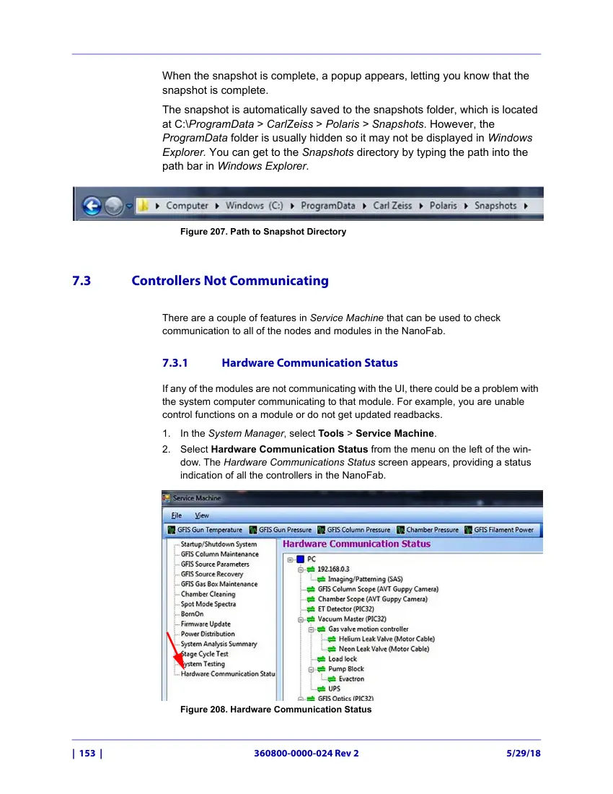

*Page 158 facsimile from `ZEISS_ORION_NanoFab_Operator_Manual_Rev2.pdf`.*

## Page 159

5/29/18
360800-0000-024 Rev 2
| 154 |
3.
Verify that there is a green bi-directional arrow next to all of the controllers. If any 
are not green, the system computer is not communicating to that controller. For 
example, in Figure 209, the NPVE is not communicating with the system computer.
Figure 209. NPVE Not Communicating
4.
Verify that the controller is powered on and verify that the communications cable 
to the controller is securely attached. 
5.
If that all checks out, power cycle the controller (turn off and turn on the rack that 
contains the board that’s not communicating), shut down the UI, and stop the 
server. Wait a couple of minutes after turning on the power to the controller and 
restart the server. 
Note:
If you need to power cycle rack 2, move the stage to a safe position (lower 
Z), as you will need to home the stage after powering back up.
Note:
For a description of rack 1 and rack 2, See “Electronics System” on 
page 41.
6.
If the bi-directional arrow is still not green, contact your service representative. 
7.3.2
Firmware Update
Another communication check can be done through the Firmware Update function, 
which is also accessed through the Service Machine menu. Select Tools > Service 
Machine > Firmware Update and the Firmware Update screen opens (Figure 210).

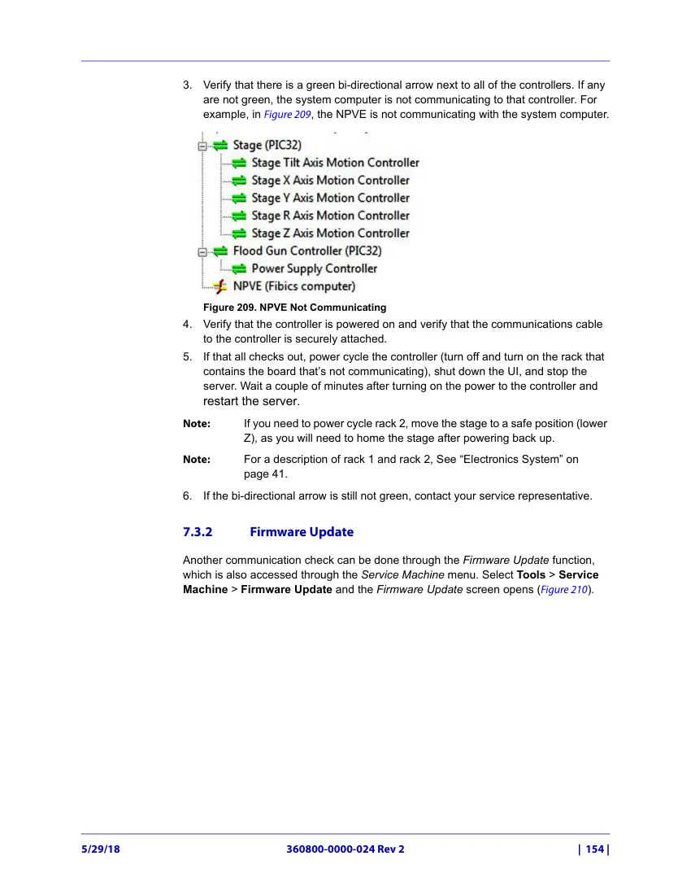

*Page 159 facsimile from `ZEISS_ORION_NanoFab_Operator_Manual_Rev2.pdf`.*

## Page 160

| 155 |
360800-0000-024 Rev 2
5/29/18
Figure 210. Firmware Update Screen
In this function the system software reads the firmware revision of each of the nodes 
replaceable boards) in the system. This can be used as a test of the communication 
between the system computer and all of the subsystems in the NanoFab. Click the 
Query Nodes button in the upper right corner of the window. The system software 
goes out to each node and reads that node’s firmware version. If communications are 
open to all boards, the screen will look like the screen shown below in Figure 211, with 
a green check mark in front of the name of each controller.
.
Figure 211. Query Completed

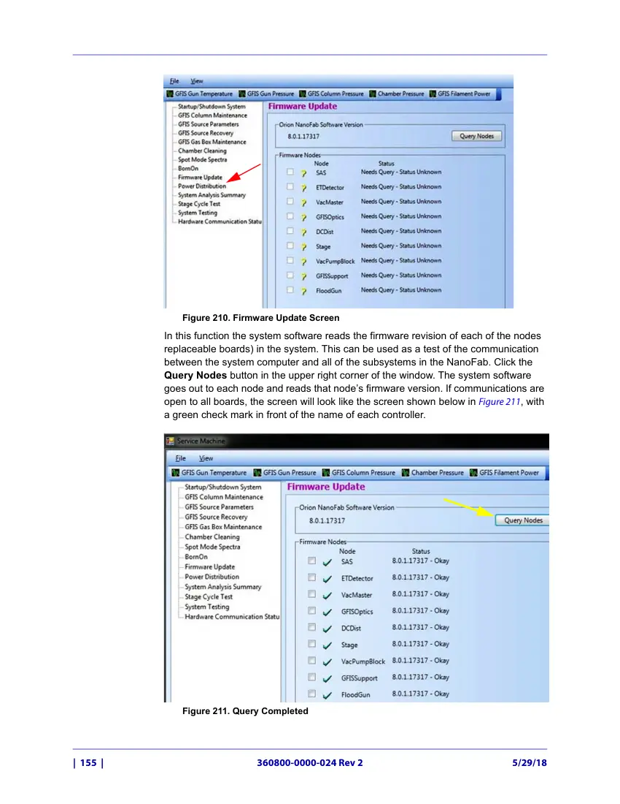

*Page 160 facsimile from `ZEISS_ORION_NanoFab_Operator_Manual_Rev2.pdf`.*

## Page 161

5/29/18
360800-0000-024 Rev 2
| 156 |
The purpose of running this test is to check the communication between the system 
computer and each node. If a red X appears next to a node name instead of a green 
check mark, there is one of two problems: either the system computer cannot 
communicate with the node, in which case the status displayed for that node is 
Unreachable – Could not ping node, or the firmware version for that node does not 
match the system software version, and you will get an Incompatible firmware 
message. If you get the Unreachable message, check that the node is powered up 
and the communications cable is securely attached. If it is still reporting unreachable, 
power cycle the node and then stop and re-start the server. If still reporting 
unreachable, contact your service representative. 
The Incompatible firmware message is an unlikely event for a working microscope as 
this can only happen if the module for that node has been replaced with in incorrect 
version. In the unlikely event that you do get this error, verify that the check box next to 
the red X is checked, then click the Download button at the bottom of the window. 
After the download completes, click Query Nodes. If the Incompatible Firmware 
message appears again, contact your service representative.

*Page 161 facsimile from `ZEISS_ORION_NanoFab_Operator_Manual_Rev2.pdf`.*

## Page 162

| 157 |
360800-0000-024 Rev 2
5/29/18
7.4
Gun /Column Issues
Use this section for help in resolving issues with the gun and column. Figure 212 shows 
what the readbacks related to the gun and column should be, under normal operation. 
With the imaging gases off, the pressures and temperature should be approximately 
as shown. The state of the Dewar should be Maintain Cool. If any of these readings 
are not correct, using the basic troubleshooting tips in this section may help you 
resolve the problem without having to call your service representative.
Figure 212. Dewar in Normal Operation
7.4.1
Maintain Cool State
The Dewar should always be left in the Maintain Cool state. If it is not in this state, the 
Dewar does not automatically fill. To set the Dewar to the Maintain Cool state, right-
click inside the graphic of the Dewar to display the list of valid commands and select 
Maintain Cool (Figure 213).

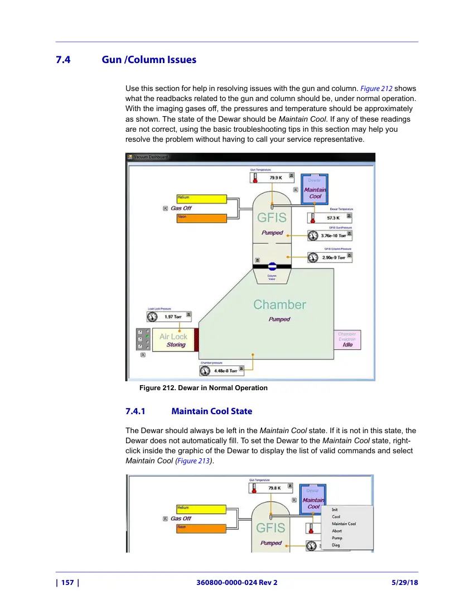

*Page 162 facsimile from `ZEISS_ORION_NanoFab_Operator_Manual_Rev2.pdf`.*

## Page 163

5/29/18
360800-0000-024 Rev 2
| 158 |
Figure 213. Change State
If the Dewar system is operating properly, it will remain in the Maintain Cool state once 
you select it. If it will not go to the Maintain Cool state, nor stay in that state, 
troubleshooting is required. One reason could be that the Dewar Auto Fill is disabled 
(see next section).
7.4.2
Dewar Auto Fill Status
The Active Cooling section of the Dewar Control tool panel displays the status, 
enabled or disabled, of the auto fill process. To open the Dewar Control tool panel, 
click the Dewar Fill icon in the menu bar at the top of the UI. 
Figure 214. Dewar Fill Icon
When auto fill is enabled, the word Enabled is displayed next to Active Cooling at the 
top of the section, and a message below that states that the system will be maintained 
in the cold state without any action by the operator (Figure 215).
Figure 215. Active Cooling Enabled
If Active Cooling is enabled and the Dewar cannot be put into the Maintain Cool state, 
contact your service representative. If the Auto Fill is disabled, the words, Disabled- 
user action required, is displayed at the top of the Active Cooling section (Figure 216), 
and the reason is given in highlighted text.

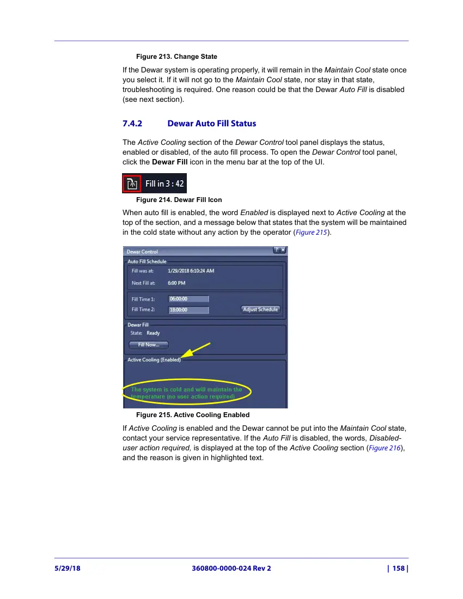

*Page 163 facsimile from `ZEISS_ORION_NanoFab_Operator_Manual_Rev2.pdf`.*

## Page 164

| 159 |
360800-0000-024 Rev 2
5/29/18
Figure 216. Active Cooling Disabled
If auto fill is disabled, the Dewar cannot go into the Maintain Cool state. 
There can be a number of reasons: 
1.
If the reason given is Servicing the LN2 source, verify that the servicing is com-
plete and then click the Done Servicing button (Figure 217).
Figure 217. Servicing LN2 Source
Active Cooling should enable and you should be able to set the Dewar state to 
Maintain Cool.
Figure 218. Gun Temperature Too HIgh

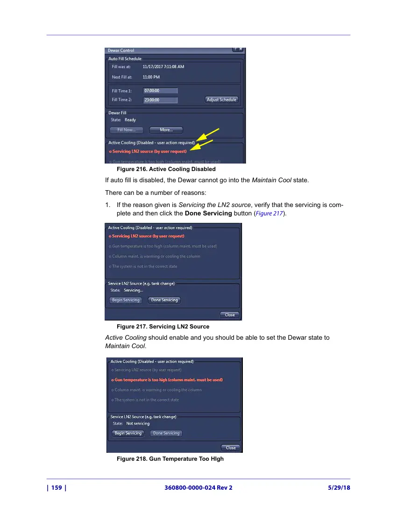

*Page 164 facsimile from `ZEISS_ORION_NanoFab_Operator_Manual_Rev2.pdf`.*

## Page 165

5/29/18
360800-0000-024 Rev 2
| 160 |
2.
If the reason is that the gun temperature is too high (Figure 218), column mainte-
nance is required for active cooling to be enabled (see the next section, Column 
Maintenance).
3.
If the reason displayed is that column maintenance is warming or cooling the col-
umn (Figure 219), an automated process is currently running and Active Cooling 
cannot be enabled until that process has finished.
Figure 219. Column Maintenance
4.
If the reason is that the system is not in the correct state, contact your service rep-
resentative.
7.4.3
Column Maintenance
In System Manager, click Tools > System Manager > Column Maintenance to open 
the GFIS Column Maintenance screen.
Figure 220. Column Maintenance Screen

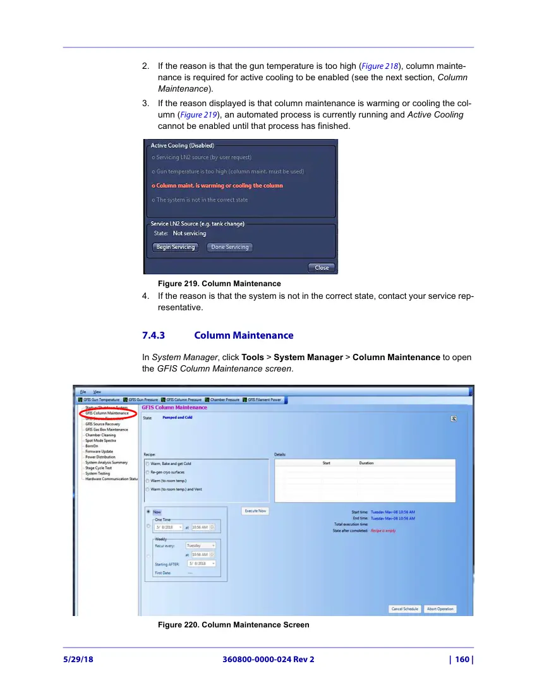

*Page 165 facsimile from `ZEISS_ORION_NanoFab_Operator_Manual_Rev2.pdf`.*

## Page 166

| 161 |
360800-0000-024 Rev 2
5/29/18
If the gun has warmed up too much, Active Cooling in the Dewar Control tool panel 
cannot be used to cool the gun. It must be done in the GFIS Column Maintenance.
If the gun is in the Pumped state select the Cool radio button in the Recipe section and 
then click Execute Now. This starts an automatic sequence to cool the gun.
7.4.4
Gun Temperature
In the upper right section of the Vacuum Dashboard are two temperature readings. 
One is the gun temperature and the other is the Dewar temperature (Figure 221).
Figure 221. Gun and Dewar Temperature
Under normal operating conditions, the gun is at a temperature of about 80K. If the 
gun temperature is above 85K, there could be a problem. During the Dewar fill 
process, the gun temperature could rise to as high as 95K. However, after the fill 
process is completed the gun temperature should return to normal operating 
temperature within an hour or so, which is normal. 
If the temperature rise is not due to a recent Dewar fill process, there is a problem. The 
gun is cooled by the Dewar. The normal Dewar temperature is about 60K. If not, it is 
likely that either the Dewar contents are not being pumped on or the Dewar is empty 
because it ran out of LN2. 
1.
If the Dewar temperature is above 77K, the Dewar is probably empty (see the next 
section, Dewar Empty).
2.
If the Dewar temperature is between 60K and 77K, there is probably LN2 in the 
Dewar but it is not being pumped on (see the section on the next page, Dewar Not 
Being Pumped).
7.4.5
Dewar Issues
Dewar Empty
If the Dewar is empty, the reason it didn’t fill needs to be determined and corrected.
a)
The tank valve may be closed. Check the valve and open it if necessary.
b)
The most likely reason that the Dewar would be empty is that the external 
fill tank is empty. If that is the case, replace the tank with a full one, using 
the procedure described by your tool owner. There are safety issues 
involved so this should only be done by trained personnel. After the tank

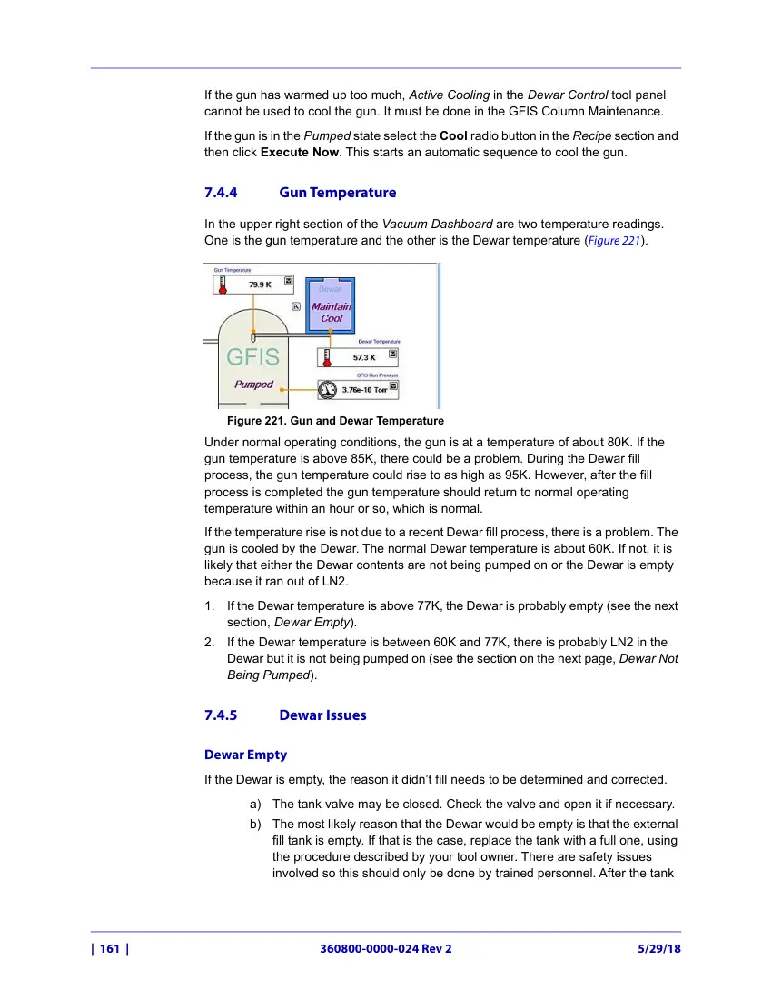

*Page 166 facsimile from `ZEISS_ORION_NanoFab_Operator_Manual_Rev2.pdf`.*

## Page 167

5/29/18
360800-0000-024 Rev 2
| 162 |
has been replaced, put the Dewar in the Maintain Cool state (see the ear-
lier section, Dewar State).
c)
Another reason the Dewar would not fill is if the gun is not in the pumped 
state. If the state of the gun, as displayed in the vacuum dashboard, is not 
Pumped, see Section 7.4.6, Gun/Column Pressure.
d)
If the external tank is not empty, there is some other reason the Dewar did 
not fill. Check whether the valve on the external tank is open. If the valve 
was closed, open it and then put the Dewar in the Maintain Cool state 
(see the earlier section, Dewar State).
e)
Another reason for the Dewar not filling could be that the fill circuit 
breaker is off. The state of this circuit breaker can be read in the Dewar 
panel on the right of the Vacuum Dashboard on the left hand side, just 
below the Dewar fill valve. Verify that the circuit breaker, CB1, on the LN2 
breaker panel on the back of the chase rack is in the On (up) position (Fig-
ure 223).
Figure 222. Fill Circuit Breaker On or Off
If the circuit breaker is Off, go to the chase rack and manually switch it to On.
Figure 223. Chase CB1 Circuit Breaker
 On 
 Off

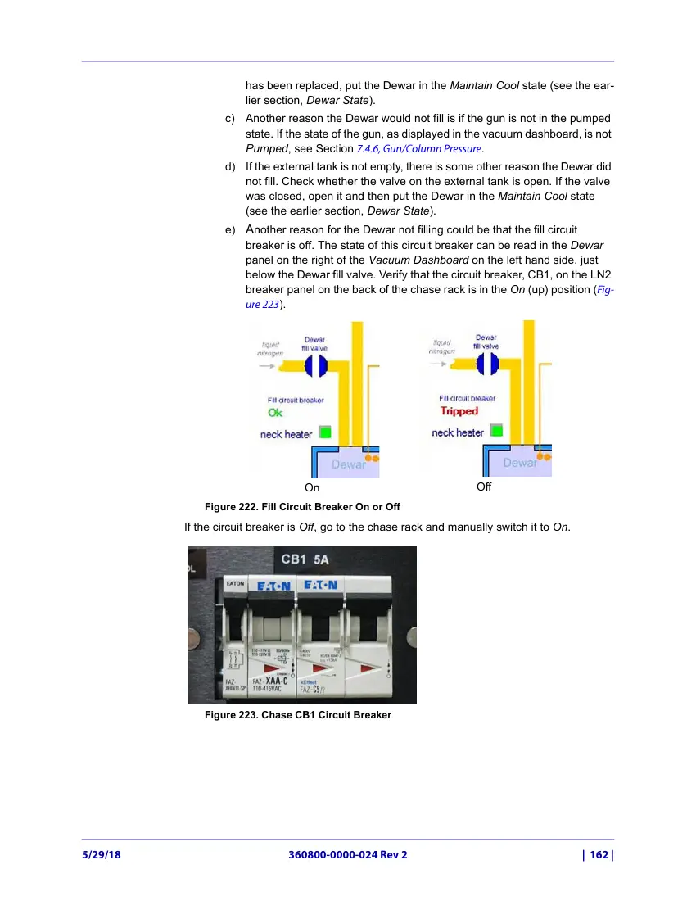

*Page 167 facsimile from `ZEISS_ORION_NanoFab_Operator_Manual_Rev2.pdf`.*

## Page 168

| 163 |
360800-0000-024 Rev 2
5/29/18
Dewar Not Empty
1.
If the external tank is not empty, the valve on the tank is open, and CB1 is in the 
On position, but the Dewar is not in the Maintain Cool state, see the earlier sec-
tion, Dewar State. 
2.
If everything with the external tank is fine, CB1 is on, and the Dewar is in the 
Maintain Cool state, yet the gun is >77K, contact your service representative.
Dewar Not Being Pumped
Under typical operating conditions, the Dewar contents are pumped to lower the 
pressure in the vessel to about 2 Torr. This has the effect of lowering the boiling point 
of the LN2 from 77K to <60K. The lower temperature at the Dewar bottom results in a 
gun temperature of <80K. If the Dewar is not pumped on, the Dewar temperature rises 
to about 77K and the gun temperature rises to about 95K.
Use this section to resolve the problem of the Dewar not being pumped on. Under 
typical operating conditions, the valves and gauges in the Dewar panel of the Vacuum 
Dashboard look like those in Figure 224.
Figure 224. Dewar Panel Typical Conditions
1.
If the Dewar contents pressure gauge (near the center of the panel) is not reading 
in the range of 1-2 Torr, the Dewar may not be being pumped on. Verify that the 
Dewar rough valve is open and the Dewar rough pressure gauge indicator is 
green.
2.
If the valve is closed and the Dewar rough pressure gauge indicator is green, 
open the valve by right-clicking it and select Open Valve. The valve will be inhib-
ited from opening if the Dewar rough pressure gauge is indicator is red.

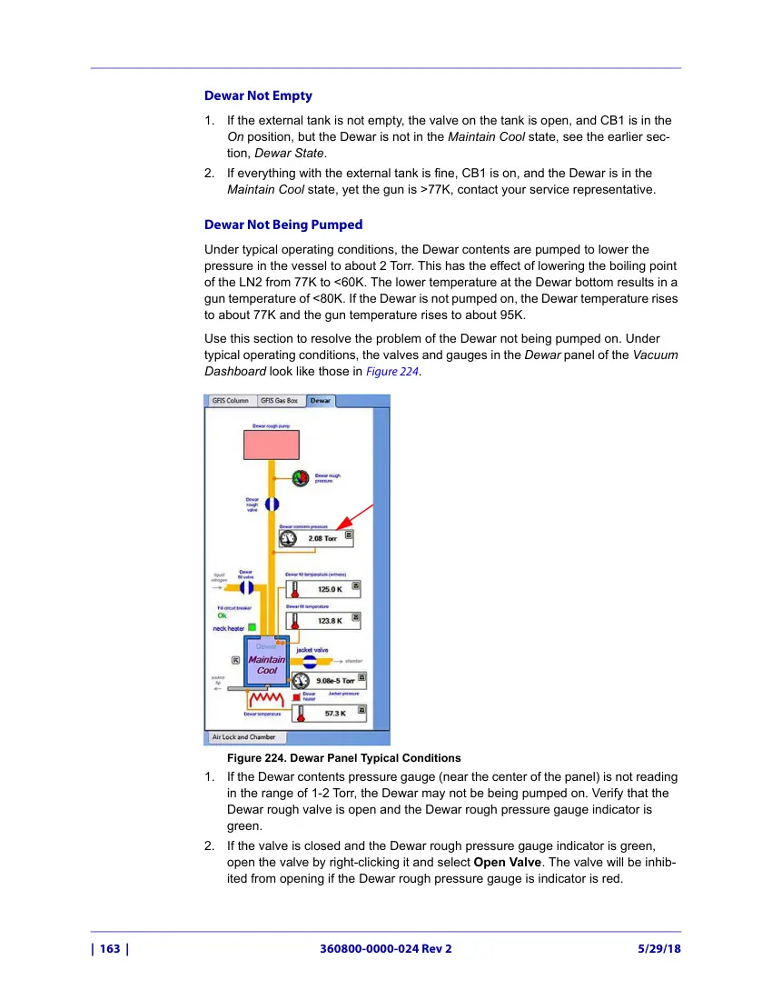

*Page 168 facsimile from `ZEISS_ORION_NanoFab_Operator_Manual_Rev2.pdf`.*

## Page 169

5/29/18
360800-0000-024 Rev 2
| 164 |
3.
If the valve opened on command, the Dewar contents pressure should start going 
back down towards 2 Torr.
4.
If the Dewar rough pressure gauge indicator is red, it is likely that the Dewar rough 
pump is not running. Check the pump, normally located in the chase room, to see 
if it is running. 
5.
If the Dewar rough pump is running but the Dewar rough pressure gauge is indi-
cating in the red area, contact your service representative.
6.
If the pump isn’t running, try pushing the Start button on the top of the pump (Fig-
ure 225).
Figure 225. Rough Pump Panel
7.
If the pump does not start, contact your service representative. If it starts, continue 
to the next step.
8.
If the pump starts, wait for the Dewar rough pressure gauge indicator to turn green 
and then open the Dewar rough valve. The Dewar contents pressure will begin to 
drop until it reaches the 1 – 2 Torr range. The Dewar temperature should now start 
moving down towards 60K.

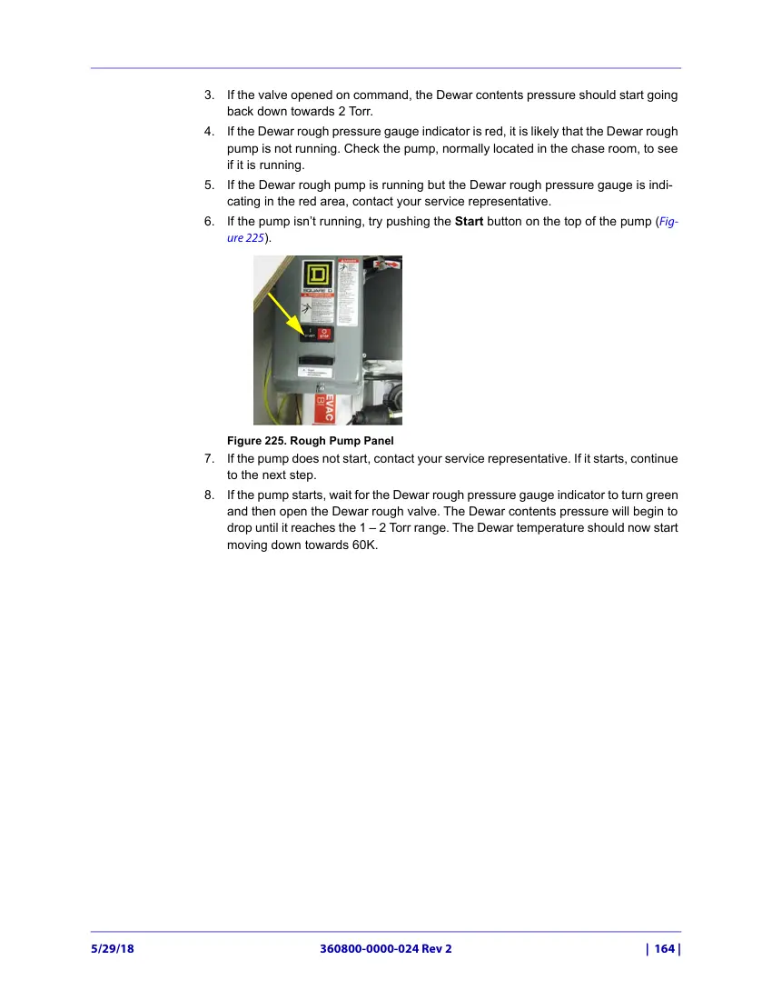

*Page 169 facsimile from `ZEISS_ORION_NanoFab_Operator_Manual_Rev2.pdf`.*

## Page 170

| 165 |
360800-0000-024 Rev 2
5/29/18
7.4.6
Gun/Column Pressure
Use this section to resolve issues when the gun and/or the mid-column are not at their 
normal vacuum level. The pressure gauges for these, GFIS Gun Pressure and GFIS 
Column Pressure, can be read in the main section of the Vacuum Dashboard, just to 
the right of the graphic of the GFIS column. 
Figure 226. Gun and Column Pressure
1.
If the state of the GFIS column displayed is Pumped No Ion Pump, it means the 
ion pump is off and the GFIS Column Pressure gauge is grayed out. This is a nor-
mal state when helium is flowing. If helium is not flowing, go to the Pumped state.
Figure 227. List of Pump States
Select Pump and within a minute or so the state of the GFIS column should 
change to Pumped. If the state of the GFIS column does not change to Pumped, 
contact your service representative.
2.
If the state of the GFIS gun displayed is Vented, select Pump from the menu (Fig-
ure 227). This should start the automated process of pumping the column. The

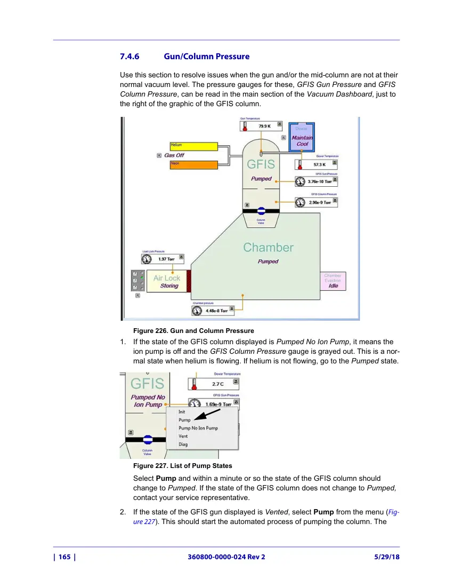

*Page 170 facsimile from `ZEISS_ORION_NanoFab_Operator_Manual_Rev2.pdf`.*

## Page 171

5/29/18
360800-0000-024 Rev 2
| 166 |
state of the GFIS column changes to To Pump. It may take many minutes to for 
the gun to reach the Pumped state. If any error message appears, contact your 
service representative.
3.
If the state of the GFIS column displayed is Diag, click on Init. If the state goes to 
Undefined, click on Pump. If any error message appears, contact your service 
representative.
7.5
Chamber Pressure Issues
1.
Use this section to resolve issues when the chamber is not at its normal vacuum 
level.The Chamber pressure gauge is below the chamber in the Vacuum Dash-
board (Figure 228). If it does not read <3E-7 Torr, and the chamber is in the 
Pumped state, or if the chamber does not reach the Pumped state, contact your 
service representative.
Figure 228. Chamber Pressure
.
Figure 229. Chamber State
2.
If the state displayed is Vented or Rough, right-click on the state displayed to open 
the states command menu, and select Pump. The state should change to To 
Pump, and then, after a number of minutes, the state should change to Pumped. If 
any error message appears, or if the chamber does not reach the Pumped state, 
contact your service representative.
3.
If the state of the chamber displayed is Diag, click on Init. If the state goes to 
Undefined, click on Pump. If any error message appears, contact your service 
representative.

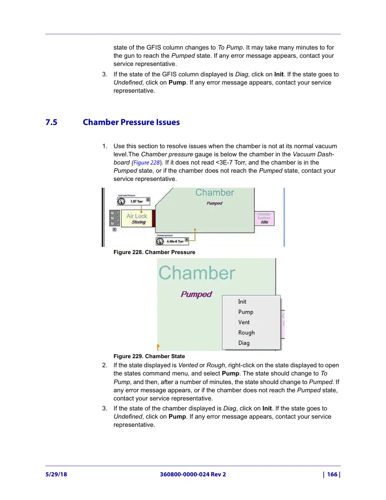

*Page 171 facsimile from `ZEISS_ORION_NanoFab_Operator_Manual_Rev2.pdf`.*

## Page 172

| 167 |
360800-0000-024 Rev 2
5/29/18
7.6
Image Issues
Use this section to resolve imaging issues. It covers some basic checks and 
troubleshooting that may uncover the problem and a way to fix it without having to call 
your service representative. 
7.6.1
Basic Image Configuration
If no image can be obtained when you are expecting to obtain an image there are a 
few things that can be checked that might resolve the problem.
The typical Vacuum Dashboard when imaging with helium is shown in Figure 230. 
Using this as a reference, there are a number of quick things to check if not getting an 
image.
Figure 230. Typical Helium Parameters
In Figure 230 helium is being used as the imaging gas. For this section, for the sake of 
simplicity, it is assumed that helium is the selected imaging gas. 
1.
First, verify that the state of the gas box is Helium On. If the state is Gas Off, no 
imaging gas is flowing and you will not be able to get an image. If the gas is off, 
right-click Gas Off and the states menu appears (Figure 231), Select Helium On. 
The state changes to Working, and then after a minute or so, the state becomes 
Helium On.

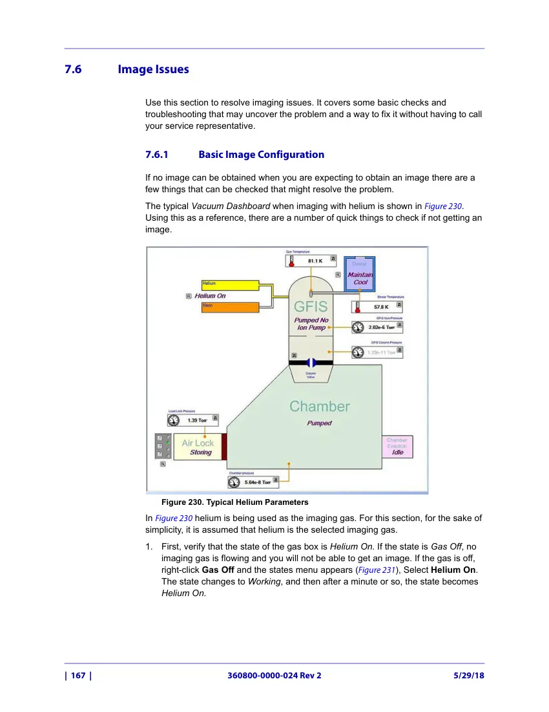

*Page 172 facsimile from `ZEISS_ORION_NanoFab_Operator_Manual_Rev2.pdf`.*

## Page 173

5/29/18
360800-0000-024 Rev 2
| 168 |
Figure 231. Gas States
When the state of the gas box is Helium On, verify that the GFIS gun pressure is at the 
set point. See Section 8.9, Gas Control.
2.
Set the aperture to Big Hole. See Section 5.3, Aperture Selection and Alignment.
3.
Verify that the column blanking mode is set to Autoblanking. See Section 8.20.3, 
Blanking Mode.
4.
Verify that there is a sample under the beam that will emit secondary electrons.
5.
Verify that beam scanning is on. If beam scanning is on, the middle button at the 
top of the Acquisition panel will have a spinning red circle around the word Stop, 
as shown in (Figure 232).
Figure 232. Beam Scanning On
6.
If beam scanning is off, the button displays the word Continuous (Figure 233).
Figure 233. Beam Scanning Off
No image is displayed on the UI if beam scanning is not on. Click on the 
Continuous button to begin scanning.

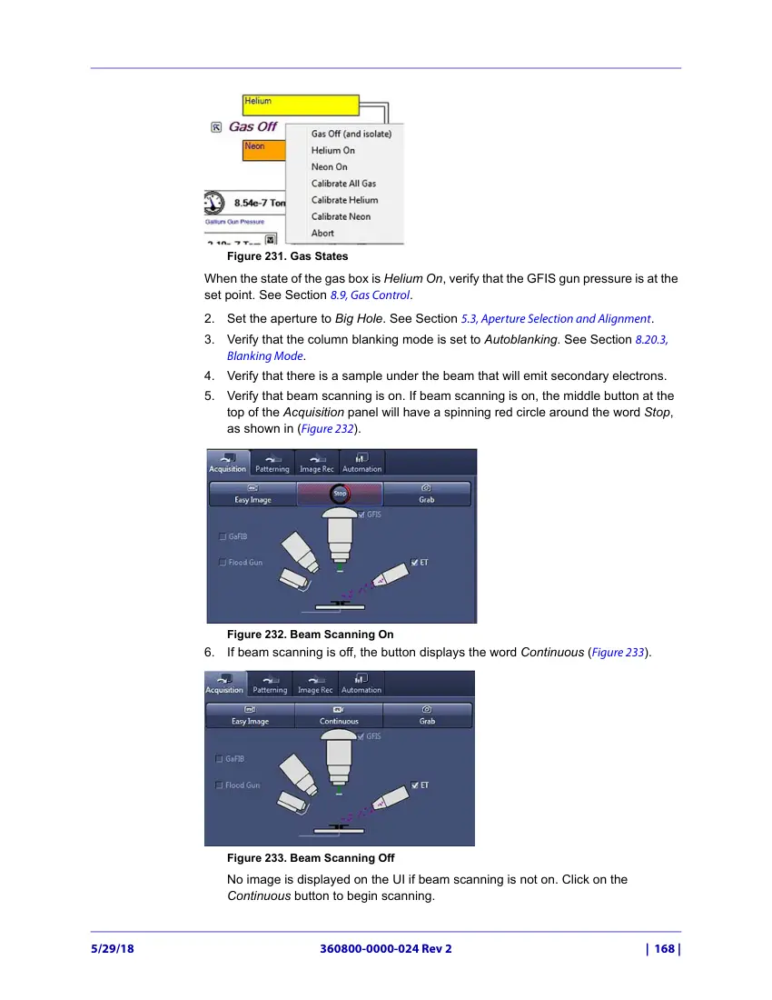

*Page 173 facsimile from `ZEISS_ORION_NanoFab_Operator_Manual_Rev2.pdf`.*

## Page 174

| 169 |
360800-0000-024 Rev 2
5/29/18
If the conditions above have been met, the NanoFab is configured correctly for 
obtaining an image. The next few sections will check key hardware and check 
for a beam and other factors that may affect your image.
7.6.2
Checking the ET Detector
1.
In order to get an image, the ET detector must be enabled. To check whether the 
it is enabled, open the Operation Center tool panel by clicking on the Operation 
Center icon, located near the top of the UI.
Figure 234. Operation Center Icon
The Operation Center tool panel opens.
Figure 235. Operation Center Tool Panel
The state of the ET detector is displayed on the right side of this panel, directly 
across from the words ET Detector. It should be PoweredUp, with a green LED.
If the ET detector is not powered up, click the Power Up button. If you are unable 
to power up the ET detector, contact your service representative.
2.
Open the ET Detector tool panel and check the Show All check box in the upper 
right corner (Figure 236).

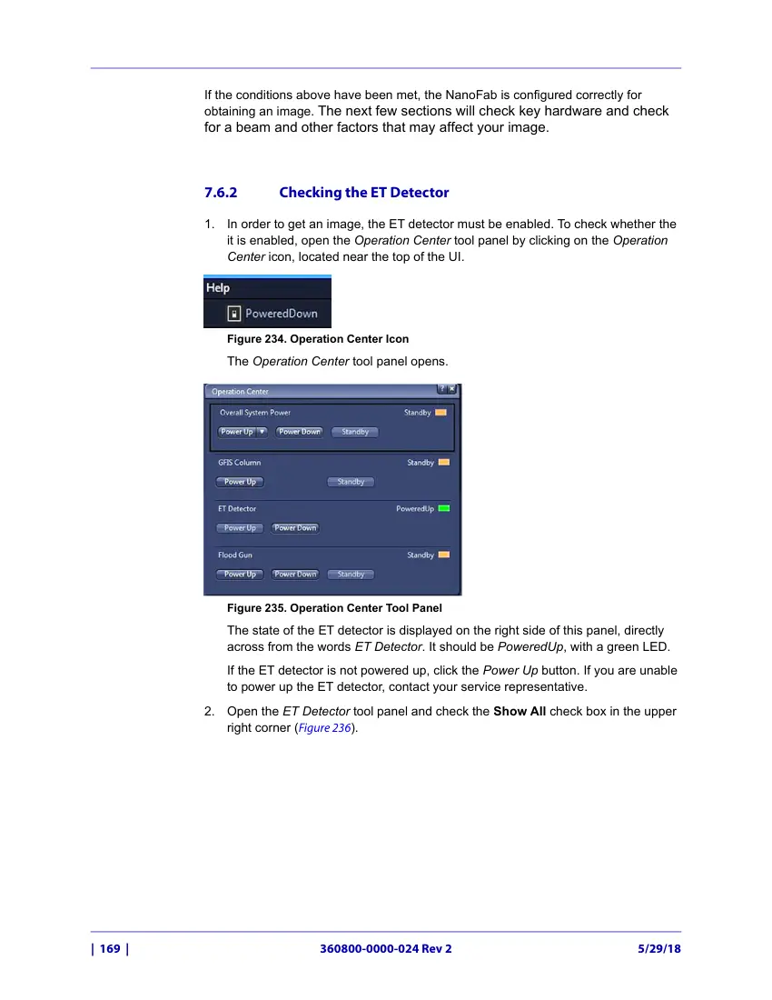

*Page 174 facsimile from `ZEISS_ORION_NanoFab_Operator_Manual_Rev2.pdf`.*

## Page 175

5/29/18
360800-0000-024 Rev 2
| 170 |
Figure 236. ET Detector Tool Panel
•
Verify that the Signal Processing control is set to about 23.3. 
Note:
The value is displayed only when the cursor hovers over the slide control.
•
To adjust the signal, move the slider to the left and right.
•
Start scanning while observing an active image window in the UI. 
•
Using the ET detector controls shown in Figure 236 do the following:
–
Set the Contrast to 0. 
–
Slide the Brightness control from the far left, all the way to the right and 
verify that the image in the UI goes from black to light gray. 
Note:
If this does not happen, the problem is most likely with the SAS or system 
computer.
•
If the Brightness control works as described above, set it to 50% and increase 
the Contrast control until noise is seen in the UI window as shown in Figure 237.
3.
The gain through the ET detector is controlled by the Contrast adjustment. The 
output from the ET detector is through the connector labeled Video and is fed over 
to the SAS assembly.
Figure 237. Detecting Noise

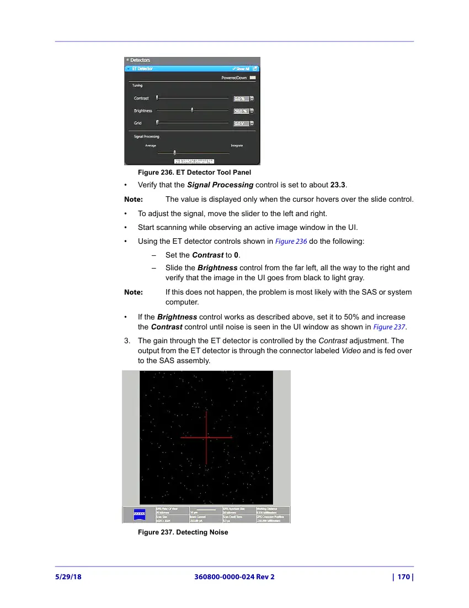

*Page 175 facsimile from `ZEISS_ORION_NanoFab_Operator_Manual_Rev2.pdf`.*

## Page 176

| 171 |
360800-0000-024 Rev 2
5/29/18
If the amount of noise in the display can be controlled by the Contrast setting, it 
indicates that the ET detector photo multiplier tube is functioning. It also confirms 
that the pre-amp is powered, functional, and the video output is connected to the 
SAS. 
4.
If noise is not present, the problem is most likely with the ET detector module. 
Contact your service representative.
5.
If noise is present, the symptom of no valid image implies that secondary elec-
trons are not making it into the ET detector assembly. The reasons for this could 
be:
–
The ET detector grid is not attracting secondary electrons. See the next 
section, Checking the ET Grid Power Supply to verify that the grid PS is work-
ing.
–
No secondary electrons are being generated, which could indicate that 
the ion beam is not striking a target. If all of the previous checks have 
been done, the most likely cause of no secondary electrons is that there 
is no ion beam. Go to Section 7.6.3, Checking for an Ion Beam.
Checking the ET Grid Power Supply
Open the ET Detector tool panel (Figure 238).Verify that the text box to the right of the 
Grid slider is reading 500V. If it isn’t, move the Grid slider all the way to the right. The 
text box should now read 500V. Note that this reading is only the commanded voltage, 
it is not a readback of the voltage. To get a readback of the grid voltage, place the 
cursor over the slider control and a readback appears at the bottom right.
Figure 238. ET Detector Tool Panel
There may also be a ghost image of the slider which is an indicator of the readback 
voltage. In Figure 239, notice the ghost slider at the left of the grid slider range. The 
ghost slider indicates that the grid voltage is close to zero. Place the cursor over either 
the control slider or the ghost slider to display the grid readback voltage close to zero 
at the bottom right.

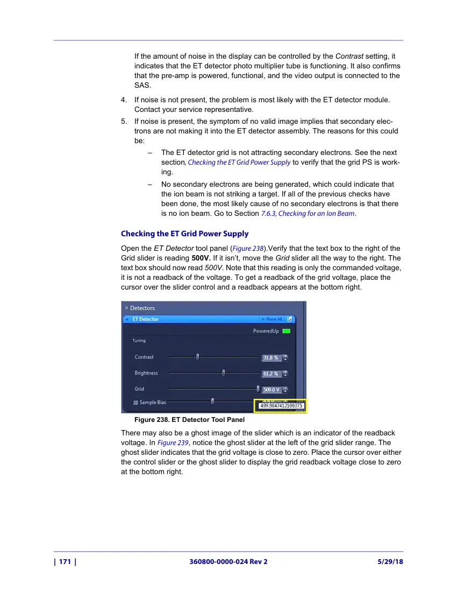

*Page 176 facsimile from `ZEISS_ORION_NanoFab_Operator_Manual_Rev2.pdf`.*

## Page 177

5/29/18
360800-0000-024 Rev 2
| 172 |
Figure 239. Ghost Image of Slider
In this case, try powering down the ET detector through the Operation Control tool 
panel (see Section 7.6.2, Checking the ET Detector) and then powering it back up. If the 
grid voltage is still not correct, contact your service representative.
7.6.3
Checking for an Ion Beam
If all the conditions in this section have been met and there is still no image, verify that 
there is a trimer. If you do not have a trimer but you can see some emission from the 
source, build a new trimer. See Section 5.2, Basic Source Maintenance.
Note:
Check the blanking aperture reading for beam current. Under typical 
conditions with Big Hole selected as the aperture, the blanking current 
should read at least a few pA and normally around 100 pA.
If there is no emission from the source, verify that the high voltages for the column are 
all enabled. Using the GFIS Column tool panel (Figure 240), verify that the Accelerator, 
Extractor, Lens 1 and Lens 2 readbacks are approximately as shown. If any of them 
are close to zero, that power supply is probably disabled.

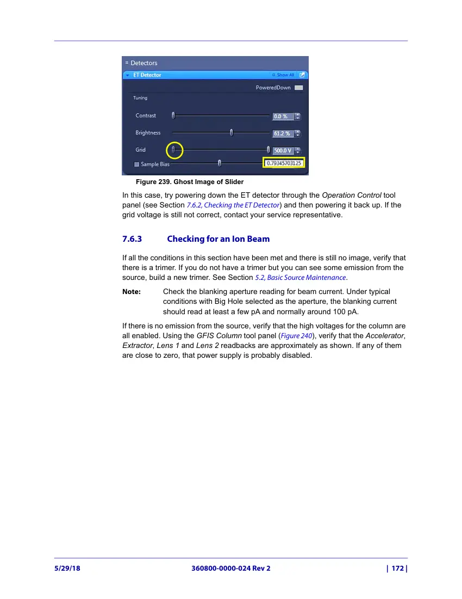

*Page 177 facsimile from `ZEISS_ORION_NanoFab_Operator_Manual_Rev2.pdf`.*

## Page 178

| 173 |
360800-0000-024 Rev 2
5/29/18
Figure 240. Column High Voltages Enabled
To verify that all of these power supplies are enabled, open Service Machine from the 
Tools menu in System Manager, and then select Power Distribution (Figure 241).

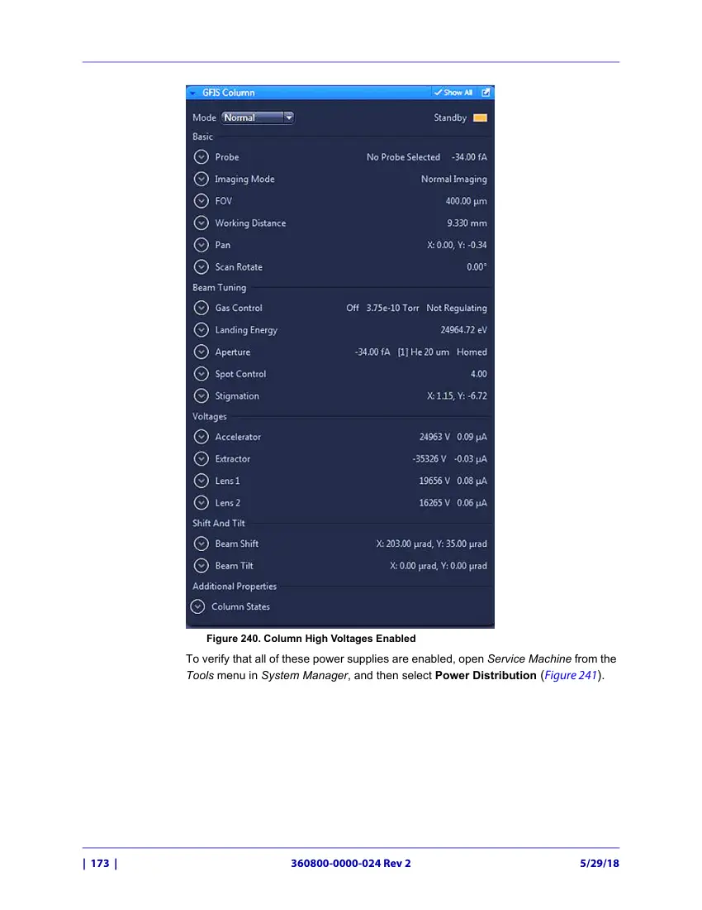

*Page 178 facsimile from `ZEISS_ORION_NanoFab_Operator_Manual_Rev2.pdf`.*

## Page 179

5/29/18
360800-0000-024 Rev 2
| 174 |
Figure 241. Verifying Power Enabled
First, verify that the check box for GFIS High voltage power supplies is checked and 
that power on is displayed in green letters to the right of the line. If the check box is not 
checked, click the check box. If it does not accept a check mark, or if the words no 
power is displayed in red letters to the right of the line, contact your service 
representative.
If the power is on for GFIS High voltage power supplies, click the tab near the top left 
of the panel labeled Power Supplies. The Power Supplies panel appears.
Figure 242. Power Supplies Panel
Verify that each power supply has a check mark in its check box and Enabled is 
displayed. If any of the check boxes are not checked, try to check it. If any of the power 
supplies do not enable, contact your service representative.

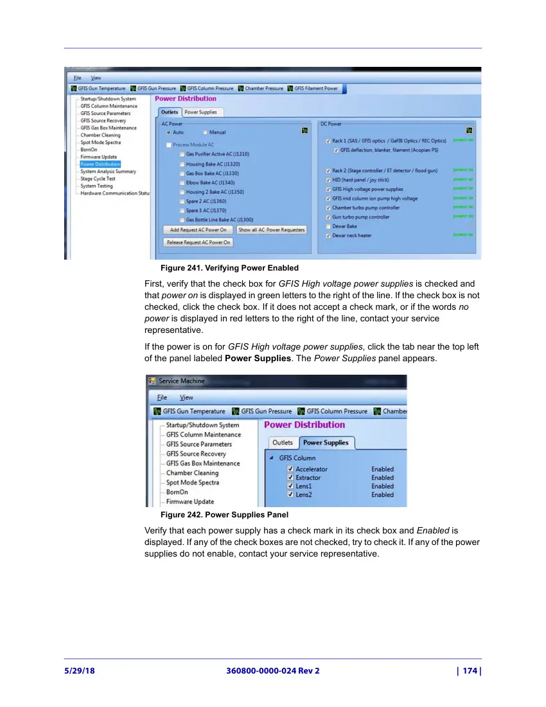

*Page 179 facsimile from `ZEISS_ORION_NanoFab_Operator_Manual_Rev2.pdf`.*

## Page 180

| 175 |
360800-0000-024 Rev 2
5/29/18

*Page 180 facsimile from `ZEISS_ORION_NanoFab_Operator_Manual_Rev2.pdf`.*

## Page 181

5/29/18
360800-0000-024 Rev 2
| 176 |
8
GFIS Column Tool Panel
A lot of the GFIS column operation can be controlled through the GFIS Column tool 
panel. See Figure 243.
Figure 243. GFIS Column Tool Panel
To see all the controls shown here click the Show All check box at the top of the tool 
panel. Below is a short summary of each of the controls in the GFIS Column tool 
panel.

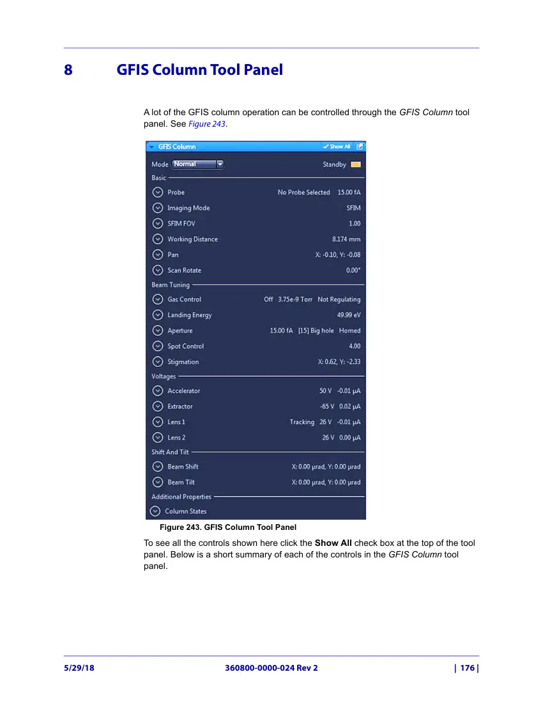

*Page 181 facsimile from `ZEISS_ORION_NanoFab_Operator_Manual_Rev2.pdf`.*

## Page 182

| 177 |
360800-0000-024 Rev 2
5/29/18
8.1
Mode
The Mode linked menu allows you to select between Normal mode and Probe Edit. 
Generally, Normal mode is selected. Probe Edit mode is used only to edit entries in the 
probe table (Figure 244). 
Figure 244. Probe Edit
8.2
Probe Control
The concept of probes and the probe table is discussed in more detail in Section 9.2, 
Probe Tables. A brief description of the probe tools is given here.
A probe table is a collection of probes. A probe is defined as a set of column settings 
that configure a column for a specific beam current, landing energy, and beam shape.
To the right of Probe in the Probe control is a description of the current aperture, the 
acceleration voltage, and the beam current. Figure 245 shows the Probe control open.
Figure 245. Probe Control
There are two GFIS column probe tables; one for helium and one for neon. Access the 
probe table by clicking the arrow to open the drop-down menu. See Figure 246.
Note:
If you have the Capella option, there is an additional Ga FIB column probe 
table, which you would access through the Ga FIB Column tool panel.

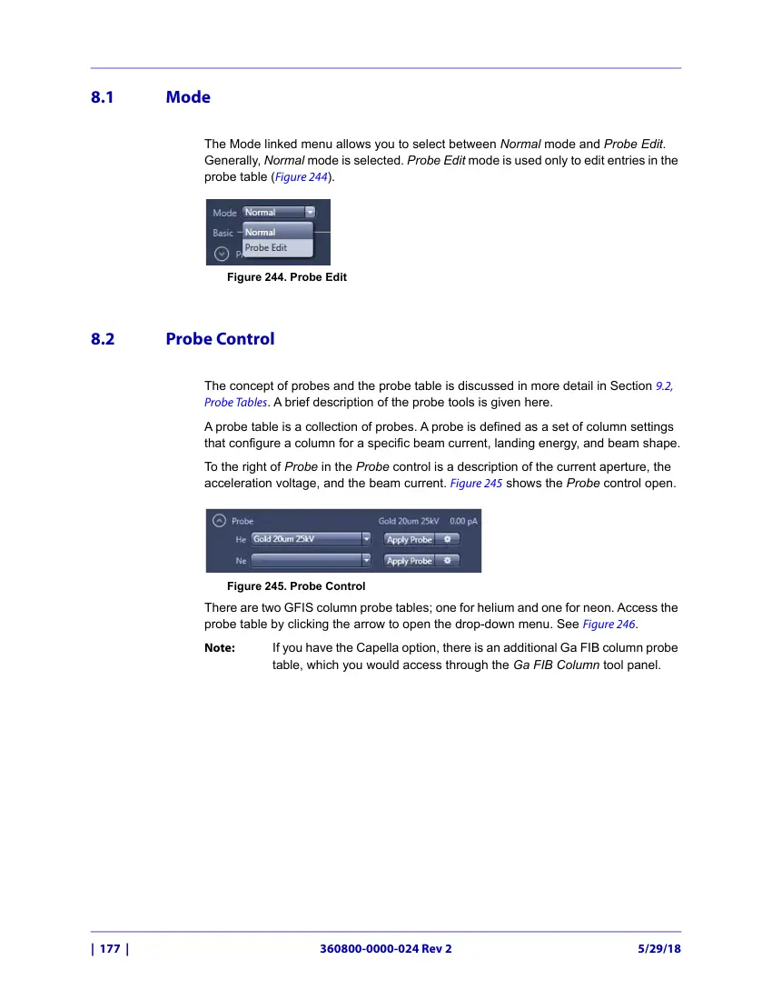

*Page 182 facsimile from `ZEISS_ORION_NanoFab_Operator_Manual_Rev2.pdf`.*

## Page 183

5/29/18
360800-0000-024 Rev 2
| 178 |
Figure 246. Helium Probe Table
8.3
Imaging Mode Control
There are two ways to select the imaging mode. One way is to select the imaging 
mode is through the GFIS Column tool panel, in the Basic section. The current mode 
is displayed to the right of the words Imaging Mode. Click the arrow to the left of 
Imaging Mode and the button for changing the imaging mode appears. If the current 
imaging mode is Normal Imaging, the button is labeled View Source. Clicking it 
switches to SFIM mode, which is used to view the source. 
Figure 247. Current Mode: Normal Imaging
If the current mode is SFIM, the button is labeled View Sample. Clicking it switches to 
Normal Imaging, which is used to view the sample.
  
Figure 248. Current Mode: SFIM View
Another way is to use the Mode button on the knob panel. Each time this button is 
pressed the imaging mode toggles between Normal Imaging and SFIM.
The current imaging mode is always displayed in the bottom right corner of the UI.

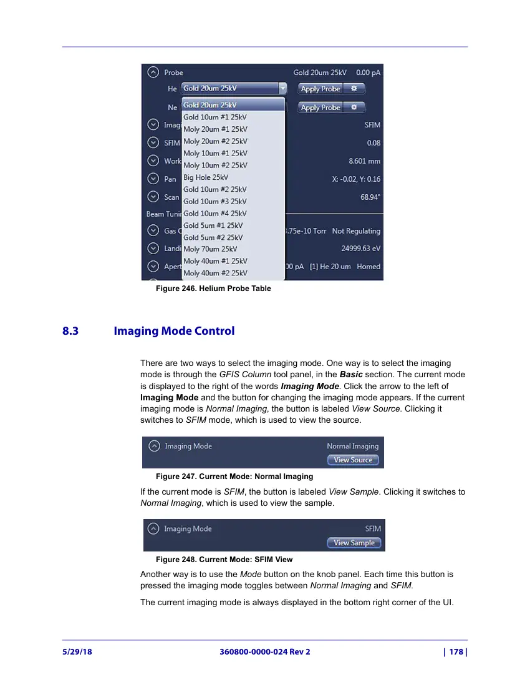

*Page 183 facsimile from `ZEISS_ORION_NanoFab_Operator_Manual_Rev2.pdf`.*

## Page 184

| 179 |
360800-0000-024 Rev 2
5/29/18
Figure 249. Viewing Image Mode
8.4
FOV (Field of View) Control
The FOV control is available only when Normal Imaging is selected as the imaging 
mode. For a description of FOV see Section 11.6, Field of View.
Figure 250. FOV Control 
Figure 251 shows the active FOV control. The current FOV is displayed to the right of 
FOV. The FOV control is linked directly to the Magnification knob on the knob panel. 
Moving the slider in this control has the same effect as turning the Magnification knob 
on the knob panel.
Figure 251. FOV Control Slider
8.5
SFIM FOV Control
SFIM FOV is determined by the magnitude of the deflection signals on the 
quadrupoles. The SFIM FOV control is displayed only when the imaging mode 
selected is SFIM mode as shown in Figure 252.
Figure 252. SFIM FOV Control

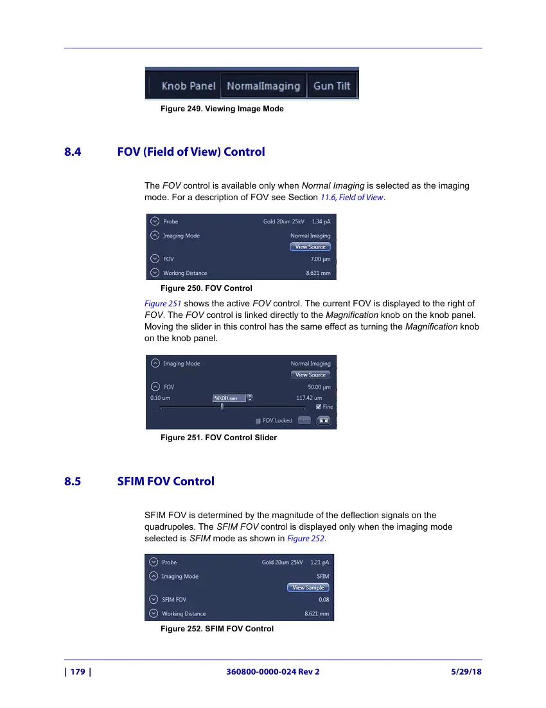

*Page 184 facsimile from `ZEISS_ORION_NanoFab_Operator_Manual_Rev2.pdf`.*

## Page 185

5/29/18
360800-0000-024 Rev 2
| 180 |
The image below shows the active SFIM FOV control. The current SFIM FOV is 
displayed to the right of SFIM FOV. The SFIM FOV is linked directly to the 
Magnification knob on the knob panel. Moving the slider in this control has the same 
effect as turning the Magnification knob on the knob panel.
Figure 253. SFIM FOV Control Slider
8.6
Working Distance Control
Working distance, the distance between the bottom of lens 2 to the sample when 
focused, is displayed in the right corner of the Working Distance control in Figure 254. It 
is not measured, but is calculated by the system based on the lens 2 voltage required 
to focus the beam on the sample. Therefore, the displayed working distance is only 
accurate when the image is in focus, See Section 11.10, Working Distance, for a graphic 
view of working distance. 
The slider in the Working Distance control is directly linked to lens 2. Moving the slider 
does not change the true working distance, but affects the focus. Moving this slider 
has the same effect as turning the Focus knob on the knob panel, which is to vary the 
lens 2 voltage.
Figure 254. Working Distance Control
8.7
Pan Control
Pan refers to moving the beam in the X and/or Y direction, which is reflected in the 
movement of the image. The Pan control is used when very small (<~10 µm) 
movement on the sample is required. For moving on the sample in such small 
magnitudes, it is easier to electronically move the beam rather than making 
mechanical movements with the stage. Generally, when panning, it is easier to use the 
Pan knobs on the knob panel than to use the control in the UI. See Section 3.10, 
Operator Console for a description of the Pan knobs. The UI pan control is shown in 
Figure 255.

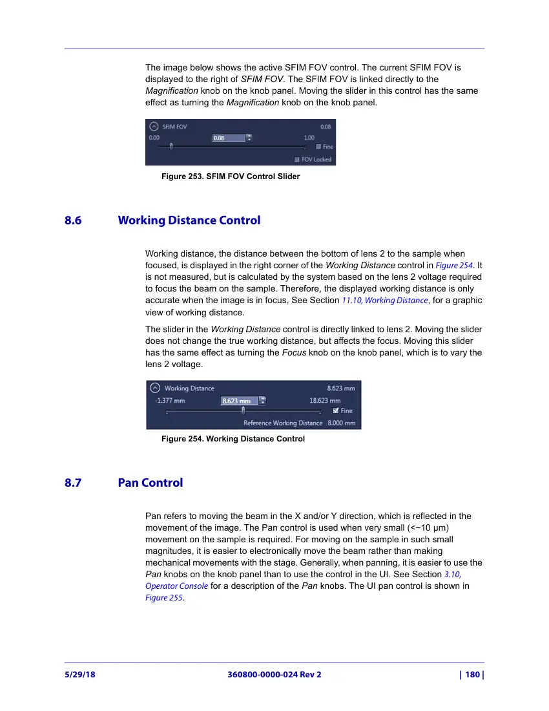

*Page 185 facsimile from `ZEISS_ORION_NanoFab_Operator_Manual_Rev2.pdf`.*

## Page 186

| 181 |
360800-0000-024 Rev 2
5/29/18
Figure 255. Pan Control
The step controls (the two concentric squares) in the above control are a bit awkward 
as the step controls do not increment by round numbers, but increment by 0.055 µm 
for the small controls, and 0.55 µm for the large controls. These may be cleared up in 
a future release of the software. If you want to try the step controls, the X and Y step 
controls are the inner and outer boxes. The inner boxes pan by 0.055 µm increments 
and the large boxes pan by 0.55 µm increments in each of the four directions (+ and - 
for X and Y).
Figure 256. Pan X & Y Controls
In the center of the control is a virtual joystick. This virtual joystick can be dragged in 
any direction to pan the beam. Dragging the joystick to the right has the same effect as 
turning the X pan knob in the clockwise direction. Dragging the joystick up has the 
same effect as turning the Y pan knob clockwise.
A useful feature of the virtual joystick is the ability to zero the X and Y pans. Right-click 
on the joystick to open a drop-down menu. See Figure 257. Some calibrations require 
that both X and Y pan are zero. Clicking on Zero X & Y will accomplish that.
Figure 257. Pan Tool Panel Virtual Joystick
Y Step Controls -
Y Step Controls +
X Step Controls +
X Step Controls -
Large
Small 
Joystick

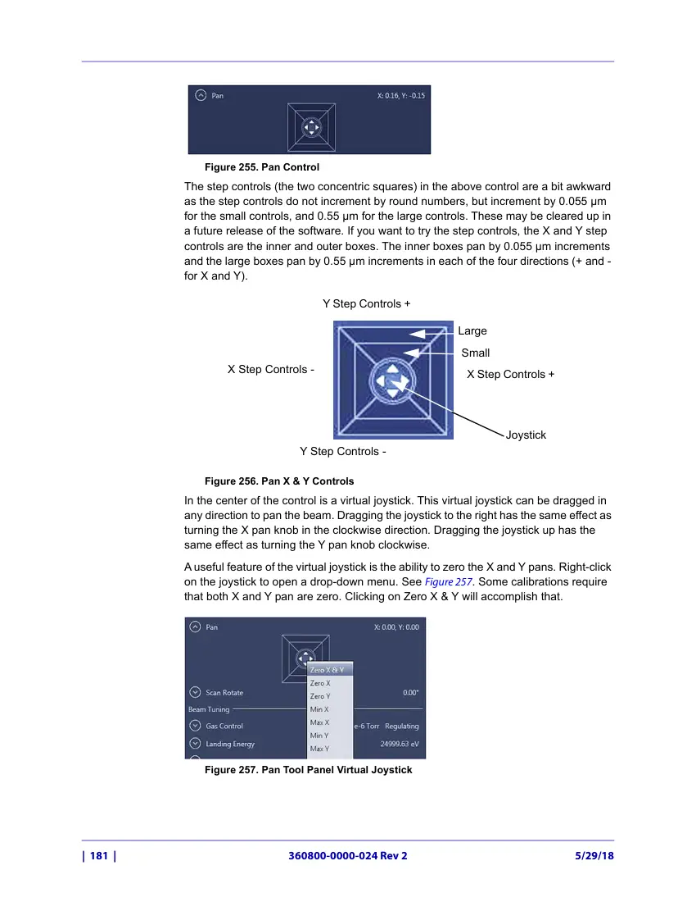

*Page 186 facsimile from `ZEISS_ORION_NanoFab_Operator_Manual_Rev2.pdf`.*

## Page 187

5/29/18
360800-0000-024 Rev 2
| 182 |
8.8
Scan Rotate Control
The Scan Rotate control rotates the scanning raster. 
Figure 258. Scan Rotate Control
There are applications (beyond the scope of this manual) where you may want to 
change the direction and angle at which the beam passes over the sample. Under 
normal operation the scan rotation is 0 degrees. The current angle of the scan rotation 
is displayed to the right of Scan Rotate. The range of values displayed is from 180o to 
-180o. Rotating counter-clockwise is the positive direction; clockwise is negative.
To rotate the scan using the control in the UI, drag the green arrow in the direction of 
the desired rotation (Figure 258 and Figure 259).
Figure 259. Scan Rotate Virtual Joystick
Clicking in a quadrant causes the scan to jump to the boundary of that quadrant 
counter-clockwise.
8.9
Gas Control
When the gas is off the Gas Control looks like Figure 260. The top line of the control 
displays the gun pressure, the radio button Off is activated, and the temperature of the 
gun is shown at the bottom of the control.
0o
90o
-90o
-180o
Click to move to 0o
Click to move to -90o
Click to move to 180o
Click to move to 90o

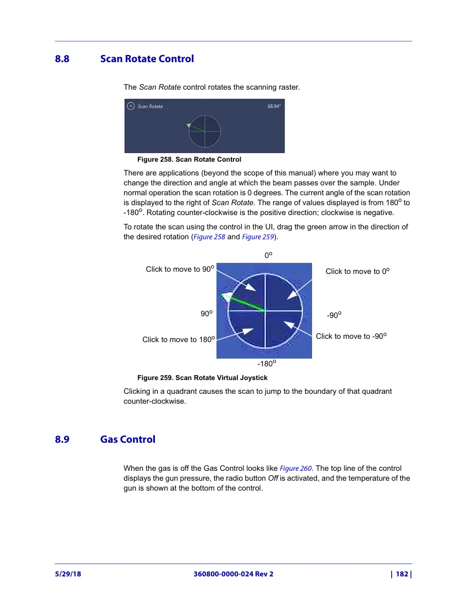

*Page 187 facsimile from `ZEISS_ORION_NanoFab_Operator_Manual_Rev2.pdf`.*

## Page 188

| 183 |
360800-0000-024 Rev 2
5/29/18
Figure 260. Gas Control
To start the flow of one of the gases, use the radio buttons to select the desired gas. In 
Figure 261, Helium has been selected. Once a gas has been selected, two more data 
items are displayed in the top line: the gas selected, and whether the gas flow is being 
regulated or not. The software regulates the pressure in the gun to the value selected 
(referred to as the gas set point), displayed to the right of the gas name (see Figure 
261).
Figure 261. Setting Gas Set Point
You can change the set point in a number of ways. One is to use the drop-down menu, 
as shown in Figure 262.
Figure 262. Gas Set Point Selection
When the drop-down menu is opened, a number of standard values are displayed. 
Select the set point you want.
Another way to change the set point is to use the arrows on either side of the displayed 
value. Each time the arrow on the right is clicked the set point is increased by 10%. 
Clicking the left arrow decreases the set point by 10%.
The set point can also be changed through the Gas Box tab in the Vacuum 
Dashboard. See Section Figure 202, . Pump Turn On/Off Popup in the Vacuum Dashboard 
section of this manual.

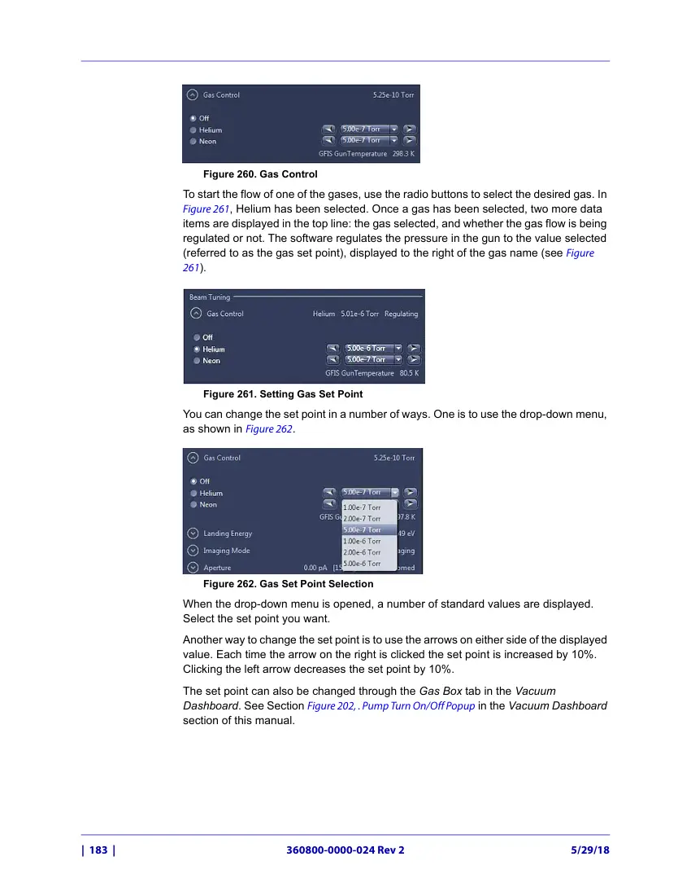

*Page 188 facsimile from `ZEISS_ORION_NanoFab_Operator_Manual_Rev2.pdf`.*

## Page 189

5/29/18
360800-0000-024 Rev 2
| 184 |
8.10
Landing Energy Control
Landing energy is the energy at which ions hit the sample, which is determined by the 
acceleration voltage applied to the source. The Landing Energy control is shown in 
Figure 263.
Figure 263. Landing Energy Control
The accelerator power supply output is displayed to the right of Landing Energy. Below 
Landing Energy is displayed the current saved value for BIV (Best Imaging Voltage) of 
the helium beam. To the right of that are drop-down menus for both the accelerator 
voltage and the extraction field.
The drop-down menu for accelerator voltage has a number of preselected values 
(Figure 264). There are some limits on the available acceleration voltages displayed. 
The accelerator can never be set higher in magnitude than the extraction field and can 
never be more than 25 kV below the extraction field. The accelerator voltage can also 
be set using the Accelerator control (see Section 8.14, Accelerator Control).
Figure 264. Selecting Accelerator Voltage
The Extractor control is enabled only when operating in SFIM mode; otherwise it is 
grayed out. There are three options; all based on the saved value of BIV for helium. 
When running helium the software automatically selects 100% of BIV. When running 
neon, the software selects 82% of BIV, because BIV for neon is typically about 82% of 
the value of BIV for helium. The last option, 105% of BIV, is selected by the software 
when the system is put into standby mode, on the principle that a higher accelerator 
voltage helps to keep the source free of contaminates.
Figure 265. Selecting Extractor Voltage

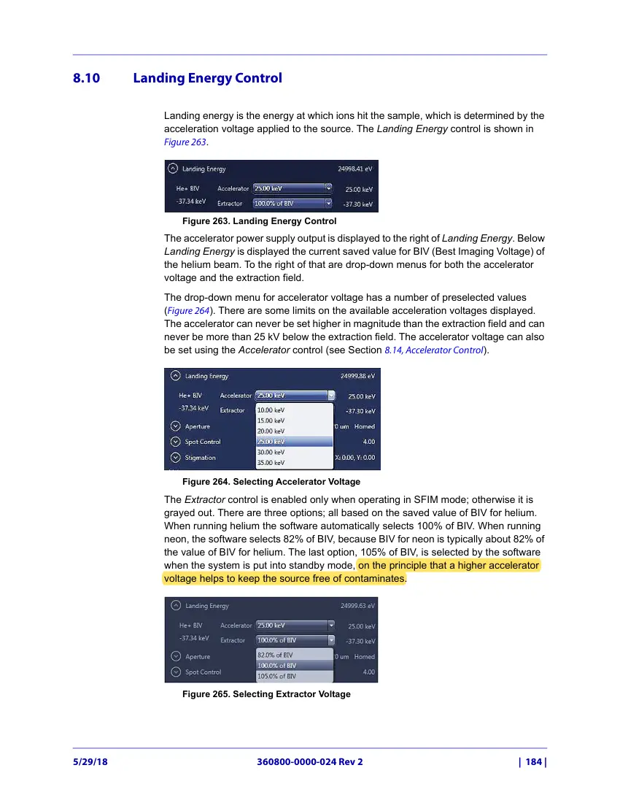

*Page 189 facsimile from `ZEISS_ORION_NanoFab_Operator_Manual_Rev2.pdf`.*

## Page 190

| 185 |
360800-0000-024 Rev 2
5/29/18
8.11
Aperture Control
The Aperture control, shown in Figure 266, displays the beam current, the aperture 
selected, and whether the aperture bar has been homed or not. If the aperture bar has 
not been homed, Not Homed is displayed at the top right corner of the control. In that 
case, the aperture bar must be homed before an aperture can be selected (see 
Section 5.3.1, Homing the Aperture Bar. See also Section 5.3.2, Selecting an Aperture.
Figure 266. Aperture Control
Clicking the alignment tool button, shown in the red box in the bottom right of the 
Aperture control, opens the GFIS Aperture Alignment tool panel (Figure 267). See 
Section 5.3, Aperture Selection and Alignment for information on the use of this window.
Figure 267. GFIS Aperture Alignment Control Panel
In the left center is the aperture alignment virtual joystick (Figure 268). Each pair of 
arrows has a small arrow and a large arrow, which are linked to the two fields below 
the joystick. Clicking a small arrow moves the aperture a small step; clicking a large 
arrow moves it a large step. You can set the sizes of the small and large steps. The 
default value for the small step is 1.00 µm; the large step is 10.00 µm. The directions 
shown on the graphic show which way the image moves on the screen when you click 
the arrows.

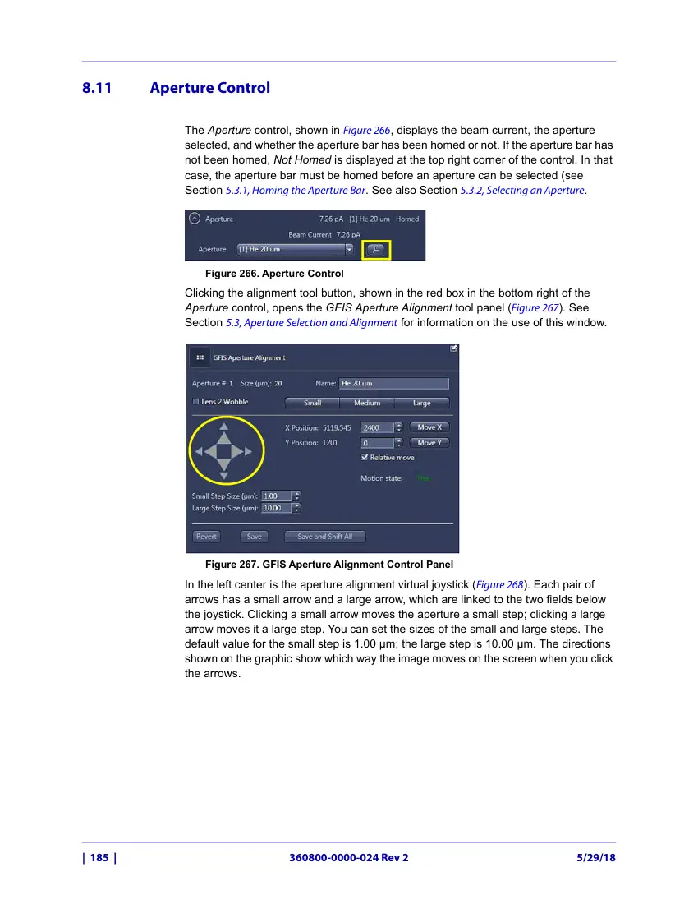

*Page 190 facsimile from `ZEISS_ORION_NanoFab_Operator_Manual_Rev2.pdf`.*

## Page 191

5/29/18
360800-0000-024 Rev 2
| 186 |
Figure 268. Aperture Virtual Joystick
8.12
Spot Control
Spot Control is directly linked to lens 1. The spot number can be changed only when in 
Normal Imaging mode. This control is grayed out when in SFIM mode. For more 
information, see Section 11.14, Spot Control.
Figure 269. Spot Control
The spot control value can be changed by either using the slider or by typing in the text 
box. 
8.13
Stigmation
Stigmation control is used to correct for distortion in the shape of the ion beam. See 
Section11.4, Astigmatism for an explanation of astigmatism. By changing the stigmation 
values, you adjust the small DC voltages on the eight upper octopole plates. 
Stigmation can be controlled using either the Stigmator X and Y knobs on the knob 
panel or Stigmation control, shown below, in the GFIS Column tool panel. Generally, it 
is easier to use the knob panel controls. See Section 5.4.2, Stigmating the Beam for the 
procedure for stigmating the beam.
Right
Down
Up
Left

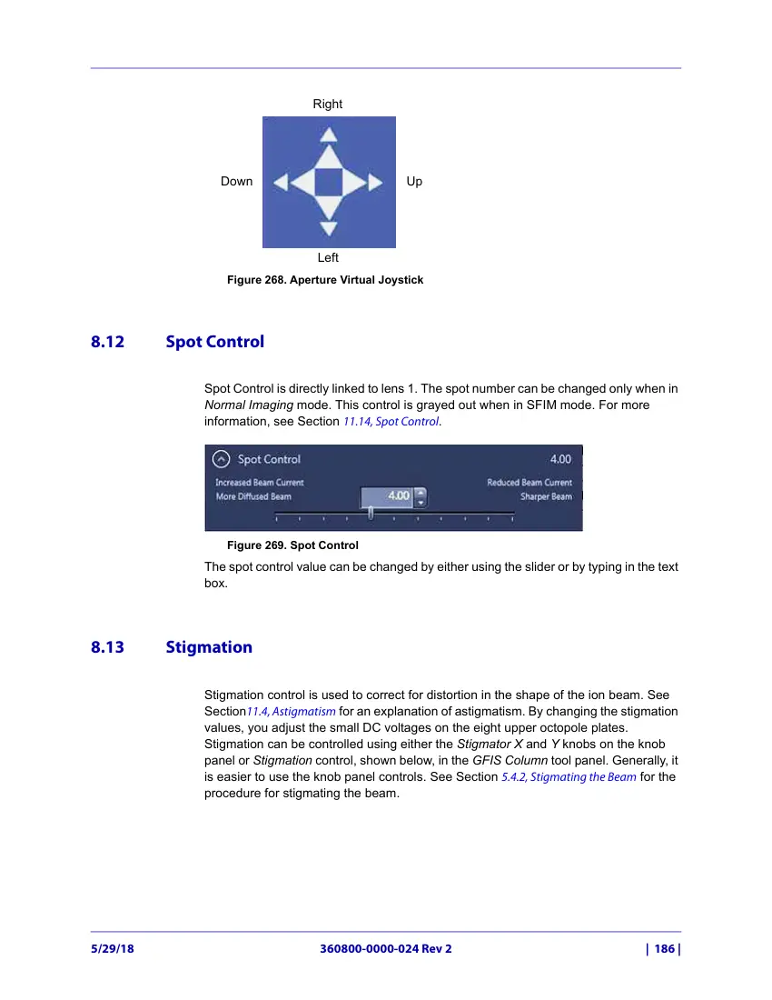

*Page 191 facsimile from `ZEISS_ORION_NanoFab_Operator_Manual_Rev2.pdf`.*

## Page 192

| 187 |
360800-0000-024 Rev 2
5/29/18
Figure 270. Stigmation Control
The stigmation step controls (the two concentric squares in  are somewhat awkward to 
use in the current release of the software as it is not clear what the step sizes are. 
Instead of using these step functions, it is recommended you use the Stigmator X and 
Y knobs on the knob panel.
A useful feature of the virtual joystick is the ability to zero the X and Y stigmation 
values. Right-click on the joystick to bring up the Zero X & Y pop-up menu (see Figure 
271). Some calibrations require zero values for both X and Y stigmation. Click Zero X 
and Zero Y to accomplish that.
Figure 271. Zero X & Y Pop-up Menu
8.14
Accelerator Control
The Accelerator control allows you to set the acceleration voltage to any value, within 
a couple of constraints: the accelerator voltage can never be set to a higher magnitude 
than the extraction field voltage, and it can never be set to less than 25 kV of the 
extraction field voltage. The software prevents the setting of the acceleration voltage 
outside of these limits.
Figure 272. Accelerator Control

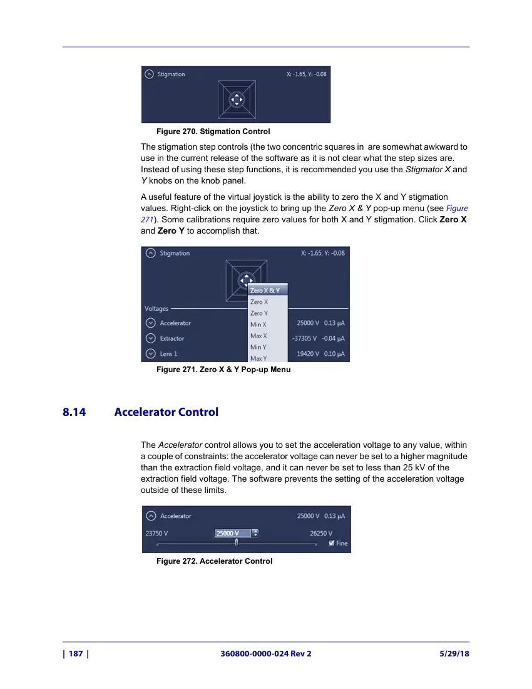

*Page 192 facsimile from `ZEISS_ORION_NanoFab_Operator_Manual_Rev2.pdf`.*

## Page 193

5/29/18
360800-0000-024 Rev 2
| 188 |
8.15
Extractor Control
The Extractor control allows you to set the extraction field voltage to any value, within 
a couple of constraints: the extractor value can only be changed when in the SFIM 
imaging mode (when operating in Normal Imaging mode this control is grayed out) and 
the extractor field voltage can never be set to a lower magnitude than the accelerator 
voltage, or more than 25 kV greater than the accelerator voltage. The software 
prevents the setting of the extractor field voltage outside of these limits.
Figure 273. Extractor Control
8.16
Lens 1 Control
The Lens 1 control is shown below. Use this to set lens 1 voltage to any desired value. 
Lens 1 voltage is linked directly to spot control. Typically, the lens 1 control is used only 
in SFIM imaging mode and Spot control is used in Normal Imaging mode. In SFIM 
mode, lens 1 is used to affect source magnification.
Figure 274. Lens 1 Control
8.17
Lens 2 Control
The Lens 2 control is shown below. Use this control to set lens 2 to any desired value. 
Lens 2 voltage is the focusing control and is linked directly to the Focus knob on the 
knob panel. Although the lens 2 control can be used to focus the beam on the sample, 
it is usually much easier to use the Focus knob.
Figure 275. Lens 2 Control

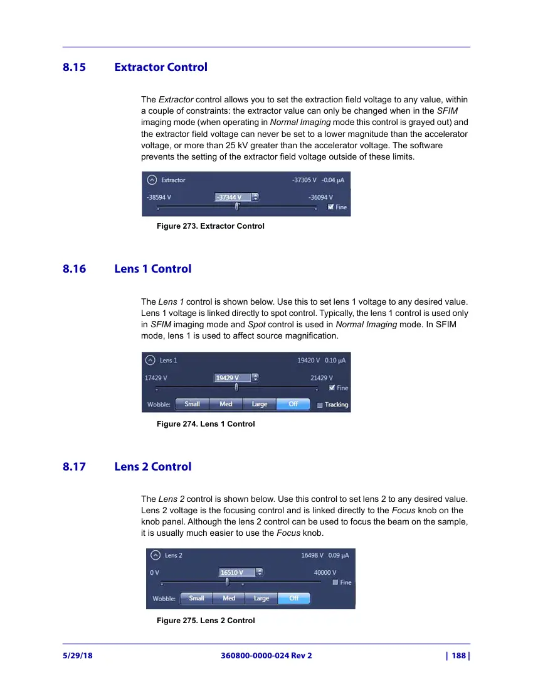

*Page 193 facsimile from `ZEISS_ORION_NanoFab_Operator_Manual_Rev2.pdf`.*

## Page 194

| 189 |
360800-0000-024 Rev 2
5/29/18
8.18
Beam Shift Control
Use the Beam Shift control as well as the Beam Tilt control to electronically fine-adjust 
small DC voltages on the upper and lower quadrupoles, which aligns the ion beam 
down the optical axis of the column. See the section, Quadrupoles or more information 
about the quadrupoles. See Section 5.3.3, Electronic Tilt and Shift Alignment for more 
information.
Use beam shift adjustments to fine-adjust wobble, typically in a FOV less than 5 µm.
Usually, it is much easier to use the Beam Shift knob on the knob panel, although this 
control can be used.
Note:
Make sure that the Tilt/Shift mode toggle is set for shift and not tilt (which 
displays on the bottom right of the UI).
Figure 276. Beam Shift Control
Use the control shown on the right in Figure 276 to shift the beam. Drag the horizontal 
green line to shift the beam in the Y direction or drag the vertical green line to shift the 
beam in the X direction. Use the blue dot on the control to shift the beam in both X and 
Y at the same time.
Use the text boxes on the left to enter beam shift values directly. This is most useful 
when setting these values to zero, as some calibrations require these values to be at 
zero.
8.19
Beam Tilt Control
Use the Beam Tilt control as well as the Beam Shift control to electronically fine-adjust 
small DC voltages on the upper and lower quadrupoles, which aligns the ion beam 
down the optical axis of the column. See the section, Quadrupoles for more information 
about the quadrupoles. See Section 5.3.3, Electronic Tilt and Shift Alignment for a 
description of using the Beam Shift control for aperture alignment.
Use beam tilt adjustments to fine-adjust current emission and image intensity.
Usually, it is much easier to use the Beam Tilt knob on the knob panel, although this 
control can be used.

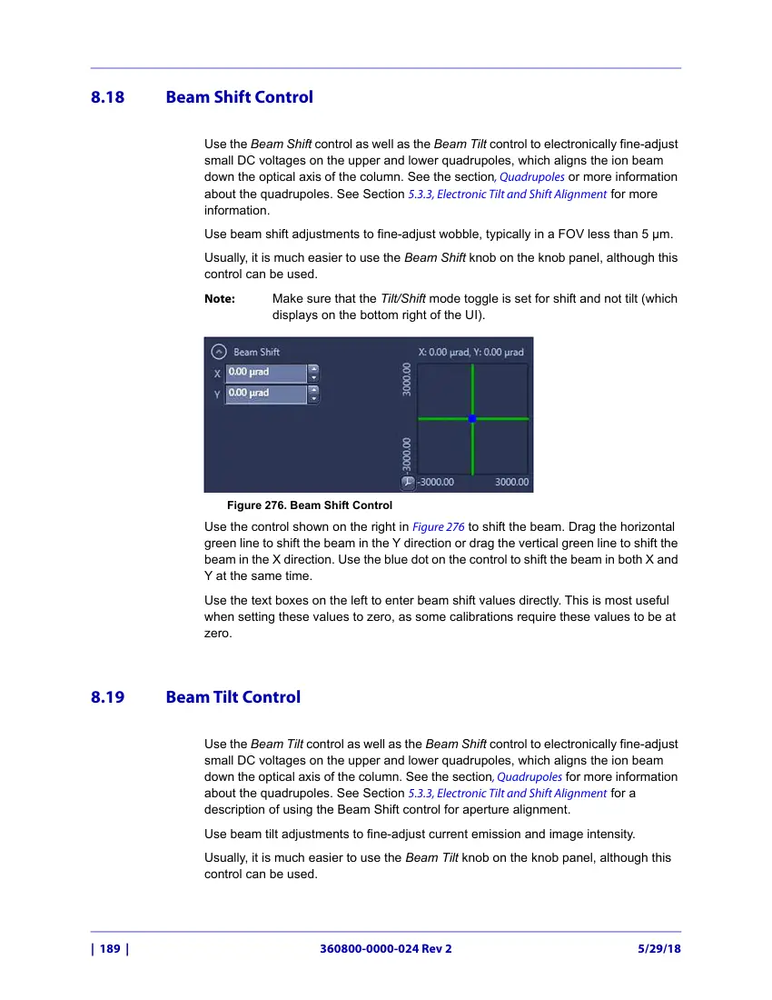

*Page 194 facsimile from `ZEISS_ORION_NanoFab_Operator_Manual_Rev2.pdf`.*

## Page 195

5/29/18
360800-0000-024 Rev 2
| 190 |
Figure 277. Beam Tilt Control
Use the control shown on the right in Figure 277, . Beam Tilt Control to control the beam 
tilt. Drag the horizontal green line to adjust the tilt in the Y direction or drag the vertical 
green line to adjust the tilt in the X direction. Use the blue dot on the control to tilt in 
both X and Y at the same time.
Use the text boxes on the left to enter beam tilt values in directly. This is most useful 
when setting these values to zero since some calibrations require these values to be 
at zero.
8.20
Column States Control
There are three separate column state controls within the Column States control.
Figure 278. Isolation Valve Control
8.20.1
Isolation Valve Control
You can control the column isolation valve (CIV) here as well as through the Vacuum 
Dashboard. Use the button at the top right, across from Isolation Valve is, to toggle the 
state of the CIV between Open or Close. The current state of the CIV is displayed just 
to the left of the button in Figure 278.
8.20.2
Scan Control Mode
Scan Control Mode is usually set to Internal, meaning that the SAS Module is driving 
the raster signals. The other two states are used when the raster is controlled by an 
external (to the NanoFab) scan generator, such as the NPVE option (Figure 279). The 
choice between ExternalActiveHigh and ExternalActiveLow is based on the logic level 
of the blanking signal from the external scan generator.

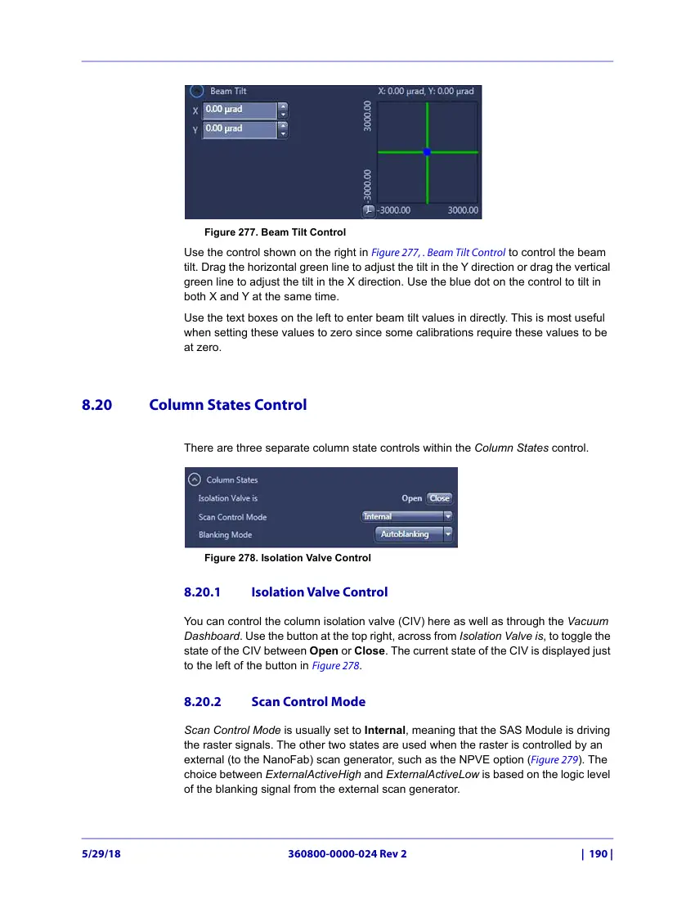

*Page 195 facsimile from `ZEISS_ORION_NanoFab_Operator_Manual_Rev2.pdf`.*

## Page 196

| 191 |
360800-0000-024 Rev 2
5/29/18
Figure 279. Scan Mode Control
8.20.3
Blanking Mode
The Blanking Mode is normally left in Autoblanking. In this state the scan generator 
software determines when to blank and unblank the beam. The beam is blanked 
anytime the beam is not being scanned, and during retrace of the beam.
The Blanked and Unblanked states (Figure 280) are useful for troubleshooting purposes 
and are discussed in the troubleshooting section.
Figure 280. Blanking Mode Control

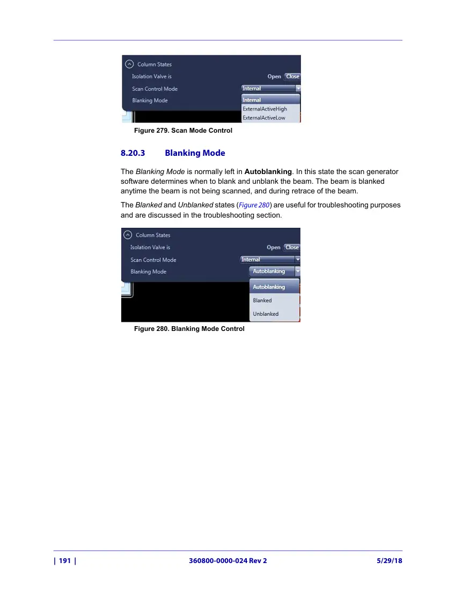

*Page 196 facsimile from `ZEISS_ORION_NanoFab_Operator_Manual_Rev2.pdf`.*

## Page 197

5/29/18
360800-0000-024 Rev 2
| 192 |
9
Presets and Probe Tables
9.1
Using Machine Presets
A preset is a way to use one mouse click to change the NanoFab settings to a 
frequently-used group of settings that would otherwise require several separate 
mouse clicks. Executing a preset changes several of the NanoFab’s settings in a 
logical sequence to arrive at a configuration useful for a specific purpose.
Presets can be used in combination to toggle between two frequently-used 
configurations. One example is imaging/scanning parameters. Imaging parameters 
include scan size (pixel resolution – 256 x 256 to 2048 x 2048), dwell time, type of 
averaging and number of averages.
It is common to use one set of these parameters to “tune” the beam (de-wobble, focus, 
stigmate). This function is usually done at some relatively fast scan rate, which is 
determined by the specific combination of imaging parameters.
It is also common to use a different set of parameters to capture a high quality image 
to save for presentation or further analysis. This function typically calls for higher pixel 
resolution and either longer dwell times or high averaging or some combination of 
both.
Presets can be created for each function (beam tuning and high quality imaging). 
When you want to capture a high quality image on a particular sample, click one preset 
to set the NanoFab parameters for beam tuning. When you are done tuning the beam, 
click another preset to set the NanoFab parameters for a high quality image. You can 
then simply click the Grab button to acquire an image for saving. This sequence can 
be repeated for new samples.
Another example for using a preset is with the flood gun (used for charge 
neutralization). Effective use of the flood gun requires adjustments to voltages that can 
be sample-dependent.  When a sample is unloaded, the flood gun must be powered 
down to protect it from relatively high pressure.  If, and when, a sample is loaded again 
and the flood gun is powered up, default voltages are put in place and not the specific 
voltages that may have been optimized for the sample.  If those voltages are stored in 
a preset, they can be restored easily by applying the preset after reloading the sample.
Following is a description of how you would set up presets for beam tuning and high 
resolution imaging, as an example of how two presets can work together to simplify 
your work flow.
Without a preset, each time you wanted to do high resolution imaging, you would first 
tune your beam as follows, in the Scan Parameters tool panel from the Acquisition 
panel
1.
Click the Acquisition tab in the upper left corner of the Zen UI to access the 
Acquisition tool panel and select Scan Parameters in the Acquisition panel to 
tune the beam up in the Scan Parameters tool panel.

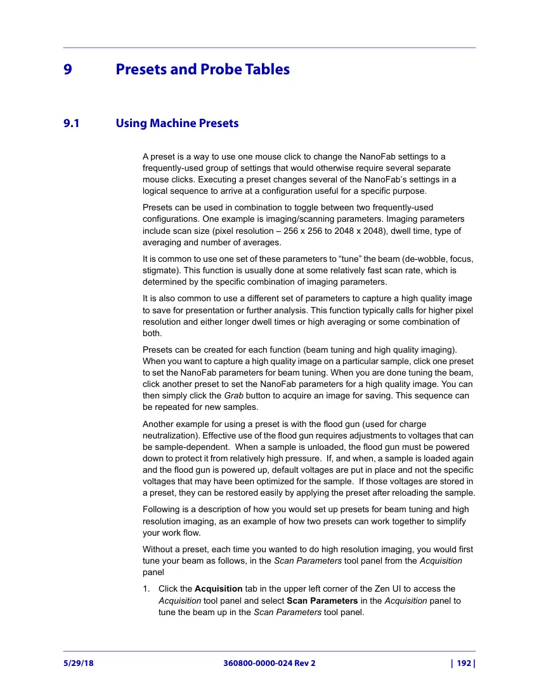

*Page 197 facsimile from `ZEISS_ORION_NanoFab_Operator_Manual_Rev2.pdf`.*

## Page 198

| 193 |
360800-0000-024 Rev 2
5/29/18
Figure 281. Scan Parameters Tool Panel
2.
Set all of the parameters that you use for beam tuning. For this example, select a 
scan size of 256 x 256, dwell time of 1.0 µs, frame for averaging mode, and aver-
aging number of 4.
9.1.1
Example - Preset for Beam Tuning Imaging Conditions
With presets, you can set up these conditions once, and then apply them with one click 
of the preset in the Favorites bar at the top of the UI when ever you need them (see 
Figure 296). Use the following steps to set up the preset:
1.
Click the Machine Presets Setup icon, above the Acquisition tab and to the right 
of Machine Presets in the left corner.
Figure 282. Machine Presets Button
2.
The drop-down list of presets appears, if presets have previously been set up.
Note:
The list is a list of presets that have previously been created by the 
user(s), arranged in groups designated by the user(s).
Note:
A group name can be your own name, or a name for a collection of 
presets of a particular type, or a name that will identify the presets for a 
number of users. It is simply a method of categorizing your presets.

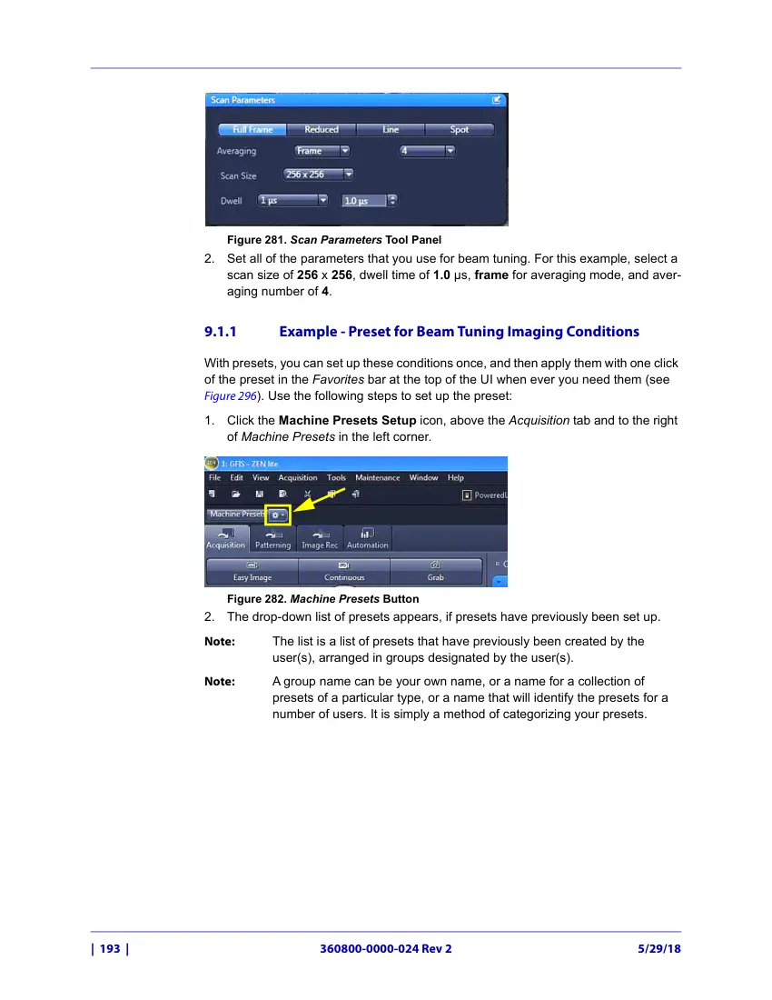

*Page 198 facsimile from `ZEISS_ORION_NanoFab_Operator_Manual_Rev2.pdf`.*

## Page 199

5/29/18
360800-0000-024 Rev 2
| 194 |
Figure 283. List of User-created Presets
3.
To create a preset for the parameters you have previously set up in the Scan 
Parameters tool panel, click the Create button at the top of the list. The Device 
Presets Editor opens.
Figure 284. Device Presets Editor
4.
Click and drag the bottom to open it to its full length, or scroll down as needed.

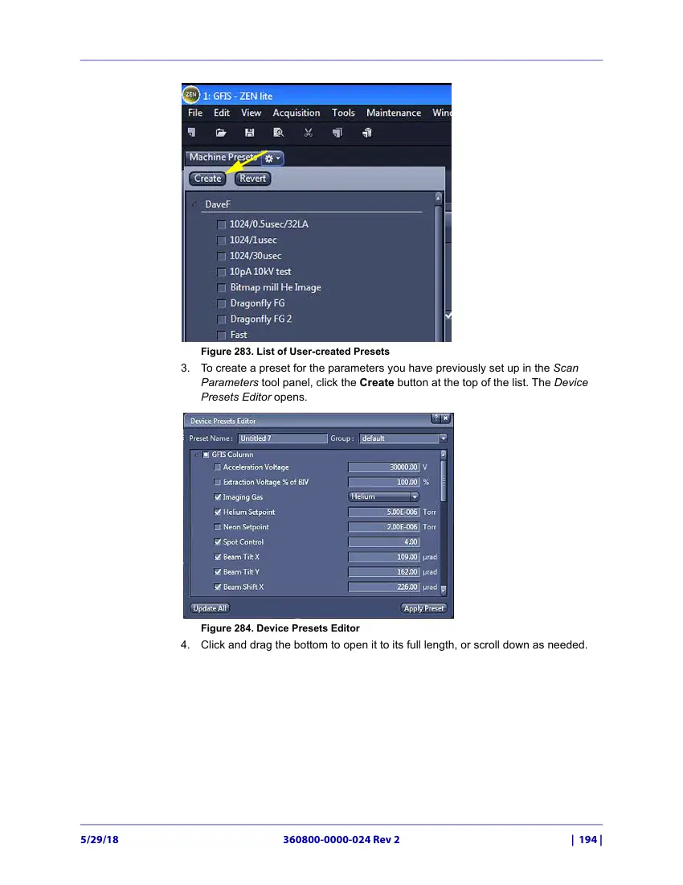

*Page 199 facsimile from `ZEISS_ORION_NanoFab_Operator_Manual_Rev2.pdf`.*

## Page 200

| 195 |
360800-0000-024 Rev 2
5/29/18
Figure 285. Bottom of Device Presets Editor List
5.
Uncheck GFIS Column and ET Detector.
Figure 286. Setting Parameters in Device Presets Editor
6.
At the bottom of the editor are the imaging parameter fields.
7.
Enter the following settings for our example:
–
Averaging: Frame
–
Number of Averages: 4
–
Scan Size: 256 x 256
–
Pixel Dwell: 1.0 µs

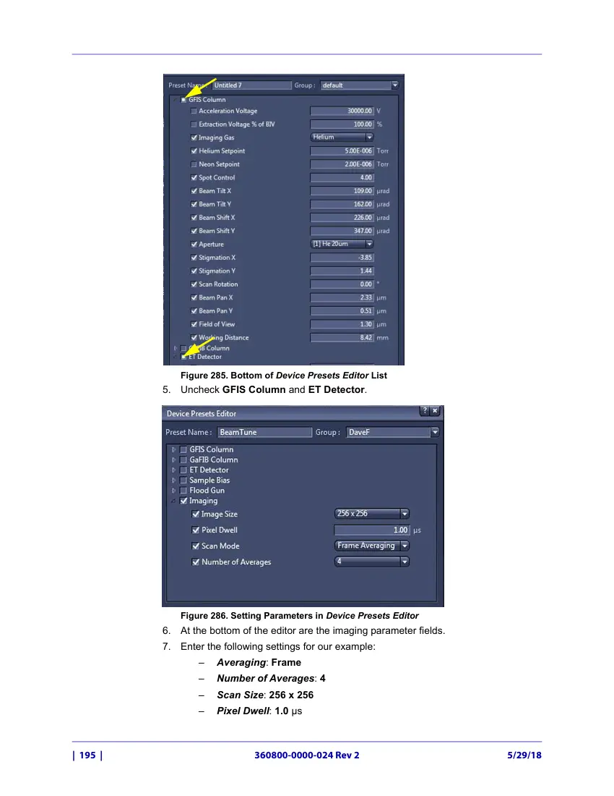

*Page 200 facsimile from `ZEISS_ORION_NanoFab_Operator_Manual_Rev2.pdf`.*

## Page 201

5/29/18
360800-0000-024 Rev 2
| 196 |
Figure 287. Enter or Select Preset Group Name
8.
At the top of the Device Presets Editor, you can select a group name from the 
drop-down list, or enter a new one into the Group field; for example, Operator 1.
Figure 288. Give New Preset a Name
9.
Type the name you want for the preset into the Preset Name field; for example, 
Beam Tuning.
Note:
Keep your preset names short, as you will want to place a lot of them in 
the Favorites bar up at the top of the window (Figure 290). 
Note:
The Favorites bar allows you to easily place presets for your easy access 
when needed. You can remove them when not needed, and bring them 
back later.
10. Save your preset by clicking the X in to top right corner to close the Device Pre-
sets Editor panel.
Figure 289. New Preset and New Preset Group Saved
11. To put your new preset in the Favorites bar at the top of the UI, click the Machine 
Presets tab at the top to open the panel. The new preset group appears at the bot-
tom of the panel with the new preset name below it (Figure 289). 
Note:
If you did not create a new group, but selected an existing group for this 
preset, the new preset appears in the list in Machine Presets at the bottom 
of that group’s list.

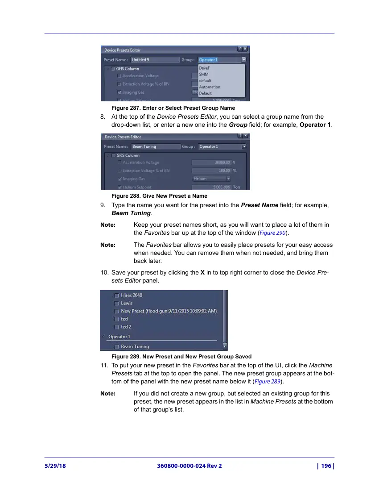

*Page 201 facsimile from `ZEISS_ORION_NanoFab_Operator_Manual_Rev2.pdf`.*

## Page 202

| 197 |
360800-0000-024 Rev 2
5/29/18
Figure 290. Presets in Favorites Bar
12. To add the new preset to the Favorites bar at the top of the window, click the 
check box in front of the name in the Machine Presets list and the name appears 
in the next position in the Favorites bar.
Note:
Later, to apply a preset, left click it. The message, Preset Applied 
Successfully, appears at the bottom of the screen. (You must click it 
deliberately without moving the mouse while clicking).
Figure 291. Preset Applied Successfully Message
9.1.2
Example - Preset for High Resolution Images
In this example we will set up a preset for second set of parameters for high resolution 
imaging.
Figure 292. Click Create to Create a Preset
1.
Click Create to open the Device Presets Editor panel. 
2.
Click and drag the bottom to open it to its full length, or scroll down as needed.

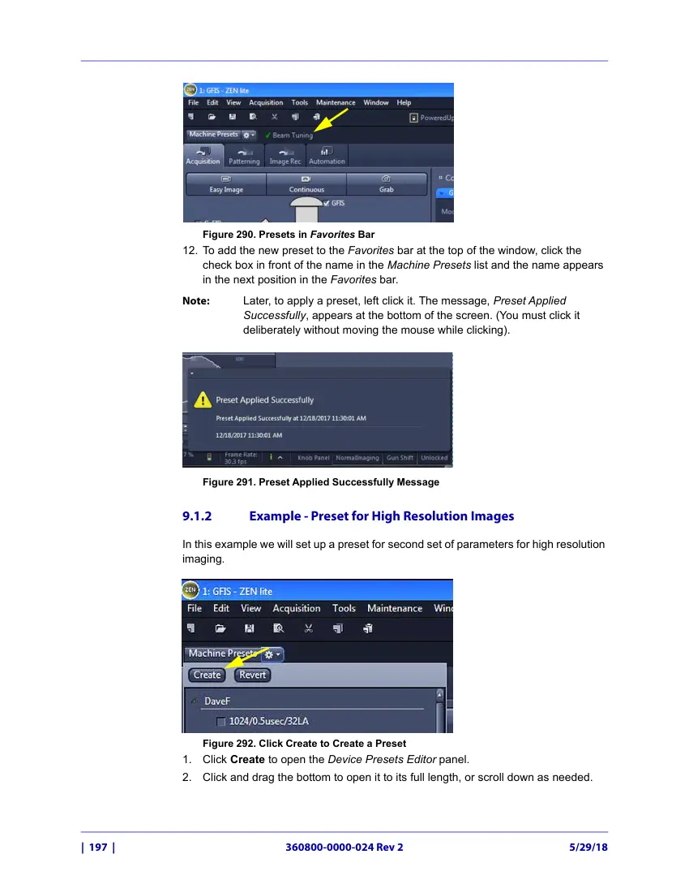

*Page 202 facsimile from `ZEISS_ORION_NanoFab_Operator_Manual_Rev2.pdf`.*

## Page 203

5/29/18
360800-0000-024 Rev 2
| 198 |
3.
Uncheck GFIS Column and ET Detector
4.
Scroll to the bottom of the editor to the Imaging section.
Figure 293. Setting Preset Parameters in Scan Parameters Tool Panel
5.
Make the following entries:
•
Image Size: 2048 x 2048
•
Pixel Dwell: 0.5 µs
•
Scan Mode: Line Averaging
•
Number of Averages: 16.
Note:
Image Size is the same as Scan Size, the number of pixels in the image, 
which is used elsewhere in the UI.

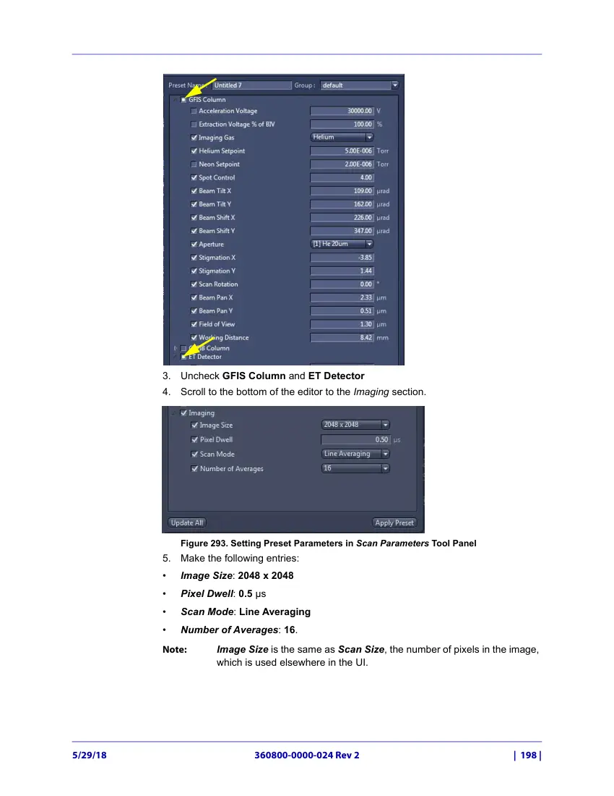

*Page 203 facsimile from `ZEISS_ORION_NanoFab_Operator_Manual_Rev2.pdf`.*

## Page 204

| 199 |
360800-0000-024 Rev 2
5/29/18
Figure 294. Select Presets Group
6.
Select the group name from the drop-down list; for example, Operator 1.
7.
Name the new preset; for example, HiRes Image.
8.
Save your preset by clicking the X in to top right corner to close the Device Pre-
sets Editor panel.
Figure 295. New Preset Group and Preset
9.
Select the Machine Presets tab at the top. The new preset group appears at the 
bottom of the panel with the new preset name below it.
Figure 296. Favorites Bar
10. Click the check box in front of the name in the Machine Presets list to add it to the 
Favorites bar (Figure 296).
Now that the two presets are set up, high resolution imaging can be done much more 
easily than in the past. First select your Beam Tuning preset in the Favorites bar and 
then tune the beam. Next select the Hi Res preset and grab your image. Slight 
adjustments may be necessary for fine tuning and can be made if desired.
9.1.3
Additional Preset Features
There are various ways of editing an existing preset, depending on the situation.
Loading in Preset Parameters
1.
If you want to edit specific parameters of an existing preset, make your changes in 
the Device Presets Editor. For example, you may wish to change the dwell time

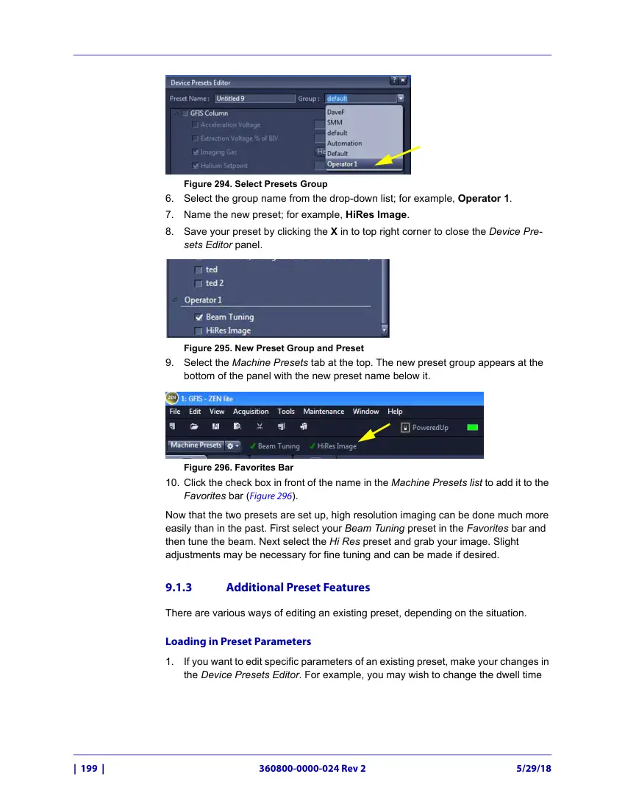

*Page 204 facsimile from `ZEISS_ORION_NanoFab_Operator_Manual_Rev2.pdf`.*

## Page 205

5/29/18
360800-0000-024 Rev 2
| 200 |
from 0.5 to 1.0, and perhaps other parameters, such as the number of averages. 
Right-click the preset name in the Machine Presets list.
Figure 297. Editing a Preset
2.
Select Edit. The Device Preset Editor screen appears.
Note:
You can also double-click the preset name to open Device Presets Editor.
Figure 298. Editing Preset in Device Presets Editor
3.
Change Pixel Dwell to 1.00, for example, and any others you wish to change.
4.
Click the X in the upper right corner to close the Device Presets Editor, and your 
changes are saved.
Update All by Reading In Elements
In another circumstance, you may have made various adjustments. In addition to 
changing specific settings, such as dwell time, perhaps you’ve made adjustments via 
the knob panel to your stigmation and other GFIS column parameters in order to fine 
tune your result. In this case, you may want to save all of the adjustments to your 
preset. To accomplish this, click the Update All button in the bottom left of the Device 
Presets Editor. The outline around the button turns blue and any specific fields you’ve 
changed plus the knob panel adjustments are saved to the preset.

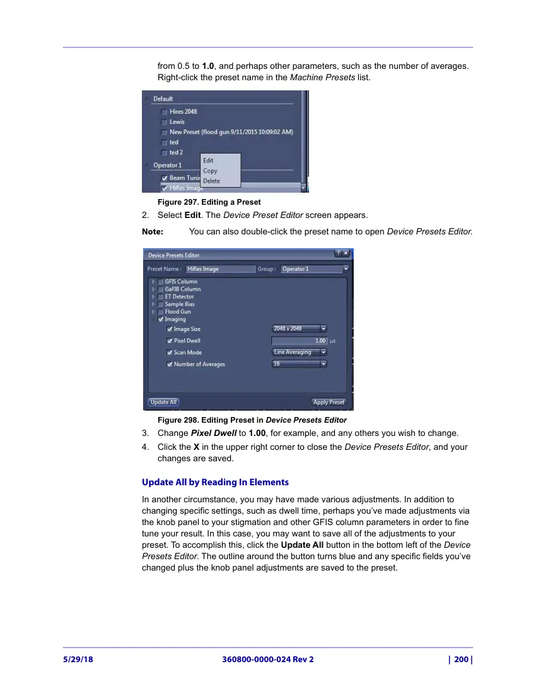

*Page 205 facsimile from `ZEISS_ORION_NanoFab_Operator_Manual_Rev2.pdf`.*

## Page 206

| 201 |
360800-0000-024 Rev 2
5/29/18
Update One of Several Changes
In another scenario you’ve made some experimental changes to 2 or 3 parameters of 
a preset and perhaps have forgotten which, but decide you want to save only one; for 
example, dwell time.
Figure 299. Saving One of Several Preset Edits
1.
Place your cursor just to the left of the field you want to update and right-click. The 
Update Element pop-up appears. 
2.
Click Update Element to update the single element. Any other changes you 
made to the system are not applied to the preset.
Figure 300. Single Preset Edit Saved

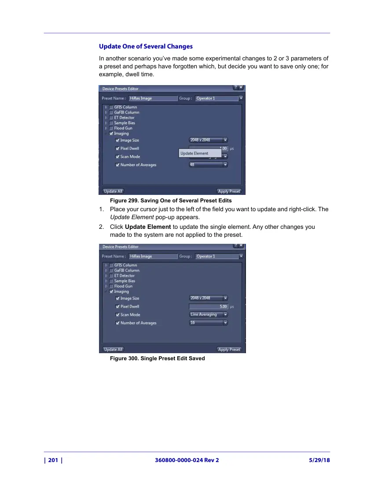

*Page 206 facsimile from `ZEISS_ORION_NanoFab_Operator_Manual_Rev2.pdf`.*

## Page 207

5/29/18
360800-0000-024 Rev 2
| 202 |
9.2
Probe Tables
The Damascus software release introduced a new feature into the tool set of the 
NanoFab: the probe table. Probe tables have been a staple of the gallium column in 
SmartSEM, and we have recognized the utility of the feature and chose to integrate it. 
With this new feature come new user interfaces and system behavior, which this 
section addresses.
9.2.1
Probe and Probe Table Basics
A probe is a set of column settings that configure the column for a specific beam 
current, landing energy, and beam size for the performance of a particular task. The 
parameter settings are listed in a probe table, and you give it a name that is 
recognizable by you for that task. As you develop other tasks that have repetitive 
settings and create probes for them, you add them to your table. For each probe you 
assign a particular value to each of the parameters listed in the table above, for the 
type of column/beam type you are using.
Examples: Helium High Resolution; Neon milling 
Note:
Use a probe instead of selecting an aperture and other settings.
The idea of the probe table is to use a probe (or “beam”) for a specific task rather than 
selecting an aperture and making other adjustments and settings for that specific task. 
You can incorporate the appropriate aperture in the probe but also include other 
settings appropriate for that task (accelerating voltage, spot control/beam current, 
electronic beam alignment settings specific to the spot control setting, etc.)
For example, you could create a probe for high resolution imaging. This probe could 
incorporate a small aperture, high spot control setting, high accelerating voltage, 
electronic beam tilt specific to the spot control setting and settings for the x and y 
stigmators. By selecting the probe, all of these settings are put into place.
As another example, you can create a probe for patterning in a gold sample. Perhaps 
this patterning requires a relatively high beam current. You may incorporate a relatively 
large aperture and/or low spot control setting in the probe for this task, and additional 
settings specific to that aperture and spot control. These settings are different than 
those used for high resolution imaging.
In this scenario, you can select the “Gold Patterning” probe, use the probe to make a 
pattern, and then select the “High Res Imaging” probe to take an image of the pattern. 
The system would automatically change aperture, spot control, alignment, stigmator 
and other settings as appropriate.
You can adjust or maintain each probe by selecting the probe, making necessary 
adjustments (to the stigmator values, for example) and saving the changes (see 
below).
New probes can be created for new tasks as needed by adding an entry from the 
probe table.
Once you have probes listed in your tables, you can then apply them by the press of a 
button. Upon being applied, each setting in the selected probe is written to the column,

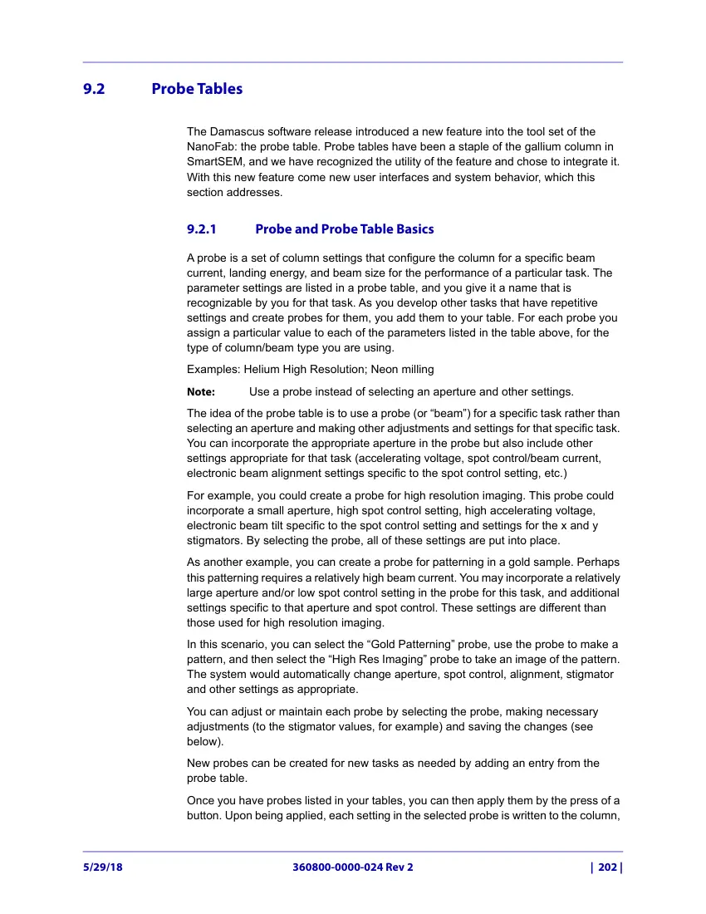

*Page 207 facsimile from `ZEISS_ORION_NanoFab_Operator_Manual_Rev2.pdf`.*

## Page 208

| 203 |
360800-0000-024 Rev 2
5/29/18
which makes the necessary changes and reports back status messages. Each probe 
table has a Reference Probe. Delta parameters in the table use the reference probe 
and the previous probe to determine the new value (see Figure 301).
Note:
If no probe is selected, the reference probe is selected at power up.
Figure 301. A Probe Table
Note:
Although this table is labeled GFIB Helium Probe Table, the table is a 
GFIS table, not a Ga FIB table. It is named incorrectly. 
There are two probe tables for the GFIS column: one for the helium beam, and another 
for the neon beam. The Capella column has one probe table for the gallium beam.
Note:
“Spot Number” in the GFIS lists of parameters refers to “Spot Control”.
The list of parameters that can be set in your probes can be seen in Figure 302.
Figure 302. Table of Probe Parameters
GFIS Column - He or Ne
Capella (Ga FIB) Column
Probe name
Probe Name
Landing Energy
Landing Energy
Beam Current
Beam Current
Aperture Index
Aperture Index
Aperture Offset (X,Y)
Aperture Offset (X,Y)
ΔWorking Distance
Δ Focus Voltage
Extractor % of BIV
Extractor When Saved
Gas Pressure
MidColumn Shift (X,y)
Midcolumn Tilt (X,y)
Spot Number
Lens 1 Voltage
Pan Offset (X,Y)
Stigmation (X,Y)
Stigmation (X,Y)
Mill Defocus
Mill Defocus

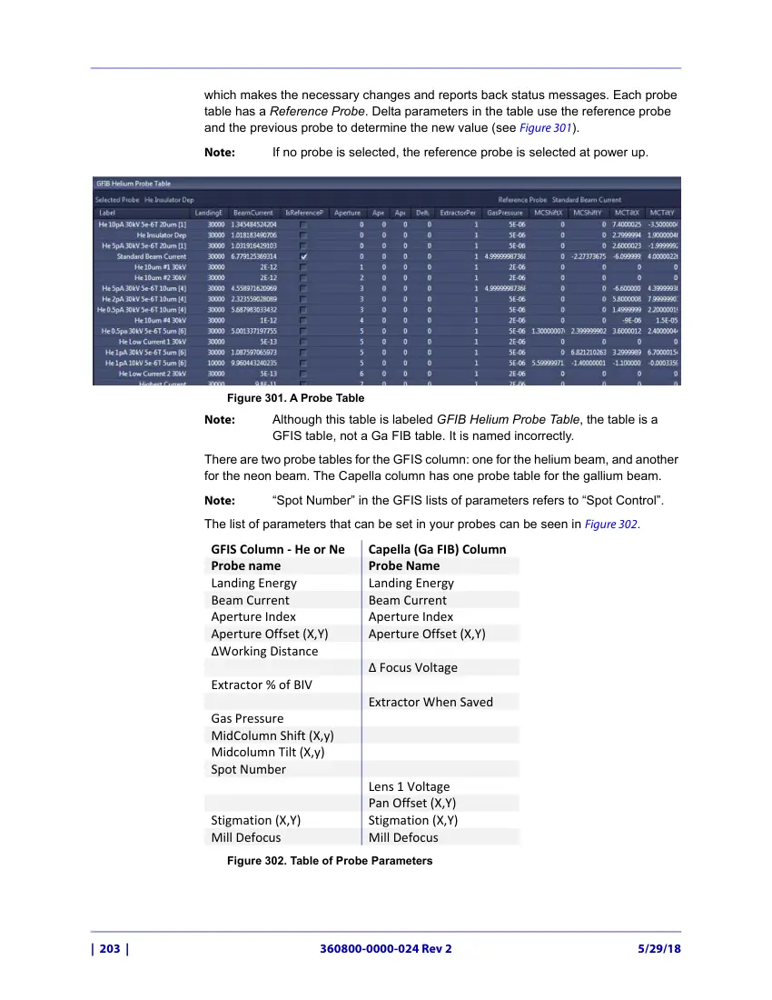

*Page 208 facsimile from `ZEISS_ORION_NanoFab_Operator_Manual_Rev2.pdf`.*

## Page 209

5/29/18
360800-0000-024 Rev 2
| 204 |
9.2.2
Column User Interfaces
The user interfaces for the GFIS and Gallium columns have been simplified in an effort 
to give the user the most useful information in the simplest way possible. The goal of 
this redesign was to provide all of the controls needed to run each column, assuming 
normal operating conditions, without any redundant controls.
Figure 303. GFIS Column Tool Panel
This simplicity is achieved by the versatility of probes. Probes combine Landing 
Energy, Aperture position, Beam Current, and various other settings which affect the 
characteristics of the beam, so many previously unrelated controls can now be hidden, 
while still providing the user with full control of the column.
All of the settings governed by the probe control are still available by clicking the 
“Show All” option in the upper right corner.
Figure 304. Probe Tool Panel
The probe control allows users to select and apply probes, and access the table(s) for 
reference or advanced editing. To apply a probe, simply select the probe wanted from 
the drop-down list, and click the Apply Probe button next to it. 
As the GFIS column has a probe table for each gas, there are 2 sets of probe table 
controls. If the user applies a probe associated with the gas that is not currently 
flowing, the system automatically takes the appropriate actions of switching gasses. 
The sprocket button to the right of the Apply Probe button opens the associated probe 
table (Figure 304).
9.2.3
Probe Editing
Because probes encompass a wide range of features that must all be set together, 
there is now a Probe Edit mode for each column, accessible via the Mode drop-down 
menu at the top of the column page (Figure 305).

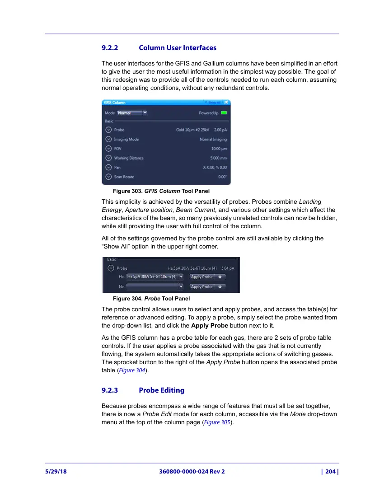

*Page 209 facsimile from `ZEISS_ORION_NanoFab_Operator_Manual_Rev2.pdf`.*

## Page 210

| 205 |
360800-0000-024 Rev 2
5/29/18
Figure 305. Mode Drop-down menu
The Probe Edit tool panel provides all the functionality necessary to tune and define 
the beam, with no need to go back and forth to the Normal Mode tool panel under 
normal operating conditions.
Figure 306. Probe Edit Control Panel
Changes made on this panel affect the column in real time, but are not committed to 
the table until you click the Save button in the top right corner. If you want to revert the 
column to the last saved settings, click the Undo button to reapply the current probe, 
overwriting any unsaved changes.
The Probe Edit tool panel also provides controls to change Pan, Working Distance and 
Field of View. While these settings are not saved as part of the probe, they are useful 
when tuning the beam, thus justifying their inclusion on the panel.
You may find it more convenient to use the normal UI with knobs to tweak everything 
(SFIM alignment with MC Tilt, L2 wobble with MC Shift, focus, stigmation), and then go 
to the Probe Edit tool panel, click the Save button, and then back to Normal mode. The

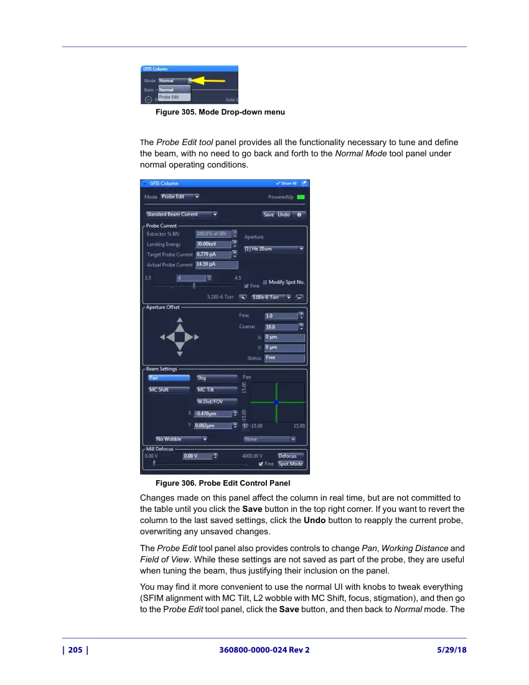

*Page 210 facsimile from `ZEISS_ORION_NanoFab_Operator_Manual_Rev2.pdf`.*

## Page 211

5/29/18
360800-0000-024 Rev 2
| 206 |
controls behavior in the Probe Edit tool panel is different in at least one instance; for 
example, the Spot Control slider behavior is different here with respect to the normal 
UI slider. The greatest possible use of the Probe Edit tool panel might be in remote 
sessions.
Note:
The Aperture Offset section of the Probe Edit tool panel should only be 
used for the Ga FIB column.
9.2.4
Patterning
Probes were originally created to improve the consistency and to reduce the overhead 
of patterning, so the probes are tightly integrated into the Zen patterning engine. Each 
pattern may specify the probe which is used to mill it. 
Each column’s probes feature a Mill Defocus parameter. This value is used to apply an 
offset to the focus voltage while patterning, and is a useful tool for optimizing pattern 
milling and deposition, especially with the larger beam currents of the Ga FIB column.
In the context of patterning, probes may be used in conjunction with machine presets 
(see Section 9.1, Using Machine Presets). In this case, the probe is applied first, followed 
by the machine preset. As machine presets can overwrite the values set by probes, 
care should be taken to ensure that the combination of probe and presets set all of, 
and only, the parameters necessary to perform the pattern operation, or unintended 
behavior may ensue.
Figure 307. Shape Properties Tool Panel - Apply Probe selected

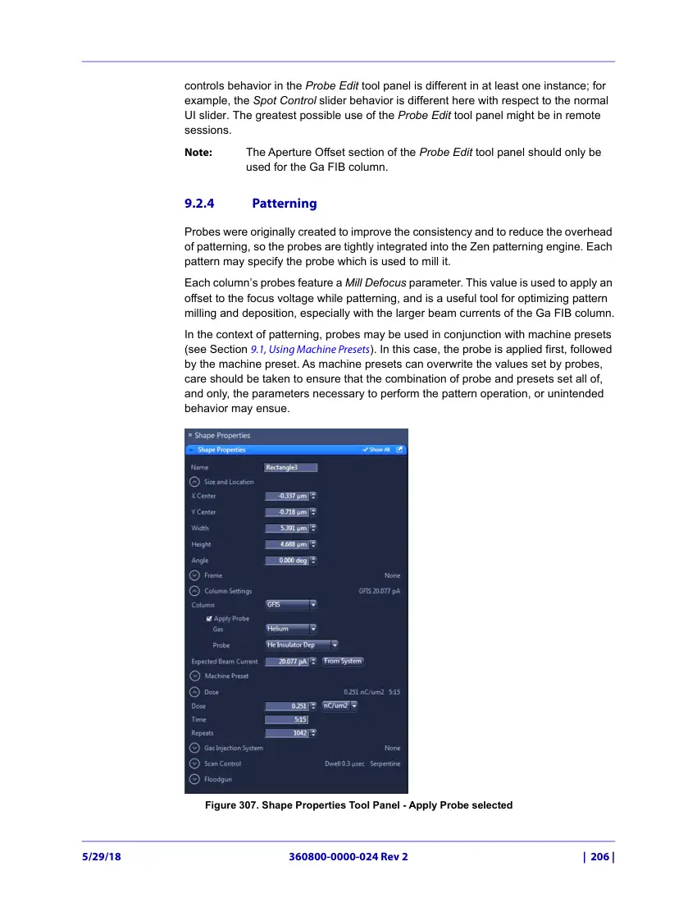

*Page 211 facsimile from `ZEISS_ORION_NanoFab_Operator_Manual_Rev2.pdf`.*

## Page 212

| 207 |
360800-0000-024 Rev 2
5/29/18
9.2.5
Automation
The probe tables are integrated into the NanoFab automation software as well. 
Developers are able to get information about each column’s probe table(s), apply 
probes, and even create new probes from within their work flows.
Figure 308. Lists of Probe Tables
The ProbeTableInfo activities in the Properties panel (Figure 309) allow the user to
–
Query and get probes by name
–
Obtain a collection of all probes in the table
–
Obtain the reference probe
–
Obtain the selected probe
–
Create and get a new probe
Figure 309. Probe Properties Panel
The probe objects returned by the ProbeTableInfo activities expose the settings of the 
probe, which are both readable and writable. Writing a new value to a setting this way 
will immediately save it.
Probes can be added to patterns created via automation as well. This can be done by 
assigning a probe to the Probe field in the CreateScanParameters activity.

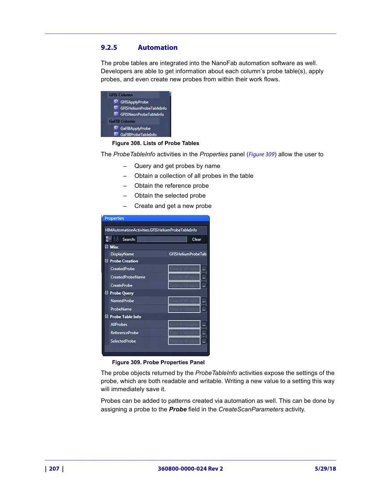

*Page 212 facsimile from `ZEISS_ORION_NanoFab_Operator_Manual_Rev2.pdf`.*

## Page 213

5/29/18
360800-0000-024 Rev 2
| 208 |
9.2.6
Probe Table Display
Each probe table may be viewed in its entirety by going to the Probe control on the 
column user interface panel and clicking the sprocket icon that corresponds with the 
desired probe table. Probes may be created or deleted from the probe table display 
window using the + and Garbage Can buttons in the lower right corner. Changes made 
to the probe table from this window are immediately saved. Any probe can be applied 
from this window by right-clicking on the row for that probe and clicking Apply Probe 
from the context menu.
The probe table display window is intended for probe management by tool 
administrators, and should be used with care to avoid accidental changes or deletions 
of probes.
Note:
There are currently software issues with editing the text in these cells: see 
the Note at the bottom of the next page.
Figure 310. GFIS Helium Probe Table
Note:
This table is named GFIB Helium Probe Table in error. It is a GFIS table.
9.2.7
Putting Probes to Work
Using Probes
To use a probe:
•
Expand the Probe section of the GFIS Column tool panel.
•
Select the probe from the Probe drop-down list.
•
Click the Apply Probe button.
Adjusting Probes
To adjust a probe:
•
With the appropriate probe applied, make adjustments (accelerating voltage, spot 
control, electronic beam tilt and shift, stigmators, focus, etc.).

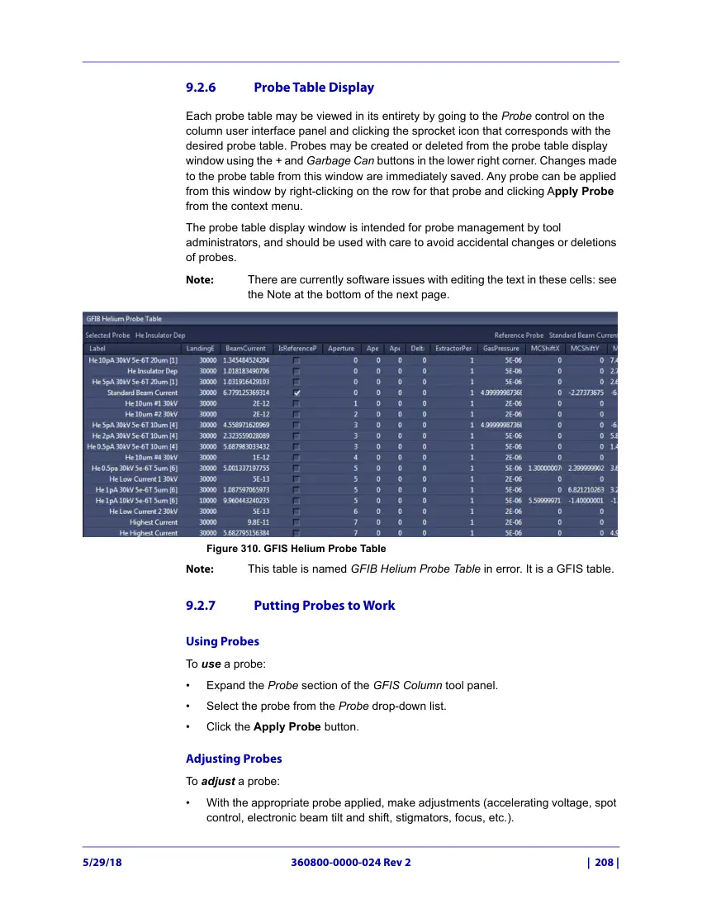

*Page 213 facsimile from `ZEISS_ORION_NanoFab_Operator_Manual_Rev2.pdf`.*

## Page 214

| 209 |
360800-0000-024 Rev 2
5/29/18
•
Change from Normal to Probe Edit mode.
•
Click the Save button
•
Return to Normal mode
Creating New Probes
To create a new probe:
•
Make all the necessary changes to the system for the probe you want to create 
(accelerating voltage, aperture size, spot control, electronic beam tilt, electronic 
beam shift, focus, stigmation, etc.).
•
Expand the Probe section of the GFIS Column tool panel.
•
Select the cog icon to the right of the Apply Probe button.
•
Click the + icon in the lower right corner of the probe table
•
Highlight the new probe name in the left-most column of the probe table and cre-
ate an appropriate name
•
Close the probe table by clicking the X in the upper left corner (this saves the new 
probe – there is no Save button in the probe table.
•
To use this probe immediately, select it from the Probe drop-down list and click the 
Apply Probe button (otherwise, the probe that was in place just prior to creating 
the new one will still be displayed).
Since the Save button in Probe Edit mode is not used in this sequence, the probe 
that was in place just prior to the new probe being created is not disrupted.
Note:
It is recommended that you create new probes using this sequence, and 
not by entering condition values in the Selected Probe table screen, due 
to some anomalies in the Damascus/Delft releases of the software that 
will be resolved in a future release; namely
–
The probe tables do not specify what units are being used for any of the 
conditions; for instance, beam current may be seen as pAs in the UI, but 
appear as Amps in the probe table, so 5 pA would appear as 5......E-12.
–
Entering decimal points: Decimal points can not be entered after any 
numerical value; therefore, if you enter 0.5, it appears as 5, or if you enter 
5.3, it appears as 53.
–
Apertures: Apertures are numbered from 1 to 15 in all other screens in the 
UI, but are numbered from 0 to 14 in the probe tables.
–
If you enter a value into the probe table with, for instance, two decimal 
places, and save it in the Probe Edit screen, it is converted to 14 decimal 
places and thus can be somewhat unrecognizable.

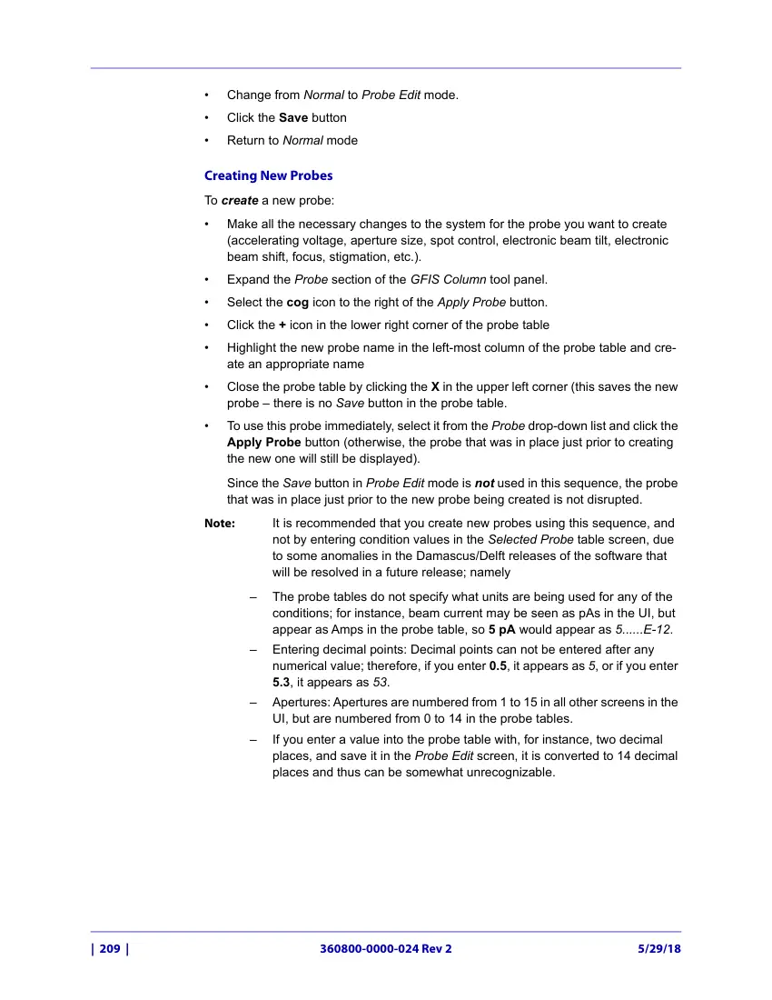

*Page 214 facsimile from `ZEISS_ORION_NanoFab_Operator_Manual_Rev2.pdf`.*

## Page 215

5/29/18
360800-0000-024 Rev 2
| 210 |
10
Correlative Microscopy
10.1
Overview
Shuttle & Find is a UI module that allows users to locate and examine image features 
on one enabled Zeiss product, e.g., light microscope, Crossbeam system, and the 
NanoFab, and transfer those images to other enabled Zeiss products so that sample 
positions of the images can be precisely located and examined in the receiving tool. 
Users can now transfer features of interest back and forth between any products that 
support Shuttle & Find.
The Shuttle & Find module provides a user interface and data management which 
essentially stores a series of lock points in two coordinate spaces. These points are 
used to reference features in either coordinate space. Three lock points are selected 
as this gives the space scale in both X and Y as well as rotation and orthogonality, as 
shown in the diagram below.
10.1.1
A Summary of the Process
1.
A sample of interest is loaded into the microscope and three lock points are 
located using the Shuttle & Find module, which establishes a coordinate space 
that the features of interest will be referenced in, called the original coordinate 
space.
2.
The locations of any number of features of interest are found, which are automati-
cally stored in the Shuttle & Find coordinate space when the image is saved in 
Zen using the .CZI image format.
3.
The holder with the sample is loaded into another (or even the same) microscope 
and the same three lock points are located, which establish a working coordinate

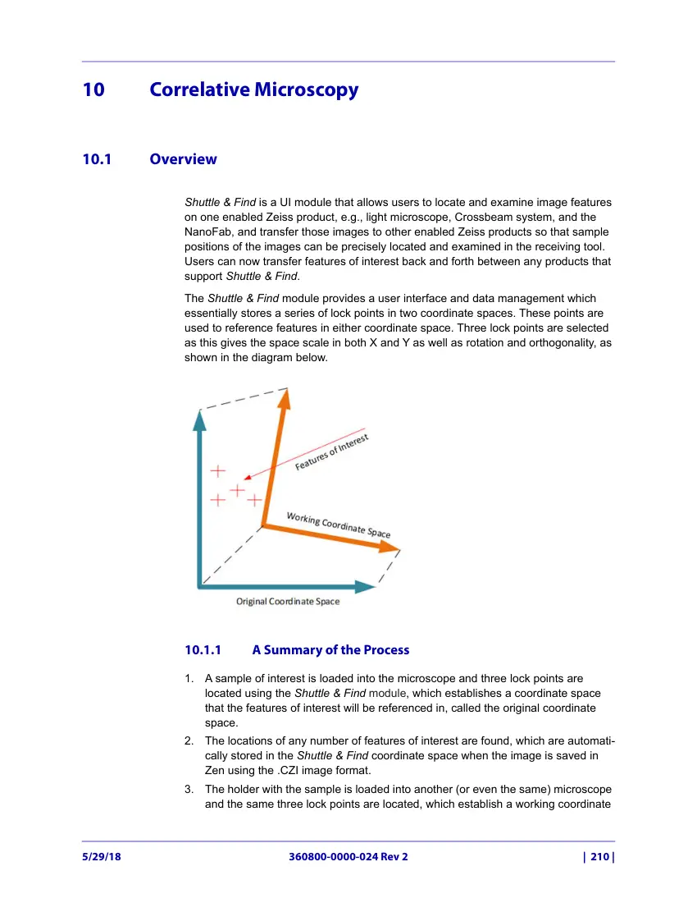

*Page 215 facsimile from `ZEISS_ORION_NanoFab_Operator_Manual_Rev2.pdf`.*

## Page 216

| 211 |
360800-0000-024 Rev 2
5/29/18
space and a lock between the two coordinate systems whereby all features of 
interest from the original coordinate space can be located in the working coordi-
nate space. 
4.
The images from the original microscope are loaded into the working microscope. 
By matching the reference locations in the original images to those in the live 
image, Shuttle & Find allows you to locate all features of interest easily, even if the 
working coordinate space has a different scale and rotation.
5.
The image sizes and orientations in the two coordinate spaces are matched.
10.2
Zeiss Shuttle & Find Holders
Zeiss provides standard holders for use in Shuttle & Find that fit into the standard 
Zeiss dovetail. The Orion NanoFab can accept any of these holders.
Other holders can be used for correlative microscopy. Users can lock any two 
coordinate spaces by finding the matching lock points on any holder that has features 
of interest relative to the same coordinate space. The standard Shuttle & Find holders 
have the advantage of having built-in lock points which appear in the Sample 
Management tool panels. All holders that are listed in the Sample Management tool 
panel have a wire frame outline that is used in other parts of the UI. Selecting a holder 
in the Sample Management tool panel updates the software everywhere the sample 
holder is needed.
If using other holders, there may be limitations on the distances you can use when 
creating lock points, due to differences in imaging systems. For example, the stage 
travel distance is 50 mm for the NanoFab, allowing a maximum travel with the Shuttle 
& Find holder of 43 mm. If the Original Coordinate Space is created with a distance 
between lock points greater than 43 mm, a NanoFab user would not be able to lock the 
two coordinate spaces. The NanoFab correlative holder has such lock points 
permanently located on the three tabs machined into the holder which are within the 
allowable travel range.

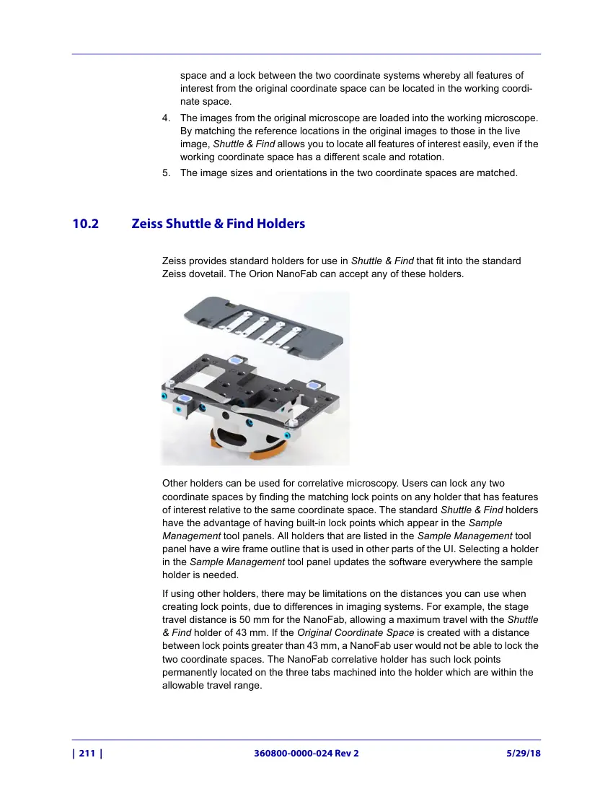

*Page 216 facsimile from `ZEISS_ORION_NanoFab_Operator_Manual_Rev2.pdf`.*

## Page 217

5/29/18
360800-0000-024 Rev 2
| 212 |
10.3
Using Shuttle & Find
The following steps describe the Shuttle & Find process using the Orion NanoFab tool. 
The process is similar using other systems that enable Shuttle & Find, but there are 
differences, depending on the platform.
10.3.1
Activating Your License
The Shuttle & Find module is a licensed product. After purchasing a license the license 
key must be entered into the license manager.
1.
Select Tools > License Manager.. from the task bar at the top of the main screen 
in the Zen UI. The ZEN License Manager dialog box opens.
2.
Enter the user license key, with no spaces, into the License Key field at the bot-
tom of this dialog box and click Register. A Correlative Microscopy Active notice 
appears and Shuttle & Find is enabled.
3.
The license is created

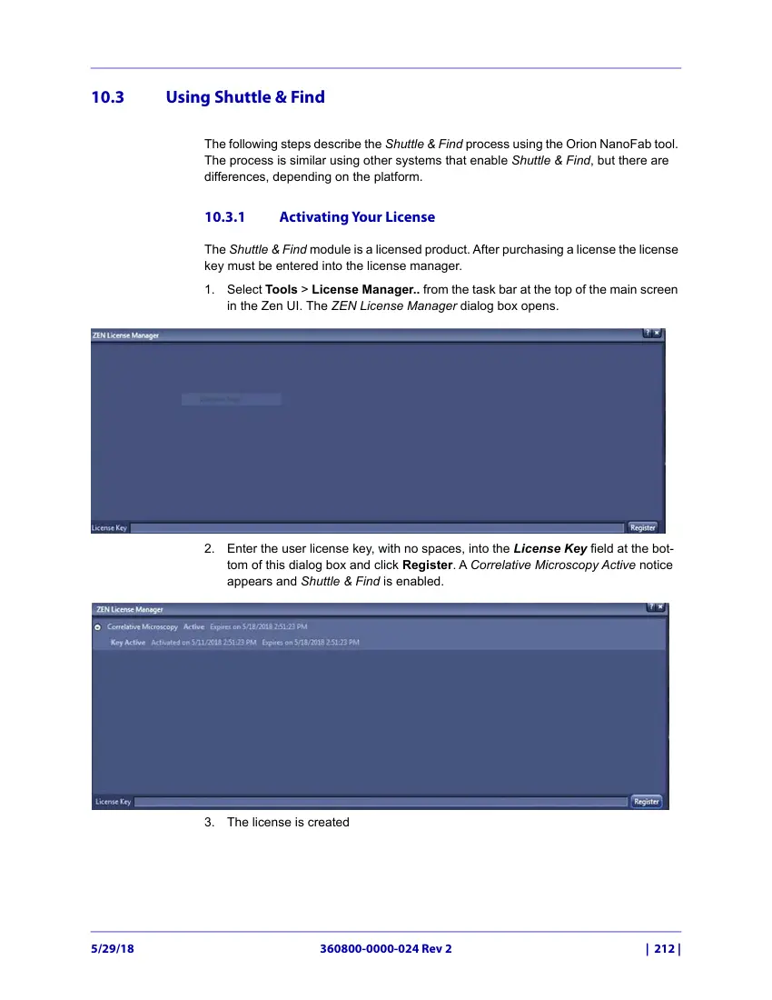

*Page 217 facsimile from `ZEISS_ORION_NanoFab_Operator_Manual_Rev2.pdf`.*

## Page 218

| 213 |
360800-0000-024 Rev 2
5/29/18
10.3.2
Loading the Sample
1.
Load the holder with sample into the NanoFab.
2.
Click the Sample Management icon along the top of the Zen UI. The Sample 
Management tool panel opens. 
3.
Select the correlative holder in the upper right for Shuttle & Find (or other holder 
as appropriate). 
10.3.3
Establishing the Coordinate System
Use this section to establish mapping between original and coordinate working spaces 
in ZEN (Yellow Edition) on the Orion NanoFab. The process is the same, whether you 
are creating the original coordinate space or the working coordinate space.
Note:
If using the Zeiss correlative holder, choosing lock points is not an issue.  
The NanoFab correlative holder has such features permanently located 
on the three tabs machined into the holder. If using another holder, it is 
important to choose appropriate lock points on the sample. Using Shuttle 
& Find between systems having a wide dissimilarity in resolution can 
affect the ability to find features of interest when going from higher to 
lower resolution systems with feature sizes that are smaller than the 
working system. This typically induces small scale and rotational errors. 
Also, when choosing lock points, consider using locations that are as 
precise as possible, and which create a right-angled coordinate space. A

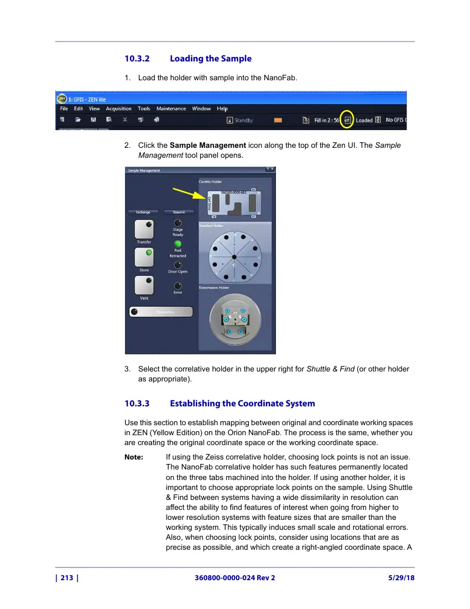

*Page 218 facsimile from `ZEISS_ORION_NanoFab_Operator_Manual_Rev2.pdf`.*

## Page 219

5/29/18
360800-0000-024 Rev 2
| 214 |
right angle is not required, but are optimal. The precision location of the 
lock points in both the original and working coordinate spaces determine 
how easily you will find features of interest in the working coordinate 
space.
1.
Locate the Shuttle & Find tool in the Correlative Microscopy tool group in the left 
tool area of Zen. 
2.
Check the Enable Shuttle & Find check box to enable the module. 
3.
Select the Calibrate button to activate the Shuttle & Find wizard. The wizard 
guides you through the process of finding lock points, called marker positions in 
the wizard, which create the coordinate space.
4.
Click the check box for Save marker detection images so images will be saved 
on the local hard drive. Saving these images will help you find the exact location 
of the marker positions in later tasks. 
Note:
These images are not transported along with the lock information in the 
.CZI file.
5.
Choose three marker positions, one at a time, in sequence, that together form a 
right triangle which optimizes the coordinate space scaling, rotation and orthogo-
nality. 
a)
Select Marker position 1. The software moves the image of the first lock 
point, called a marker position, into view. If you are using a standard cor-

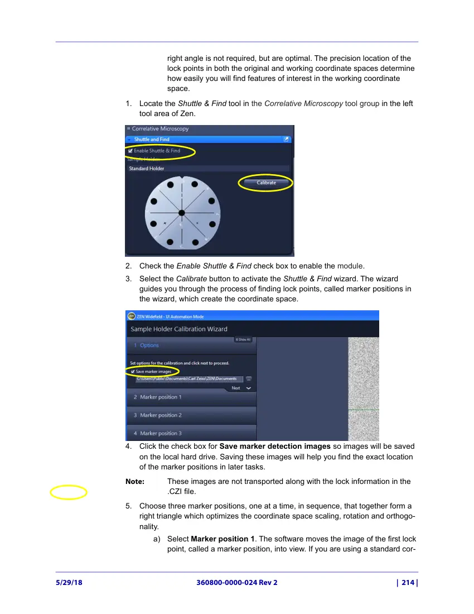

*Page 219 facsimile from `ZEISS_ORION_NanoFab_Operator_Manual_Rev2.pdf`.*

## Page 220

| 215 |
360800-0000-024 Rev 2
5/29/18
relative holder, the marker positions are the tabs machined into the 
holder.
b)
Move the stage using imaging controls to place the marker position in the 
green cross hairs.
c)
Click Set to lock that position and save it for Shuttle & Find.
d)
Click Next and repeat the three steps for marker positions 1 and 2.
e)
Click Finish to complete the process.
10.3.4
Finding Features of Interest
Once the coordinate space is established, navigate to locations and acquire images of 
features of interest.
1.
Select GFIS > S&F in the image area.
2.
Locate the Shuttle & Find tools at the bottom of the screen. The S&F tab hosts 
controls that allow you to choose regions to correlate against by drawing a rectan-
gle on the image where the feature of interest is located, or putting marks around 
points of interest. As these features are identified a list is maintained and dis-
played in the tool panel. Features of interest can be removed or selected in this 
list. The resulting list is saved in the .CZI file when the overall .CZI file is saved in 
Zen.

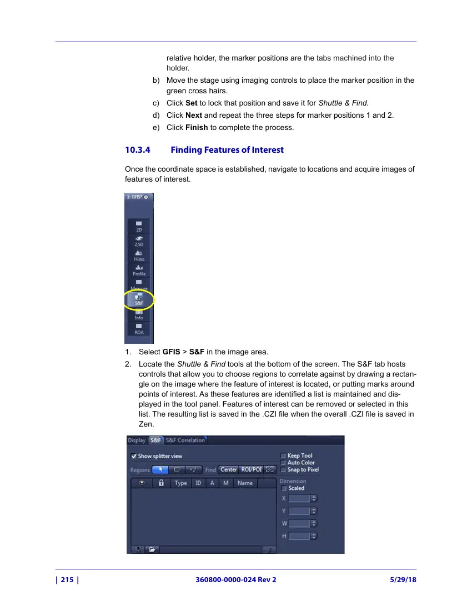

*Page 220 facsimile from `ZEISS_ORION_NanoFab_Operator_Manual_Rev2.pdf`.*

## Page 221

5/29/18
360800-0000-024 Rev 2
| 216 |
3.
Unload the sample from the originating system using the Sample Management 
tool panel and remove the correlative holder from the mount, taking care not to 
move the sample with respect to the correlative holder as this will shift the fea-
tures of interest.
10.3.5
Transporting Holder Between Enabled Zeiss Systems
You can transport the sample in and amongst any Zeiss equipment that supports 
Shuttle & Find and can accept the correlative holder.
1.
Once mounted onto the target system holder, load the sample using the loading 
method of the target system and then locate the Shuttle & Find feature in the tar-
get system software. If the target system is a Zen implementation, the same func-
tionality as described here can be used. If the target system is a Zeiss product 
that uses SmartSEM, please refer to the SmartSEM user manual for activating 
Shuttle & Find. 
2.
Load a .CZI file with the coordinate marking positions. Then perform the same 
coordinate lock process as described above. Once completed the two coordinate 
systems are locked.
10.3.6
Matching Image Sizes
Note:
Not every microscope has the same magnification or field of view. To view 
the images within the Shuttle & Find workspace, you can scale or rotate 
them so the features of interest appear in the same scale and orientation 
as the original. The Shuttle & Find workspace has a feature with which 
you can find features in the original image and lock those to the working 
image. 
1.
Locate the Shuttle & Find tab located on the image area. This displays the Shuttle 
& Find workspace. At the bottom of the image area locate the S&F Correlation tab 
that is used to do a secondary lock, image to image.
Locking the images follows the same process as locking the coordinate systems, with 
the same end result: two images that are of the same scale, rotation and orthogonality.

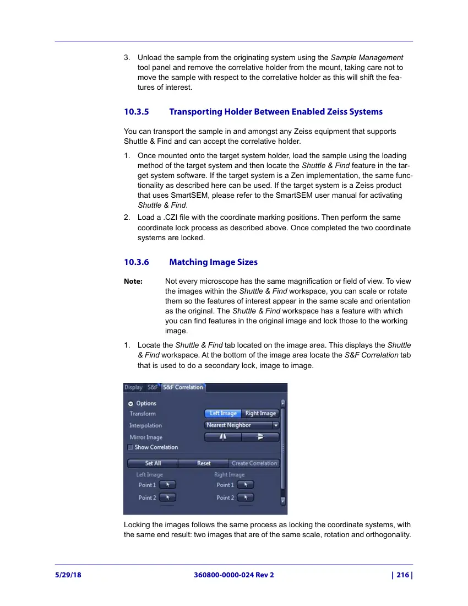

*Page 221 facsimile from `ZEISS_ORION_NanoFab_Operator_Manual_Rev2.pdf`.*

## Page 222

| 217 |
360800-0000-024 Rev 2
5/29/18
2.
Click either Left Image or Right Image to select the original image. This is the 
image that the other image is locked to. By default the left image is selected.
Note:
S&F Correlation allows users to optimize the method by which pixels are 
scaled. Choose the method among the several options that are available 
to preserve the best image quality. 
3.
For images that have flipped orientations use the Mirror Image button to flip the 
target image space along either the horizontal or vertical axes.
Note:
Expand options to find the Mirror Image button if it is not already open.
4.
Select the Show Correlation check box for an image overlay showing the cor-
relation. 
5.
Using the Left and Right image points select the reference points in order, 1 to 3, 
finding the exact same feature in the exact same location on both images. Once 
the three points have been selected the Create Correlation button is enabled. 
6.
Select the Create Correlation button to correlate the two images, changing the 
appearance of the target image. Points selected in either image are now saved in 
the scaled image coordinate space.

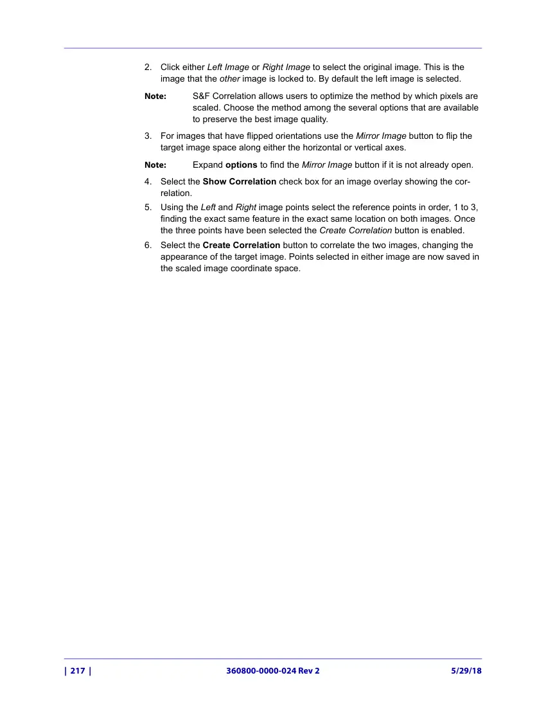

*Page 222 facsimile from `ZEISS_ORION_NanoFab_Operator_Manual_Rev2.pdf`.*

## Page 223

5/29/18
360800-0000-024 Rev 2
| 218 |
11
Some Imaging Concepts
11.1
The Trimer
The 3-atom cluster at the tip of the GFIS source is called the trimer. you forms a 3-
sided pyramid on the end of the tip, using a proprietary process called Form the 
Source, located in the GFIS Source Maintenance Wizard of the UI. Then, using Select 
a Trimer, you strips away atoms until only the 3-atom formation is left at the tip.
Figure 311. Formed Trimer Seen in SFIM mode
Eventually, one or more of the atoms that are part of the trimer break away from the tip. 
When this occurs the process of selecting a trimer must be repeated from the existing 
pyramid, or, if necessary, the pyramid must be rebuilt. 
The life time of a trimer is a result of a few factors, the most important being the type of 
gas the source is exposed to. A trimer that is exposed only to helium for imaging 
typically lasts a couple of weeks. A trimer that is mostly used for neon imaging might 
last for a much shorter period of time.
11.2
Best Imaging Voltage (BIV)
One of the key parameters when evaluating a source is its best imaging voltage (BIV). 
BIV refers to the extraction field setting that produces the highest rate of ionization at 
the trimer for that source. The BIV varies from source to source, and also changes for 
a given source as it ages. See Figure 312 for a typical BIV curve (trimer beam current 
as a function of extraction field.

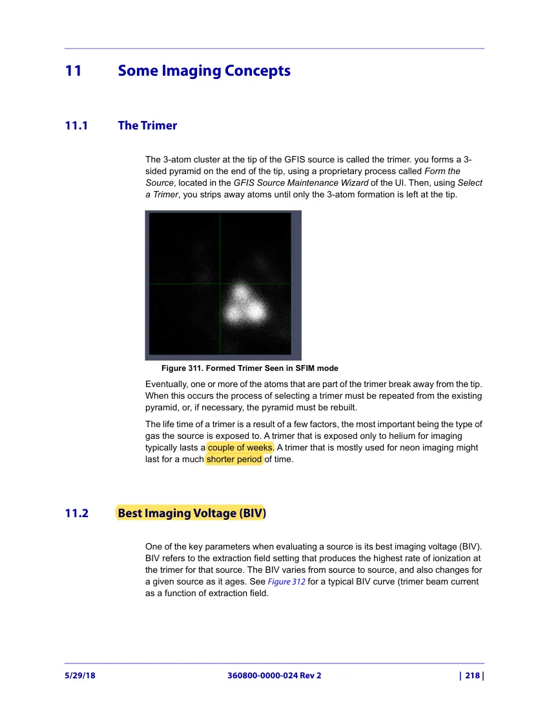

*Page 223 facsimile from `ZEISS_ORION_NanoFab_Operator_Manual_Rev2.pdf`.*

## Page 224

| 219 |
360800-0000-024 Rev 2
5/29/18
Figure 312. BIV Curve
Determine BIV in the GFIS Source Maintenance Wizard of the UI is used to find the 
BIV for a source, while using helium as the imaging gas. The BIV for neon is about 82 
percent of the BIV for helium (discussed in more detail in the neon imaging section). 
The spec for helium BIV is 25kV to 35kV, although most operators prefer a BIV at the 
higher end of this range.
With a very low extraction field, there is no beam current (see Figure 312). There is 
usually no ionization, hence no ion beam, until the extraction field reaches between 
20kV and 24kV. The point at which the ionization is first observed is referred to as “first 
light”. After that point, the ionization rate increases as the extraction field is increased. 
At a certain point, however, the ionization rate at the trimer begins to decrease as the 
extraction field is increased further. Protruding atoms on the source at a distance from 
the trimer begin to ionize helium, reducing the available helium at the trimer. 
The extraction field setting that gives the maximum trimer beam current is the BIV. 
Setting the extraction field well beyond BIV can pull the trimer off of the source, and 
may even cause permanent damage to the source.

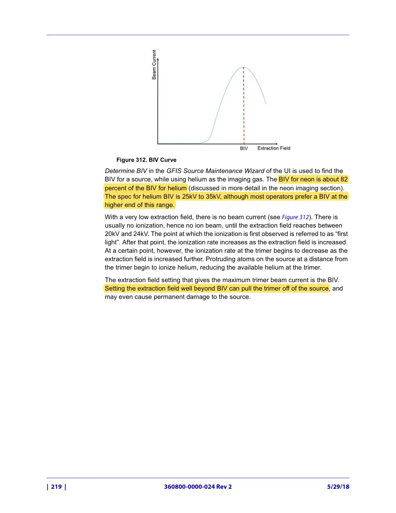

*Page 224 facsimile from `ZEISS_ORION_NanoFab_Operator_Manual_Rev2.pdf`.*

## Page 225

5/29/18
360800-0000-024 Rev 2
| 220 |
11.3
Focus
The focus is the point where all beam ions converge in a small spot. This is controlled 
by the objective lens (lens 2). When the focus is adjusted, the focus point is moved up 
and down the optical axis. The focus is set correctly when the focus point is directly on 
the sample surface, resulting in a sharp image. If the focus is above or below the 
sample, the image is out of focus and appears blurry.
Figure 313. Focus
Figure 314. Focus Examples
Focus point above sample surface; 
the image is out of focus.
Focus is on the sample 
surface; image is in focus.
Focus is below sample surface; 
image is out of focus

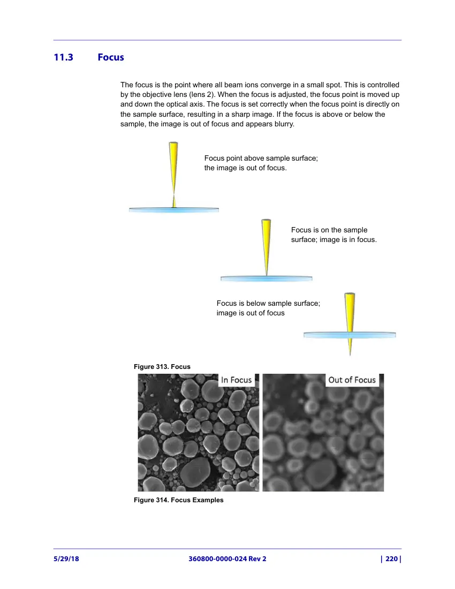

*Page 225 facsimile from `ZEISS_ORION_NanoFab_Operator_Manual_Rev2.pdf`.*

## Page 226

| 221 |
360800-0000-024 Rev 2
5/29/18
11.4
Astigmatism
Ideally, the ion beam would be perfectly round when it strikes the sample. However, 
there are a number of things that can cause the ion beam to be somewhat elliptical in 
shape (Figure 315). When this type of distortion is caused by a lens it is called 
astigmatism. The term is used in this context as a general reference to a non-circular 
beam, regardless of the cause. A non-circular beam results in a distortion of the 
image. The distortion is most easily seen when sweeping the lens 2 focus control 
through the range of best focus. When out of focus, the image has a noticeable 
directional distortion. As the focus is adjusted from out of focus, through the focus 
point, and beyond to out of focus again, the direction of the distortion changes by 90 
degrees (Figure 315, right side). The ion beam is brought back into a circular shape by 
you, using the stigmator controls, as described in Section 5.3.5, Mechanical Aperture 
Alignment.
Figure 315. Astigmatism

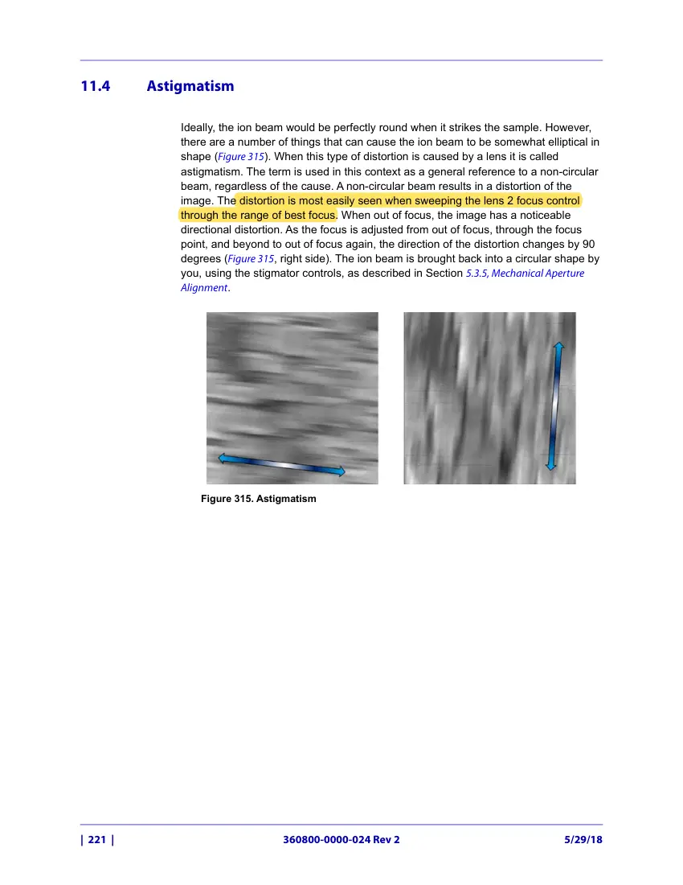

*Page 226 facsimile from `ZEISS_ORION_NanoFab_Operator_Manual_Rev2.pdf`.*

## Page 227

5/29/18
360800-0000-024 Rev 2
| 222 |
11.5
Contrast and Brightness
The Contrast control adjusts the gain through the ET detector, which has the effect of 
increasing the difference between darker and lighter pixels, giving a wider overall 
range of intensity of the image pixels. The Brightness control simply adds a DC offset 
to all the pixels during processing of the signal from the ET detector.
Figure 316. Contrast and Brightness
Figure 317. Contrast and Brightness Controls
Brightness
Contrast

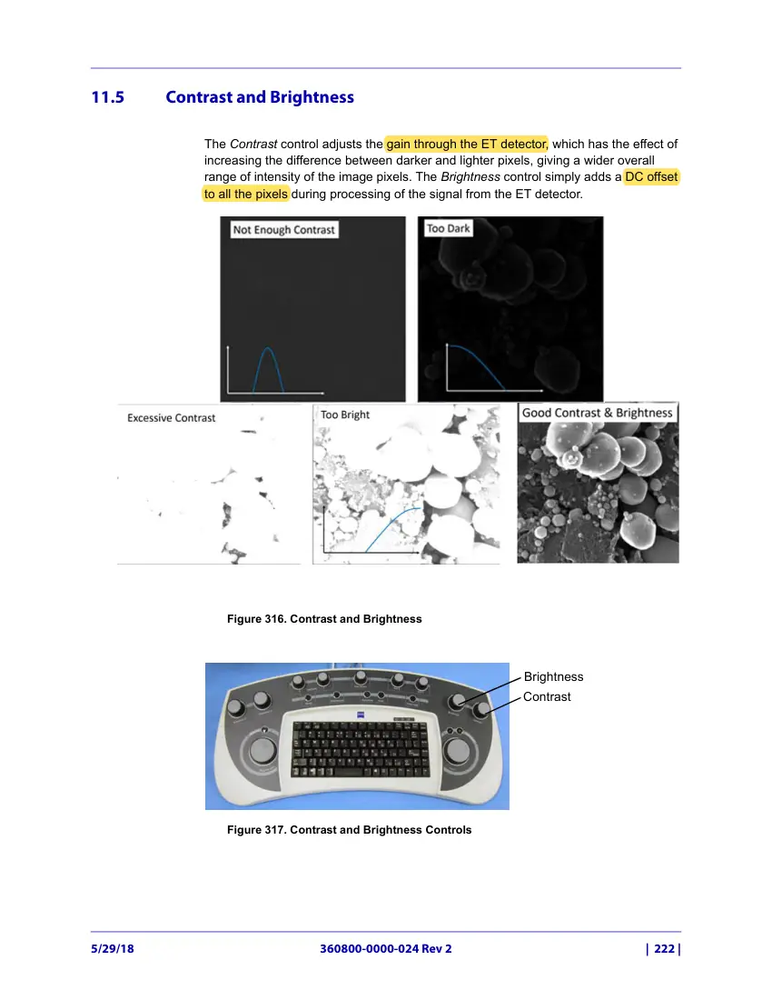

*Page 227 facsimile from `ZEISS_ORION_NanoFab_Operator_Manual_Rev2.pdf`.*

## Page 228

| 223 |
360800-0000-024 Rev 2
5/29/18
11.6
Field of View
Field of view (FOV) refers to the size of the area being scanned by the ion beam. In the 
NanoFab the FOV is always a square. For example, setting the image FOV to 1 µm 
means that the ion beam will scan an area of 1 µm by 1 µm, hence the displayed 
image represents an area of 1 µm by 1 µm. The largest FOV available depends on a 
number of factors, such as working distance and acceleration voltage. The smallest 
FOV available is 100 nm by 100 nm.
FOV is determined by the magnitude of the deflection signals in the octopoles.
Figure 318. Field of View
11.7
Scan Size
Scan size refers to the number of pixels per line (x-direction) and the number of lines 
(y-direction) per frame (one full scan of the field of view). There are four available 
sizes: 
•
256 x 256
•
512 x 512
•
1024 x 1024
•
2048 x 2048
Note that the scan size does not affect FOV. For a given FOV, selecting a higher scan 
size results in the pixels being closer together. In general, a larger scan size gives a 
higher resolution image for a given FOV.
10 µm FOV 
2 µm FOV

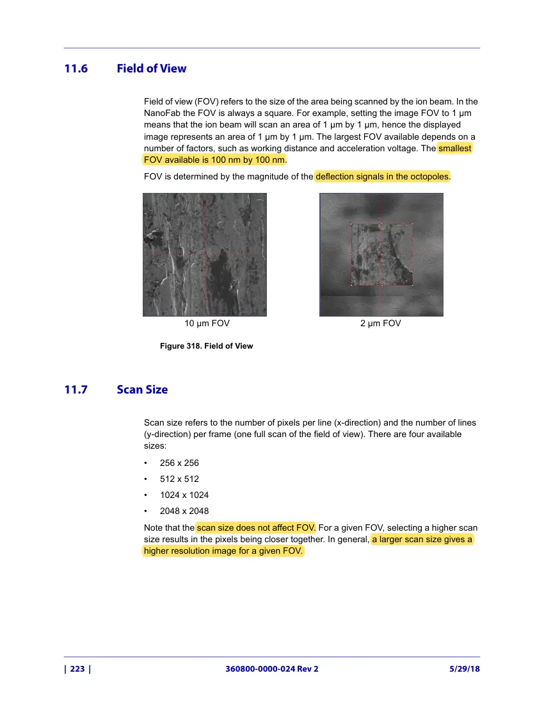

*Page 228 facsimile from `ZEISS_ORION_NanoFab_Operator_Manual_Rev2.pdf`.*

## Page 229

5/29/18
360800-0000-024 Rev 2
| 224 |
Figure 319. Resolution Examples
11.8
Dwell Time/Scan Speed
The dwell time sets the time in which the beam remains at a single scan point before 
moving to the next scan point. A longer dwell time gives you a slower scan speed and 
means that the beam stays longer at a single scan point, which can create more signal 
but do more damage to the sample. A shorter dwell time gives you a higher scan 
speed because the beam does not stay as long at a single scan point. The image 
appears more noisy as less signal is created in this shorter time.
If an image is noisy, increasing the dwell time improves the image quality by increasing 
the signal-to-noise ratio. If your sample is easily damaged, a quicker scan time in 
combination with averaging (see next section) might be the best option.
Figure 320. Dwell Time Examples

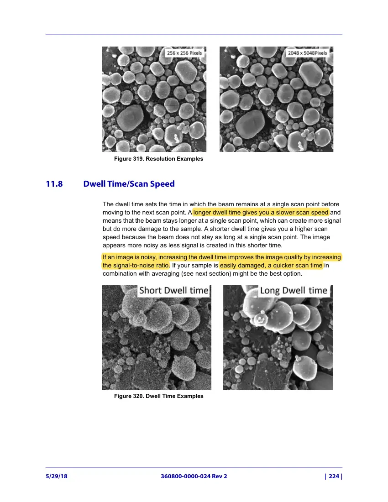

*Page 229 facsimile from `ZEISS_ORION_NanoFab_Operator_Manual_Rev2.pdf`.*

## Page 230

| 225 |
360800-0000-024 Rev 2
5/29/18
11.9
Averaging
Averaging can be used to improve the image quality and is used in combination with 
shorter dwell times. Averaging is often used for beam-sensitive or charging samples.
Off (no averaging): When recording the image, the area is scanned point by point and 
line by line until the final scan point is reached. This setting is used for all alignments 
and for recording most images.
Line: When recording the image, the first line is scanned a selected number of times 
the signal for each pixel is averaged. Once finished the next line is scanned the 
selected number of times and the signal averaged. This process is repeated until the 
last line is scanned.
Frame: When recording the image, the entire image is scanned a selected number of 
times N and the signal averaged.
11.10
Working Distance
The working distance is the distance between the surface of the sample and the 
bottom of lens 2. The current working distance is calculated by the system based on 
the lens 2 voltage required to focus the beam on the sample. Therefore, the working 
distance calculation is only accurate when the image is in focus.
Figure 321. Working Distance
Working Distance

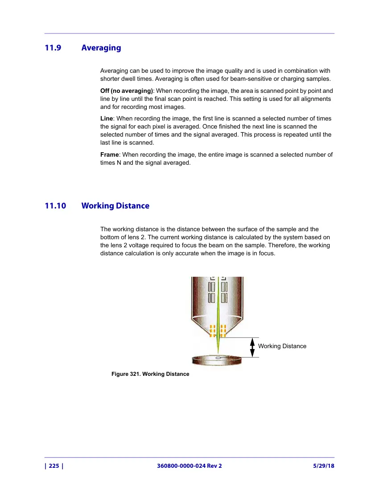

*Page 230 facsimile from `ZEISS_ORION_NanoFab_Operator_Manual_Rev2.pdf`.*

## Page 231

5/29/18
360800-0000-024 Rev 2
| 226 |
11.11
Eucentric Height
Eucentric height is the working distance at which the sample is exactly on the tilt axis. 
When the sample is at eucentric height, there is no displacement of the displayed 
image and no focus change as the stage is tilted. Instead of eucentric height, it might 
be better to think of it as “eucentric working distance”.
11.12
Charge Neutralization
Charging of the sample can occur with insulating (non-conductive) or semi-conductive 
materials. The positive charge which is introduced in the sample by the ion beam is not 
conducted away and builds up. The signal (secondary electrons) is negatively charged 
and is attracted back to the positively charged sample instead of reaching the detector. 
Charging is therefore represented by black areas (or images which get darker with 
every scan). To reduce this charging effect, the flood gun can be used to direct a beam 
of electrons to the area where the ion beam is scanning. The electrons replace those 
displaced by the ion beam, thus neutralizing the charging effect on the sample.
Figure 322. Charge Neutralization

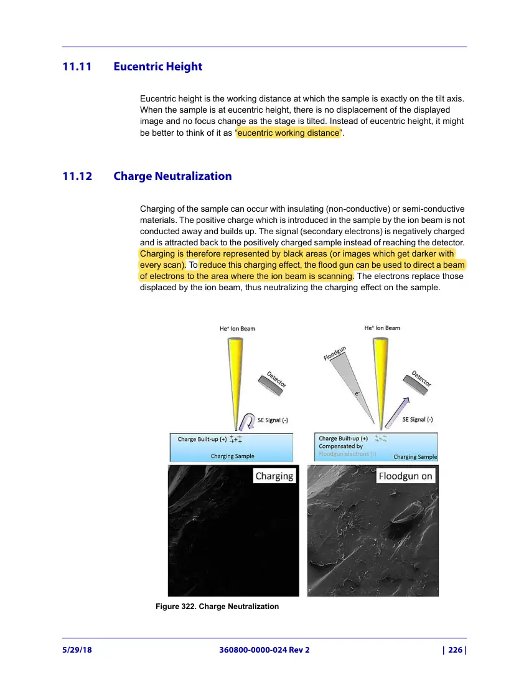

*Page 231 facsimile from `ZEISS_ORION_NanoFab_Operator_Manual_Rev2.pdf`.*

## Page 232

| 227 |
360800-0000-024 Rev 2
5/29/18
11.13
Crossover
The expressions “above crossover”, “below crossover” and “at crossover” are used in 
various places in this manual, particularly when discussing the alignment of the tilt of 
the gun head. These expressions are used idiomatically, and therefore require some 
explanation to understand their use.
As the beam leaves the source it tends to diverge, creating a cone-shaped beam with 
the apex at the source. As the beam passes through lens 1 (also known as the 
condenser lens) the beam is pushed back towards a single point, much as would be 
done to focus the beam. The point at which th beam converges is called the crossover 
point. After the crossover point, the beam begins to diverge again.
Figure 323. Above Crossover
The magnitude of the lens 1 voltage determines where the crossover point is. The 
higher the lens 1 voltage, the higher up the column the crossover point is. When 
aligning the mechanical tilt of the gun head it is necessary to move the crossover point 
above and below the beam limiting aperture. (During gun tilt alignment the beam 
limiting apertures are moved out of the beam path.) When the crossover point is 
positioned below the beam limiting aperture, we refer to it as “below crossover”. When 
the crossover point is positioned right at the beam limiting aperture, we refer to that as 
“at crossover”. Above the beam limiting aperture, it is referred to as “above crossover”.
Generally, crossover is only of concern when operating in SFIM mode and observing 
the trimer. When looking at a given trimer above and below crossover, the trimer when 
observed below crossover will be the mirror image, in both axes, of what was seen 
above crossover. In looking at Figure 323 and Figure 325, notice that the brightest atom 
is in the lower left of the cluster when above crossover but when observed at below 
crossover, that brightest atom is now in the upper left of the cluster.
When at crossover, the SFIM image is a bright circle (Figure 324). That is because the 
beam is in focus right at the beam limiting aperture.

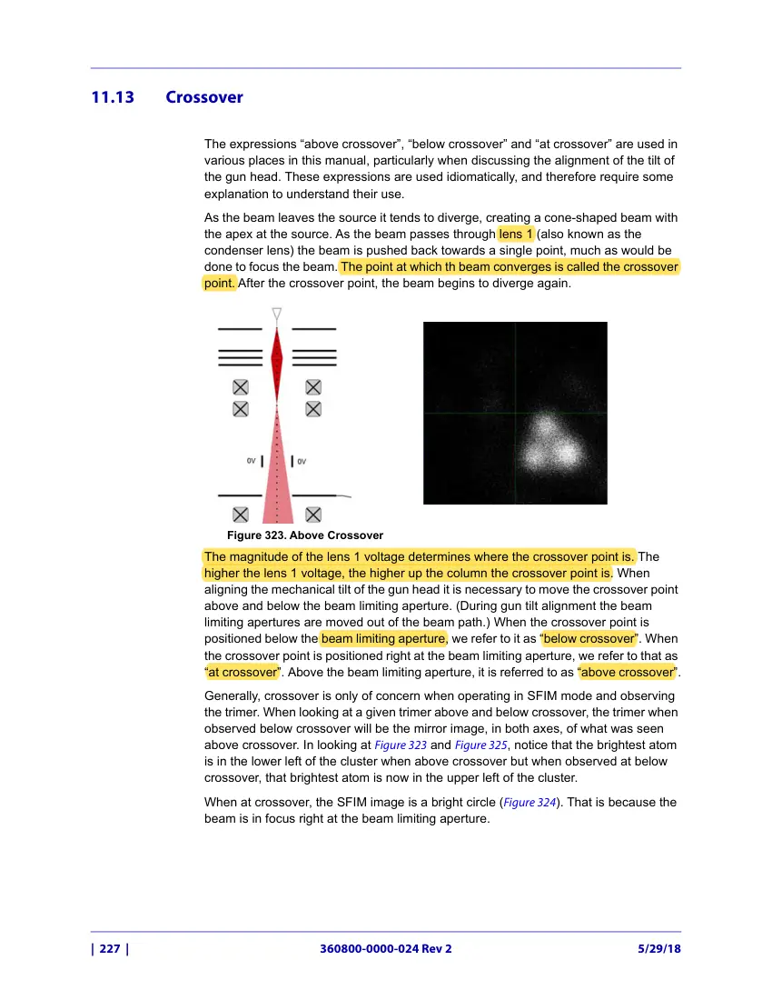

*Page 232 facsimile from `ZEISS_ORION_NanoFab_Operator_Manual_Rev2.pdf`.*

## Page 233

5/29/18
360800-0000-024 Rev 2
| 228 |
Figure 324. At Crossover
Below crossover means the crossover point is below the beam limiting aperture. This 
is brought about by an even lower lens 1 voltage. The shift is adjust below crossover. 
The image of the trimer is a mirror image of the, on both axes, than the image above 
crossover.
Figure 325. Below Crossover

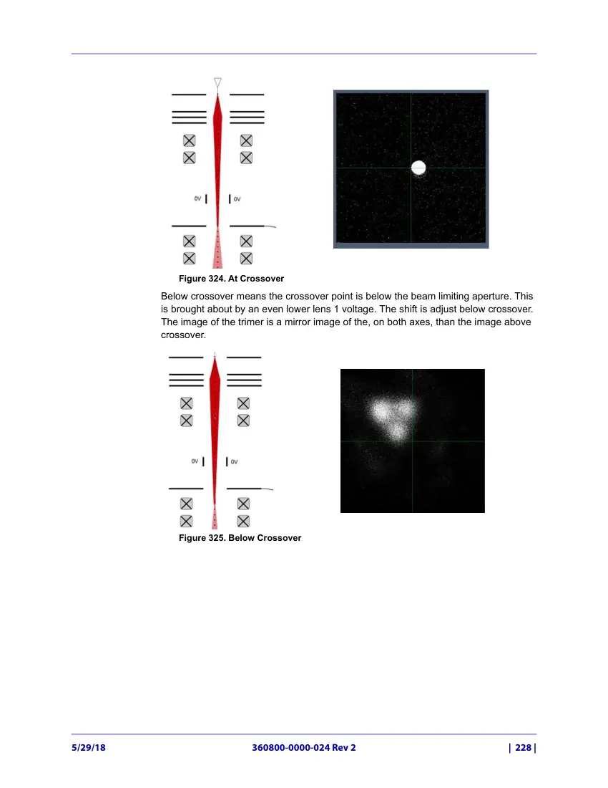

*Page 233 facsimile from `ZEISS_ORION_NanoFab_Operator_Manual_Rev2.pdf`.*

## Page 234

| 229 |
360800-0000-024 Rev 2
5/29/18
11.14
Spot Control
Spot control is a gradient scale from 1 to 10 that represents the beam crossover 
position in the column. Spot 1 puts the crossover at the beam limiting aperture. At spot 
1 all of the beam current passes through the aperture and hits the sample, giving a 
maximum beam current at the expense of resolution. 
When you raise the spot number you increase lens 1 voltage, moving the crossover 
higher in the column, which results in a wider beam at the aperture. Therefore some of 
the beam is blocked by the aperture, resulting in a lower beam current, but a higher 
resolution. 
A lower spot raises source magnification. At spot 1 the source is magnified and so is 
the vibration, giving a large beam diameter and the greatest amplification of any 
source vibrations.
If at spot 1 the aperture is not in focus, recalibrate the source distance (see Section 
5.2.7, Set Source Distance).
Note:
Avoid prolonged use at spot 1 with the gold apertures, as that can damage 
the apertures. Use moly apertures when available.
Figure 326. Spot 1
Crossover

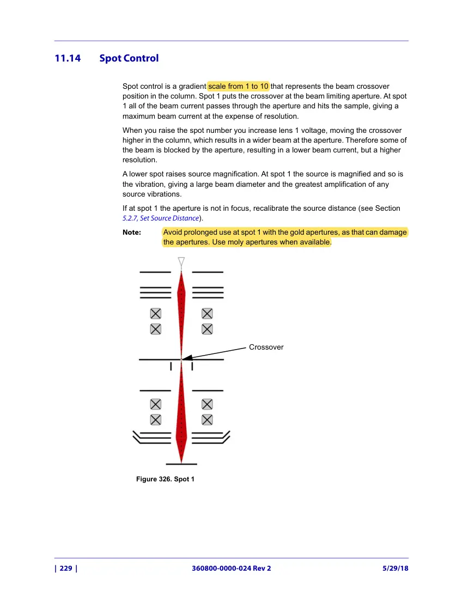

*Page 234 facsimile from `ZEISS_ORION_NanoFab_Operator_Manual_Rev2.pdf`.*

## Page 235

5/29/18
360800-0000-024 Rev 2
| 230 |
Rule of thumb for selecting the spot control number:
•
Spot 1 - Useful for alignment
•
Spot 2-3: Use for high beam current milling
•
Spot 4-6 Use for resolution Imaging
•
Spot 7-9 Low beam current
Figure 327. Higher Spot Number
Crossover

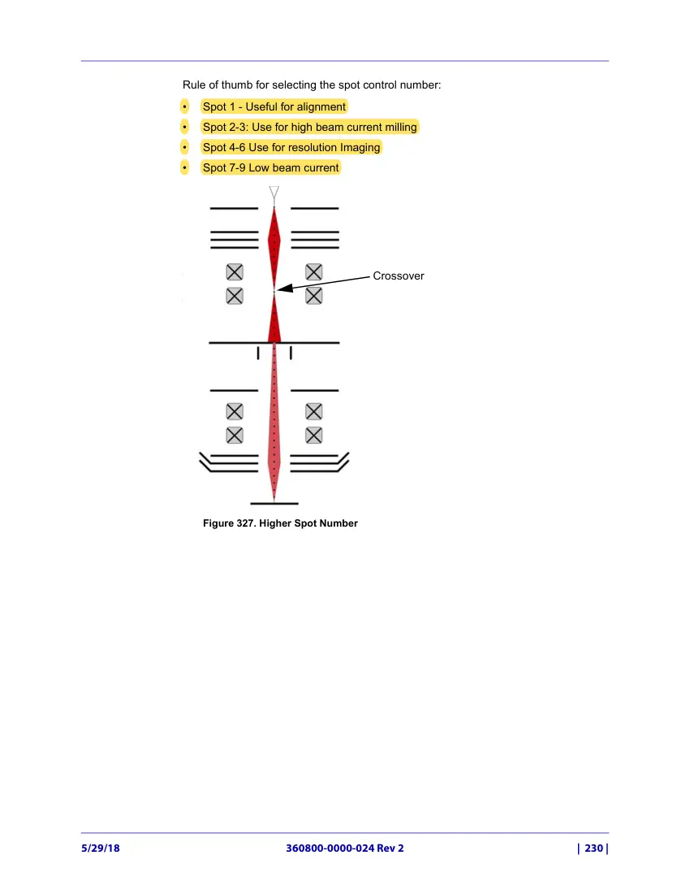

*Page 235 facsimile from `ZEISS_ORION_NanoFab_Operator_Manual_Rev2.pdf`.*

## Page 236

| 231 |
360800-0000-024 Rev 2
5/29/18

*Page 236 facsimile from `ZEISS_ORION_NanoFab_Operator_Manual_Rev2.pdf`.*

## Page 237

5/29/18
360800-0000-024 Rev 2
| 232 |
12
Patterning
ORION NanoFab features an integrated hardware and software control system: the 
NanoPatterning and Visualization Engine (NPVE), which incorporates a dedicated 16-
bit scan generator for each NanoFab column and dual-signal acquisition hardware 
supporting real-time advanced patterning and visualization.
You are able to completely control the beam with the use of a GUI that allows you to 
create a range of fully edible shapes including rectangles, trapezoids, polygons, lines, 
polylines, ellipses and spots. You can then vector-fill these shapes while maintaining 
full control over dose variation and patterning parameters including patterning 
direction, spacing, dwell, refresh and scan strategy.
12.1
Patterning Basics
Patterning is the process of removing sample atoms in specific areas on the sample 
with the ion beam. During patterning the ion beam is vector-scanned across the 
sample surface. The beam stays in a single scan point for a designated time (dwell 
time) before it moves to the next scan point. While milling, the ion beam overlaps to 
ensure a smooth edge cutting. Multiple patterns can be milled at the same time and 
complex patterns created from the basic geometric figures. The features that can be 
created are only limited by your imagination! 
Patterning can also be an additive process when the ion beam is used to deposit 
material onto the sample surface using a Gas Injection System (GIS). The GIS flows a 
precursor gas onto the sample surface and the ion beam reacts chemically with the 
precursor to deposit material only where the beam is directed.
It is essential that the ion beam is well aligned when patterning. An astigmatic or 
unfocused beam leads to larger or distorted figures and different milling depths.
Figure 328. Beam Misalignment
When patterning, the ion beam stays in a single scan point and removes sample 
atoms. The ion beam is then moved to the next scan point. The ion beam usually 
overlaps 50% between adjacent scan points to create smooth edges (See Figure 329).

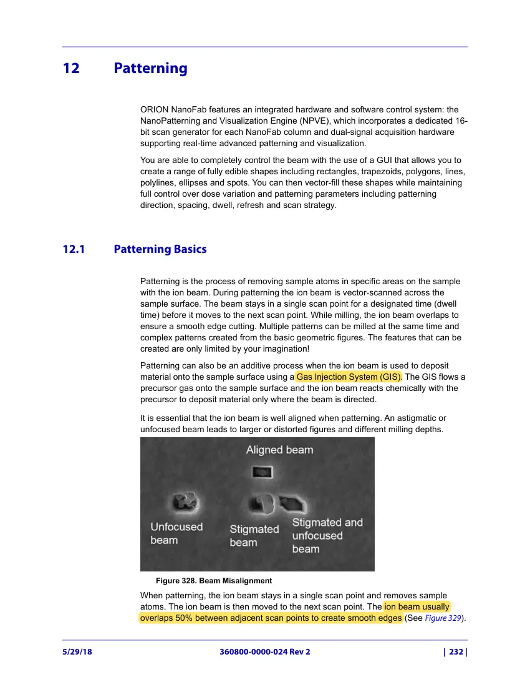

*Page 237 facsimile from `ZEISS_ORION_NanoFab_Operator_Manual_Rev2.pdf`.*

## Page 238

| 233 |
360800-0000-024 Rev 2
5/29/18
Figure 329. Scan Point to Scan Point
12.1.1
Patterning Parameters
Acceleration Voltage (Ion Beam Energy) 
Acceleration voltage, ion species, and material density determines how deep the ions 
travel into the sample and determines the resolution.
High Acceleration Voltage - At higher energy, ions travel further into the sample. 
SRIM simulations can be used to determine the depth to which the ions travel. He 
ions can travel a few hundred nm deep into the sample, Ne less than 100 nm, and 
Ga less deep.
Lower Acceleration Voltage - At lower energy, ions travel less distance into the 
sample.
Figure 330. SRIM Simulation: Ion Range - He, Ne, Ga
Note:
Ref: “Stopping and range of ions in matter”, version SRIM 2013.00, 
www.SRIM.org

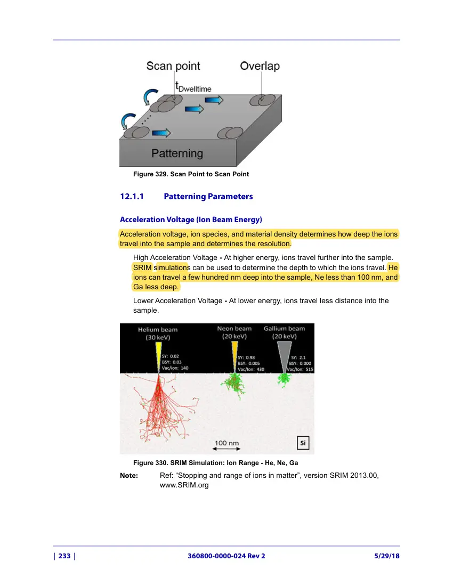

*Page 238 facsimile from `ZEISS_ORION_NanoFab_Operator_Manual_Rev2.pdf`.*

## Page 239

5/29/18
360800-0000-024 Rev 2
| 234 |
Aperture and Spot Control Value Selection
The aperture determines the ion beam current as well as the beam diameter. Larger 
apertures provide more current for milling, the beam is larger. Smaller apertures 
provide less current but a smaller beam diameter, which means that smaller structures 
can be milled. Since milling depth is directly related to beam current, patterning with 
smaller apertures takes longer than patterning with larger apertures for a given pattern 
size. The appropriate aperture/spot control value depends on the sample, as well as 
the structure size which needs to be milled. Note that increasing the spot control value 
decreases beam size, and vice versa.
Dwell Time/Passes 
The dwell time determines how long the ion beam stays in a single point. The dwell 
time is directly linked to the amount of material which is removed in the milling 
process: longer dwell times remove more material. The dwell time is usually linked to 
the Passes parameter (Repeats in NPVE). 
Passes set the amount of repeats in which the ion beam is scanned over the 
patterning area. In most cases, a short dwell time, 1 µs, is used with several thousand 
passes to achieve the desired pattern depth (or dose). Alternatively, a single pass with 
a very long dwell time (ms) can be used. Both approaches have their advantages and 
disadvantages.
Beam Overlap 
The beam overlap determines how much the beam overlaps between the different 
scan points. It’s default value is 50%. The beam conventionally overlaps when milling 
in order to achieve a smooth edge. If the beams do not overlap, a rough edge is 
obtained. This is illustrated below. Beam overlaps are usually changed when the 
sample melts or phase transformations occur Figure 331).
Figure 331. Beam Overlap

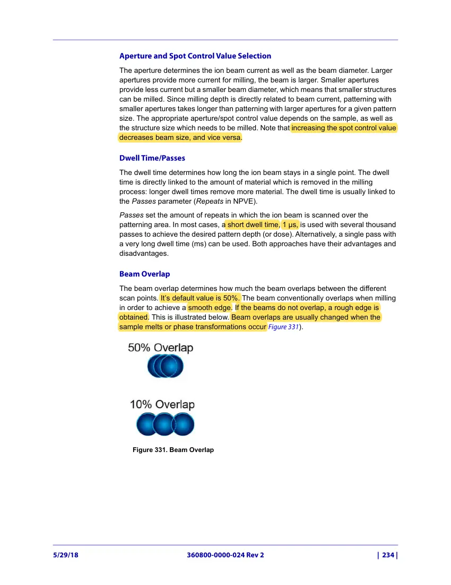

*Page 239 facsimile from `ZEISS_ORION_NanoFab_Operator_Manual_Rev2.pdf`.*

## Page 240

| 235 |
360800-0000-024 Rev 2
5/29/18
Scan Direction 
The scan direction is used to control the direction of redeposition. Redeposition of the 
sputtered sample atoms occurs at the backside of the scan direction (where the scan 
started) (Figure 332). 
Figure 332. Scan Direction and Redeposition
Calculate the Number of Ions in Ion Beam
The number of Ions (N) in the ion beam which interact with the sample during the time 
(t) can be calculated:
The calculation shows that 3 ions interact with the sample in 1µs. 3 X 106 ions would 
interact with the sample in a 1s scan.

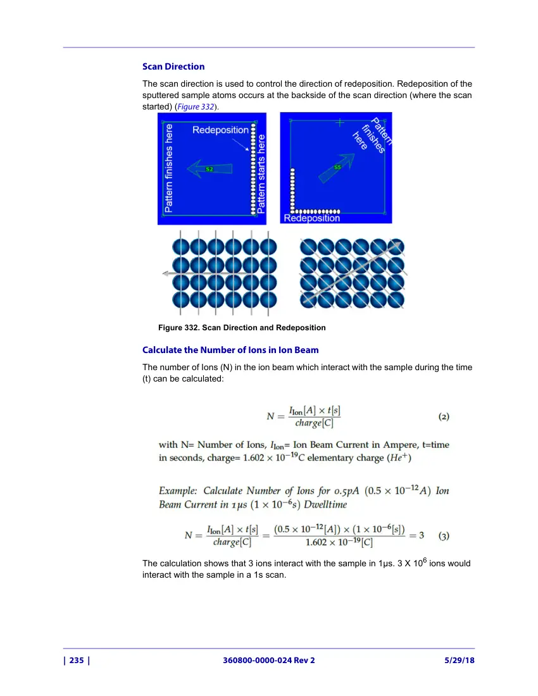

*Page 240 facsimile from `ZEISS_ORION_NanoFab_Operator_Manual_Rev2.pdf`.*

## Page 241

5/29/18
360800-0000-024 Rev 2
| 236 |
Ion Dose (a.k.a Fluence) - The ion dose is 
the amount of ions which travel through a 
specific surface area on the sample:
–At low doses (< 5-10% implanted spe-
cies): individual disordered regions are cre-
ated within the sample.
–At high doses (>5-10% implanted spe-
cies): the individual regions can overlap 
and form an amorphous layer.
Figure 333. Dosage Effects
Volume Per Dose
Every material mills at different speeds. This means that the same ion dose mills to 
different depths in different materials. The parameter Volume per Dose describes how 
much material (how much volume) is removed for a specific dose (determined by the 
beam current and the time milled).
Dose Array -The dose array is used to determine the volume per dose for the element 
(which will then allow you to indirectly set the milling depth). You need your sample on 
top of a charging substrate (glass) for this experiment. Alternatively, you will need the 
FIB to determine the milling depth after your dose array. Another alternative is to 
measure the depths of the milled areas by tilting the sample and measuring from the 
sample surface to the bottom of the milled area. 
Note:
in this case, the milled area dimensions and the tilt angle must be 
appropriate so that the bottom of the milled area can be seen. An 
appropriate tilt correction factor must also be applied to the 
measurements.
The idea is to create an array of the same structure (line or rectangle) and mill the 
structure with different doses. If the sample thickness is known, you check out at which 
dose the sample was milled away to the charging substrate (which will appear black). 
This way, you know how deep the sample was milled (z-value) (see Figure 334). You

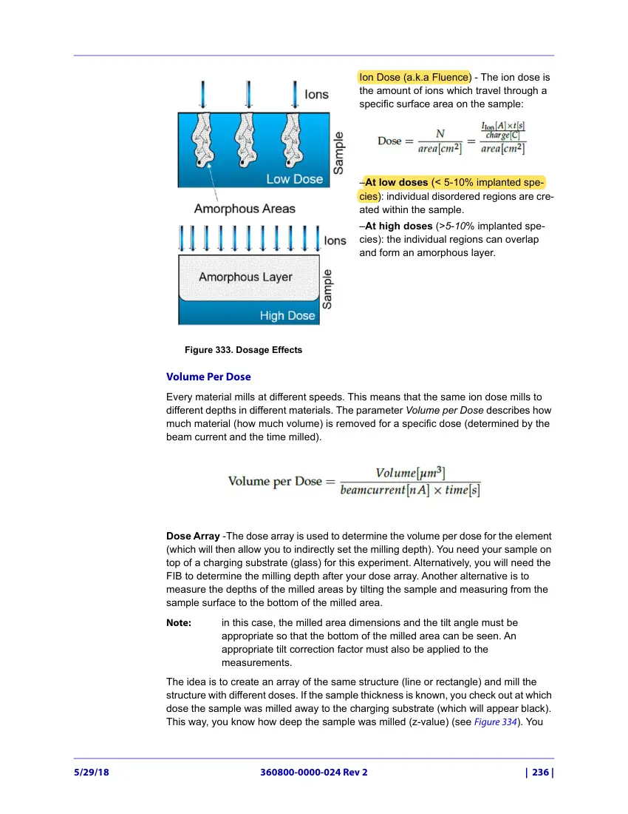

*Page 241 facsimile from `ZEISS_ORION_NanoFab_Operator_Manual_Rev2.pdf`.*

## Page 242

| 237 |
360800-0000-024 Rev 2
5/29/18
know the area of the structure that you milled and when multiplying the structure area 
with the depth, you get the volume. This is then used to calculate the volume per dose 
for your sample. Once you have determined the volume per dose for your material, 
you can indirectly set the milling depth by adjusting the current and milling time.
Figure 334. Determining Dose

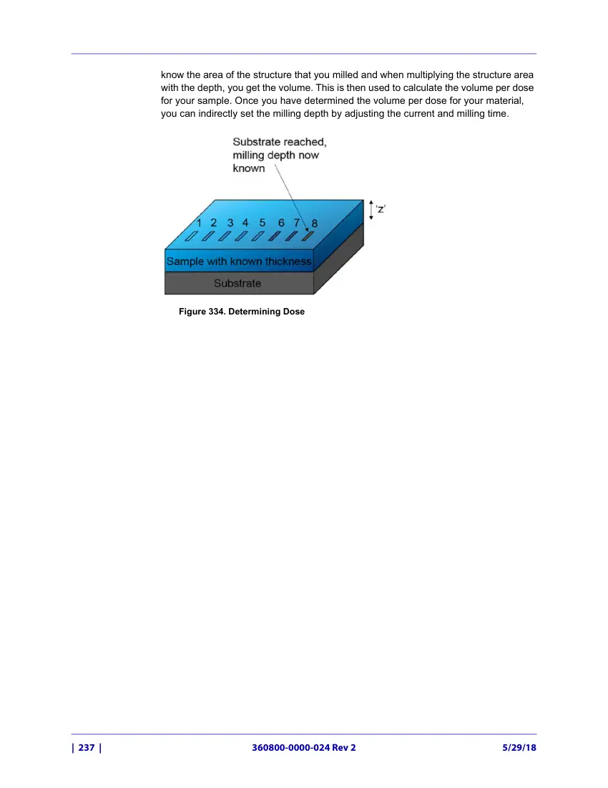

*Page 242 facsimile from `ZEISS_ORION_NanoFab_Operator_Manual_Rev2.pdf`.*

## Page 243

5/29/18
360800-0000-024 Rev 2
| 238 |
12.2
Patterning Basics Using NPVE
Patterning can be done with helium or neon. Use helium for features less than 200 nm, 
and Neon for features over 10 nm.
Note: Operating with neon requires a lower extractor voltage, which is automatically 
set by Zen when switching the gas. The theoretical BIV for neon is 82% of that for 
helium (based on first ionization energies).
Following are descriptions of some of the patterning concepts and processes. You can 
find much more information in the NPVE User Guide, found in Program Files (x86) > 
Fibics > NPVE 4Z > Documentation.
12.2.1
Patterning Process
The general process for patterning:
1.
Select the required aperture (refer to "Select Aperture" on page 137 and "Beam 
Limiting Apertures" on page 21).
2.
Select the required acceleration voltage.
3.
Align the HIM using helium gas.
4.
When aligned, switch to neon.
5.
Record an image of the sample in NPVE.
6.
Draw patterns.
7.
Set pattern parameters.
8.
Determine when to stop the pattern (after specified time, dose, or repeats, or by 
using endpoint images or graph) to determine patterning depth.
Note:
Use Dose Array to determine milling depth of sample (different for each 
material) if known.
9.
Press START.
10. Start the patterning process.
Note:
You can pause the pattern anytime if required.

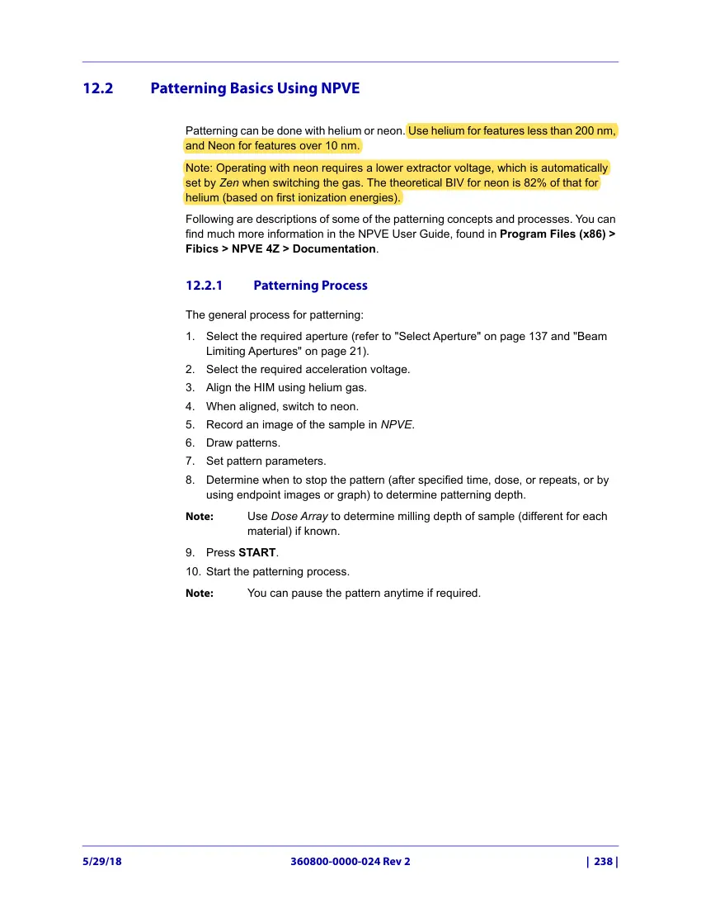

*Page 243 facsimile from `ZEISS_ORION_NanoFab_Operator_Manual_Rev2.pdf`.*

## Page 244

| 239 |
360800-0000-024 Rev 2
5/29/18
12.2.2
Using NPVE
Figure 335. NPVE Navigation
12.2.3
Creating Shapes/Patterns
1.
Select the desired pattern.
Figure 336. Geometry Window

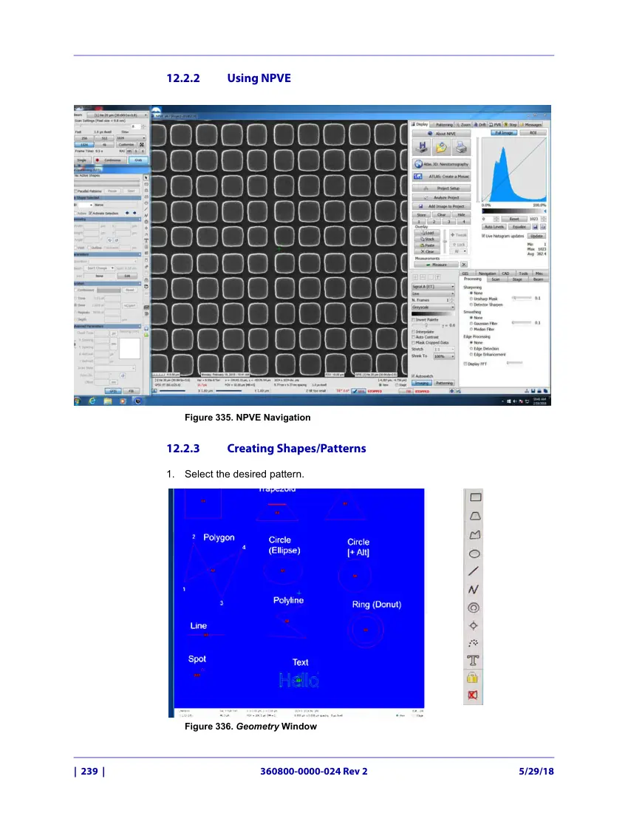

*Page 244 facsimile from `ZEISS_ORION_NanoFab_Operator_Manual_Rev2.pdf`.*

## Page 245

5/29/18
360800-0000-024 Rev 2
| 240 |
2.
Draw the pattern on the image.
3.
Select the Geometry tab to adjust or set the pattern size in the Geometry window. 
(Figure 337).
Note:
If a pattern outline only is required, use the line and polygon tools in the 
tool bar, or click the Outline check box in the Geometry tab.
Figure 337. Geometry Tab
Duration
–
Continuous: Patterns until stopped
–
Dose: Patterns until specified Dose () is reached
–
Repeats: the pattern is repeated a specified number of times: the number 
is determined by the dwell time and/or pixel spacing and/or beam current.
Scan Direction
The scan direction controls redeposition.
1.
Select: Change Milling Direction.
2.
Move the mouse over the pattern to change the scan direction.
3.
Left-click to set the scan direction.
Figure 338. Redeposition

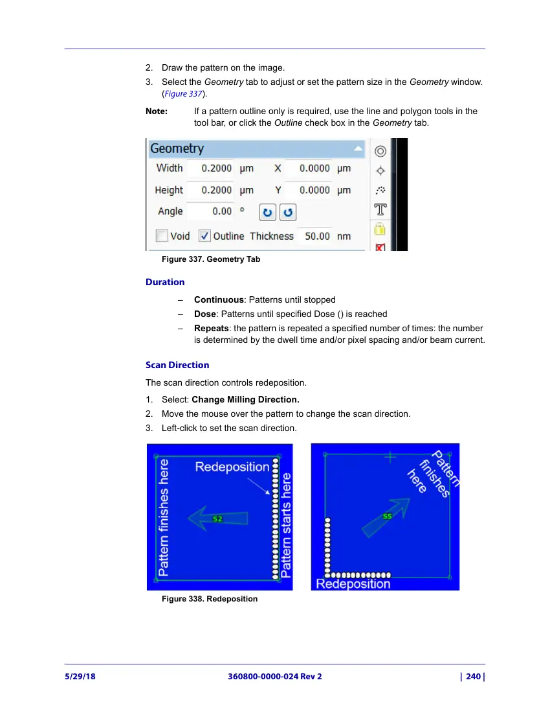

*Page 245 facsimile from `ZEISS_ORION_NanoFab_Operator_Manual_Rev2.pdf`.*

## Page 246

| 241 |
360800-0000-024 Rev 2
5/29/18
Advanced Settings
–
Dwell time: sets the time that the ion beam stays in a single scan point
–
Spacer: can be set to either relative spacing (between scan points), rela-
tive overlap (of the beam between scan points) and absolute spacing 
(between scan points), the values can be set independently for the hori-
zontal and vertical direction.
Figure 339. Spacing
12.2.4
Creating Multiple Patterns
You can draw multiple patterns in the Geometry window, and then move them around 
with the mouse. You build complex structures by placing different patterns over each 
other. The patterns can be milled serial (first pattern 1, then pattern two, etc.) or 
parallel (pattern 1 and pattern 2, etc.) at the same time.
–
serial patterning (default)): Mills pattern 1 first, and then mills the second 
pattern.
–
parallel patterning (select parallel patterns): Mills all patterns at the 
same time: (in parallel).
Note: Parallel milling means that pattern 1 is milled first to a specific 
depth, then pattern 2 is milled to the same depth, than pattern 1 is milled a 
bit more, and so forth. This is determined by repeats.
–
Void: Does not mill the drawn area. This can be used to created complex 
shapes. Two examples are given in the image below (middle and right 
images, Figure 340).
–
Outline: Mills the shape outline only. An example is given in the left image 
below, Figure 340).

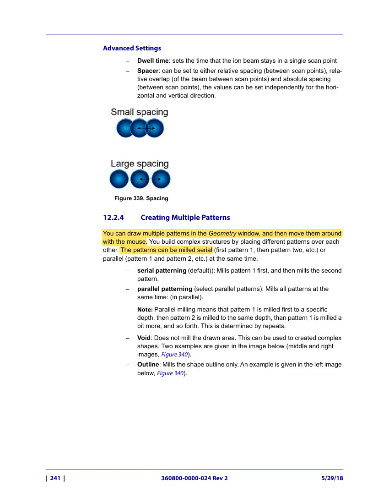

*Page 246 facsimile from `ZEISS_ORION_NanoFab_Operator_Manual_Rev2.pdf`.*

## Page 247

5/29/18
360800-0000-024 Rev 2
| 242 |
Figure 340. Outline (Left) & Void (Middle & Right) Patterns
12.2.5
Creating Arrays
1.
Draw the pattern first.
2.
Select Array Builder.
3.
Set the desired number of rows and columns.
4.
Set the distance between lines and columns.
Note:
The red rectangle determines where the array is started (initial shape).
5.
Press OK.
6.
Start patterning.
The patterns can be kept constant or the pattern and beam parameters can be varied 
in the array by unselecting boxes on the Array Builder screen.

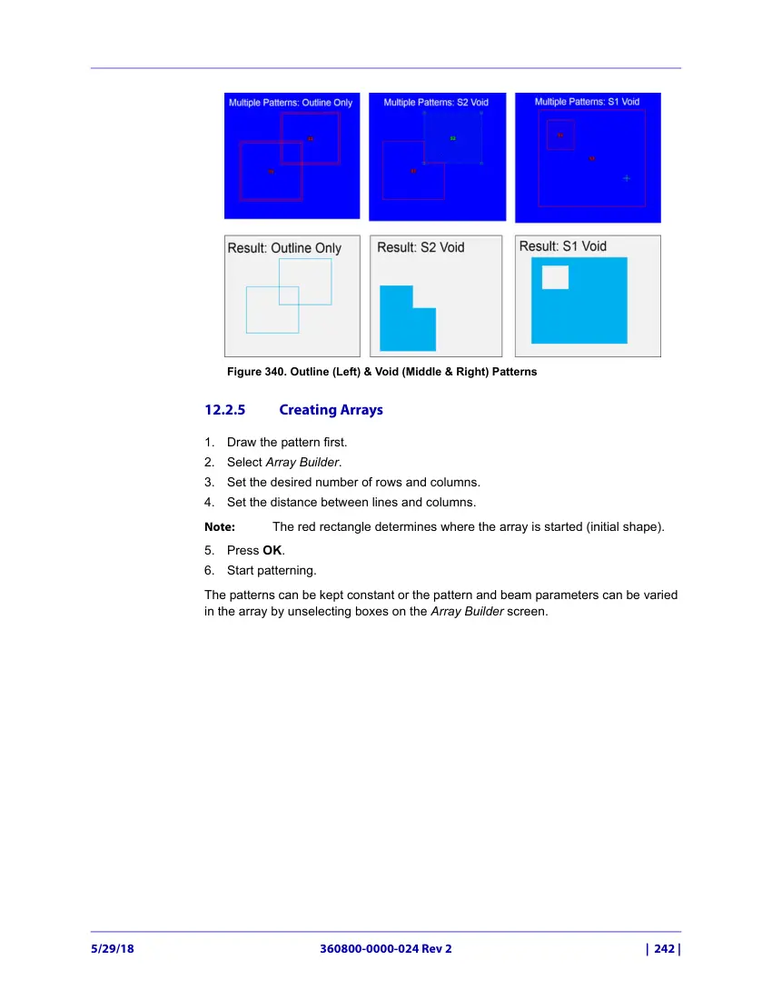

*Page 247 facsimile from `ZEISS_ORION_NanoFab_Operator_Manual_Rev2.pdf`.*

## Page 248

| 243 |
360800-0000-024 Rev 2
5/29/18
12.2.6
Creating Dose Arrays
1.
Set the FOV to 10 µm.
2.
Draw 1 line.
3.
Select Array Builder.
4.
Set the desired number of rows and columns.
5.
Set the distance between lines and columns.
6.
De-select nC/µm2 (the Dose is now varied).
7.
∆i increase set value next row.
8.
∆j increase set value next column.
Note:
The red rectangle determines where the array is started (initial shape)
9.
Press OK.
10. Start patterning
When done check which dose achieved the desired result/depth (charging substrate 
reached)
Different parameters can be varied, including the dwell time, the spacings between 
structures, etc. (see Figure 341).
Figure 341. Set Dose Array Parameters

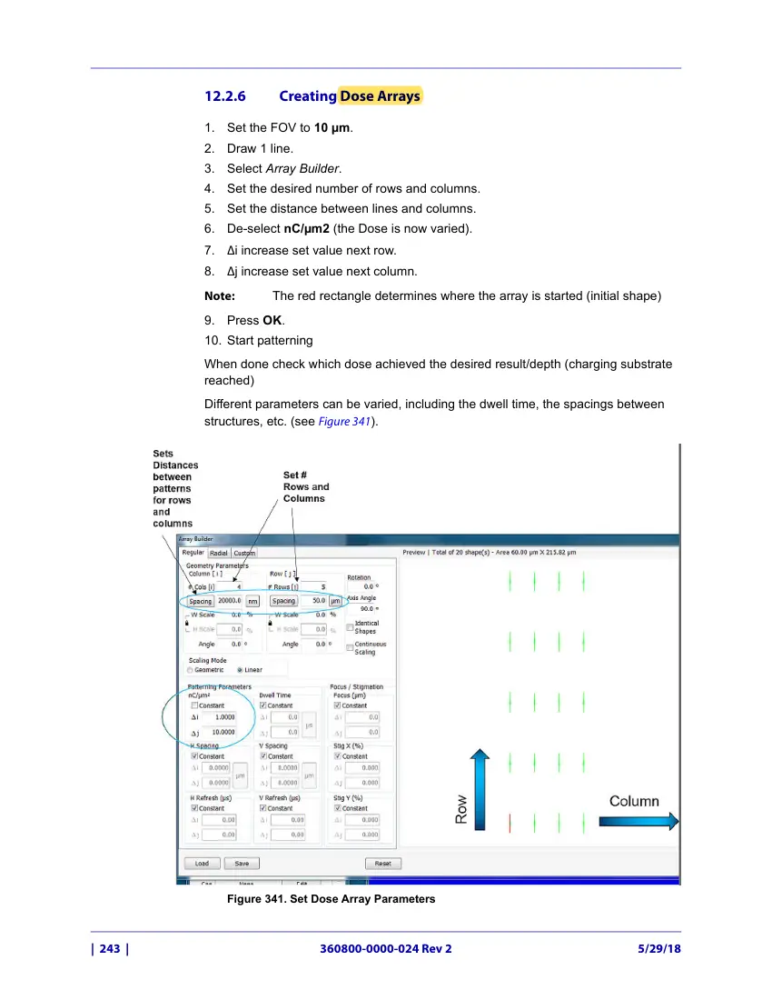

*Page 248 facsimile from `ZEISS_ORION_NanoFab_Operator_Manual_Rev2.pdf`.*

## Page 249

5/29/18
360800-0000-024 Rev 2
| 244 |
13
Glossary
Accelerator - A positive voltage applied to the source, used to accelerate the ions to 
their final energy.
Adatoms – Contaminant atoms that attach to the source. A contraction of “adsorbed 
atoms”, which refers to the adhesion of atoms from a gas, liquid, or dissolved solid to 
a surface.
Aperture - A small opening in the beam path that forms and limits the electron or ion 
beam.
Astigmatism – Lens aberration that distorts the shape of the electron beam, 
compensated by the stigmator.
Bakeout – Degassing of surfaces of a vacuum system by heating during the pumping 
process.
Trimer - A group of three atoms that reside on the tip of the gas field ion source.
Bias voltage – The amount of voltage that an electronic device needs in order to 
power on and function.
Big Hole – When there is no limiting aperture bar in the beamline, the beam is focused 
on the blanking aperture which allows passage of a broad beam for the purpose of 
scanning by the quadrupoles in SFIM mode. The void created by the removal of the 
beam limiting aperture is idiomatically referred to as “big hole”.
BIV - Best Image Voltage - The extractor voltage that makes the brightest image when 
viewing the trimer in SFIM mode.
Blanking – Deflection of the beam so that it misses the orifice in the blanking aperture. 
When a particle beam column is powered up but not being used it is normally blanked. 
Deflection directs the beam into the aperture element, which absorbs them.
Blanking aperture – A disc with a relatively large central orifice downstream from the 
blanking plates (deflection electrodes) through which the beam passes when in an 
unblanked state. When DC voltages of opposite polarities are applied to the blanking 
plates, the beam particles are repelled by one plate and attracted by the other, the net 
effect being that the beam misses the orifice and is absorbed by the aperture element. 
Also known as “Big hole”.
Capella Column - The ORION NanoFab gallium focused ion beam column option
Characterization - The broad and general process by which a material's structure and 
properties are probed and measured.
CIV – Column Isolation Valve. Isolates column from chamber. It sits right above the 
aperture assembly.
Coincident Point - The point where both the Ga-FIB and GFIS beams are focused 
with the stage at eucentric position
Cryogenic - The study of the production and behavior of materials at very low 
temperatures (below −150 °C, −238 °F or 123 K)

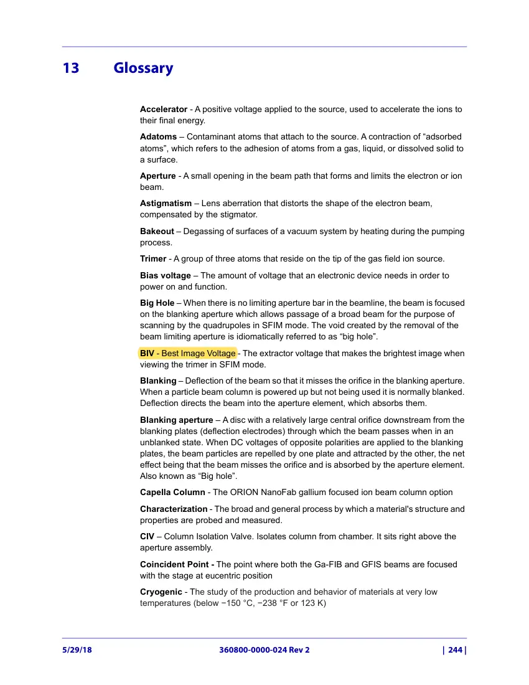

*Page 249 facsimile from `ZEISS_ORION_NanoFab_Operator_Manual_Rev2.pdf`.*

## Page 250

| 245 |
360800-0000-024 Rev 2
5/29/18
Deflection – To bend the beam path through the application of positive (repelling) and 
negative (attracting) voltages on opposite sides of the beam
Degassing – The process of heating a gauge in order to remove unwanted or excess 
gas
Detector – A mechanism for detecting image signals consisting of secondary 
electrons or backscattered electrons, and generating a corresponding intensity value 
for each pixel of the scan.
Dwell Time - The amount of time the beam remains at a single scan point before 
moving to the next scan point. 
Eucentric Height - The working distance at which the sample is exactly on the tilt axis.
Eucentric Point – The point at which the tilt rotational axis meets the beam rotational 
axis, guaranteeing that the focus is maintained when the sample is tilted at a certain 
working distance.
Eucentric Position – Same as Eucentric Height.
Evactron - The plasma cleaner that eliminates hydrocarbon contamination by 
generating plasma inside the chamber.
Extractor – Biased electrode, which, by creating a potential difference with the 
source, creates a strong electrical field that attracts electrons from the gas atoms in 
the gas field and ionizes them.
Extraction field - The ionization field created between the source and the extractor 
electrode.
Faraday – Measuring apparatus, whereby ions or electrons are collected in a small 
metal cup and measured to determine probe current.
Featureless - An area that does not have a pattern. Bare metal, such as that on the 
sample holder, works best.
FIB - Focused Ion Beam
First Light - The point in the Select a Trimer process at which the signal stays there 
for more than a few seconds when slowly increasing the extractor voltage. It is the 
point at which ionization is first observed. It is typically within the range of -20 to -25 kV.
Focus Point - The point where all beam ions converge in a small spot. This is 
controlled by the objective lens (lens 2)
Focus voltage – Voltage applied to lens 2 for the purpose of focusing the beam on the 
sample. It is controlled via a knob on the knob panel.
Focus wobble - Function that sweeps the focus of the objective lens backwards and 
forward through the focus on the sample plane. When the aperture is misaligned a 
lateral shift is observed.
FOV - The size of the area being scanned by the ion beam. In the NanoFab the FOV 
is always a square. For example, setting the image FOV to 1 µm means that the ion 
beam will scan an area of 1 µm by 1 µm, hence the displayed image represents an 
area of 1 µm by 1 µm

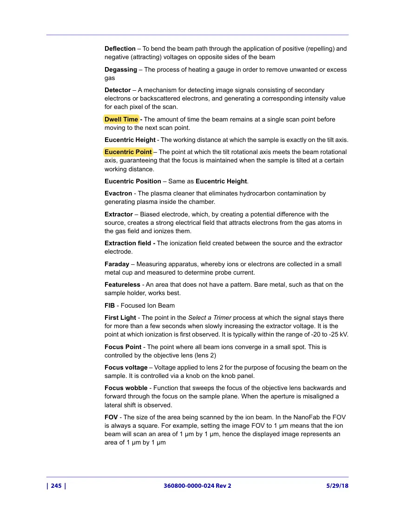

*Page 250 facsimile from `ZEISS_ORION_NanoFab_Operator_Manual_Rev2.pdf`.*

## Page 251

5/29/18
360800-0000-024 Rev 2
| 246 |
Frame Averaging - Each frame is scanned the selected number of times and the 
average signal is displayed.
Ga FIB Column - The Capella Gallium Focused Ion Beam column. an optional 
component of the ORION NanoFab basic system that uses ionized gallium for image 
generation and specimen analysis, milling, and gas assisted etching and deposition.
Gain - The ratio of two quantities. When referring to circuits, it's almost always the ratio 
of some measurement of the output of a circuit or component to its input. The most 
common usage is voltage gain, the ratio between the voltage amplitude of the output 
signal to the input signal, but it could also be power gain or current gain.
Gas Box – The gas manifold through which gas from the He or Ne bottles is 
transported to the inner gun can. It includes the regulators and leak valves and the gas 
purifier.
GFIS - Gas Field Ion Source. The gas field can be either Helium or Neon in the Orion/
Polaris NanoFab.
GIS - Gas Injection System
Image size - The same as Scan Size, the number of pixels in the image.
Kelvin – A unit of measure for temperature. The Kelvin scale is an absolute, 
thermodynamic temperature scale using as its null point absolute zero. Water at 0.0 °C 
= 273.16 K. 100 K = -173.15ºC = -279.67F.
Landing Energy - The energy at which ions hit the sample, determined by the 
accelerator voltage.
Lens 1 – The upper (condenser) lens. When the beam comes through the extractor 
plate on the end of the gun, it is diverging. Lens 1 causes the beam to converge so that 
it focuses at a point after lens 1 and prior to reaching the limiting apertures.
Lens 2 – The lower (objective) lens. Lens 2 focuses the beam on the sample.
Line Averaging: - Each line is scanned the selected number of times and the average 
signal for each pixel is displayed.
NanoFab – The current model of the HIM tool being produced by Zeiss (engineering 
product name is Polaris).
Nanometer – One billionth of a meter (10-9).
Node - In the context of NanoFab circuitry, a node is a replaceable board that is 
connected to an Ethernet circuit, such as a stage board or vacuum board.
Normal imaging mode – The mode in which the ion beam generated by the 
microscope generates an ion beam that is deflected by the octopoles and scanned 
across the sample. The image displayed in the UI is of your sample.
NPVE - NanoPatterning and Visualization Engine – a component that allows you to 
perform intricate and specific patterns in both etching and deposition processes.
Octopoles (Octopole Deflectors) – Mechanism for deflecting the ion beam for the 
purpose of scanning across the target.

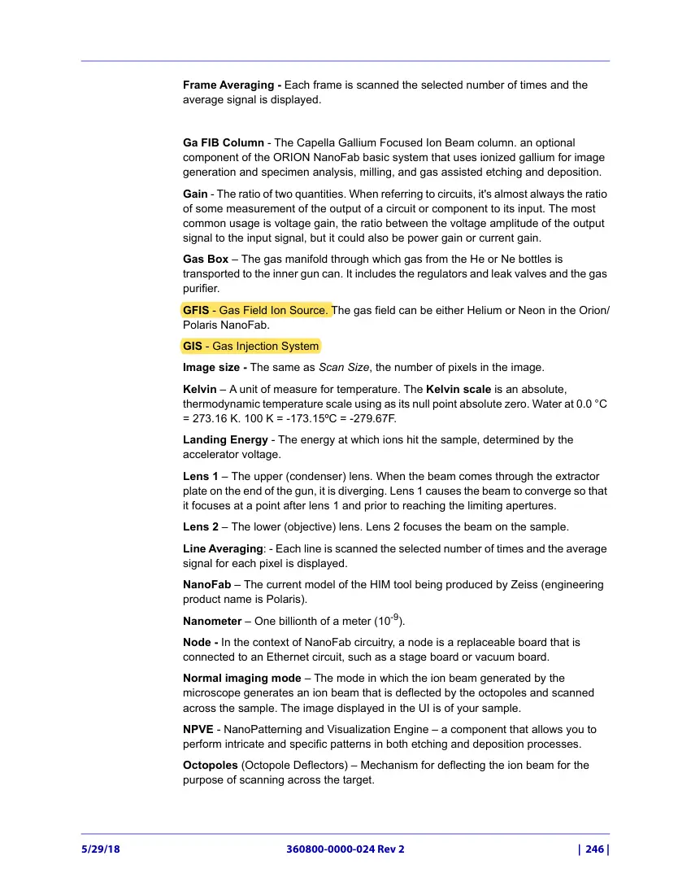

*Page 251 facsimile from `ZEISS_ORION_NanoFab_Operator_Manual_Rev2.pdf`.*

## Page 252

| 247 |
360800-0000-024 Rev 2
5/29/18
Operations Center - A tool panel available in the Zen UI which allows users to view 
and alter component power states.
Outgassing - The release of adsorbed or occluded gases or water vapor, usually by 
heating, in a vacuum.
Patterning - The process of removing sample atoms in specific areas on the sample 
with the ion beam. During patterning the ion beam is vector-scanned across the 
sample surface. The beam stays in a single scan point for a designated time (dwell 
time) before it moves to the next scan point.
Polaris - The Zeiss engineering product name for the current version of the NanoFab.
Power Cycle - To power down and power back up. This typically applies to rack 1 or 
rack 2, which house several sub-system boards.
Power Down - A state in which a hardware device’s power supplies are disabled. A 
powered down component is considered safe, but cannot be used to perform its task 
from its current state. Depending on the component, the time to power up from a 
Powered Down state may be lengthy. Many IO points from a powered down 
component may still be available for readback.
Power Up - A state in which a component can perform its designed purpose.
Preset - A set of system settings that can be applied as a group, and can include 
column settings, aperture selection, detector settings, imaging parameters, etc.
Probe - A set of column settings that configure a column for a specific beam current, 
landing energy, and beam size.
Probe Table - A collection of probes.
Quadrupoles – Mechanism below lens 1 with the main purpose of directing the ion 
beam to be on-axis with the center of lens 2.
Rack 1 - Also known as optics rack. The left hand side of the upper portion of the 
electronics rack. It contains the GFIS1 optics controller, GFIS2 optics support 
controller, SAS controller, and Capella controller if a Capella column is installed.
Rack 2 - Also known as detector rack. The right hand side of the upper portion of the 
electronics rack. It contains the Internet hub, flood gun controller, ET detector 
controller, and the stage controller.
Raster scan pattern - the beam sweeps horizontally left-to-right at a steady rate, then 
blanks and rapidly moves back to the left, where it turns back on and sweeps out the 
next line.
SAS - Scanning and Acquisition system. The SAS controller defines the scanning 
parameters, such image size, dwell time, field of view, etc., and brings in the video 
signal from the ET detector to create the ion beam images.
Scan Size - The number of pixels per line (x-direction) and the number of lines (y-
direction) per frame (one full scan of the field of view).
Scan Speed - The rate at which a sample is scanned. Scan speed is established by 
setting dwell time, which is the amount of time in which the beam remains at a single 
scan point.

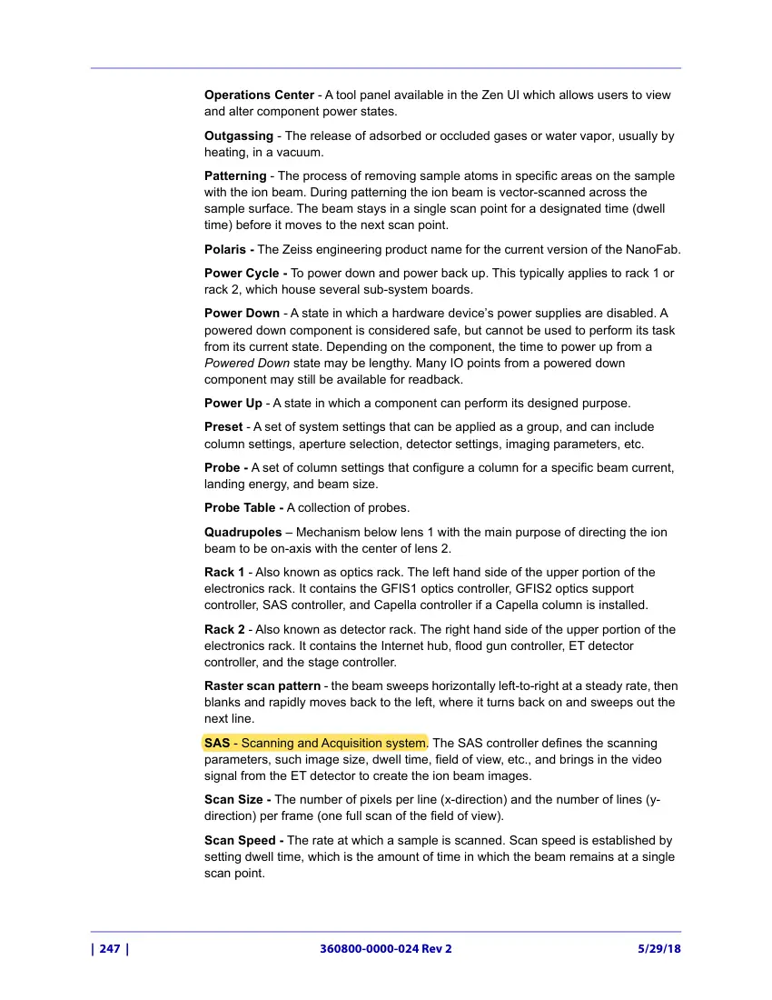

*Page 252 facsimile from `ZEISS_ORION_NanoFab_Operator_Manual_Rev2.pdf`.*

## Page 253

5/29/18
360800-0000-024 Rev 2
| 248 |
Scintillator - a disk coated with two very thin and fragile layers of first phosphor and 
then aluminum. It absorbs electrons and fluoresces photons while releasing the 
previously absorbed energy.
Secondary Electron (SE) – Low energy electrons that are liberated from the sample 
surface when the sample is hit by the primary ion or electron beam. They are 
generated by inelastic scattering.
SFIM Mode - Scanning Field Ion Microscope mode – Mode used to for viewing or 
aligning a trimer. In SFIM mode, scanning is done by the quadrupoles, and the image 
displayed in the UI is a representation of the source.
SIMS - Secondary Ion Mass Spectrometry - A mass spectrometry technique used to 
analyze the qualitative compositions of solid surfaces and thin films up to a depth of 2 
nm.
Source – The filament which, when appropriately treated and operated, knocks off 
electrons and creates positively charged gas ions.
Spot Control – A gradient scale from one to ten representing an increase of lens 1 
voltage, resulting in a decrease of beam current, lesser column magnification, and 
decreased source vibration, but an increase of resolution. Note that increasing the 
spot control value decreases beam size, and vice versa.
Standby - A state in which a component can be left safely for prolonged periods of 
time and quickly transition back into its Powered Up state.
State Machine - A conceptual model of a machine that can be in a finite number of 
states, transitions, and actions. When the Vacuum Dashboard is in state machine 
mode, the system is controlled by the software, with a limited number of commands 
available to the operator, each of which produce further programmed actions.
Stigmation – The process of removing any astigmatism (non-circular shape) of the 
beam.
Stigmator – Mechanism that compensates for astigmatism (lens aberration), 
contributing to the formation of a rotationally symmetrical beam. The upper octopole 
serves this purpose (as well as beam deflection).
UPS - Uninterruptable Power Supply. Also referred to as PCU – Electrical apparatus 
that provides emergency power to a load when the input power source fails.
Wizard - A set of software routines in the GFIS Source Maintenance, System 
Maintenance, and other tool panels of the Zen UI that perform actions such as 
obtaining and aligning a trimer, or aligning eucentric working distance.
Wobble - A function that sweeps the focus of the objective lens (lens 2) backward and 
forward through the focus on the specimen plane. When the aperture is misaligned a 
lateral shift is observed. Wobble is used in conjunction with tilt & shift for beam 
alignment.
Working Distance (WD) - The distance from the bottom of lens 2 to the sample when 
focused, as calculated by the software.
Zen - The new user interface that contains the controls for operating the NanoFab & 
the screens for displaying images and graphics.

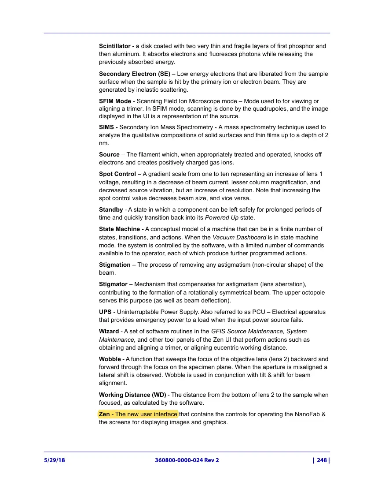

*Page 253 facsimile from `ZEISS_ORION_NanoFab_Operator_Manual_Rev2.pdf`.*
